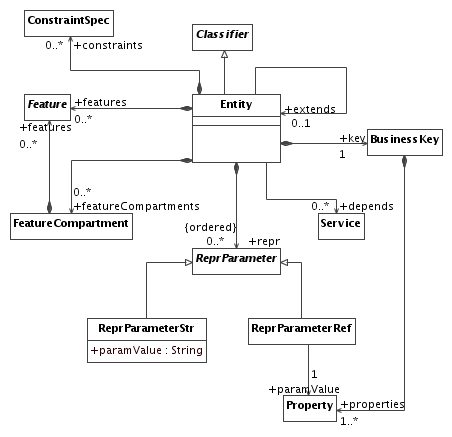
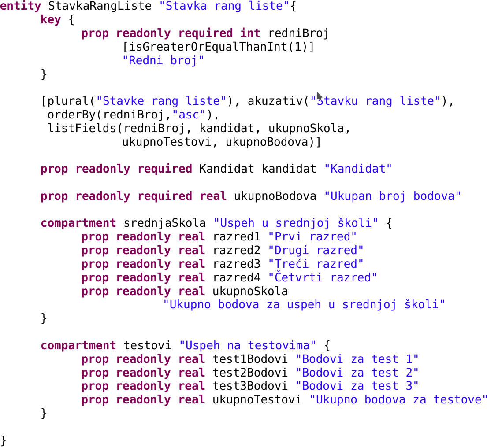
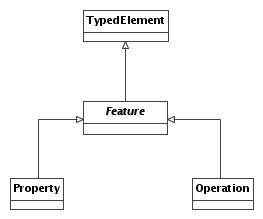
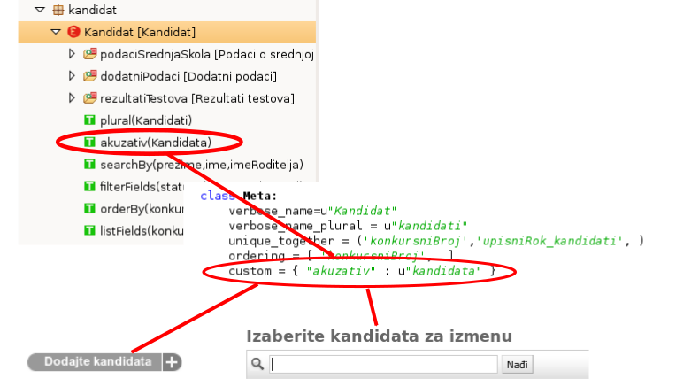
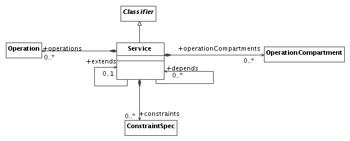
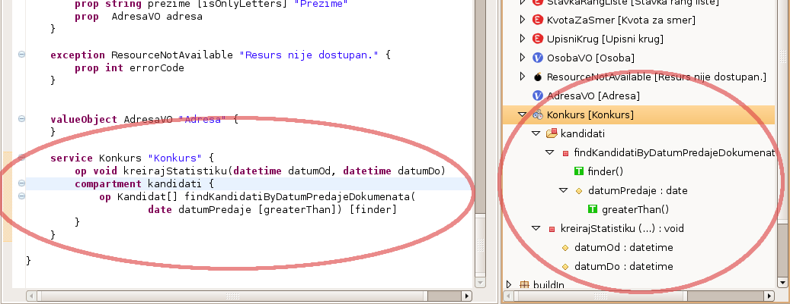
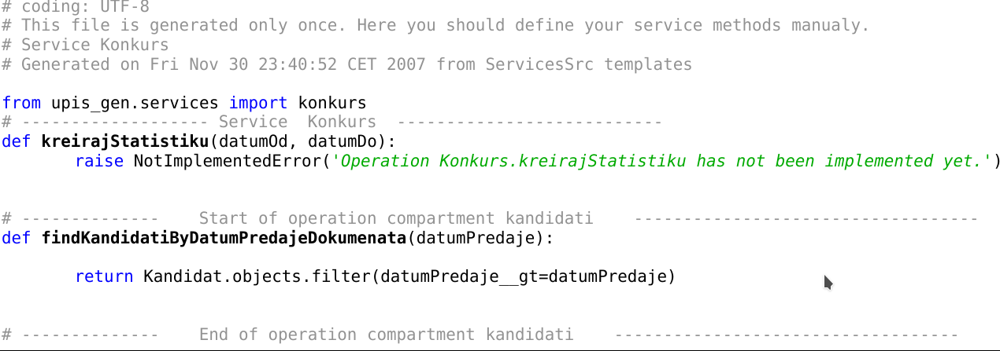
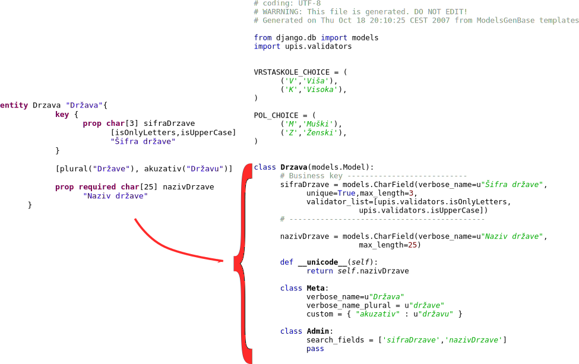



name: sadrzaj

# Sadržaj

- [DOMMLite](#dommlite)
- [mobl](#mobl)
- [pyFlies](#pyflies)

---
name: dommlite
class: center, middle

# DOMMLite

---
layout: true

.section[[DOMMLite](#sadrzaj)]

---

## Šta je DOMMLite?

- DOMMLite.ref[1] je jezik za opis statičke strukture poslovnih aplikacija.ref[2].
- Opisuje entitete, njihove atribute, validatore, veze između entiteta,
  primitivne tipove, pakete, servise i sl.
- Generator koda na osnovu DOMMLite mograma generiše naprednu CRUD aplikaciju sa
  podrškom za pretrage, filtriranje, sortiranje, definisanje servisnih metoda,
  validacije itd. Implementiran u xText-u.
  
.footer[

1. I. Dejanović, *Metamodel, editor modela i generator poslovnih aplikacija*.
   magistarska teza, April 2008.

1. I. Dejanović, G. Milosavljević, B. Perišić, and M. Tumbas, *A domain-specific
   language for defining static structure of database applications*, Computer
   Science and Information Systems, vol. 7, pp. 409–440, June 2010. ISSN
   1820-0214

]

---
## Osnovne osobine

- Opis entiteta, ključeva, veza jedan na jedan, jedan na više, više na više.
- Tekstualna sintaksa. Puna eclipse integracija (dopuna i bojenje koda,
  strukturni pogled, navigacija, validacija sintakse).
- Veliki broj standardnih parametarskih validatora uz mogućnost definisanja
  dodatnih u samom jeziku uz implementaciju na jeziku ciljne platforme.
- Podrška za definisanje korisničkih tipova podataka, validatora i oznaka.
- Generator koda za Django web okvir za razvoj.ref[1] . Generisanje pune CRUD
  aplikacije sa pretragama, filtriranjem, sortiranjem itd.

.footer[
1.  http://www.djangoproject.com
]

---
## Model

---
## Paketi

---
## Entiteti

---
## Konkretna sintaksa

---
## Odeljci

---
## Odeljci - konkretna sintaksa

---
## Odeljci - strukturni prikaz

---
## Odeljci - mapiranje na ekranske forme

---
## Atributi i reference

.lcol[

]
.rcol[

]

---
## Atributi i reference - konkretna sintaksa

---
## Oznake (*Tags*)

- Služe za opis dodatne semantike elementa nad kojim su definisane.
- DOMMLite poseduje *11 ugrađenih oznaka* (*plural, searchBy, orderBy, finder,
  filterFields...*) a korisnik može definisati na nivou mograma i svoje oznake.
  
---
## Primer - podrška za specifičnosti prirodnih jezika

---
## Validatori 

- Definisanje uslova koji mora biti ispunjen da bi se instanca elementa modela
  nad kojom je primenjen smatrala ispravnom.
- DOMMLite poseduje *33 ugrađena validatora* (*isAlphaNumeric, isOnlyDigits,
  isValidEmail...*) a na nivou mograma mogu biti definisani korisnički.

---
## Primer upotrebe validatora

---
## Servisi

---
## Podrška za *finder* metode

---
## Dopuna koda

---
## Generator koda

---
## Prikaz generisane forme

---
name: mobl
class: center, middle
layout: false

# mobl

---
layout: true

.section[[mobl](#sadrzaj)]

---

## mobl

TODO

---
name: pyflies
class: center, middle
layout: false

# pyFlies

---
layout: true

.section[[pyFlies](#sadrzaj)]

---

## pyFlies


