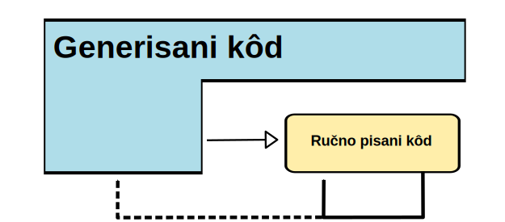
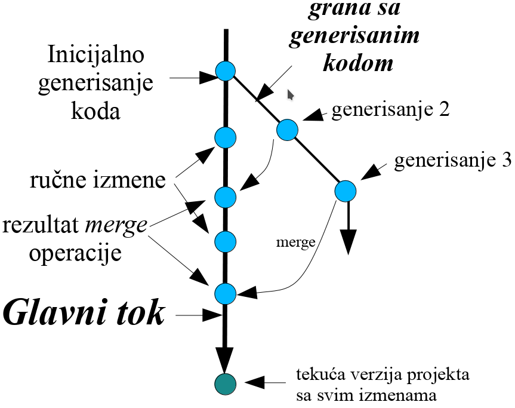



name: sadrzaj

# Sadržaj

- [Uvod](#uvod)
- [Generisanje koda](#generisanje-koda)
- [Interpretiranje koda](#interpretiranje)
- [Finalne napomene](#finalne-napomene)

---
name: uvod 
class: center, middle

# Uvod

---
layout: true

.section[[Uvod](#sadrzaj)]

---


## Cilj

- Imamo kreiran DSL i iskaze na njemu (mograme) i šta sada?
- Krajnji cilj nam je dobijanje izvršivog softvera na bazi naših mograma.

---
## Semantika jezika

- Pragmatični načini definisanja:
  - Transformacija iskaza jezika na jezik sa već definisanom semantikom
    (kompajleri/generatori koda).
  - DSL →GPL →asemblerski kôd →mašinski kôd →interpretiranje (na procesoru). DSL
    →GPL →VM code →interpretiranje (na virtuelnoj mašini).
- Interpretiranje.
  - DSL →interpretiranje
- Obično se za strukturalne aspekte sistema koristi generisanje koda dok se
  interpreteri koriste kod aspekata ponašanja.


---
name: generisanje-koda
class: center, middle
layout: false

# Generisanje koda

---
layout: true

.section[[Generisanje koda](#sadrzaj)]

---
## Generisanje koda (kompajliranje)


---
## Pristupi u generisanju koda

- Naivan pristup - kombinovanje fragmenata koda - upotreba komandi print oblika.
- API bazirano generisanje
- Inline generisanje
- Generisanje bazirano na šablonima i obrađivačima šablona - *Template Engines*.

---
## Print pristup

- Generisan kôd se dobija print komandom uz korišćenje spajanja i interpolacije
  stringova.
- Koriste se standardni iskazi jezika domaćina za uslove i petlje.
- Jednostavan pristup ali loše skalira. Kod složenijeg koda koji se generiše
  čitkost je niskog nivoa.

---
## Print pristup - primer

.small[
```python
class Class(object):
    def __init__(self, name, attributes):
        self.name = name
        self.attributes = attributes
        
classes = []
classes.append(Class("Student", 
                [("String", "ime"),
                 ("String", "prezime"),
                 ("String", "brojIndeksa")]))
classes.append(Class("Predmet", 
                [("String", "naziv"),
                 ("String", "nastavnik"),
                 ("int", "ESBP")]))
ime_paketa = "fakultet"

print "package %s;" % ime_paketa
print
for cls in classes:
    print "public class %s {" % cls.name
    print
    for attr in cls.attributes:
        print "    protected %s %s;" % (attr[0], attr[1])
    print
    for attr in cls.attributes:
        print "    public %s get%s(){" % \
                    (attr[0], attr[1].capitalize())
        print "        return %s;" % attr[1]
        print "    }"
        print
        print "    public void set%s(%s %s){" % \
                    (attr[1].capitalize(), attr[0], attr[1])
        print "        this.%s = %s;" % (attr[1], attr[1])
        print "    }"
        print 
    print "}"
    print
```
]

---
## Print pristup - generisani kod

.medium[
```java
package fakultet;

public class Student {

    protected String ime;
    protected String prezime;
    protected String brojIndeksa;

    public String getIme(){
        return ime;
    }

    public void setIme(String ime){
        this.ime = ime;
    }

    public String getPrezime(){
        return prezime;
    }

    public void setPrezime(String prezime){
        this.prezime = prezime;
    }

    public String getBrojindeksa(){
        return brojIndeksa;
    }

    public void setBrojindeksa(String brojIndeksa){
        this.brojIndeksa = brojIndeksa;
    }

}
```
]

---
## API bazirano generisanje koda


---
## Obrađivači šablona (*Template Engines*)

- Za opis generisanog programskog kôda koristi se DSL za zadavanje šablona.
- Fiksni delovi generisanog koda su definisani bez izmena.
- Varijabilni delovi su definisani upotrebom posebnih iskaza šablon DSL-a i biće
  interpretirani od strane obrađivača šablona u vreme generisanja koda.

---
## Arhitektura


---
## Primer - Jinja/Django

```django

  <component class="struct">
      <type class="char">{{component.type_name}}</type>
      <name class="char">{{component.fqn}}</name>

      <parameters class="struct">
          
          <parameter class="struct">
                  
                  <parent class="char">parameter.owner.name</parent>
                  
              <name class="char">{{parameter.name}}</name>
              <value class="double">{{parameter}}</value>
          </parameter>
          
      </parameters>

      <terminals class="struct">
          
          <terminal class="struct">
              <name class="char">{{terminal.name}}</name>                    
              <type class="char">{{terminal.type}}</type>             
              <node class="char">{{terminal.node}}</node>
          </terminal>
          
      </terminals>
  </component>

```

---
## Primer - JSP

```jsp
<html>
<head><title>First JSP</title></head>
<body>
  <%
    double num = Math.random();
    if (num > 0.95) {
  %>
      <h2>You'll have a luck day!</h2><p>(<%= num %>)</p>
  <%
    } else {
  %>
      <h2>Well, life goes on ... </h2><p>(<%= num %>)</p>
  <%
    }
  %>
  <a href="<%= request.getRequestURI() %>"><h3>Try Again</h3></a>
</body>
</html>
```

.footer.small[
http://www.ntu.edu.sg/home/ehchua/programming/java/JSPByExample.html
]

---
## Primer - PHP

```php
<?php
    $Fname = $_POST["Fname"];
    $Lname = $_POST["Lname"];
?>
<html>
<head>
    <title>Personal INFO</title>
</head>
    <body>
        <form method="post" action="<?php echo $PHP_SELF;?>">
            First Name:<input type="text" size="12" maxlength="12" name="Fname"><br />
            Last Name:<input type="text" size="12" maxlength="36" name="Lname"><br />
        </form>
        <?
        echo "Hello, ".$Fname." ".$Lname.".<br />";
        ?>
    </body>
</html>
```

.footer.small[
http://www.ntchosting.com/php/php-in-html.html
]

---
## Primer - Ruby ERB

.medium[
```erb
<h1>Listing Books</h1>
 
<table>
  <tr>
    <th>Title</th>
    <th>Summary</th>
    <th></th>
    <th></th>
    <th></th>
  </tr>
 
<% @books.each do |book| %>
  <tr>
    <td><%= book.title %></td>
    <td><%= book.content %></td>
    <td><%= link_to "Show", book %></td>
    <td><%= link_to "Edit", edit_book_path(book) %></td>
    <td><%= link_to "Remove", book, method: :delete, data: { confirm: "Are you sure?" } %></td>
  </tr>
<% end %>
</table>
 
<br />
 
<%= link_to "New book", new_book_path %>
```
]

.footer.small[
http://guides.rubyonrails.org/layouts_and_rendering.html
]

---
## Primer - Xtend


```xtend
def compile(Entity e) ''' 
	«IF e.eContainer.fullyQualifiedName != null»
		package «e.eContainer.fullyQualifiedName»;
	«ENDIF»
	
	public class «e.name» «IF e.superType != null
			»extends «e.superType.fullyQualifiedName» «ENDIF»{
		«FOR f:e.features»
			«f.compile»
		«ENDFOR»
		}
	'''

def compile(Feature f) '''
	private «f.type.fullyQualifiedName» «f.name»;
	
	public «f.type.fullyQualifiedName» get«f.name.toFirstUpper»() {
		return «f.name»;
	}
	
	public void set«f.name.toFirstUpper»(«f.type.fullyQualifiedName» «f.name») {
		this.«f.name» = «f.name»;
	}
	'''
}
```

.footer.small[
http://www.eclipse.org/Xtext/documentation.html
]

---
## Primer - Stratego


.footer.small[
http://metaborg.org/wiki/spoofax/tour
]

---
## In-line generisanje koda

- Ciljni jezik poseduje iskaze koji se u vreme kompajliranja zamenjuju drugim
  konstrukcijama istog jezika.
- Ova zamena se obavlja najčešće posebnim alatom koji se naziva predprocesor.
- Predprocesiranje može da se obavlja u više koraka, odnosno možemo imati više
  predprocesora koji će vršiti ekspanziju koda pre faze kompajliranja.

---
## Primer - C predprocesor

```c
#include <stdio.h>

#define SLICES 8
#define ADD(x) ( (x) / SLICES )

int main() 
{
    int a = 0, b = 10, c = 6;

    a = ADD(b + c);

    printf("%d\n", a);

    return 0;
}

```

---
## U svim slučajevima...

- ...imamo fiksni, nepromenjivi deo programskog koda i varijabilni deo.
- Šta će u našem slučaju biti izvor za koji definiše varijabilni deo?

---
## Šta i kako generisati?

- Truditi se da generisan kod bude čitak. Očuvati nazubljivanje, generisati
  komentare, u komentarima jasno napisati da je generisani kod u pitanju i na
  osnovu čega je generisan.
- Ukoliko DSL dobro pokriva ciljni domen moguće je generisati 100% programskog
  koda. Ovo je obično slučaj kod zrelih DSL-ova.
- Često u toku razvoja, i zbog praktičnih razloga, DSL ne pokriva domen u
  potpunosti. U tom slučaju generiše se deo programskog koda, dok se deo piše
  ručno na jeziku ciljne platforme.
- U ovom slučaju moramo rešiti problem integracije ručno
  pisanog i generisanog koda.
  
---
## Ručne izmene u generisanom kodu

- Ponovno generisanje celih fajlova vs. očuvanje ručnih izmena.
- Kod očuvanja ručnih izmena u generisanom kodu koriste se tzv. zaštićene
  sekcije (*protected regions*). Najčešće posebne oznake unutar komentara.
- Zaštićene regije komplikuju implementaciju generatora i kontrolu verzija -
  izbegavati.
- Kôd koji se uvek generiše potpuno ne čuvati u sistemu za kontrolu verzija bez
  potrebe - uvek ga možete izgenerisati! Isti je razlog zbog koga ne čuvate
  Java `.class` fajlove.
  
---
## Generisani kôd i kontrola verzija

- Kod koji se uvek generiše potpuno ne čuvati u sistemu za kontrolu verzija bez
  potrebe - uvek ga možete izgenerisati!
- Razlog je isti zbog kod ne čuvate npr. Java `.class` fajlove.
- ... osim u slučaju kada VCS koristite za integraciju ručno pisanog koda.

---
## Integracija generisanog i ručno pisanog koda

- Najčešće se koriste mogućnosti ciljnog programskog jezika.
- Na primer, ukoliko je u pitanju OO jezik možemo koristiti nasleđivanje ili
  ukoliko jezik podržava parcijalne klase (npr. .NET).
  
---
## Obrasci za integraciju kod OO jezika - 1

Generisani kôd poziva ručno pisani.


.footer.small[
M. Völter and T. Stahl, *Model-Driven Software Development : Technology, Engineering, Management*. John Wiley & Sons, June 2006
]

---
## Obrasci za integraciju kod OO jezika - 2

Ručno pisani kôd poziva generisani.


.footer.small[
M. Völter and T. Stahl, *Model-Driven Software Development : Technology, Engineering, Management*. John Wiley & Sons, June 2006
]

---
## Obrasci za integraciju kod OO jezika - 3

Generisani kôd nasleđuje apstraktne klase ili implementira interfejse (ručno
pisane). Ručno pisani kod poziva generisani preko interfejsa ili apstraktnih
klasa.


.footer.small[
M. Völter and T. Stahl, *Model-Driven Software Development : Technology, Engineering, Management*. John Wiley & Sons, June 2006
]

---
## Obrasci za integraciju kod OO jezika - 4

Ručno pisani kôd nasleđuje i redefiniše generisani.


.footer.small[
M. Völter and T. Stahl, *Model-Driven Software Development : Technology, Engineering, Management*. John Wiley & Sons, June 2006
]

---
## Obrasci za integraciju kod OO jezika - 5

Generisani kôd nasleđuje i poziva ručno pisani. Na primer, implementacija
apstraktnih metoda u kojoj se koriste pozivi konkretnih metoda.


.footer.small[
M. Völter and T. Stahl, *Model-Driven Software Development : Technology, Engineering, Management*. John Wiley & Sons, June 2006
]

---
## Obrasci za integraciju kod OO jezika - 6

Generisani kôd nasleđuje ručno pisani i definiše apstraktne metode. Ručno pisani
kôd poziva konkretne metode kao i apstraktne metode koje definiše generisani
kod. Implementacija *Template Method* dizajn šablona.




.footer.small[
M. Völter and T. Stahl, *Model-Driven Software Development : Technology, Engineering, Management*. John Wiley & Sons, June 2006
]

---
## Integracija upotrebom VCS




---
name: interpretiranje
class: center, middle
layout: false

# Interpretiranje

---
layout: true

.section[[Interpretiranje](#sadrzaj)]

---

## Interpretiranje

- Interpreter je softver koji čita mogram i dinamički ga evaluira u vreme
  izvršavanja (*runtime*).
- Nema generisanja koda.
- Brži *round-trip* u razvoju ali sporije izvršavanje.
- Često teže debagovanje ukoliko ne postoje specijalizovani debageri.

---
## Arhitektura pristupa


---
## Primer - Arpeggio i textX

- Arpeggio textX su parseri koji vrši interpretiranje gramatike jezika.
- Parser se ne generiše već se arpeggio konfiguriše gramatikom jezika i posle
  toga je spreman da parsira proizvoljne iskaze na definisanom jeziku.


---
name: finalne-napomene
class: center, middle
layout: false

# Finalne napomene

---
layout: true

.section[[Finalne napomene](#sadrzaj)]

---

## Vreme analize modela - generatori vs. interpreteri

- Analiza modela se kod generatora obavlja u vreme izgradnje dok se kod
  interpretera obavlja u vreme izvršavanja.
- Postoje interpreteri koji će pre startovanja mograma obaviti analizu u cilju
  otkrivanja čestih grešaka.
- Određeni interpreteri vrše validaciju mograma i zatim ga transformišu u
  efikasan međuformat (npr. *bytecode* za Java virtualnu mašinu).
- Takođe, određeni generatori vrše generisanje koda u vreme izvršavanja (npr.
  *JIT kompajleri*).

---
## Generisanje ili interpretacija?

- Na ovo pitanje ne postoji opšti odgovor.
- Zavisi od jezika, domena, zahteva u razvoju kao i zahtevanih nefunkcioanlnih
  osobina.
- Često se u praksi ova dva pristupa kombinuju.




