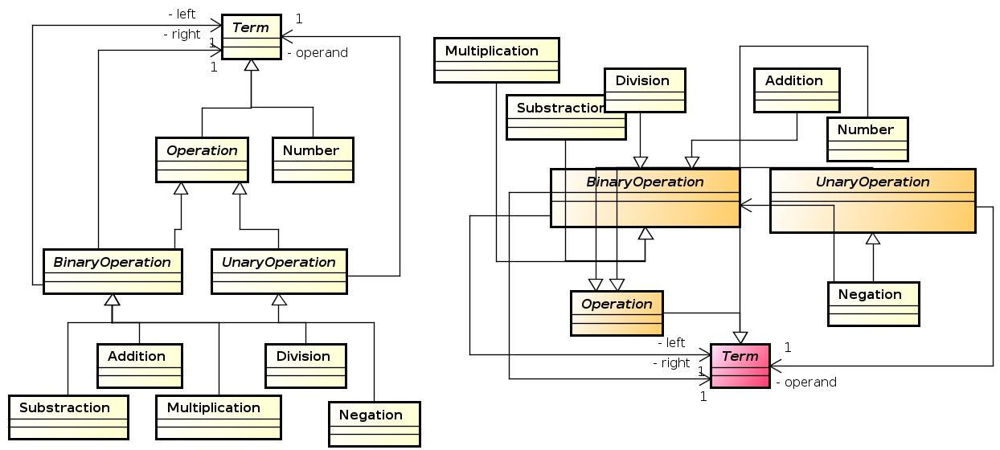
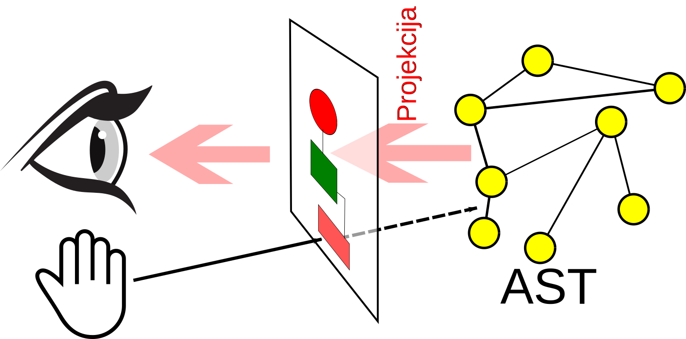
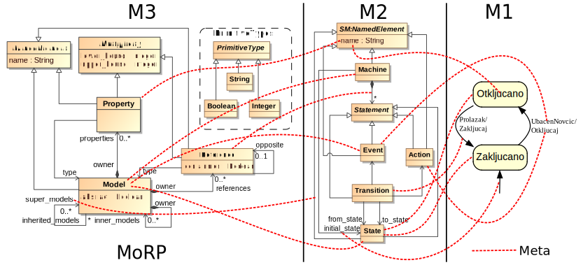



name: sadrzaj

# Sadržaj

- [Sintakse](#sintakse)
- [Sekundarna sintaksa](#sekundarna)
- [Meta-modelovanje](#meta-modelovanje)
- [Meta-metamodeli](#meta-metamodeli)
- [Stek za meta-modelovanje](#stek)

---
name: pregled
class: center, middle

# Sintakse

---
layout: true

.section[[Sintakse](#sadrzaj)]

---

## Tehnike i tehnologije za implementaciju DSL-ova

- Parser generatori/interpreteri
- Meta-modelovanje
- Druge tehnike: ontologije, XML tehnologije...

---

## Konkretna sintaksa

- Da bi mogram prikazali korisniku potrebna nam je konkretna sintaksa.
- Konkretna sintaksa definiše "izgled" iskaza na nekom jeziku, odnosno u širem
  smislu definiše i načine interakcije korisnika sa jezičkim iskazima tj.
  predstavlja interfejs jezik-korisnik.
- Iako nam je za jedan jezik dovoljna jedna konkretna sintaksa, možemo ih imati
  više.
- Konkretne sintakse mogu biti tekstualne, grafičke, tabelarne, tipa stabla,
  bazirane na dijalozima ...

---

## Primer istog iskaza upotrebom dve različite konkretne sintakse


---

## Parsiranje - sintaksna analiza

- Analiza linearnog zapisa niza simbola na osnovu pravila neke formalne
  gramatike jezika.
- Transformacija ulaznog stringa u stablo parsiranja.

---

## Stablo parsiranja

- Nastaje iz niske simbola (ulaznog stringa) procesom skeniranja (tokenizacije
  ili leksičke analize) i parsiranja.
- Listovi stabla su tokeni prepoznati od strane skenera dok je struktura stabla
  određena gramatikom jezika.
- Stablo parsiranja reflektuje sintaksnu strukturu ulaznog stringa na bazi
  unapred definisane formalne gramatike.
  
---

## Stablo parsiranja - Primer


---

## Apstraktna sintaksa

- Određuje pravila validnosti jezičkih iskaza sa stanovišta njegove strukture
  bez razmatranja konkretne reprezentacije iskaza (konkretne sintakse).
- Definiše strukture validnih rečenica sa stanovišta jezika.
- Sadrži koncepte domena, njihove osobine i međusobne relacije.
- Jezici za definisanje apstraktnih sintaksi jezika se u domenu modelovanja
  nazivaju meta-meta-modelima.ref[*].
  
.footer[
\* Preciznije, meta-metamodel je apstraktna sintaksa takvog jezika. Jezik još
   čine i konkretne sintakse i semantika. 
]

---

## Primer - apstraktna sintaksa jezika za opis konačnih automata


---

## Primer - apstraktna sintaksa jezika za jednostavne algebarske izraze


---

## Stablo apstraktne sintakse

- Svaki iskaz na datom jeziku se može na apstraktan način opisati stablom
  apstraktne sintakse (*Abstract Syntax Tree*).
- AST je usmereno labelirano stablo gde čvorovi stabla predstavljaju instance
  koncepata apstraktne sintakse.
  
---

## Primer stabla apstraktne sintakse


---

## Razlike između stabla apstraktne i konkretne sintakse

- Stablo konkretne sintakse je bazirano na formalnoj gramatici koja opisuje
  detalje zapisa u tekstualnom obliku.
- Stablo apstraktne sintakse sadrži suštinu jezičkog iskaza.
- Možemo imati više gramatika za isti jezik odnosno jedno stablo apstraktne
  sintakse možemo zapisati na više različitih načina što rezultuje različitim
  stablima konkretne sintakse.
- **Primer:** Izraz `-(4-1)*5/(2+4.67)` možemo u postfiksnoj notaciji zapisati
  kao `4 1 - 5 * 2 4.67 + / -`. Ovo će rezultovati različitim stablima
  parsiranja ali je suština izraza ista i može rezultovati istim stablom
  apstraktne sintakse.


---
name: sekundarna-sintaksa
class: center, middle
layout: false

# Sekundarna sintaksa

---
layout: true

.section[[Sekundarna sintaksa](#sadrzaj)]

---

## Sekundarna sintaksa


- Iako konkretna sintaksa nameće svoja pravila, gotovo uvek postoji određena
  sloboda koja se ostavlja korisniku i koja omogućava da se mogram koji je isti
  sa stanoviša apstraktne sintakse (isto stablo apstraktne sintakse) prezentuje
  na različite načine.
- Primeri:

  - "Prazni" karakteri kod tekstualnih sintaksi (*white-spaces*) najčešće nemaju
    semantičkog značaja pa se mogu koristiti na različite načine (kod se može
    nazubljivati na više načina).
  - Položaji, boja i veličine simbola kod grafičkih sintaksi najčešće nemaju
    semantičkog značenja pa korisnik može da iskoristi ove osobine da enkoduje
    neko svoje značenje.
    
---

## Problemi sa sekundarnom sintaksom

- Sekundarna sintaksa se može koristiti na proizvoljan način.
- Svaki korisnik razvija svoj stil upotrebe sekundarne sintakse što može
  prouzrokovati pogrešno ili otežano tumačenje.
  


.center[Da li su ova dva mograma ista?]

---

## Problemi sa sekundarnom sintaksom


.center[A sada?]

---

## Moguća rešenja

- Definisanje stila kodiranja - *coding style* (kod tekstualnih) koga se
  pridržavaju svi programeri. Potrebna je određena doza discipline.
- Smanjenje korisničke slobode - ugrađivanje mogućih elemenata sekundarne
  sintakse u formalni jezik. Alati će sprečiti neispravnu upotrebu.
  
---

## Primer - Python

- Python koristi identaciju koda za kontrolu toka programa.
- Jedan od razloga čitljivosti Python koda - svi programeri moraju ispravno da
  *nazubljuju* kod.

```python
def inner_from_python(expression):
    retval = None
    if isinstance(expression, types.FunctionType):
        # If this expression is a parser rule
        rule_name = expression.__name__
        if rule_name in __rule_cache:
            c_rule = __rule_cache.get(rule_name)
            if self.debug:
                print("Rule {} founded in cache.".format(rule_name))
            if isinstance(c_rule, CrossRef):
                self.__cross_refs += 1
                if self.debug:
                    print("CrossRef usage: {}"
                          .format(c_rule.target_rule_name))
            return c_rule
        ...
```

---

## Pristupi u realizaciji editora za DSL-ove

.medium[
- Direktna izmena apstraktne reprezentacije kroz projekciju.
 
  
  
- Parsiranje - izmena se vrši posredno kroz tekst koji se parsira da bi se
  dobila apstraktna reprezentacija.

  

]

.footer[
.small[Eye icon designed by Freepik. Hand icon by Yannick Lung.]
]


---
name: meta-modelovanje
class: center, middle
layout: false

# Meta-modelovanje

---
layout: true

.section[[Meta-modelovanje](#sadrzaj)]

---

## Model

- Modelovanje je esencijalno za ljudsku aktivnost jer svakoj akciji prethodi,
  eksplicitno ili implicitno, kreiranje modela.
- Modeli mogu biti deskriptivni, ukoliko modeluju postojeći realni sistem, ili
  preskriptivni (specifikacija) ukoliko predstavljaju "plan" sistema koji treba
  da se izgradi.
- Model predstavlja opis, ili specifikaciju sistema i njegovog okruženja kreiran
  za određenu namenu. Najčešće je model predstavljen kao kombinacija crteža i
  teksta. Tekst može biti zadat jezikom za modelovanje ili prirodnim jezikom
  .ref[*].

.footer[
\* J. Miller, J. Mukerji, et al., *MDA Guide Version 1.0.1*, Object
   Management Group, vol. 234, 2003
]

---

## Model - drugi pokušaj

.medium[

> ...Model predstavlja **pojednostavljenje sistema** sa određenim ciljem. Model
> treba da odgovori na pitanja umesto stvarnog sistema. **Odgovori** dobijeni od
> modela **moraju da budu isti** kao i oni dobijeni od realnog sistema, pod
> uslovom da se pitanja nalaze u domenu definisanom ciljem modela. Da bi bio
> koristan, model mora biti **jednostavniji za upotrebu** od realnog sistema. Da
> bi se ovo postiglo, mnogi detalji realnog sistema su **apstrahovani** i
> izostavljeni. Ovo pojednostavljenje je srž modelovanja...

]
            
.footer[
  J. Bézivin and O. Gerbé, *Towards a precise definition of the OMG/MDA
  framework*, in ase, p. 273, Published by the IEEE Computer Society, 2001
]

---

## Osnovne karakteristike modela

- Model ne predstavljaju samo crteži i tekstualni opisi. Model može imati
  materijalnu formu npr. može biti model/maketa aviona, pojednostavljena verzija
  motora sa unutrašnjim sagorevanjem itd.
- Apstrakcija i namena, tj. skup pitanja na koje želimo da dobijemo odgovore, su
  osnovne karakteristike modela.
- U opštem slučaju, ne možemo očekivati da će model dati potpuno iste odgovore
  kao modelovani sistem ali možemo očekivati da razlike (greške) budu u
  projektovanim granicama.
  
---

## Meta-model

- Kada kreiramo model sistema moramo poštovati određena pravila odnosno moramo
  koristiti određeni jezik za modelovanje.
- Jezik može biti opšte namene (npr. UML) ili specifičan za domen.
- Takav jezik predstavlja eksplicitnu specifikaciju korišćene apstrakcije pri
  modelovanju.ref[*].
- Apstraktna sintaksa datog jezika u svetu modelovanja je takođe predstavljena
  kao model. Ovakav model nazivamo meta-modelom.
- Meta-model sadrži koncepte domena, njihove međusobne veze i ograničenja.


.footer[
\* J. Bézivin and O. Gerbé, *Towards a precise definition of the OMG/MDA
   framework*, in ase, p. 273, Published by the IEEE Computer Society, 2001
]

---

## Primer - meta-model jezika za opis konačnih automata


.center[Apstraktna sintaksa je meta-model]

---

## Operacije koje koristimo pri (meta)modelovanju

- Apstrakcija
- Klasifikacija
- Generalizacija

---

## Apstrakcija

- Jedno od osnovnih oruđa ljudskog intelekta.
- Proces zanemarivanja nebitnih informacija prilikom kreiranja modela.


---

## Apstrakcija

> If you assume a certain basic knowledge in the audience, you can talk in a
> language that deals with bigger concepts, and express things in a much shorter
> and clearer way. This, more or less, is what abstraction is.

.footer[
Marijn Haverbeke, *Eloquent JavaScript*, http://eloquentjavascript.net/
]

---

## Klasifikacija

- Objekti realnih sistema, kao i njihovi modeli, se mogu grupisati na osnovu
  zajedničkih osobina.
  


---

## Token modeli i modeli tipova

- Prvi ih je definisao Čarls Sanders Pirs.
- Token modeli:

  - Modeli konkretnih pojedinačnih pojava realnog sveta.
  - Nastaju isključivo procesom apstrakcije.
  - Primer: geografska mapa, maketa aviona...

- Modeli tipova:

  - Nastaju procesom klasifikacije modela tokena na osnovu zajedničkih osobina.
  - Ovakav model opisuje klasu pojava realnog sveta.
  
---

## Generalizacija

- Predstavlja dalji proces klasifikacije modela tipova na osnovu zajedničkih
  osobina.
- Odvija se unutar modela tipova na taj način što se tipovi grupišu u apstraktne
  koncepte na osnovu zajedničkih osobina. Za tako kreirane koncepte kažemo da
  generalizuju posmatrani skup koncepata, odnosno posmatrani skup koncepata se
  nasleđuje iz generalizovanog koncepta.
  


---
name: meta-metamodeli
class: center, middle
layout: false

# Meta-metamodeli

---
layout: true

.section[[Meta-metamodeli](#sadrzaj)]

---

## Meta-metamodel

- Kreiranje jezika predstavlja domen sa svojim konceptima i pravilima.
- Jezik ovog domena (jezik za opis jezika) nazivamo meta-jezikom.
- Kao što apstraktnu sintaksu bilo kog jezika nazivamo meta-modelom, apstraknu
  sintaksu meta-jezika nazivamo meta-metamodelom.
- Meta-metamodelom možemo opisati apstraktnu sintaksu bilo kog jezika pa i
  meta-jezika. Stoga kažemo da je meta-metamodel samodefinišući.
  
---

## MOF

- MOF (*Meta-Object Facility*).ref[1] je meta-metamodel i industrijski
  standard koji se razvija pod okriljem OMG (*Object Management Group*)
  konzorcijuma.
- Predstavlja osnovnu integracionu platformu MDA (*Model-Driven
  Architecture*) pravca i omogućava interoperabilnost UML baziranih alata.
- Nastao je na bazi UML-a i u MOF-u se danas opisuju OMG jezici za modelovanje,
  između ostalog i UML
- MOF je podeljen na EMOF (*Essential MOF*), CMOF(*Complete MOF*) i
  SMOF(*Semantic MOF*).

.footer[
1.  http://www.omg.org/mof/
]

---

## EMOF


---

## ECore

- ECore je meta-metamodel čiji je razvoj započeo IBM a kasnije je razvijan u
  okviru Eclipse EMF (*Eclipse Modeling Framework*).ref[1] projekta.
- Baziran na programskom jeziku Java. Pod licencom slobodnog softvera
  (*Eclipse Public License*).
- U osnovi predstavlja efikasnu implementaciju EMOF meta-metamodela.
- Industrijski standard, dokazan i testiran kroz višegodišnju upotrebu na
  realnim projektima.

.footer[
1. http://www.eclipse.org/modeling/emf/
]

---

## ECore


---

## GOPPRR

- Ime predstavlja skraćenicu reči koje opisuju osnovne koncepte jezika:
  **G**raph, **O**bject, **P**roperty, **P**ort, **R**ole, **R**elationship.
- Vlasnički softver. Okosnica MetaEdit+ alata.ref[1]. Nastao je od
  ranijih verzija koje su nosile naziv GOPRR i OPRR.ref[2].

.footer[
   
1. http://www.metacase.com/products.html
2. S. Kelly, *Towards a comprehensive MetaCASE and CAME environment:
   conceptual, architectural, functional and usability advances in
   MetaEdit+*. PhD thesis, University of Jyväskylä, 1997

]

---

## MoRP

- Razvijen na Katedri za informatiku.
- Jednostavan - mali broj koncepata.
- Implementacija u Javi.ref[1]. U toku port na Python.ref[2] (čim se nađe
  vremena ;) ).


.footer[

1. https://github.com/igordejanovic/MoRP
2. https://github.com/igordejanovic/MoRPy

]


---
name: stek-za-metamodelovanje
class: center, middle
layout: false

# Stek za metamodelovanje

---
layout: true

.section[[Stek za metamodelovanje](#sadrzaj)]

---

## Stek za metamodelovanje


---

## Primer - Mogram, jezik, meta-jezik





