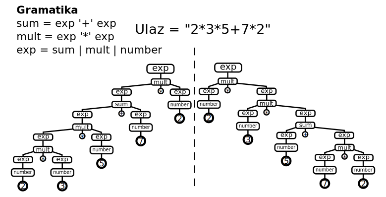
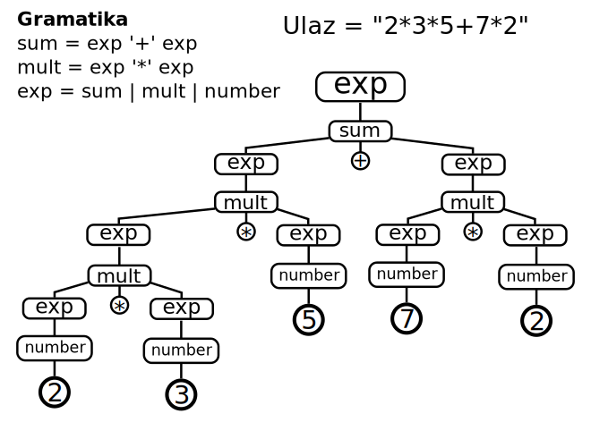



name: sadrzaj

# Sadržaj

- [Parsiranje](#parsiranje)
- [Formalne gramatike](#formalne-gramatike)
- [Strategije parsiranja](#strategije-parsiranja)

---
name: pregled
class: center, middle

# Parsiranje

---
layout: true

.section[[Parsiranje](#sadrzaj)]

---

## Jezički softver (*Language Software*)

Osnovne klase alata:

- *Generators* - generišu validne rečenice na nekom jeziku.
- *Recognizers* - prepoznaju da li rečenica pripada jeziku.
- *Parsers* - prevode rečenice u stabla.
- *Formatters* - prevode stabla u rečenice.

---

## Parsiranje - sintaksna analiza


- Analiza linearnog zapisa niza simbola na osnovu pravila neke formalne
  gramatike jezika.
- Transformacija ulaznog stringa u *stablo parsiranja* ili neku drugu strukturu
  podatka.

---

## Leksička analiza

- Svaki jezik poseduje *alfabet mogućih karaktera* koji se mogu pojaviti u
  sklopu validnih rečenica. Kod računarskih jezika određene kombinacije simbola
  se tretiraju kao jedinstveni entitet - *token*.ref[1].
- *Proces grupisanja* niza uzastopnih karaktera ulaznog stringa u tokene.
  Tekstualni blok koji odgovara tokenu naziva se još i *leksema*.
- Program koji vrši leksičku analizu naziva se *lekser*, *skener* ili
  *tokenizator*.
- Leksička analiza *prethodi procesu parsiranja* tako što se karakteri sa ulaza
  prvo grupišu u tokene a zatim parser vrši sintaksnu analizu i kreira stablo
  parsiranja.
- Skeneri mogu biti posebni alati a mogu biti integrisani u parser (*scannerless
  parsing*).
- Poznatiji skeneri: flex i lex, JLex...

.footer[
1. A. Aho and J. Ullman, The theory of parsing, translation, and compiling, vol.
  1 of Series in Automatic Computation. Prentice-Hall, 1972
] 

---

## Stablo parsiranja

- Nastaje iz niske simbola (ulaznog stringa) procesom *skeniranja* (tokenizacije
  ili leksičke analize) i *parsiranja*.
- Listovi stabla su tokeni prepoznati od strane skenera (*terminali*) dok su
  unutrašnji čvorovi stabla (*neterminali*) definisani gramatikom jezika.
- Stablo parsiranja reflektuje sintaksnu strukturu ulaznog stringa na bazi
  unapred definisane formalne gramatike.
  
---

## Stablo parsiranja - primer


.center[Stablo parsiranja za ulazni string `-(4-1)*5/(2+4.67)`]

---

## Stablo apstraktne sintakse

- Svaki iskaz na datom jeziku se može na apstraktan način opisati stablom
  apstraktne sintakse (*Abstract Syntax Tree*).
- AST je usmereno labelirano stablo gde čvorovi stabla predstavljaju instance
  koncepata apstraktne sintakse.
- AST ne sadrži elemente koje ne doprinose semantici kao što su ključne reči,
  zagrade, "prazni" karakteri i komentari.
  
---

## Primer stabla apstraktne sintakse


.center[`-(4-1)*5/(2+4.67)`]

---

## Razlike između stabla apstraktne i konkretne sintakse

- Stablo konkretne sintakse je bazirano na formalnoj gramatici koja opisuje
  *detalje zapisa* u tekstualnom obliku.
- Stablo apstraktne sintakse sadrži *suštinu jezičkog iskaza*.
- Možemo imati više gramatika za isti jezik odnosno jedno stablo apstraktne
  sintakse možemo zapisati na više različitih načina što rezultuje različitim
  stablima konkretne sintakse.
- Primer: Izraz `-(4-1)*5/(2+4.67)` možemo u postfiksnoj notaciji (obrnuta
  poljska notacija) zapisati kao `4 1 - 5 * 2 4.67 + / -`. Ovo će rezultovati
  različitim stablima parsiranja ali je suština izraza ista i može rezultovati
  istim stablom apstraktne sintakse.


---
name: formalne-gramatike
class: center, middle
layout: false

# Formalne gramatike

---
layout: true

.section[[Formalne gramatike](#sadrzaj)]

---

## Formalna gramatika

- Predstavlja skup pravila (*produkcije*) pomoću
  kojih je moguće generisati sve *validne rečenice* nekog jezika
  (*formalni jezik*) polazeći od *startnog simbola*.
- Definiše koji od svih mogućih nizova simbola u jeziku predstavljaju
  validne rečenice tog jezika (ali bez validnosti njihovih značenja).
- Generisanje ispravnih rečenica jezika (*generativne gramatike*) - često se
  koriste kao osnova za prepoznavanje validnih rečenica.

---

## Formalna gramatika - definicija

Formalna gramatika je `G = (N, Σ, P, S)` gde je:

- `N` - konačni skup *neterminalnih simbola*,
- `Σ` - konačni skup *terminalnih simbola*,
- `P` - konačni skup *produkcionih pravila* (produkcija) oblika: <br/>
  `(Σ ∪ N)∗ N(Σ ∪ N)∗ → (Σ ∪ N)∗`
- `S` - neterminal iz skupa N (S ∈ N) koga nazivamo *početnim simbolom*.


---

## Klasifikacija formalnih gramatika po Čomskom

Formalne gramatike se mogu klasifikovati prema hijerarhijskoj klasifikaciji
  Noama Čomskog.ref[1]. Prema ovoj klasifikaciji gramatike mogu biti:

  - *tipa 3 - rekurzivno prebrojive* - bez ograničenja na oblik
      produkcija.
  - *tipa 2 - kontekstno zavisne* - produkcije oblika: `αAβ → αγβ`
  - *tipa 1 - kontekstno slobodne* - produkcije oblika: `A → γ`
  - *tipa 0 - regularne* - produkcije oblika: `A → a, A → aB`


.footer[
  1. http://en.wikipedia.org/wiki/Chomsky_hierarchy
]

---

## Konteksno slobodne gramatike (*Context-Free Grammars - CFGs*)

- Produkcije oblika: `A → γ`
- Popularne u domenu računarskih jezika. Dovoljno jednostavne za konstrukciju
  *efikasnih algoritama za parsiranje*.
- Generišu jezike koje nazivamo kontekstno slobodnim jezicima.
- *Earley parser* - algoritam za parsiranje koji prihvata ceo skup CFG. U praksi
  se češće koriste jednostavniji algoritmi koji prihvataju samo podskup CFG.
- Jezik za definisanje CFG - *(Extended) Backus-Naur Form (EBNF)*.

---

## Primer kontekstno slobodne gramatike

```
G = ({S}, {a, b}, P, S)

S → aSa
S → bSb
S → ε

```

.footer[
https://en.wikipedia.org/wiki/Context-free_grammar
]

---

## Izvođenje - derivacija (*Derivation*)

- Generisanje ispravne rečenice, počevši od startnog simbola/neterminala,
  sukcesivnom primenom produkcija dok ne dobijemo rečenicu koja se sastoji samo
  od terminala.

```
S → aSa    (1)
S → bSb    (2)
S → ε      (3)

S (1)→ aSa (1)→ aaSaa (2)→ aabSbaa  (3)→ aabbaa
```

.footer[
https://en.wikipedia.org/wiki/Context-free_grammar
]

---

## Primer izvođenja - alebarski izrazi

.lcol-narrow2[
```
1. S → x
2. S → y
3. S → z
4. S → S + S
5. S → S - S
6. S → S * S
7. S → S / S
8. S → ( S )
```
]

.rcol-wide2[
```
S (startni simbol)
→ S - S (pravilo 5)
→ S * S - S (pravilo 6, primenjeno na levi neterminal S)
→ S * S - S / S (pravilo 7, primenjeno na desni neterminal S)
→ ( S ) * S - S / S (pravilo 8, primenjeno na levi S)
→ ( S ) * S - S / ( S ) (pravilo 8, primenjeno na desni S)
→ ( S + S ) * S - S / ( S ) (itd.)
→ ( S + S ) * S - S * S / ( S )
→ ( S + S ) * S - S * S / ( S + S )
→ ( x + S ) * S - S * S / ( S + S )
→ ( x + y ) * S - S * S / ( S + S )
→ ( x + y ) * x - S * y / ( S + S )
→ ( x + y ) * x - S * y / ( x + S )
→ ( x + y ) * x - z * y / ( x + S )
→ ( x + y ) * x - z * y / ( x + x )
```
]


.footer[
https://en.wikipedia.org/wiki/Context-free_grammar
]
            

---

## Rečenična forma i rečenica

- Bilo koja niska terminala i neterminala koja se može dobiti primenom
  produkcionih pravila počevši od početnog simbola naziva se rečeničnom formom
  (*Sentential Form*).

```
( x + S ) * S - S * S / ( S + S )
```

- Ukoliko se rečenična forma sastoji samo od terminala onda je to rečenica
  (*Sentence*).

```
( x + y ) * x - z * y / ( x + x )
```

---

## Odluke pri izvođenju

- U svakom koraku izvođenja parser donosi dve odluke:

  1. *koji neterminal da zameni?*,
  2. *sa kojim pravilom da ga zameni?* - ukoliko imamo više mogućnosti.

- Prva odluka je najčešće fiksna (npr. uvek se zamenjuje prvi sleva ili prvi
  sdesna).
- Za drugu odluku koriste se tehnike kao što su *lookahead* (videti u nastavku).
- Strategija pri donošenju druge odluke utiče na izgled stabla parsiranja.

---

## Strategije izvođenja sa stanovišta izbora neterminala za zamenu

- *Levo izvođenje* - uvek se prvo razrešava levi neterminal.
- *Desno izvođenje* - uvek se prvo razrešava desni neterminal.
- Strategija izvođenja je bitna kod parsera koji izvšavaju određene akcije kod
  svake primene produkcije jer se redosled primene razlikuje iako mogu
  rezultovati istim stablima parsiranja.
  
---

## Levo izvođenje - primer


---


## Višeznačne gramatike - primer - *dangling else*

.medium[
- Stablo parsiranja za određeni ulaz nije jednoznačno određeno CFG gramatikom
- Višeznačna gramatika je gramatika kod koje postoji ulazni string sa više
  različitih levih izvođenja.
- Ili jednostavnije: ukoliko postoji ulazni string koji može da rezultuje sa
  više različitih stabala parsiranja.
- Klasičan primer je "viseći else":

```
if a then if b then s else s2
Može da se parsira kao:
if a then (if b then s) else s2
ili kao:
if a then (if b then s else s2)
```
- Rešavaju se dodavanjem pravila prioriteta ili dodavanjem konteksta kojim se
  izbegava višeznačnost. Na primer, za kod `if-else` klauzule može se dodati
  ključna reč `endif`.
]


---

## Višeznačna gramatika - primer



---

## A u ovom slučaju želimo

.center[Stablo koje oslikava prioritet i asocijativnost operacija]



---

## Razrešavanje višeznačnosti

- Višeznačnost je uglavnom *osobina gramatike a ne jezika*.
- Često se gramatika može refaktorisati da ne bude višeznačna.
- Određeni parseri omogućavaju dodatna pravila (npr. *pravilo prioriteta*) koje
  pomaže u izboru produkcije koju treba primeniti.
- Parser generatori će najčešće detektovati višeznačnost i prijaviti grešku.
- Generalizovani parseri dozvoljavaju višeznačne gramatike. Ukoliko postoje
  različite interpretacije ulaza biće vraćena sva moguća stabla/interpretacije.
- Pojedini parseri implicitno razrešavaju višeznačnost. Npr. rekurzivni silazni
  parseri (videti u nastavku) uvek pokušavaju primenu produkcija po redosledu
  navođenja (s leva na desno).

---

## Leva rekurzija

- Određene vrste parsera ne smeju da imaju *levo rekurzivne produkcije* jer to
  dovodi do beskonačne rekurzije gde parser primenjuje stalno iste produkcije
  bez konzumiranja tokena sa ulaza.
- Mogu biti direktne i indirektne.
- Direktna leva rekurzija je produkcija oblika `A → Aγ`.
- Leve rekurzije se *mogu refaktorisati* da koriste desno rekurzivne produkcije
  ali gramatika tada često gubi na intuitivnosti.

---

## Eliminacija leve rekurzije u opštem slučaju
Pravilo `A → Aa | B` postaje `A → Ba*`

Primer:

```
expr → expr '+' term | number

postaje:

expr → number ('+' term)*
```

---

## *Extended Backus–Naur Form - EBNF*

- Meta-sintaksa za zapis kontekstno slobodnih gramatika.
- ISO/IEC 14977
- Produkcije dodeljuju sekvencu simbola (terminala i neterminala) neterminalima.
- U širokoj upotrebi kod parser generatora i interpretera za opis gramatike
  jezika.
  
---

## Primer - EBNF u EBNF-u

.medium[
```
letter = "A" | "B" | "C" | "D" | "E" | "F" | "G"
       | "H" | "I" | "J" | "K" | "L" | "M" | "N"
       | "O" | "P" | "Q" | "R" | "S" | "T" | "U"
       | "V" | "W" | "X" | "Y" | "Z" ;
digit = "0" | "1" | "2" | "3" | "4" | "5" | "6" | "7" | "8" | "9" ;
symbol = "[" | "]" | "{" | "}" | "(" | ")" | "<" | ">"
       | "'" | '"' | "=" | "|" | "." | "," | ";" ;
character = letter | digit | symbol | "_" ;

identifier = letter , { letter | digit | "_" } ;
terminal = "'" , character , { character } , "'"
         | '"' , character , { character } , '"' ;

lhs = identifier ;
rhs = identifier
     | terminal
     | "[" , rhs , "]"
     | "{" , rhs , "}"
     | "(" , rhs , ")"
     | rhs , "|" , rhs
     | rhs , "," , rhs ;

rule = lhs , "=" , rhs , ";" ;
grammar = { rule } ;
```
]

.footer[
http://en.wikipedia.org/wiki/Extended_Backus-Naur_Form
]


---
name: strategije-parsiranja
class: center, middle
layout: false

# Strategije parsiranja

---
layout: true

.section[[Strategije parsiranja](#sadrzaj)]

---

## Strategije parsiranja

.medium[
- **Top-down (Silazna)**

  - Kreće od polaznog neterminala gramatike i pokušava da generiše(izvede)
    ulazni string primenom produkcija *s leva na desno (lhs -> rhs)*.
  - Od opšteg ka pojedinačnom.
  - Ukoliko se izabere pogrešna alternativa radi se vraćanje - *backtrack*.
  - Ukoliko ne koriste vraćanje zovu se *prediktivni parseri*.
  - LL parseri i rekurzivni silazni parseri (*recursive descent*) koriste ovu
    strategiju.
  - LL parseri prirodno primenjuju levo izvođenje stabla parsiranja.

- **Bottom-up (Uzlazna)**

  - Kreće od terminala i primenom produkcija *s desna na levo (lhs <- rhs)*
    pokušava da redukuje ulaz na polazni neterminal gramatike.
  - Od pojedinačnog ka opštem.
  - *Shift-Reduce* - efikasan metod uzlaznog parsiranja.
  - LR parseri koriste ovu strategiju.
  - LR parseri prirodno primenjuju desno izvođenje stabala parsiranja

]
            
---

## Lookahead

- Strategija kod koje se koristi određeni broj nekonzumiranih tokena sa ulaza da
  bi se odlučilo o sledećim koracima kod parsiranja.
- Manji *lookahead* znači jednostavniji parser ali takođe i manji skup gramatika
  koje prihvata.
- Koliko tokena unapred koristimo najčešće piše u oznaci parsera - primer LL(1),
  LR(k).
- Za većinu programskih jezika potreban je samo jedan token *lookahead*-a -
  LL(1), LR(1)...
  
---

## Vraćanje (*backtracking*)

- Strategija kod koje se u slučaju alternativnih derivacija pokušava redom sa
  svakom i u slučaju da parsiranje ne uspe *vrši vraćanje unazad* (na
  stanje izbora alternative) i pokušava se sa sledećom alternativom.
- Parseri koji implementiraju vraćanje često prihvataju veći skup gramatika tj.
  manja su ograničenja gramatika koje se prihvataju.
- Mana je što u praksi možemo imati veliki broj alternativa što često dovodi do
  *eksponencijalnog vremena parsiranja*.
- Ukoliko ne koriste vraćanje (prediktivni parseri) prihvataju manji skup
  gramatika.
  
---

## LL parser

- Top-down parser koji podržava podskup kontekstno slobodnih gramatika.
- Konzumira tokene s leva na desno i kreira levo izvođenje.
- Klasa gramatika koju podžava LL parser nazivamo LL gramatikama.
- LL(k) parser koristi k tokena unapred (*lookahead*) za odluku koju
  sledeću produkciju da primeni. Ako takav parser postoji za neku gramatiku, a
  da ne koristi vraćanje (*backtracking*) tada kažemo da je gramatika
  LL(k). Jezik za koji postoji LL(k) gramatika naziva se LL(k) jezik.
- LL(*) parseri nisu ograničeni na broj tokena koje mogu preuzeti sa ulaza da bi
  odlučili o sledećoj produkciji - dinamički se prilagođavaju.
- Veće k - moćniji ali i složeniji parser. LL(1) su naročito popularni kod
  računarskih jezika.
  
---

## Primer LL parsiranja

```
Gramatika: S → E    E → T + E    E → T    T → int
Ulaz: int + int + int

Production       Input              Action
---------------------------------------------------------
S                int + int + int    Predict S -&gt; E
E                int + int + int    Predict E -&gt; T + E
T + E            int + int + int    Predict T -&gt; int
int + E          int + int + int    Match int
+ E              + int + int        Match +
E                int + int          Predict E -&gt; T + E
T + E            int + int          Predict T -&gt; int
int + E          int + int          Match int
+ E              + int              Match +
E                int                Predict E -&gt; T
T                int                Predict T -&gt; int
int              int                Match int
                                    Accept
```
          
.footer[
http://stackoverflow.com/questions/5975741/what-is-the-difference-between-ll-and-lr-parsing
]

---

## LR parser

- Bottom-up parser koji podržava podskup kontekstno slobodnih gramatika.
- Implementiraju *Shift-Reduce* strategiju i koriste tablice stanja-prelaza.
  Skup gramatika koje prihvata je nadskup skupa koje prihvata prediktivni LL
  parser.
- 1965 Donald Knuth.
- Gramatika uglavnom ne mora da se prilagođava kao kod LL parsera. Mogu se
  navoditi rekurzivne produkcije.
- Podvarijante: LALR (*Look-Ahead*), SLR (*Simple*), GLR (*Generalized LR*).
- Generatori: yacc, GNU Bison, Elkhound...
- Interpreteri: parglare

---

## LR parsiranje - primer


.footer[
http://www.dabeaz.com/ply/ply.html#ply_nn22
]

---

## GLR

- **G**eneralized **LR** parser.
- Parsiranje višeznačnih gramatika.
- Efektivno radi kao LR parser ali u svakom stanju dozvoljava dozvoljava više
  prelaza čime simulira nedeterministički algoritam.
- Kod višeznačnih ulaza vraća skup stabala parsiranja (šumu parsiranja - *Parse
  Forest*).
- Na korisniku je da odredi ispravno stablo - najčešće dodatnim pravilima (npr.
  prioritet, asocijativnost).
- Bison u novijim verzijama može da generiše GLR parser.
- SDF parser, Elkhound, DParser, parglare.

---

## LL - LR napomene

- Kod LL parsera problem je određivanje produkcije koju treba primeniti nad
  neterminalom.
- Kod većine LR parsera (implementiranih kao SHIFT-REDUCE) problem je kada
  uraditi REDUCE operaciju i na koji neterminal redukovati, odnosno kada uraditi
  SHIFT.
- I kod jednog i kod drugog algoritma generiše se tablica koja pomaže parseru da
  donese odluku u toku parsiranja.
  
---

## Rekurzivni silazni parser - Recursive descent parser

- Silazni parser izgrađen na bazi međusobno rekurzivnih procedura.
- Svaka procedura implementira jednu produkciju odnosno prepoznvanje jednog
  (ne)terminala.
- Kod prediktivnih parsera ne zahteva se vraćanje (*backtracking*).
- Ukoliko se koristi vraćanje vreme parsiranja *može eksponencijalno da
  poraste* kod složenijih gramatika.
  
---

## *Top-Down Parsing Language*

.medium[
- Šematski opis rekurzivnog silaznog parsera sa vraćanjem (*recursive descent
  parser with backtracking*). Orijentisan je ka prepoznavanju ulaznog teksta.
- Ideje datiraju unazad u ’70 godine prošlog veka.ref[1,2].
- Rekurzivni silazni parseri nisu imali veću popularnost u 20. veku jer vreme
  parsiranja može biti eksponencijalno ukoliko se ne koristi tehnika
  *memoizacije* u kom slučaju je linearno ali je potreban značajan memorijski
  prostor koji direktno zavisi od veličine ulaza.
- Bryan Ford je obnovio interesovanje za TDPL (*Top-Down Parsing Language*)
  fomalizam za opis gramatika.ref[3].
- Gramatike koje opisuju TDPL Ford naziva gramatikama izraza za parsiranje
  (*Parsing Expression Grammars - PEG*).
]

.footer.small[
1. A. Birman, The tmg recognition schema. PhD thesis, 1970
2. A. Aho and J. Ullman, The theory of parsing, translation, and compiling, vol.
   1 of Series in Automatic Computation. Prentice-Hall, 1972
3. B. Ford, Packrat parsing: a practical linear-time algorithm with
   backtracking. PhD thesis, Massachusetts Institute of Technology, 2002
]

---

## PEG - *Parsing Expression Grammars*

- Formalizam za opis TDPL.
- Osnovna prednost PEG gramatika u odnosu na CFG jeste upotreba operatora
  uređenog izbora (eng. *ordered choice*) koji omogućava nedvosmislenost u
  parsiranju.
- Ako ulazni tekst pripada jeziku koji opisuje dati PEG tada postoji samo jedno
  validno stablo koje ga opisuje.
- Odnosno, gramatike *ne mogu biti višeznačne*.
- Kod CFG postoji neodređenost jer je redosled izbora alternativa neodređen i u
  praktičnim primenama zavisi od korišćenog algoritma u implementaciji parsera.
- Vrsta parsera koja koristi PEG i implementirana je kao rekurzivni silazni
  parser sa bektrekingom i memoizacijom naziva se *pakrat parser*.

---

## Packrat parser

- Rekurzivni silazni parser sa vraćanjem koji koristi tehniku *memoizacije*
  (pamćenje derivacija podstabala) da bi obezbedio *linearno vreme
  izvršavanja*.
- Prepoznaje bilo koji LL(k)/LR(k) jezik kao i mnoge jezike koji zahtevaju
  neograničen lookahead.
- Bolje kompozitne osobine od LL/LR parsera što ga čini pogodnim za opis
  proširivih dinamičkih jezika.

---

## Refaktorisanje gramatike za PEG parsere


.center[Kako enkodovati pravila prioriteta i eliminisati levu rekurziju?]

---

## Determinističko parsiranje

- Algoritam parsiranja kod koga se ne koristi vraćanje unazad
  (*backtracking*).
- Analogno determinističkom potisnom automatu.
- Parseri prihvataju klasu determinističkih kontekstno slobodnih jezika (podskup
  svih kontekstno slobodnih jezika).
- Linearno vreme parsiranja - popularni u praksi.

---

## Pristupi u izradi parsera

- Parser generatori
- Interpreteri gramatika

---

## Parser generatori

- Na osnovu formalne gramatike *generišu programski kod* parsera koji će
  prepoznavati rečenice na datom jeziku i pretvarati ulazne stringove u stabla
  parsiranja.
- Često implementiraju mehanizam za obilazak stabla parsiranja i njegovu
  transformaciju.
- Mogu generisati i *lexer (scanner)* a mogu biti i *scannerless*.
- Neki od poznatijih parser generatora: ANTLR, JavaCC, yacc, bison.

---

## ANTLR

- ANTLR (*ANother Tool for Language Recognition*) je LL(*) parser generator
  implementiran na programskom jeziku Java.
- Iz opisa gramatike kreira parser kao i infrastrukturu za analizu stabla
  (vizitori, akcije koje se izvršavaju kada se prepozna određena konstrukcija).
  
---

## Interpreteri

- Konfigurišu se gramatikom u vreme izvršavanja (*run-time*) tj. *interpretiraju
  gramatiku*.
- Brz round-trip. Nema generisanja parsera. Moguća izmena gramatike "u letu".
- Arpeggio, parglare i textX rade kao interpreteri.



