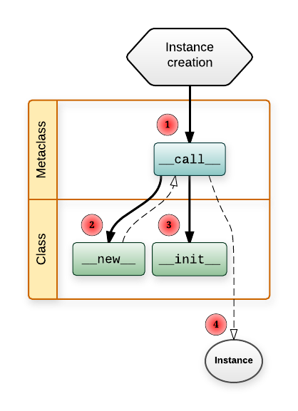
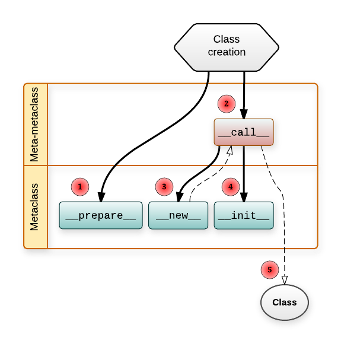



name: sadrzaj

# Sadržaj

- [Specijalne metode](#specijalne-metode)
- [Properties](#properties)
- [Descriptors](#descriptors)
- [Decorators](#decorators)
- [functools](#functools)
- [itertools](#itertools)
- [collections](#collections)
- [Višestruko nasleđivanje i MRO](#višestruko-nasleđivanje-i-mro)
- [Metaklase](#metaklase)


---
name: specijalne-metode
class: center, middle
layout: false

# Specijalne metode

---
layout: true

.section[[Specijalne metode](#sadrzaj)]

---

## Specijalne metode

- Često se zovu i *magične* metode.
- Posebno se tretiraju od strane Python interpretera. Imaju posebnu semantiku.
- Format naziva je `__xxx__`.
- Neki od primera:
  - `__init__`
  - `__str__`
  - `__eq__`
  - `...`
- Implementacija *protokola*


---
## Iterabilni objekti

- Moguće ih je koristiti u npr. `for` pelji.
```
for i in iterabilni_objekat:
    ...
```
- Poziv ugrađene funkcije `iter` nad iterabilnim objektom vraća iterator
  objekat.
- Kada je potrebna iteracija Python poziva `__iter__` metodu nad našim objektom.
  Ova funkcija treba da vrati iterator objekat.
- Iterator objekti implementiraju tzv. `iterator` protokol.
  - `__next__` metoda -- sledeći element ili izuzetak `StopIteration` ukoliko
    smo stigli do kraja.

---

## Iterabilni objekti - primer

- Primer `TextXMetaModel` klasa [textX](https://github.com/igordejanovic/textX)
  projekta.

```python
def __iter__(self):
    """
    Iterate over all classes in the current namespace and imported
    namespaces.
    """

    # Current namespace
    for name in self._current_namespace:
        yield self._current_namespace[name]

    # Imported namespaces
    for namespace in \
            self._imported_namespaces[self._namespace_stack[-1]]:
        for name in namespace:
            # yield class
            yield namespace[name]
```

- U ovom slučaju `__iter__` metoda je generator (vraća elemente sa `yield`).

---
## Provera pripadnosti kolekciji

- Operator `in` služi za testiranje pripadnosti:

```python
if a in neka_kolekcija:
   ...
```

- Ukoliko želimo da omogućimo `in` test sa našim objektima potrebno je
  definisati specijalnu metodu `__contains__`:

```python
def __contains__(self, name):
    """
    Check if given name is contained in the current namespace.
    The name can be fully qualified.
    """
    try:
        self[name]
        return True
    except KeyError:
        return False
```

---
## Pristup elementu kolekcije po ključu

- Specijalna metoda `__getitem__` omogućava upotrebu operatora `[]`.

```python
>>> a = [1, 2, 3]
>>> a.__getitem__(2)
3
>>> b = { "foo": 45, "bar": 34}
>>> b.__getitem__(34)
---------------------------------------------------------------------------
KeyError                                  Traceback (most recent call last)
...
KeyError: 34
>>> b.__getitem__("foo")
45

```

---
## Pristup elementu kolekcije po ključu - primer

```python
def __getitem__(self, name):
    """
    Search for and return class and peg_rule with the given name.
    Returns:
        TextXClass, ParsingExpression
    """
    if "." in name:
        # Name is fully qualified
        namespace, name = name.rsplit('.', 1)
        return self.namespaces[namespace][name]
    else:
        # If not fully qualified search in the current namespace
        # and after that in the imported_namespaces
        if name in self._current_namespace:
            return self._current_namespace[name]

        for namespace in \
                self._imported_namespaces[self._namespace_stack[-1]]:
            if name in namespace:
                return namespace[name]

        raise KeyError("{} metaclass does not exists in the metamodel "
                        .format(name))
```

---
## Pristup atributu objekta

- Dve specijalne metode: `__getattr__` i `__getattribute__`

```python
obj.neki_atribut
```

---
## `__getattr__`

- Poziva se ukoliko standardnim mehanizmima nije pronađen atribut objekta. Kao
  parametar prima ime atributa i vraća njegovu vrednost ukoliko postoji ili
  podiže izuzetak `AttributeError` ukoliko atribut ne postoji.
  
```python
class A:
    def __init__(self):
        self.additional = {'foo': 5, 'bar': 7.4}
        # .a će biti pronađeno standardnim mehanizmom
        self.a = 3

    def __getattr__(self, key):
        if key in self.additional:
            return self.additional[key]
        else:
            raise AttributeError

if __name__ == '__main__':
    a = A()
    print(a.a)
    print(a.foo)
    print(a.bla)
```

---
## Postavljanje vrednosti i brisanje atributa

- `object.__setattr__(self, name, value)` - kada se pozove `object.name = value`
  - Obratiti pažnju na rekurziju! Ne raditi u telu metode `self.name = value`
    već `self.__dict__[name] = value`.

- `object.__delattr__(self, name)` - kada se pozove `del object.name`

---
## `__getattribute__`

- Specijalna metoda nižeg nivoa.
- Podrazumevana implementacija obavlja podrazumevanu pretragu:
  - Prvo se proverava `__dict__` rečnik instance a zatim klasa prateći MRO lanac.
  - Ukoliko se atribut ne pronađe poziva se `__getattr__`
- Ovu metodu je retko potrebno redefinisati.
- Paziti prilikom pisanja na beskonačanu rekurziju! Najbolje je pozvati
  na kraju nadimplementaciju `object.__getattribute__(self, name)`

---
## Operatori

- Svi operatori u Python-u su definisani specijalnim metodama. Na primer:
  - `-` - `__sub__`
  - `+` - `__add__`
  - `*` - `__mul__`
  - `+=` - `__iadd__` - (za *mutable* objekte)
  - ...
  
  
---
## Poređenje objekata

- Ukoliko želimo da instance naše klase mogu da se porede (npr. da bi mogli da
  sortiramo niz objekata) potrebno je implementirati specijalne metode:
  - `__eq__` za operator jednakosti `==`
  - `__ne__` za operator nejednakosti `!=`
  - `__lt__` za operator *manje* - `<`
  - `__le__` za operator *manje ili jednako* - `<=`
  - `__gt__` za operator *veće* - `>`
  - `__ge__` za operator *veće ili jednako* - `>=`
- Nije potrebno ručno definisati sve operatore jer su prirodno međuzavisni.
  Python u sklopu modula `functools` nudi dekorator `total_ordering` (videti u
  sekciji `functools`) koji automatski kreira nedostajuće operatore poređenja.
  

---
name: properties
class: center, middle
layout: false

# *Properties*

---
layout: true

.section[[Properties](#sadrzaj)]

---

## *Properties*

- Tzv. kalkulisani ili izvedeni atributi.
- Generalizacija *getter* i *setter* mehanizma.
- Sintaksa ostaje kao kod direktnog pristupa atributu.

---

## *Properties* - primer

```python

class ...:
...
    @property
    def full_file_name(self):
        return os.path.join(self.file_path, self.file_name)

    @full_file_name.setter
    def full_file_name(self, filename):
        path_name, file_name = os.path.split(filename)
        self.file_path = path_name
        self.file_name = file_name
        model_name, __ = os.path.splitext(file_name)
        self.name = model_name
```

*Property* atributima se pristupa kao običnim atributima:
```python
obj.full_file_name = '/neka/putanja/neko_ime.ext'
```

- Objekat čuva atribute `file_path` i `file_name`.
- Atribut `full_file_name` je izveden.


---
name: descriptors
class: center, middle
layout: false

# Deskriptori

---
layout: true

.section[[Descriptors](#sadrzaj)]

---

## *Descriptors*

- Generalizacija prilagođavanja pristupu atributima objekata.
- Npr. *properties* iz prethodne sekcije su implementirani mehanizmom
  deskriptora.
- Ukoliko interpreter pronađe atribut na nivou klase i taj atribut je objekat
  koji ima neku od metoda `__get__`, `__set__`, `__del__` tada će ovim metodama
  biti prosleđeno dobavljanje, postavljanje ili brisanje atributa respektivno.
  
---
## Problem sa *properties*

.medium[
```python
class Movie(object):
    def __init__(self, title, rating, runtime, budget, gross):
        self._budget = None

        self.title = title
        self.rating = rating
        self.runtime = runtime
        self.gross = gross
        self.budget = budget
        
    @property
    def budget(self):
        return self._budget
    
    @budget.setter
    def budget(self, value):
        if value < 0:
            raise ValueError("Negative value not allowed: %s" % value)
        self._budget = value
        
    def profit(self):
        return self.gross - self.budget

    
m = Movie('Casablanca', 97, 102, 964000, 1300000)
print m.budget       # calls m.budget(), returns result
try:
    m.budget = -100  # calls budget.setter(-100), and raises ValueError
except ValueError:
    print "Woops. Not allowed"
```
]


.footer.small[
Chris Beaumont: [Python Descriptors Demystified](http://nbviewer.jupyter.org/urls/gist.github.com/ChrisBeaumont/5758381/raw/descriptor_writeup.ipynb)
]

---
# Rešenje upotrebom deskriptora (1)

```python
from weakref import WeakKeyDictionary

class NonNegative(object):
    """A descriptor that forbids negative values"""
    def __init__(self, default):
        self.default = default
        self.data = WeakKeyDictionary()
        
    def __get__(self, instance, owner):
        # we get here when someone calls x.d, and d is a NonNegative instance
        # instance = x
        # owner = type(x)
        return self.data.get(instance, self.default)
    
    def __set__(self, instance, value):
        # we get here when someone calls x.d = val, and d is a NonNegative instance
        # instance = x
        # value = val
        if value < 0:
            raise ValueError("Negative value not allowed: %s" % value)
        self.data[instance] = value
```

.footer.small[
Chris Beaumont: [Python Descriptors Demystified](http://nbviewer.jupyter.org/urls/gist.github.com/ChrisBeaumont/5758381/raw/descriptor_writeup.ipynb)
]

---
# Rešenje upotrebom deskriptora (2)

.medium[
```python
class Movie(object):
    
    #always put descriptors at the class-level
    rating = NonNegative(0)
    runtime = NonNegative(0)
    budget = NonNegative(0)
    gross = NonNegative(0)
    
    def __init__(self, title, rating, runtime, budget, gross):
        self.title = title
        self.rating = rating
        self.runtime = runtime
        self.budget = budget
        self.gross = gross
    
    def profit(self):
        return self.gross - self.budget
    
    
m = Movie('Casablanca', 97, 102, 964000, 1300000)
print m.budget  # calls Movie.budget.__get__(m, Movie)
m.rating = 100  # calls Movie.budget.__set__(m, 100)
try:
    m.rating = -1   # calls Movie.budget.__set__(m, -100)
except ValueError:
    print "Woops, negative value"
```
]

.footer.small[
Chris Beaumont: [Python Descriptors Demystified](http://nbviewer.jupyter.org/urls/gist.github.com/ChrisBeaumont/5758381/raw/descriptor_writeup.ipynb)
]


---
name: decorators
class: center, middle
layout: false

# Dekoratori(*Decorators*)

---
layout: true

.section[[Decorators](#sadrzaj)]

---

## Dekoratori

- Dekorator obrazac.
- Funkcije koje prihvataju kao parametar funkciju (ili uopšte
  `callable`) i vraćaju izmenjenu verziju.

.lcol-narrow[
```python
@trace
def square(x):
  return x*x

# Ovo je ekvivalentno sa
def square(x):
  return x*x
square = trace(square)
```
]

.rcol-wide[
```python
enable_tracing = True
if enable_tracing:
  debug_log = open("debug.log","w")
def trace(func):
  if enable_tracing:
    def callf(*args,**kwargs):
      debug_log.write("Calling %s: %s, %s\n" %
              (func._ _name_ _, args, kwargs))
      r = func(*args,**kwargs)
      debug_log.write("%s returned %s\n" %
                      (func._ _name, r))
      return r
    return callf
  else:
    return func
```
]


---

## Dekoratori (2)

Mogu da se stekuju.

```python
@foo
@bar
@spam
def grok(x):
  pass
```

je isto što i
```python
def grok(x):
  pass
grok = foo(bar(spam(grok)))
```


---

## Dekoratori (3)

Mogu da imaju parametre

.lcol[
```python
@eventhandler('BUTTON')
def handle_button(msg):
  ...

@eventhandler('RESET')
def handle_reset(msg):
  ...

# Sto je ekvivalentno sa
def handle_button(msg):
...
temp = eventhandler('BUTTON')
handle_button = temp(handle_button)
```
]

.rcol[
```python
# Event handler decorator
event_handlers = { }
def eventhandler(event):
  def register_function(f):
    event_handlers[event] = f
    return f
  return register_function
```
]


---
layout: false
name: functools
class: center, middle

# `functools` modul
## Podrška za funkcije višeg reda.

---
layout: true

.section[[functools](#sadrzaj)]

---
## `partial`

- Delimična (parcijalna) primena funkcije.
- Određeni parametri se *zamrzavaju*. Nova funkcija prihvata manji broj
  parametara.
 
.medium[
```python
>>> from functools import partial
>>> basetwo = partial(int, base=2)
>>> basetwo.__doc__ = 'Konverzija stringa broja u bazi 2 u int.'
>>> basetwo('10010')
18

>>> stepen = lambda a, b: a ** b
>>> kvadrat = partial(stepen, b=2)
>>> kvadrat(5)
25
>>> kub = partial(stepen, b=3)
>>> kub(5)
125

>>> from operator import mul
>>> dvaputa = partial(mul, 2)
>>> dvaputa(10)
20
>>> triputa = partial(mul, 3)
>>> triputa(5)
15
```
]

---
## `reduce`

- Primena date funkcije koja prima dva parametra na iterabilnu kolekciju s leva
  na desno tako što se kao prvi parametar koristi rezultat prethodne evaluacije
  dok se kao drugi parametar koristi sledeći element kolekcije.
  
```python
reduce(lambda x, y: x+y, [1, 2, 3, 4, 5])
```
izračunava
```
(((1+2)+3)+4)+5)
```

- Postoji i kao ugrađena (*build-in*) funkcija u Python 2.
---
## `reduce` ekvivalentan Python kod

```python
def reduce(function, iterable, initializer=None):
    it = iter(iterable)
    if initializer is None:
        try:
            initializer = next(it)
        except StopIteration:
            raise TypeError('reduce() of empty sequence with no initial value')
    accum_value = initializer
    for x in it:
        accum_value = function(accum_value, x)
    return accum_value
```

---
## Primer: množenje niza elemenata

```python
niz = range(1, 10)
```

`for` petlja:
```python
proizvod = 1
for elem in niz:
    proizvod *= elem
```

`reduce`:
```python
proizvod = reduce(lambda x, y: x*y, niz)
```

---
## Kreiranje funkcije za množenje niza elemenata

Kompozicija funkcija `partial` + `reduce` (funkcionalno):
```python
from functools import reduce, partial
amul = partial(reduce, lambda x, y: x*y)
# ili upotrebom mul operatora
from operator import mul
amul = partial(reduce, mul)
```

Sa `for` petljom (imperativno):
```
def amul(niz):
  proizvod = 1
  for elem in niz:
      proizvod *= elem
  return proizvod
```

Oba primera kreiraju funkciju `amul` koja množi elemente prosleđenog iterabilnog
objekta:
```python
amul(range(1, 100))
```

---
## `update_wrapper` i `wraps`

- Kod dekoracije funkcija ažurira dekorisanu funkciju da spolja "izgleda" kao
  originalna.

.medium[
```python
>>> from functools import wraps
>>> def my_decorator(f):
...     @wraps(f)
...     def wrapper(*args, **kwds):
...         print 'Calling decorated function'
...         return f(*args, **kwds)
...     return wrapper
...
>>> @my_decorator
... def example():
...     """Docstring"""
...     print 'Called example function'
...
>>> example()
Calling decorated function
Called example function
>>> example.__name__
'example'
>>> example.__doc__
'Docstring'
```
]


---
## `total_ordering`

- "Dopuna" specijalnih metoda za poređenje. Koristi se kao dekorator klase.
- Klasa treba da definiše jednu od `__lt__`, `__le__`, `__gt__`, ili `__ge__()`
  metoda uz `__eq__`.

```python
@total_ordering
class Student:
    def __eq__(self, other):
        return ((self.lastname.lower(), self.firstname.lower()) ==
                (other.lastname.lower(), other.firstname.lower()))
    def __lt__(self, other):
        return ((self.lastname.lower(), self.firstname.lower()) <
                (other.lastname.lower(), other.firstname.lower()))
```


.footer.small[
https://docs.python.org/2/library/functools.html
]

---
name: itertools
class: center, middle
layout: false

# `itertools` modul
## Pomoćne funkcije za iteraciju

---
layout: true

.section[[itertools](#sadrzaj)]

---

## `chain`

- Iteracije kroz više iterabilnih objekata prema zadatom redosledu.
- Tretiranje niza sekvenci kao jedne sekvence.

Ekvivalentno sa sledećim Python kodom:
```python
def chain(*iterables):
    for it in iterables:
        for element in it:
            yield element
```

Upotreba:

```python
a = [1, 2, 3]
b = 'abc'
for i in chain(a, b):
    print(i)
```

---
## `cycle`

- Beskonačna iteracija kroz zadati iterabilni objekat *u krug*.

Ekvivalentno sa:

```python
def cycle(iterable):
    # cycle('ABCD') --> A B C D A B C D A B C D ...
    saved = []
    for element in iterable:
        yield element
        saved.append(element)
    while saved:
        for element in saved:
              yield element
```

---
## `ifilter/filter`

- Kreira iterator koji filtrira i vraća samo one elemente zadatog iterabilnog
  objekta koji zadovoljavaju određeni predikat.
- U Python 3 `ifilter` je izbačen jer ugrađena funkcija `filter` radi na isti
  način (kao generator).
  
Ekvivalentno sa:
```python
def ifilter(predicate, iterable):
    # ifilter(lambda x: x%2, range(10)) --> 1 3 5 7 9
    if predicate is None:
        predicate = bool
    for x in iterable:
        if predicate(x):
            yield x
```

---
## `imap/map`

- Kreira iterator koji vraća vrednost zadate funkcije gde se parametri uzimaju
  iz zadatih iterabilnih objekata.
- U Python 3 `imap` je izbačen jer ugrađena funkcija `map` radi na isti način
  (kao generator).

Ekvivalentno sa:

```python
def imap(function, *iterables):
    # imap(pow, (2,3,10), (5,2,3)) --> 32 9 1000
    iterables = map(iter, iterables)
    while True:
        args = [next(it) for it in iterables]
        if function is None:
            yield tuple(args)
        else:
            yield function(*args)
```

---
## `izip/zip`

- Kreira iterator koji istovremeno iterira kroz više iterabilnih objekata
  vraćajući n-torke gde svaki element pripada odgovarajućem iterabilnom objektu.
- U Python 3 `izip` je izbačen jer ugrađena funkcija `zip` radi na isti način
  (kao generator).
- Ekvivalentno sa:

```python
def izip(*iterables):
    # izip('ABCD', 'xy') --> Ax By
    iterators = map(iter, iterables)
    while iterators:
        yield tuple(map(next, iterators))
```

---
## `groupby`

- Kreira iterator koji vraća grupe elemenata prema zadato `key` funkciji.
- Kolekcija nad kojom pozivamo `groupby` mora biti sortirana prema istoj `key`
  funkciji.
  
```
groups = []
uniquekeys = []
data = sorted(data, key=keyfunc)
for k, g in groupby(data, keyfunc):
    groups.append(list(g))      # Store group iterator as a list
    uniquekeys.append(k)
```

---
## `dropwhile`

- Iterator koji odbacuje prve elemente za koje je dati predikat istinit i zatim
  vraća sve preostale redom.
- Ekvivalentno sa:
  
```python
def dropwhile(predicate, iterable):
    # dropwhile(lambda x: x<5, [1,4,6,4,1]) --> 6 4 1
    iterable = iter(iterable)
    for x in iterable:
        if not predicate(x):
            yield x
            break
    for x in iterable:
        yield x
```

---
## `takewhile`

- Iterator koji vraća elemente dok je predikat zadovoljen.
- Ekvivalentno sa:

```python
def takewhile(predicate, iterable):
    # takewhile(lambda x: x<5, [1,4,6,4,1]) --> 1 4
    for x in iterable:
        if predicate(x):
            yield x
        else:
            break
```

---
## `tee`

- Deli dati iterabilni objekat na više.
- Ekvivalentno sa:

```python
def tee(iterable, n=2):
    it = iter(iterable)
    deques = [collections.deque() for i in range(n)]
    def gen(mydeque):
        while True:
            if not mydeque:             # when the local deque is empty
                try:
                    newval = next(it)   # fetch a new value and
                except StopIteration:
                    return
                for d in deques:        # load it to all the deques
                    d.append(newval)
            yield mydeque.popleft()
    return tuple(gen(d) for d in deques)
```


---
name: collections
class: center, middle
layout: false

# collections
## High-performance container datatypes

---
layout: true

.section[[collections](#sadrzaj)]

---
## OrderedDict

- Nasleđuje `dict` i dodaje osobinu uređenosti. Iteracija vraća ključeve u
  redosledu u kom su dodavani u kolekciju.
- Dodaje metodu `move_to_end(key, last=True)` koja postojeći ključ pomera na
  kraj kolekcije.

.medium[
```python
>>> d = OrderedDict.fromkeys('abcde')
>>> d.move_to_end('b')
>>> ''.join(d.keys())
'acdeb'
>>> d.move_to_end('b', last=False)
>>> ''.join(d.keys())
'bacde'
```

```python
>>> # regular unsorted dictionary
>>> d = {'banana': 3, 'apple': 4, 'pear': 1, 'orange': 2}

>>> # dictionary sorted by key
>>> OrderedDict(sorted(d.items(), key=lambda t: t[0]))
OrderedDict([('apple', 4), ('banana', 3), ('orange', 2), ('pear', 1)])

>>> # dictionary sorted by value
>>> OrderedDict(sorted(d.items(), key=lambda t: t[1]))
OrderedDict([('pear', 1), ('orange', 2), ('banana', 3), ('apple', 4)])

>>> # dictionary sorted by length of the key string
>>> OrderedDict(sorted(d.items(), key=lambda t: len(t[0])))
OrderedDict([('pear', 1), ('apple', 4), ('orange', 2), ('banana', 3)])
```
]

---
## namedtuple

- N-torke slične tipu `tuple` ali sa mogućnošću pristupa poljima po imenu kao
  kod atributa objekta.
  
```python
>>> # Basic example
>>> Point = namedtuple('Point', ['x', 'y'])
>>> p = Point(11, y=22)     # instantiate with positional or keyword arguments
>>> p[0] + p[1]             # indexable like the plain tuple (11, 22)
33
>>> x, y = p                # unpack like a regular tuple
>>> x, y
(11, 22)
>>> p.x + p.y               # fields also accessible by name
33
>>> p                       # readable __repr__ with a name=value style
Point(x=11, y=22)
```


---
## deque

- Linearna struktura sa efikasnim `O(1)` ubacivanjem i uzimanjem elementa sa obe
  strane.
- Slično `list` tipu ali `list` tip ima složenost `O(n)` za ubacivanje i
  izbacivanje elementa sa početka liste.

.medium[
```python
>>> from collections import deque
>>> d = deque('ghi')                 # make a new deque with three items
>>> for elem in d:                   # iterate over the deque's elements
...     print(elem.upper())
G
H
I

>>> d.append('j')                    # add a new entry to the right side
>>> d.appendleft('f')                # add a new entry to the left side
>>> d                                # show the representation of the deque
deque(['f', 'g', 'h', 'i', 'j'])

>>> d.pop()                          # return and remove the rightmost item
'j'
>>> d.popleft()                      # return and remove the leftmost item
'f'
>>> list(d)                          # list the contents of the deque
['g', 'h', 'i']
>>> d[0]                             # peek at leftmost item
'g'
>>> d[-1]                            # peek at rightmost item
'i'
```
]


---
## Counter

- Podklasa `dict` tipa za prebrojavanje objekta koji mogu da se *heširaju*.
- Ključevi su objekti a vrednosti su njihov ukupan broj.

```python
>>> c = Counter()                           # a new, empty counter
>>> c = Counter('gallahad')                 # a new counter from an iterable
>>> c = Counter({'red': 4, 'blue': 2})      # a new counter from a mapping
>>> c = Counter(cats=4, dogs=8)             # a new counter from keyword args

>>> c = Counter(['eggs', 'ham'])
>>> c['bacon']                              # count of a missing element is zero
0

>>> c = Counter(a=4, b=2, c=0, d=-2)
>>> sorted(c.elements())
['a', 'a', 'a', 'a', 'b', 'b']

>>> Counter('abracadabra').most_common(3)  
[('a', 5), ('r', 2), ('b', 2)]

>>> c = Counter(a=4, b=2, c=0, d=-2)
>>> d = Counter(a=1, b=2, c=3, d=4)
>>> c.subtract(d)
>>> c
Counter({'a': 3, 'b': 0, 'c': -3, 'd': -6})
```


---
## defaultdict

- Nasleđuje `dict` i omogućava kreiranje elementa sa podrazumevanom vrednošću
  ukoliko se pokuša pristup nepostojećem elementu.
- Kao parametar prima `default_factory` što mora biti `callable` koji će se
  pozvati da kreira novi element.
  
```python
>>> s = [('yellow', 1), ('blue', 2), ('yellow', 3), ('blue', 4), ('red', 1)]
>>> d = defaultdict(list)
>>> for k, v in s:
...     d[k].append(v)
...
>>> sorted(d.items())
[('blue', [2, 4]), ('red', [1]), ('yellow', [1, 3])]
```


---
name: višestruko-nasleđivanje-i-mro
class: center, middle
layout: false

# Višestruko nasleđivanje i MRO

---
layout: true

.section[[Višestruko nasleđivanje i MRO](#sadrzaj)]

---

## Višestruko nasleđivanje

- Python podržava višestruko nasleđivanje.
- Problem razrešavanja metode/atributa iz nadklasa.
- *Diamond problem*.
- Problem kod naivnog pretraživanja "po dubini".


.footer.small[
[Wikipedia: Multiple inheritance](https://en.wikipedia.org/wiki/Multiple_inheritance)
]


---
## *Method Resolution Order* (MRO)

- Mehanizam/algoritam za razrešavanje u kontekstu višestrukog nasleđivanja
- C3 linearizacija
- Programski jezik *Dylan*
- Dva pravila:
  - Podklase se pretražuju pre nadklasa
  - Pretražuju se u redosledu navođenja
- Za primer sa prethodnog slajda: D B C A

---
## `super`

- Dinamički određuje metodu/atribut na osnovu MRO.
- Klase koje koriste višestruko nasleđivanje treba da se pišu na određeni način.
- Obavezno koristiti `super` umesto direktnog navođenja klase.


---
## `super`

```python
class LoggingDict(dict):
    def __setitem__(self, key, value):
        logging.info('Setting %r to %r' % (key, value))
        super().__setitem__(key, value)
```

```python
class LoggingOD(LoggingDict, collections.OrderedDict):
    pass
```

```python
>>> pprint(LoggingOD.__mro__)
(<class '__main__.LoggingOD'>,
 <class '__main__.LoggingDict'>,
 <class 'collections.OrderedDict'>,
 <class 'dict'>,
 <class 'object'>)
```

.footer.small[
[Raymond Hettinger:  Python’s super() considered super!](https://rhettinger.wordpress.com/2011/05/26/super-considered-super/)
]


---
## Parametri metoda

- Situacija u kojoj signature metoda nisu iste.

```python
class Shape:
    def __init__(self, shapename, **kwds):
        self.shapename = shapename
        super().__init__(**kwds)        

class ColoredShape(Shape):
    def __init__(self, color, **kwds):
        self.color = color
        super().__init__(**kwds)

cs = ColoredShape(color='red', shapename='circle')
```

.footer.small[
[Raymond Hettinger:  Python’s super() considered super!](https://rhettinger.wordpress.com/2011/05/26/super-considered-super/)
]

---
## Pretraga metoda

- Obratiti pažnju da `super` poziv traži metodu uz MRO lanac.
- Što znači da metoda mora postojati u nadklasi ili će doći do pojave izuzetka.
- Kod primera sa konstruktorom `__init__` metoda postoji i u `object` korenskoj
  klasi. Izuzetak se može pojaviti ukoliko nismo iscrpeli sve parametre u
  `**kwds` što je svakako greška.


---
## Pretraga metoda

.medium[
- Ukoliko metoda ne postoji u korenskoj `object` klasi najbolje je kreirati
  koren naše hijerarhije sa datom metodom.
- Ova korenska metoda biće kraj pretrage.
- Dodatno možemo osigurati da klase niz MRO lanac slučajno ne implementiraju
  ciljnu metodu.
 
```python
class Root:
    def draw(self):
        # the delegation chain stops here
        assert not hasattr(super(), 'draw')

class Shape(Root):
    def __init__(self, shapename, **kwds):
        self.shapename = shapename
        super().__init__(**kwds)
    def draw(self):
        print('Drawing.  Setting shape to:', self.shapename)
        super().draw()

class ColoredShape(Shape):
    def __init__(self, color, **kwds):
        self.color = color
        super().__init__(**kwds)
    def draw(self):
        print('Drawing.  Setting color to:', self.color)
        super().draw()

cs = ColoredShape(color='blue', shapename='square')
cs.draw()
```
]

.footer.small[
[Raymond Hettinger:  Python’s super() considered super!](https://rhettinger.wordpress.com/2011/05/26/super-considered-super/)
]

---
## Upotreba klasa koje nisu dizajnirane za višestruko nasleđivanje

```python
class Moveable:

    def __init__(self, x, y):
        self.x = x
        self.y = y

    def draw(self):
        print('Drawing at position:', self.x, self.y)
```

.footer.small[
[Raymond Hettinger:  Python’s super() considered super!](https://rhettinger.wordpress.com/2011/05/26/super-considered-super/)
]

---
## Upotreba klasa koje nisu dizajnirane za višestruko nasleđivanje

```python
class MoveableAdapter(Root):

    def __init__(self, x, y, **kwds):
        self.movable = Moveable(x, y)
        super().__init__(**kwds)

    def draw(self):
        self.movable.draw()
        super().draw()

class MovableColoredShape(ColoredShape, MoveableAdapter):
    pass

MovableColoredShape(color='red', shapename='triangle',
                    x=10, y=20).draw()
```

.footer.small[
[Raymond Hettinger:  Python’s super() considered super!](https://rhettinger.wordpress.com/2011/05/26/super-considered-super/)
]

---
name: metaklase
class: center, middle
layout: false

# Metaklase

---
layout: true

.section[[Metaklase](#sadrzaj)]

---

## Metaklase

- Python klase predstavljaju "šablon" za kreiranje objekata.
- I same klase su objekti. Šta je njihov šablon? Ko je zadužen za njihovo
  kreiranje?
- Klase imaju svoje "klase" koje nazivamo metaklasama.


---
## Metaklase

- Python ima podrazumevanu metaklasu `type` koju interpreter koristi kada naiđe
  na definiciju klase.
- `type` klasa je svoj sopstveni tip
- Podrazumevanu klasu možemo promeniti i time uticati na kreiranje klase.
- Pri kreiranju metaklase nasleđujemo `type`

- Kao što za instanciranje objekta Python poziva klasu, za kreiranje klase
  poziva metaklasu.
- Pojednostavljeno gledano `class` iskaz možemo smatrati lepšom sintaksom
  (*Syntactic sugar*) za poziv `type` ili neke druge metaklase.


---
## `type`

- `type` može da se koristi i kao funkcija koja vraća tip nekog objekta.

```python
>>> class Foobar:
...     pass
...
>>> type(Foobar)
<class 'type'>
>>> foo = Foobar()
>>> type(foo)
<class '__main__.Foobar'>

>>> isinstance(foo, Foobar)
True
>>> isinstance(Foobar, type)
True
```

.footer.small[
[Ionel Cristian Mărieș: Understanding Python metaclasses](https://blog.ionelmc.ro/2015/02/09/understanding-python-metaclasses/)
]

---
## Ili predstavljeno dijagramom


.footer.small[
[Ionel Cristian Mărieș: Understanding Python metaclasses](https://blog.ionelmc.ro/2015/02/09/understanding-python-metaclasses/)
]

---
## Kreiranje klase sa `type`

```python
>>> MyClass = type('MyClass', (), {})
>>> MyClass
<class '__main__.MyClass'>
```

---
## Korisnička metaklasa


```python
>>> class Meta(type):
...     pass

>>> class Complex(metaclass=Meta):
...     pass
>>> type(Complex)
<class '__main__.Meta'>
```

.footer.small[
[Ionel Cristian Mărieș: Understanding Python metaclasses](https://blog.ionelmc.ro/2015/02/09/understanding-python-metaclasses/)
]

---
## Specijalne metode

- `__new__` - konstruktor objekta
- `__init__` - inicijalizator

---
## Pretraga metoda - dijagram

- Na sledećem slajdu
- [Ionel Cristian Mărieș: Understanding Python metaclasses](https://blog.ionelmc.ro/2015/02/09/understanding-python-metaclasses/)

---


---



.footer.small[
[Ionel Cristian Mărieș: Understanding Python metaclasses](https://blog.ionelmc.ro/2015/02/09/understanding-python-metaclasses/)
]

---



.footer.small[
[Ionel Cristian Mărieș: Understanding Python metaclasses](https://blog.ionelmc.ro/2015/02/09/understanding-python-metaclasses/)
]

---
## Metaklase - više detalja

- [Ionel Cristian Mărieș: Understanding Python metaclasses](https://blog.ionelmc.ro/2015/02/09/understanding-python-metaclasses/)



