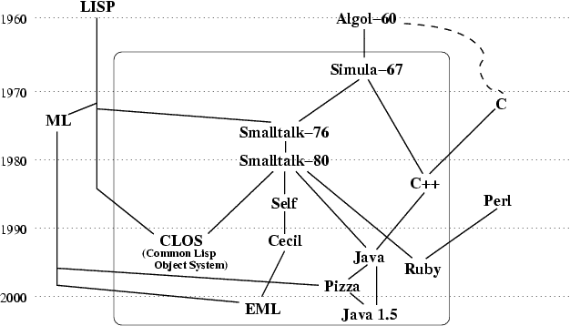
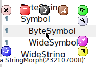
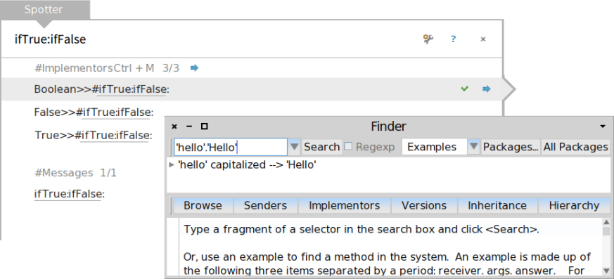
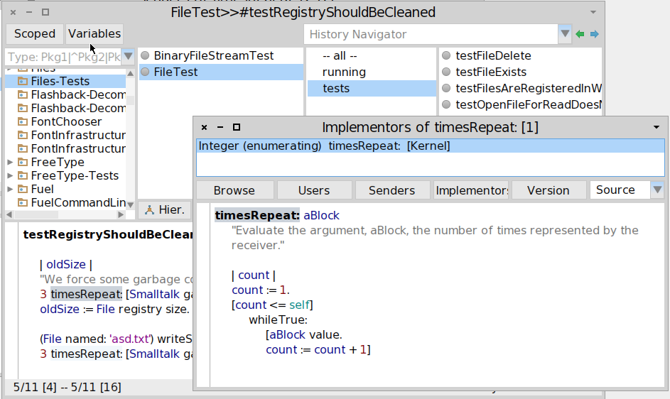
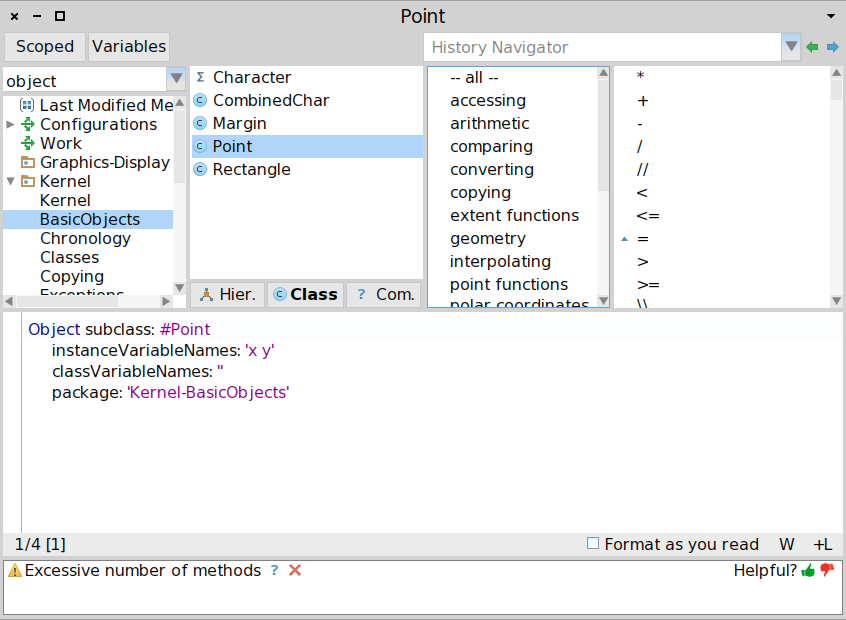
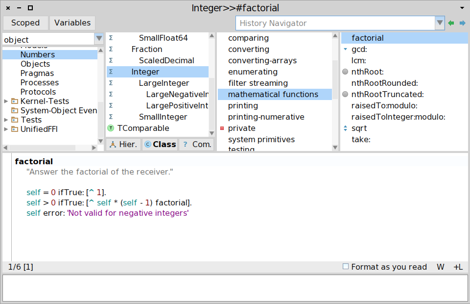
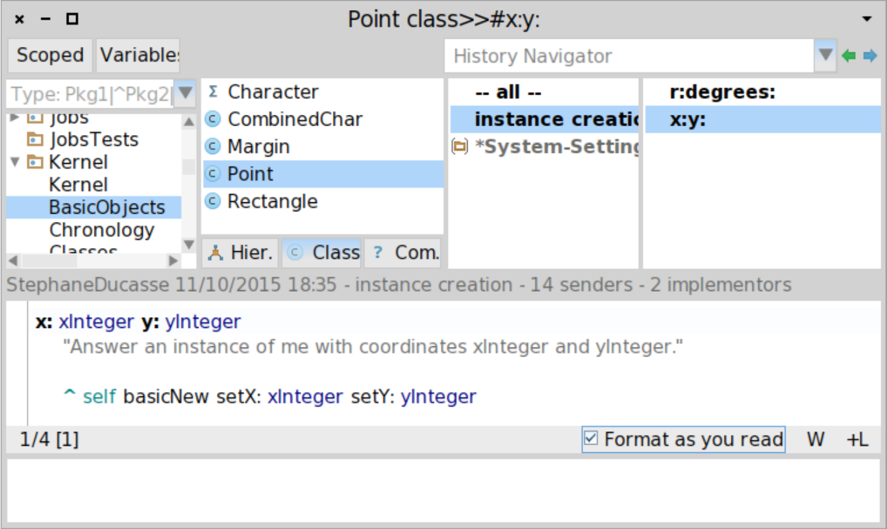
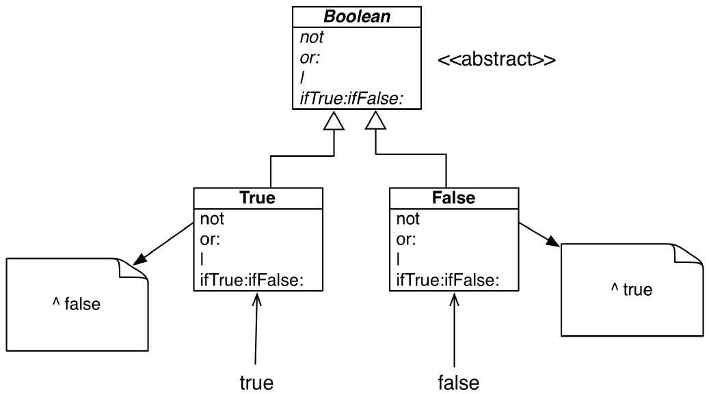
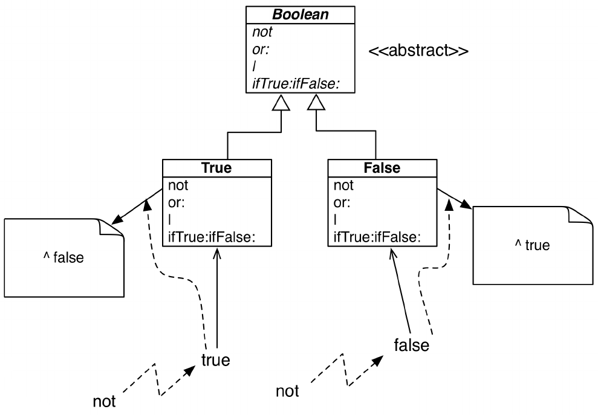



name: sadrzaj

# Sadržaj

- [Smalltalk](#smalltalk)
- [Pharo uvod](#pharo_uvod)
- [Poruke](#poruke)
- [Petlje i iteracije](#iteracija)
- [Blokovi](#blokovi)
- [Bulovi izrazi i uslovi](#bulovi-izrazi)
- [Klase i metode](#klase-i-metode)
- [yourself](#yourself)
- [Dispatch](#dispatch)
- [Klase i kolekcije](#kolekcije)
- [Nasleđivanje i pretraga metoda](#nasledjivanje)
- [Izuzeci, debagovanje i refleksija](#izuzeci)

---
name: smalltalk
class: center, middle

# Smalltalk

---
layout: true

.section[[Smalltalk](#sadrzaj)]

---

## Smalltalk


> Smalltalk is dangerous. It is a drug. My advice to you would be don't try it; it
> could ruin your life. Once you take the time to learn it (to REALLY learn it)
> you will see that there is still nothing out there that can quite touch it.

> -- Andy Bower


---
## Šta je Smalltalk?

- Objektno-orijentisani dinamički reflektivni jezik.
- Xerox PARC - Alan Kay, Dan Ingalls i drugi - tokom 70-ih.
- Uticao na razvoj Actor model obrasca.
- Nastao pod uticajem Simule (prvi OO jezik, Norwegian Computing Center u
  Oslu - 60-te).
- Jedan od najuticajnijih jezika.
- Napredni koncepti: sve je objekat, razmena poruka, "živ" sistem, virtualna
  mašina.
- Konstrukcionistički pristup programiranju.
  
---
## Istorijat

- Razvijen u par dana 1971 godine (Smalltalk-71) zbog opklade (Alan Kay).
- Kasnija verzija Smalltalk-72 je korišćena u istraživanjima.
- Smalltalk-76 - nasleđivanje klasa, razvojno okruženje
- Najpoznatija verzija Smalltalk-80 - meta-klase. Prva verzija dostupna van
  PARC-a (Apple, HP, DEC, UC Berkeley)
- Standardizovan - ANSI 1998

---
## Smalltalk implementacije

- Komercijalne
  - Smalltalk-80 (PARC)
  - VisualWorks (ParcPlace Systems, prodato 1999 firmi Cincom)
  - IBM VisualAge - napušteno u korist Jave. Današnji Eclipse je započeo kao
    VisualAge Smalltalk okruženje. Jedno vreme je i Java podrška bila
    implementirana u Smalltalk-u.

- FLOSS:
  - Squeak (moderna verzija Smalltalk-80) - Apple -> Disney -> HP Labs -> SAP Labs
    -> Y Combinator
  - Pharo - fork Squeak-a (2008) sa ciljem upotrebe u istraživanju i komercijalnim
    projektima (Pharo consortium, Pharo association)
  - Amber Smalltalk - Smalltalk u JavaScipt-u

---
## Familija Smalltalk i vezanih jezika



.footer[
http://courses.cs.washington.edu/courses/cse341/04wi/lectures/16-smalltalk-intro.html
]


---
name: pharo_uvod
class: center, middle
layout: false

# Pharo uvod

.footer[
Bazirano na [Pharo MOOC](http://files.pharo.org/mooc/)
]

---
layout: true

.section[[Pharo uvod](#sadrzaj)]

---

## Pharo

- Pravi OO jezik ("sve je objekat") + IDE!
- Inspirisan Smalltalk-om
- Aktivna zajednica
- "Živ" sistem.
- Jednostavan i moćan objektni model
- Radi na Mac OSX, Linux, iOS, Android, Windows, Pi.
- 100% MIT

---
## Cela sintaksa

Staje na jedan slajd:

```smalltalk
exampleWithNumber: x
    "A method that illustrates every part of Smalltalk method syntax."
    <menu>
    | y |
    true & false not & (nil isNil) ifFalse: [self halt].
    y := self size + super size.
    #($a #a "a" 1 1.0)
        do: [ :each |
            Transcript show: (each class name);
                       show: (each printString);
                       show: ' '].
    ^x < y

```
---
## Model

- Dinamički tipiziran
- Sve je objekat tj. instanca klase
- Sve metode su javne i virtualne
- Svi atributi su zaštićeni
- Jednostruko nasleđivanje (*Single inheritance*)

---
## Napisan u samom sebi

- Sve je napisano u Pharo!
- Jednostavna sintaks/model za pristup svemu.


---
## Introspekcija

- Pharo nije "crna kutija".
- Sve što vidite su objekti sa kojima možete stupiti u interakciju i menjati ih
  "naživo".
- Npr. Alt+Shift+Click -> Halo hendleri!




---
## Introspekcija


- Sa alatima *Spotter* (`Shift+Enter`) i *Finder* možete pronaći implementaciju
  bilo koje klase/poruke sistema.



- *Finder* ima interesantnu opciju pretrage po primeru.

---

## Introspekcija

- Kompletan kod je dostupan za analizu.



---
## Samo objekti, poruke...

- *Objekti*: mouse pointer, booleans, arrays, numbers, strings, windows, files,
  sound, url, socket, font, text, streams...
  
- *Poruke (messages)*: size, +, at:put:, do:, collect:, ifTrue:ifFalse:...

- Poruke predstavljaju **nameru** (šta treba uraditi). Metode opisuju kako treba
  nešto uraditi.
  
- Objekat koji prima poruku zovemo "prijemnikom" (*receiver*).

---
## ... i blokovi (*Block Closures*)

- Blokovi su vrsta anonimnih metoda.

```
4 timesRepeat:
    [ Transcript show: 'Hello World!']
```

- Blokovi se navode unutar `[]`.

---
## Jednostavan, elegantan i uniforman model

- *Sve* je objekat tj. instanca klase.
  - Klase i poruke su takođe objekti.
  
- Svo procesiranje se obavlja *razmenom poruka* (*message passing*) između
  objekata.

- Koristimo izraz *slanje poruke* jer:
  - metode se određuju dinamički
  - kasno povezivanje (*late binding*), samo virtuelni pozivi

- Postoji *samo jedan* mehanizam za pretragu metoda za sve objekte.

---
## Pharo objektni model

- Atributi instanci (*instance variables*) su zaštićeni (*protected*):
  - Privatni za objekat
  - Dostupni podklasama
- Metode su javne (*public*) i virtualne.
- Jednostruko nasleđivanje klasa.

---
## Slanje poruka

```
Date today

Date today + 3 days

2 + 3

(point1 x * point2 y) - (point1 y * point2 x)

```

---
## Kreiranje objekata

Obavlja se slanjem poruke drugom objektu

```
10@20
```
Nova instanca klase `Point` se kreira:

- slanjem poruke `@`
- objektu `10` (`SmallInteger`)
- sa argumentom `20` (`SmallInteger`)

---
## Kreiranje objekata - String

```smalltalk
'Pharo', 'is cool!'
=> 'Pharo is cool!'
```

Novi string se kreira spajanjem dva stringa tako što:
- se šalje poruka `,`
- stringu `'Pharo'`
- sa parametrom `'is cool!'`

---
## Kreiranje objekata

Slanjem poruke `new` ili `new:` klasi

```
Monster new
=> aMonster
```
U prethodnom primeru `Monster` je ime klase a `new` je poruka koja se šalje ovoj
klasi. Rezultat je nova instanca klase `Monster`.

Kreiranje niza dužine 6.
```
Array new: 6
=> #(nil nil nil nil nil nil)
```

Slanjem poruke klasi izvšava se metoda klase (*class method*).

```
Tamagoshi withHunger: 10
```

---
## Less is more!

- Bez konstruktora
- Bez statičkih metoda
- Bez deklaracije tipova
- Bez interfejsa
- Bez *package/private/protected* modifikatora
- Bez parametrizovanih tipova
- Bez boxing-a
- Ali i dalje vrlo moćan jezik!

---

## Hello world

```
'Hello World' asMorph openInWindow
```

Šaljemo poruku `asMorph` stringu `Hello World` i dobijamo grafički element
(*Morph*). Dobijenom grafičkom elementu šaljemo poruku `openInWindow` da bi ga
prikazali u prozoru.

---
## Primer - preuzimanje slike sa web-a

```
(ZnEasy getPng: 'http://pharo.org/web/files/pharo.png') asMorph openInWindow
```

- `ZnEasy` je ime klase. Klase su globalno dostupe i nazivi počinju sa velikim
  slovom.
- `getPng:` je poruka koju šaljemo klasi `ZnEasy`. Ova poruka ima argument. U
  ovom slučaju to je string `'http://pharo.org/web/files/pharo.png'`
  - Poruke koje imaju argumente se pišu sa `:` na kraju naziva i mogu biti
    višesložne. Ovakve poruke nazivamo `keyword message`.
    
- Poruka `asMorph` šalje se objektu koji vraća poruka `getPng:`. Ovo je obična
  unarna poruka bez argumenata.
  
- Poruka `openInWindow` se šalje objektu koji vraća poruka `asMorph`.

- Ove dve unarne poruke se primenjuju s leva na desno.

---
## Sintaksni elementi jezika

.center-table[
| Vrsta                       | Primer                       |
|-----------------------------|------------------------------|
| Komentar                    | `"Ovo je komentar"`          |
| Karakteri                   | `$c $# $@`                   |
| String                      | `'Ovo je string'`            |
| Simbol (jedinstveni string) | `#prvi #+`                   |
| Literal niz                 | `#(23 56 89)`                |
| Integer                     | `45, 2r10100`                |
| Real                        | `1.5, 6.03e-34, 4, 2.4e7`    |
]

---
## Sintaksni elementi jezika

.center-table[
| Vrsta     | Primer                           |
|-----------|----------------------------------|
| Boolean   | `true, false`                    |
|           | `   (instanca True i False)`     |
| Undefined | `nil` (instanca UndefinedObject) |
| Point     | 10@120                           |
]

---
## Osnovne jezičke konstrukcije

- Deklaracija privremene varijable: `| var |`
- Dodela vrednosti varijabli: `var := aValue`
- Separator iskaza: `obj1 message1. obj2 message2.`
- Povratak vrednosti iz metode: `^ aValue`
- Blokovi (leksička zatvorenja ili anonimne metode)
```
[ :x | x + 2 ] value: 5
=> 7
```

---
name: poruke
class: center, middle
layout: false

# Poruke

---
layout: true

.section[[Poruke](#sadrzaj)]

---
## Tri vrste poruka

.condensed[

1. Unarne poruke:
   - Sintaksa: `receiver selector`
   - Primeri:
   ```
   9 squared
   Date today
   ```

2. Binarne poruke:
   - Sintaksa: `receiver selector argument`
   - Primeri:
   ```
   2 + 3
   3 @ 4
   ```
   
3. *Keyword* poruke:
   - Sintaksa: `receiver key1: arg1 key2: arg2`
   - Primeri:
   ```
   2 between: 10 and: 20
   5 to: 10 do: [ :i | Transcript show: i ]
   ```
]

---
## Prioriteti poruka

```
(Msg) > Unary > Binary > Keywords
```

Ova pravila redukuju potrebu za navođenjem zagrada.

---
## Slanje unarne poruke

```
receiver selector
```

Primer:

```
10000 factorial
```

Šaljemo poruku `factorial` objektu `10000`.

---
## Slanje binarne poruke

```
receiver selector argument
```

Primer:

```
1 + 3
```

Šaljemo poruku `+` objektu `1` sa parametrom `3`.

---
## Slanje *keyword* poruke

```
receiver keyword1: arg1 keyword2: arg2
```

Ekvivalentno u Javi ili C-like jezicima:

```
receiver.keyword1keyword2(arg1, arg2)
```

---
## *Keyword* poruke za Java programere

U Javi

```
postman.send(mail, recipient);
```
--
```
postman . send ( mail , recipient );
```
--
```
postman send mail recipient
```
--
```
postman send mail to recipient
```
--

U Pharo/Smalltalk-u
```
postman send: mail to: recipient
```

---
## Primer: slanje HTTP zahteva

```
ZnClient new
  url: 'https://en.wikipedia.org/w/index.php';
  queryAt:'title' put:'Pharo';
  queryAt:'action' put:'edit';
  get
```

- `new` je unarna poruka koja se šalje klasi `ZnClient`
- `queryAt:put:` je *keyword* poruka sa dva argumenta
- `get` je unarna poruka
- `;` je specijalan operator koji zovemo kaskada (*cascade*) - šaljemo poruku
  istom objektu primaocu.
  
---
## Poruke su svuda

- Uslovi
- Petlje
- Iteracije
- Konkurencija
- ...

---
# Primer - *Integer>>factorial*

```smalltalk
factorial
	"Answer the factorial of the receiver."

	self = 0 ifTrue: [^ 1].
	self > 0 ifTrue: [^ self * (self - 1) factorial].
	self error: 'Not valid for negative integers'
```

- `ifTrue:` je poruka koja se šalje `Boolean` objektu koji vraća poruka `=`
  poslata objektu `self` sa parametrom `0`.
- Postoje i `ifTrue:ifFalse:`, `ifFalse:ifTrue:` i `ifFalse:`
- Implementirane su u klasama `True` i `False` i možete ih pročitati. Ne postoji
  ništa specijalno u vezi ovih poruka!
  
---
## Kompozicija poruka - s leva na desno

Šta se dešava kada imamo sukcesivne poruke istog tipa?

```smalltalk
1000 factorial class name
> 'LargePositiveInteger'
```

ekvivalentno je sa:

```
(((1000 factorial) class) name)
```

---
## Prioritet primeri

```
(Msg) > unarne > binarne > keyword
```

```smalltalk
2 + 3 squared
> 2 + 9
> 11
```

- Prvo unarna `squared`
- Zatim binarna `+`

---
## Prioritet primeri

```smalltalk
2 raisedTo: 3 + 2
> 2 raisedTo: 5
> 32
```

- Prvo binarna `+`
- Zatim *keyword* `raisedTo:`

---
## Prioritet primeri

```smalltalk
Color gray - Color white = Color black
> aGray - aWhite = aBlack
> aBlack = aBlack
> true
```

- Prvo unarne
- Zatim binarne s leva na desno: `-` pa onda `=`

---
## Prioritet primeri

```smalltalk
1 class maxVal + 1
> 1073741824
```
- unarna `class`, unarna `maxVal`, binarna `+`

```smalltalk
1 class
> SmallInteger

1 class maxVal
> 1073741823

1 class maxVal + 1
> 1073741824

(1 class maxVal + 1) class
> LargePositiveInteger
```

---
## Upotreba zagrada kod prioriteta

```smalltalk
0@0 extent: 100@100 bottomRight
> Message not understood
> 100 does not understand bottomRight
```

Moramo koristiti zagrade:

```smalltalk
(0@0 extent: 100@100) bottomRight
> (aPoint extent: anotherPoint) bottomRight
> aRectangle bottomRight
> 100@100
```

---
## Cena jednostavnosti/uniformnosti

Samo poruke:

- `+`
  - je poruka (nije operacija), ne postoji specijalno definisani prioritet
  - možemo je redefinisati za različite domene
- Jednostavnost
- Ograničenje: nemamo definisan matematički prioritet operacija

---
## Nema prioriteta aritmetičkih operacija

```smalltalk
3 + 2 * 10
> 5 * 10
> 50
```

Moramo pisati sa zagradama:

```
3 + (2 * 10)
> 3 + 20
> 23
```

---
## Nema prioriteta aritmetičkih operacija

```smalltalk
1/3 + 2/3
> 7/3 /3
> 7/9
```

Moramo pisati:

```
(1/3) + (2/3)
>1
```

---
## Sekvenca izraza

`.` je separator:

```
expression1.
expression2.
expression3
```

Primer:

```smalltalk
Transcript cr.
Transcript show: 1.
Transcript show: 2
```

---
## Sekvenca izraza

- `.` je separator a ne terminacija.
- Nema potrebe da se stavlja na kraju niza izraza.
- Ne stavlja se posle deklaracije privremenih promenjivih.

```smalltalk
| macNode pcNode |
macNode := Workstation withName: #mac.
macNode sendPacket: 'Hello World'
```

---
## Slanje više poruka istom objektu - kaskada (`;`)

```smalltalk
|c|
c := OrderedCollection new.
c add: 1.
c add: 2
```

Ekvivalentno je sa:

```smalltalk
OrderedCollection new
   add: 1;
   add: 2
```

- `add: 2` se šaljem istom prijemniku poruke `add: 1` a to je objekat vraćen
  porukom `new`.


---
name: iteracija
class: center, middle
layout: false

# Petlje i iteracije 

---
layout: true

.section[[Petlje i iteracije](#sadrzaj)]

---
## Petlje su takođe implementirane kao poruke

```smalltalk
1 to: 4 do: [ :i | Transcript << i ]
> 1
> 2
> 3
> 4
```
- `to:do:` je poruka poslata broju (instanci `Integer` klase)

---
## Petlje su takođe implementirane kao poruke

- Mnoge druge vrste petlji: `timesRepeat:`, `to:by:do:`, `whileTrue:`,
  `whileFalse:`...

```smalltalk
4 timesRepeat: [self doSomething ]

0 to: 100 by: 3 do: [ :i | ... ]

```

- Možete lako napraviti novu vrstu petlje koja se neće razlikovati od sistemske.

---
## `whileTrue:`

```smalltalk
[ ... ] whileTrue: [ ... ]
```

Izvršava argument dok god je vrednost prijemnika `true`

```smalltalk
Color >> atLeastAsLuminentAs: aFloat
  | revisedColor |
  revisedColor := self.
  [ revisedColor luminance < aFloat ]
    whileTrue: [ revisedColor := revisedColor slightlyLighter ].
  ^ revisedColor
```

---
## `whileTrue`

Izvršava blok prijemnik sve dok je vrednost `true`:
```smalltalk
[ ... ] whileTrue

```

Analogno, postoje i `whileFalse` i `whileFalse:`


---
## Iteracije

Implementirane kao poruke.

Pitamo kolekciju da uradi iteraciju svojih elemenata:

```smalltalk
#(1 2 -4 -86) do: [ :each | Transcript show: each abs printString; cr ]
> 1
> 2
> 4
> 86
```

---
## Osnovne iteracije definisane nad kolekcijama

- `do:` - iteracija
- `collect:` - iteracija i mapiranje elemenata
- `select:` - selekcija elemenata na osnovu predikata
- `reject:` - eliminacija elemenata na osnovu predikata
- `detect:` - vraća prvi koji zadovoljava uslov
- `detect:ifNone:` - vraća prvi koji zadovoljava uslov ili podrazumevanu
vrednost ukoliko takvog nema u kolekciji
- `includes:` - test da li elemenat pripada kolekciji
- ... mnogi drugi

```smalltalk
#(2 3 7) collect: [ :each | each raisedTo: 2 ]
> #(4 9 49)

#(2 9 7) detect: [ :i | (i \\ 3) = 0 ]
> 9
```


---
name: blokovi
class: center, middle
layout: false

# Blokovi

---
layout: true

.section[[Blokovi](#sadrzaj)]

---
## Blokovi izgledaju kao funkcije


fct(x) = x*x + 3

```
fct := [ :x | x * x + 3 ]
```

fct(2)

```
fct value: 2
```

---
## Blokovi

- Anonimne metode

```smalltalk
[ :each | Transcript show: each abs printString; cr ]
```

- Leksička "zatvorenja" (*closures*)
- Takođe su objekti:
  - Mogu se proslediti kao argumenti poruka
  - Mogu se dodeliti varijablama
  - Mogu biti povratne vrednosti metoda
  
---
## Upotreba blokova

```smalltalk
#(1 2 -4 -86) do: [ :each | Transcript show: each abs printString; cr ]
> 1
> 2
> 4
> 86
```

- Pišu se unutar `[]`
- Mogu imati parametre - navode se kao simboli pre `|` (`:each`)
- U ovom primeru blok se evaluira za svaki element niza. `:each` dobija redom
  vrednosti niza.
- `value:` poruka se koristi za evaluaciju bloka.

---
## Definicija bloka ne izvršava kod

```smalltalk
(1/0)
-> Greška
```

Ali nema greške pri definiciji bloka:
- Definicija bloka ne izvršava kod
- Definicija bloka "zamrzava" izračunavanje definisano telom bloka.

```smalltalk
[1/0]
> [1/0]

[1/0].
1 + 2
> 3
```

---
## Izvršavanje blokova

Obavlja se eksplicitno slanjem poruke `value`.

```smalltalk
[2 + 6] value
> 8

[1/0] value
> Error
```

---
## Blok sa jednim argumentom

Blokovi mogu imati argumente (kao i metode):

```smalltalk
[ :x | x + 2 ]

```

- `:x` predstavlja argument bloka
- `x + 2` je telo bloka

```smalltalk
[ :x | x + 2 ] value: 5
> 7
```

- Poruka `value:` izvršava blok sa parametrom `5`.
  - `x` dobija vrednost `5` za vreme izvršavanja bloka.
  
---
## Vrednost evaluacije bloka

Evaluacija bloka vraća vrednost poslednjeg izraza u bloku:

```smalltalk
[:x|
 x + 33.
 x + 2] value: 5
> 7
```

---
## Blokovi se mogu sačuvati

- Blok se može sačuvati kao vrednost varijable
- Blok se može evaluirati više puta

```smalltalk
| add2 |
add2 := [ :x | x + 2 ].
add2 value: 5.
>7

add2 value: 33
> 35
```

---
## Blokovi mogu imati više argumenata

Primer:

```smalltalk
[ :x :y | x + y ]
```

`:x :y` su argumenti bloka.

Kako se izvršava blok sa dva argumenta?

```smalltalk
[ :x :y | x + y ] ??? 5 7
> 12
```
--
```smalltalk
[ :x :y | x + y ] value: 5 value: 7
> 12
```

- `value:value:` je poruka sa dva argumenta koja se šalje bloku sa parametrima
  `5` i `7`
  
---
## Blokovi sa privremenim varijablama

Blokovi mogu definisati lokalne privremene varijable (kao i metode):


```smalltalk
Collection>>affect: anObject when: aBoolean
  self do: [ :index | | args |
            args := ....
            aBoolean
            ifTrue: [ anObject do: args ]
            ifFalse: [ anObject doDifferently: args ] ].

```

- `| args |` definiše privremenu varijablu `args`
- `args` postoji samo za vreme izvršavanja bloka

---
## Povratak iz bloka izaziva povratak iz metode

Kada se `^` izvrši unutar bloka dolazi do povratka iz metode u kojoj je blok
definisan:

```smalltalk
Integer>>factorial
  "Answer the factorial of the receiver."

  self = 0 ifTrue: [ ^ 1 ].
  self > 0 ifTrue: [ ^ self * (self − 1) factorial ].
  self error: 'Not valid for negative integers'
```

```
0 factorial
>1

42 factorial
>1405006117752879898543142606244511569936384000000000

```

---
## Dizajn saveti za upotrebu blokova

- Koristi blokove sa najviše 2 ili 3 parametra
- Definisati klasu umesto bloka za više parametara


---
## Interesantni primeri

```
3 timesRepeat: [ Transcript show: 'Hello' ; cr ].

Date now + 12 days.

Point linesOfCode.

Smalltalk allClasses size.

Smalltalk allClasses inject: 0 into: [ :sum :each | sum + each linesOfCode ].

VGTigerDemo runDemo.

SystemNavigation new browseAllSelect:
       [:m| m primitive isZero and: [m pragmas notEmpty]].
```
- World - inspect  (GTInspector settings, step update/refresh)


---
name: bulovi-izrazi
class: center, middle
layout: false

# Bulovi izrazi i uslovi

---
layout: true

.section[[Bulovi izrazi](#sadrzaj)]

---
## Bulovi izrazi

- `true` je jedinstvena instanca klase `True`
- `false` je jedinstvena instanca klase `False`
- Klase `True` i `False` nasleđuju klasu `Boolean`

U Pharo Bulovi izrazi nisu ništa specijalno:
- `& | not`
- `or:` `and:` - lazy
- `xor:`
- `ifTrue:ifFalse:`
- `ifFalse:ifTrue:`
- ...

---
## *Eager* i *lazy* evaluacija izraza

```smalltalk
false & (1 error: 'crazy')
−> an error
```

Argument `(1 error: 'crazy')` se evaluira jer ova operacija ne koristi "lenju
evaluaciju" (*lazy*).

```smalltalk
false and: [ 1 error: 'crazy' ]
−> false "no error!"
```

Argument `[ 1 error: 'crazy' ]` se ne evaluira jer nije neophodno za određivanje
vrednosti izraza - koristi se "lenja evaluacija".

---
## Uslovi

U Pharo uslovi su poruke koje se šalju Bulovim vrednostima i blokovima.

---
## `ifTrue:ifFalse` je poruka

```
Weather isRaining
  ifTrue: [ self takeMyUmbrella ]
  ifFalse: [ self takeMySunglasses ]
```

- Konceptualno `ifTrue:ifFalse` je poruka koja se šalje objektu koji ima Bulovu
  vrednost (ili je `true` ili je `false`).
- Optimizovano od strane kompajlera.

---
## Implementacija `Boolean` tipa

- `true` je jedinstvena instanca klase `True`
- `false` je jedinstvena instanca klase `False`


---
## `ifTrue` i `ifTrue:ifFalse:`

`ifTrue: []` i `ifTrue: [] ifFalse: []` su različite poruke.

```smalltalk
forceItalicOrOblique
  self slantValue = 0
  ifTrue: [ slantValue := 1 ]
```

Analogno, `ifFalse:[]` i `ifFalse: [] ifTrue: []` su različite poruke.

---
## Uslovi: `ifEmpty` i `ifNotEmpty:`

Implementirano za kolekcije.

```smalltalk
myProtocol
  ifEmpty: [ 'As yet unclassified' ]
> 'As yet unclassified' ili myProtocol

Implementacija:
Collection>>ifEmpty: aBlock
	^ self isEmpty 
		ifTrue: [ ^aBlock value ]
		ifFalse: [ self ]
```

```smalltalk
self listItems
  ifNotEmpty: [ :aList | aList at: index ]
> element liste na indeksu "index" ili sama lista ukoliko je prazna

Implementacija:
Collection>>ifNotEmpty: aBlock
    ^self isEmpty
          ifTrue: [self]
          ifFalse: [aBlock cull: self] 
```


---
name: klase-i-metode
class: center, middle
layout: false

# Klase i metode

---
layout: true

.section[[Klase i metode](#sadrzaj)]

---
## System Browser


---
## Kreiranje klase




## Kreiranje klase

- Slanje poruke nadklasi

```smalltalk
Object subclass: #Point
	instanceVariableNames: 'x y'
	classVariableNames: ''
	package: 'Kernel-BasicObjects'
```

---
## Definicija metoda

- Metode su javne (*public*)
- Metode su virtualne (tj. pronalaze se u vreme izvršavanja)
- Podrazumevano vraćaju `self`

```smalltalk
messageSelectorAndArgumentNames
  "comment stating purpose of message"
  
  | temporary variable names |
  statements
```

---
## Primer definicije metode




---
## Metoda podrazumevano vraća `self`

```smalltalk
Game >> initializePlayers
  self players
  at: 'tileAction'
  put: ( MITileAction director: self )
```

je ekvivalentno sa:

```smalltalk
Game >> initializePlayers
  self players
  at: 'tileAction'
  put: ( MITileAction director: self ).
  ^ self "<−− optional"
```

---
## Metode klase


.lcol[

]

.rcol[
- Dugme `Class` služi za pregled i definiciju metoda klase.
- Metode na nivou klase. Odgovor na poruke koje se šalju klasi.
]

.wide[
```smalltalk
Point class >> x: xInteger y: yInteger
  "Answer an instance of me with coordinates xInteger and yInteger."

  ^ self basicNew setX: xInteger setY: yInteger

```
]


---
name: yourself
class: center, middle
layout: false

# yourself

---
layout: true

.section[[yourself](#sadrzaj)]

---

## Problem

Dodajemo 2 u skup:

```smalltalk
Set new add: 2
>2
```

Rezultat izraza je 2 a ne skup!

---
## Zašto?

```smalltalk
Set>>add: newObject
  "Include newObject as one of the receiver's elements, but
  only if not already present. Answer newObject."
  [...]
  ^ newObject

```

- Metod `add:` vraća argument a ne objekat

```
Set new add: 2
>2
```

---
## Moguće rešenje


```smalltalk
|s|
s := Set new.
s add: 2.
s
```

---
## Kraće rešenje - `yourself`

```smalltalk
Object >> yourself
^ self
```

```smalltalk
Set new
  add: 2;
  yourself
> aSet
```

- Poruke `add:` i `yourself` se šalju skupu
- kaskada `;` vraća objekat koji vraća poruka `yourself` - u našem slučaju skup.


---
name: dispatch
class: center, middle
layout: false

# Dispatch

---
layout: true

.section[[Dispatch](#sadrzaj)]

---

## Konteks: implementacija Boolean tipa

U Pharo Boolean tip ima odličnan dizajn:

- `&, |, not` - *eager*
- `or:, and:` - *lazy*
- `ifTrue:, ifTrue:ifFalse, ...`


---
## Za razmišljanje

U svetu gde imate samo dve vrednosti: `true` i `false` i razmenu poruka

- kako implementirati `not`?
- kako implementirati `or`?

---
## `not`


```smalltalk
false not
> true
```

```smalltalk
true not
> false
```

---
## Bez upotrebe uslova

Rešenje ne koristi uslove.

Uslovi bi svakako morali da budu bazirani na Bulovom tipu.

---
## Rešenje koristi tri klase


- `Boolean` (apstraktna), `True` i `False`
- `true` je singlton instanca klase `True`
- `false` je singlton instanca klase `False`


---
## Kako iskazujemo izbor u OOP?

U OOP, izbor iskazujemo:

- Definisanjem klasa sa kompatibilnim metodama
- Slanjem poruke instanci takve klase

Primer:

```smalltalk
x open
```

- `x` može biti fajl, prozor, alat...
- Metod se selektuje u zavisnosti od klase objekta `x`
- U Python-u poznato kao *Duck Typing*

---
## Implementacija `not` operacije

```smalltalk
False >> not
  "Negation −− answer true since the receiver is false."
  ^ true
```

```smalltalk
True >> not
  "Negation −− answer false since the receiver is true."
  ^ false
```

---
## Hijerarhija implementacije 



---
## Pretraga poruke (*message lookup*) je izbor prave metode




---
## Implementacija `Boolean` klase

- `Boolean` je abstraktna klasa
- Podklase su `True` i `False` koje implementiraju:
  - logičke operacije `&` i `not`
  - kontrolne strukture `and:`, `or:`, `ifTrue:`, `ifFalse:`, `ifTrue:ifFalse:`, `ifFalse:ifTrue:`
  
```smalltalk
Boolean>>not
  "Abstract method. Negation: Answer true if the receiver is
   false, answer false if the receiver is true."

  self subclassResponsibility
``` 


---
## Ponašanje `Or` operacije


```
true | true −> true
true | false −> true
true | anything −> true
```

```
false | true −> true
false | false −> false
false | anything −> anything
```

---
## Implementacija `Or` operacije u `Boolean` klasi


```smalltalk
Boolean >> | aBoolean
  "Abstract method. Evaluating Or: Evaluate the argument.
   Answer true if either the receiver or the argument is true."

  self subclassResponsibility

```

---
## Implementacija `Or` operacije u klasi `False`


```
false | true −> true
false | false −> false
false | anything −> anything
```

```smalltalk
False >> | aBoolean
  "Evaluating Or −− answer with the argument, aBoolean."
  ^aBoolean
```

---
## Implementacija `Or` operacije u klasi `True`

```
true | true −> true
true | false −> true
true | anything −> true
```

```smalltalk
True >> | aBoolean
  "Evaluating Or −− answer true since the receiver is true."
  ^true
```

A pošto je prijemnik `true` možemo uraditi sledeće:

```smalltalk
True >> | aBoolean
  "Evaluating Or −− answer true since the receiver is true."
  ^self
```


---
## Knjige

- http://books.pharo.org

---
## Download

- http://get.pharo.org

mkdir pharo
cd pharo
wget -O- get.pharo.org | bash


---
# Reference

- Bazirano na [Pharo MOOC](http://mooc.pharo.org)
- [Video lekcije](http://rmod-pharo-mooc.lille.inria.fr/MOOC/WebPortal/co/pharo.html)


http://amber-lang.net/

http://worrydream.com/EarlyHistoryOfSmalltalk/

http://themoosebook.org/



