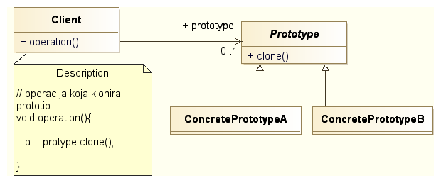



name: sadrzaj

# Sadržaj

- [Fundamentalni obrasci](#fundamentalni)
  - [Delegation](#delegation)
  - [Interface](#interface)
  - [Abstract Superclass](#abstract-superclass)
  - Immutable
  - Marker Interface
- [Kreacioni obrasci](#kreacioni)
  - [Factory Method](#factory-method)
  - [Abstract Factory](#abstract-factory)
  - [Prototype](#prototype)
  - [Builder](#builder)
  - [Singleton](#singleton)

---
name: fundamentalni
class: center, middle

# Fundamentalni obrasci

---
layout: true

.section[[Fundamentalni obrasci](#sadrzaj)]

---

## Fundamentalni obrasci

- Obrasci koji se koriste za izgradnju složenijih obrazaca.
- Često podržani programskim jezikom.


---
name: delegation
class: center, middle
layout: false

# Delegation

---
layout: true

.section[[Delegation](#sadrzaj)]

---

## Delegation

- Opšti način proširenja funkcionalnosti klase ili objekta.
- Koristi se u situacijama kada nasleđivanje nije dovoljno fleksibilno, posebno
  u situaciji kada programski jezik omogućava samo jednostruko nasleđivanje.
- Dinamičko proširenje pri instanciranju klase definisanjem delegata.

---

## Primer problema


---

## Primer rešenja


---

## Struktura obrasca


---


## Primer


```java
interface I {
    void f();
    void g();
}
class A implements I {
    public void f() { System.out.println("A: doing f()"); }
    public void g() { System.out.println("A: doing g()"); }
}
class B implements I {
    public void f() { System.out.println("B: doing f()"); }
    public void g() { System.out.println("B: doing g()"); }
}
```

.footer.small[
Izvor: Wikipedia
]

---

## Primer (nastavak)

.medium[
```java
class C implements I {
    // delegation
    I i = new A();

    public void f() { i.f(); }
    public void g() { i.g(); }
}

// normal attributes
public void toA() { i = new A(); }
public void toB() { i = new B(); }

public class Main {
    public static void main(String[] args) {
        C c = new C();
        c.f();
        // output: A: doing f()
        c.g();
        // output: A: doing g()
        c.toB();
        c.f();
        // output: B: doing f()
        c.g();
        // output: B: doing g()
    }
}
```
]

---

## Kada koristiti?

- Nasleđivanje je statička veza. Potrebno je da objekat *menja klasu* u vreme
  izvršavanja.
- Potrebno je simulirati višestruko nasleđivanje. Delegator može imati više
  delegata.
- Želimo da nasledimo određenu klasu ali ona nije pod našom kontrolom.
  Delegacija je u tom slučaju bezbednija jer nas štiti od nekompatibilnih
  promena nadklase.
  

---
name: interface
class: center, middle
layout: false

# Interface

---
layout: true

.section[[Interface](#sadrzaj)]

---

## Interface

- Želimo da učinimo klijenta nezavisnim od klasa koje obezbeđuju servis tako da
  možemo izmeniti klase bez uticaja na klijenta.
- Servisne klase već nasleđuju neke klase a višestruko nasleđivanje nije
  podržano.
  
---

## Struktura obrasca


---

## Primer


---

## Šta dobijamo?

- Servisna klasa može biti zamenjena bez uticaja na klijenta.
- Servisna klasa može implementirati više interfejsa i nasleđivati proizvoljnu
  klasu.


---
name: abstract-superclass
class: center, middle
layout: false

# Interface and Abstract Class

---
layout: true

.section[[Interface and Abstract Class](#sadrzaj)]

---

## Interface and Abstract Class

- Proširenje Interface obrasca.
- Želimo da klijenta učinimo nezavisnim od hijerarhije klasa koje implementiraju
  servis na takav način da možemo menjati klase koje implementiraju servis bez
  uticaja na klijenta.
- Istovremeno želimo da definišemo apstraktnu implementaciju servisa tako da
  konkretni servisi mogu da redefinišu/dopune baznu implementaciju.

---

## Struktura obrasca


---

## Primer


---

## Šta dobijamo?

- Konkretan servis može biti baziran na apstraktnoj implementaciji ali i ne
  mora. Dovoljno je da implementira interfejs servisa.
- Servisna klasa može implementirati više interfejsa i može nasleđivati
  proizvoljnu klasu.
- Apstraktna klasa obezbeđuje bazičnu implementaciju čime se razvoj novih
  servisnih klasa ubrzava.
  

---
name: kreacioni-obrasci
class: center, middle
layout: false

# Kreacioni obrasci

---
layout: true

.section[[Kreacioni obrasci](#sadrzaj)]

---

## Kreacioni obrasci

- Apstrakcija i lokalizacija procesa instanciranja objekata.
- Čine sistem nezavisnim od načina kreiranja i kompozicije objekata.

---

## Bazične osobine

Bazične osobine kreacionih obrazaca su sledeće:

- Enkapsuliraju znanje o konkretnim klasama koje sistem koristi.
- Skrivaju način na koji se vrši instaciranje klasa i kompozicija objekata.

---

## Katalog kreacionih obrazaca

Prema [1] kreacioni obrasci su sledeći:

- Factory Method
- Abstract Factory
- Prototype
- Builder
- Singleton


.footer[
1. E. Gamma, R. Helm, R. Johnson, and J. M. Vlissides, *Design Patterns:
      Elements of Reusable Object-Oriented Software*, Addison-Wesley
      Professional, 1994
]


---
name: factory-method
class: center, middle
layout: false

# Factory Method

---
layout: true

.section[[Factory Method](#sadrzaj)]

---

## Factory Method

- Želimo da odvojimo klijenta od konkretne implementacije putem Interfejsa.
- Želimo da klijent kreira objekte na takav način da "ne zna" koju konkretnu
  klasu instancira.

---

## Struktura


---

## Šta dobijamo?

- Instanciranje konkretnih objekata je lokalizovano. Programski kod nije jako
  spregnut sa tipom konkretnih instanci.
- Klasa može delegirati kreiranje konkretnih objekata koje koristi na svoje
  podklase čime se postiže veća fleksibilnost.

---

## A šta gubimo?

- Relativno veliki broj klasa.
- Svaki novi Proizvod zahteva novog Kreatora.

---
class: center, middle
layout: false 

## Demonstracija obrasca *Factory Method* na primeru u Javi


---
name: abstract-factory
class: center, middle
layout: false

# Abstract Factory

---
layout: true

.section[[Abstract Factory](#sadrzaj)]

---

## Abstract Factory

- Proširenje *Factory Method* obrasca.
- Kreiranje familije objekata sličnih po funkciji koju vrše u aplikaciji pri
  čemu klijent (objekat koji ih koristi) "ne zna" konkrente klase objekata.

---

## Struktura


---

## Šta dobijamo?

- Instanciranje familije konkretnih objekata je lokalizovano.
- Programski kod nije jako spregnut sa tipom konkretnih instanci.
- Promena familije konkretnih instanci moguća je izmenom
  programskog koda na mestu gde se instancira konkretna fabrika
  objekata (najčešće jedna linija koda).
- U određenim slučajevima moguća je dinamička promena fabrike objekata
  (npr. [Swing PLAF](https://en.wikipedia.org/wiki/Pluggable_look_and_feel)).
  
---

## A šta gubimo?

- Relativno veliki broj klasa.
- Svaki novi Proizvod zahteva novu metodu u svim Kreatorima i svaka nova
  familija proizvoda zahteva novog konkretnog Kreatora i nove konkretne
  proizvode.
  

---
name: prototype
class: center, middle
layout: false

# Prototype

---
layout: true

.section[[Prototype](#sadrzaj)]

---

## Prototype

Kreiranje objekta kopiranjem već postojeće instance.

---

## Struktura



---

## Šta dobijamo?

- Eliminišemo potrebu za postojanjem kreator klasa i njenih naslednica pri
  korišćenju Factory Method dizajn šablona - smanjuje se broj potrebnih klasa.
- Ako je instanciranje objekata previše "skupo" sa stanovišta potrošnje
  procesorskog vremena i memorije, kloniranje već kreiranih objekata može
  dovesti do ubrzanja i smanjenja potrošnje memorije.
- Ukoliko nam trebaju instance objekata čije stanje se razlikuje od inicijalnog
  ali je slično već postojećim jednostavnije je kloniranje postojećeg, sličnog,
  objekta i izmena potrebnih atributa od kreiranja i pune inicijalizacije novog
  objekta.

---

## Na šta treba obratiti pažnju?

- Kloniranje se najčešće realizuje tzv. "dubokim kopiranjem" (eng. *deep copy*).
- Javina clone operacija je realizovana kao "plitko kopiranje" (eng. *shallow
  copy*).

---
class:center, middle
layout: false

## Demonstracija obrasca *Prototype* na primeru u Javi


---
name: builder
class: center, middle
layout: false

# Builder

---
layout: true

.section[[Builder](#sadrzaj)]

---

## Builder

Konstrukcija složenih objekata podelom nadležnosti na onoga ko "zna" kako treba
napraviti strukturu složenog objekta i onoga ko "zna" kako treba kreirati
pojedinačne delove.

---

## Struktura


---

## Šta dobijamo?

Razdvajamo konstrukciju složenog objekta (najčešće Composite) od njegove
reprezentacije tako da isti postupak izgradnje može rezultovati različitim
reprezentacijama.

---

## Kada koristiti?

- Ako je potrebno učiniti algoritam za kreiranje složenih objekata nezavisnim od
  konkretnih delova koji sačinjavaju objekat.
- Ako proces konstrukcije mora obezbediti različite reprezentacije objekta koji
  se izgrađuje.
  
  

---
name: singleton
class: center, middle
layout: false

# Singleton

---
layout: true

.section[[Singleton](#sadrzaj)]

---

## Singleton

- Potrebno je da postoji samo jedna instanca klase u sistemu. Na primer: logger,
  registar, jedinstvena konekcija ka bazi i sl.
- Jedinična instanca mora biti dostupna svim klijentima.

---

## Struktura


---

## Šta dobijamo?

- Kontrolisani pristup jedinstvenoj instanci.
- Nasleđivanje klase jedinstvene instance i omogućavanje rekonfiguracije sistema
  i u vreme izvršavanja (*run-time*).
- Ako je naknadno potrebno, može se obezbediti postojanje više od jedne
  instance. Na primer, *Connection Pool*.

---

## Napomena

- *Singleton* se danas smatra anti-obrascem.
- Dva glavna razloga:

  - *Singleton* je globalni objekat – globalne varijable loše utiču na kvalitet
    dizajna i na konkurentnost u kontekstu višenitnog programiranja.
  - *Singleton* se teško *mock-up*-uje (klijentski kod je čvrsto spregnut sa
    *Singleton* objektom) pa je testiranje koda koji ga koristi veoma teško.
    Ovaj problem se može rešiti korišćenjem *Dependency Injection* obrasca.


---

## Literatura

- E. Gamma, R. Helm, R. Johnson, and J. M. Vlissides, *Design Patterns: Elements
  of Reusable Object-Oriented Software*, Addison-Wesley Professional, 1994

- M. Grand, *Patterns in Java: A Catalog of Reusable Design Patterns Illustrated
  with UML*, John Wiley &amp; Sons, Inc., vol. 1, 2002



