class: center, middle

# Softverski obrasci
## Obrasci ponašanja

.author[ [Igor Dejanović](http://igordejanovic.net/) ]

.small[[Fakultet tehničkih nauka u Novom Sadu](http://ftn.uns.ac.rs/)] </br>
.small[[Katedra za informatiku](http://informatika.ftn.uns.ac.rs/)]

.small[Slajdovi u izradi]

.created[{{now|dtformat("%d.%m.%Y u %H:%M")}}]


---

# Obrasci ponašanja

- Bave se algoritmima i raspodelom odgovornosti između objekata.
- Ne definišu samo obrazac strukture već i obrazac komunikacije između
  objekata.

---

name: sadrzaj

# Sadržaj

- [Iterator](#iterator)
- [Command](#command)
- [Mediator](#mediator)
- [Memento](#memento)
- [Observer](#observer)
- [State](#state)
- [Strategy](#strategy)
- [Template method](#template)
- [Visitor](#visitor)
- [Chain of Responsibility](#chain)

---
name: iterator
class: center, middle
layout: false

# Iterator

---
layout: true

.section[[Iterator](#sadrzaj)]

---

# Iterator

Omogućava pristup elementima kolekcije sekvencijalno bez
otkrivanja konkretne reprezentacije kolekcije.

---

# Struktura obrasca


---

# Java implementacija

Iterator obrazac je direktno podržan u javinim standardnim bibliotekama –
Interfejsi `Iterable<E>` i `Iterator<E>`.

---

# Java implementacija

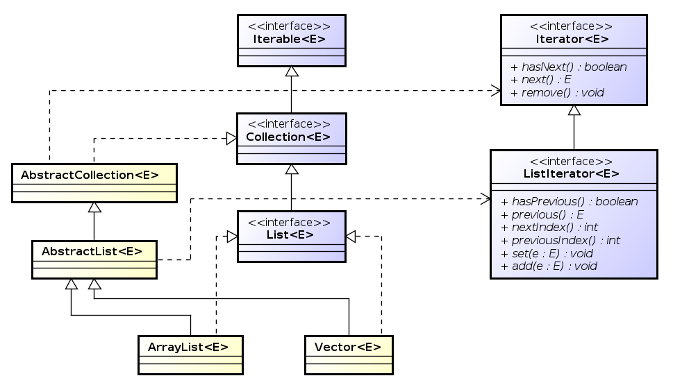

---

# Java implementacija - While petlja

```java
List<Integer> intList = new ArrayList<Integer>();
Iterator<Integer> i = intList.iterator();
while(i.hasNext()){
    Integer a = i.next();
    System.out.println(a);
}
```

---

# Java implementacija - ForEach petalja

Iteratori su podržani direktno u Java programskom jeziku. *For-each* petlja u
javi se može koristiti za bilo koji objekat koji implementira `Iterable<E>`
interfejs ili za java nizove. 

```java
List<Integer> intList = new ArrayList<Integer>();
for(Integer i: intList){
    System.out.println(i);
}
```

---
name: command
class: center, middle
layout: false

# Command

---
layout: true

.section[[Command](#sadrzaj)]

---

# Command

- Enkapsulacija zahteva za obradom u vidu objekta.
- Omogućava kreiranje redova za obradu (*Queues*) kao i *undo* operacije.
- Poznat i pod nazivima *Action* i *Transaction*.

---

# Struktura obrasca

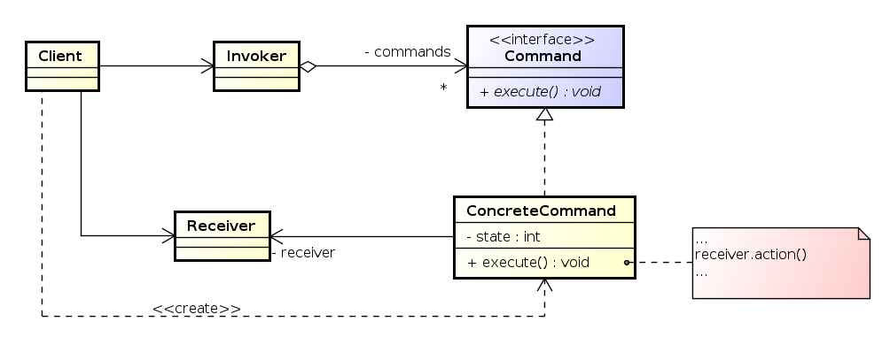

---

# Saradnja učesnika

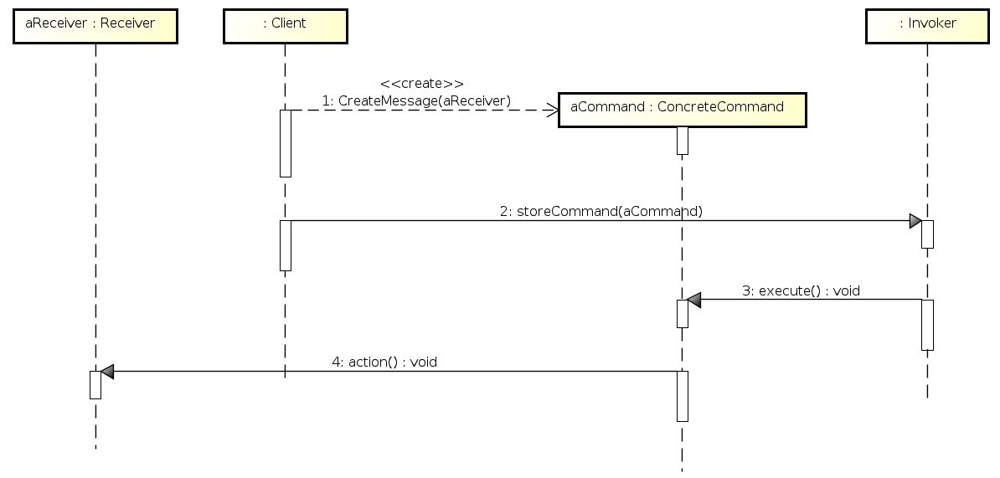

---

# Šta dobijamo?

- Razdvajamo objekat koji inicira izvršavanje operacija od onoga koji "zna"
  kako operaciju treba izvršiti.
- *Command* objekti su objekti prvog reda. Mogu se tretirati kao i svi drugi
  objekti.
- Komande se mogu komponovati (upotrebom *Composite* obrasca) i formirati
  složenije komande – makro komande.
- Nove komande se lako dodaju – nije potrebno izmeniti postojeće klase.


---
name: mediator
class: center, middle
layout: false

# Mediator

---
layout: true

.section[[Mediator](#sadrzaj)]

---

# Mediator

- Objekat koji enkapsulira znanje o interakciji grupe objekata.
- Omogućava slabo sprezanje (*loose coupling*) objekata tako što objekti
  ne referenciraju jedni druge direktno.

---

# Struktura obrasca

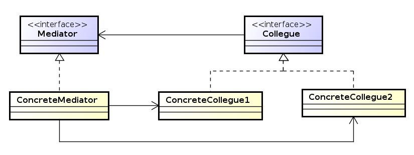

---

# Primer


---

# Saradnja učesnika

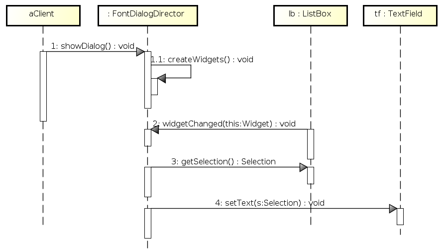

---

# Šta dobijamo?

- Složena interakcija objekata je centralizovana – izmena se vrši nasleđivanjem
  jedne klase.
- Objekti koji stupaju u interakciju su slabo spregnuti – objekte i medijator
  možemo menjati nezavisno.
- Jednostavniji protokol – veze više-na-više zamenjene vezama jedan-na-više
  koje su lakše za razumevanje i izmenu.
- Logika interakcije objekata je odvojena od njihovog individualnog ponašanja –
  inerakcija se lakše analizira.
- Problem koji može nastati – monolitan i previše kompleksan medijator objekat.


---
name: memenot
class: center, middle
layout: false

# Memento

---
layout: true

.section[[Memento](#sadrzaj)]

---

# Memento

- Bez narušavanja enkapsulacije beleži i eksternalizuje interno stanje objekta
  tako da se objekat može kasnije vratiti u identično stanje.
- Poznat i pod nazivom *Token*.

---

# Struktura obrasca


---

# Saradnja učesnika

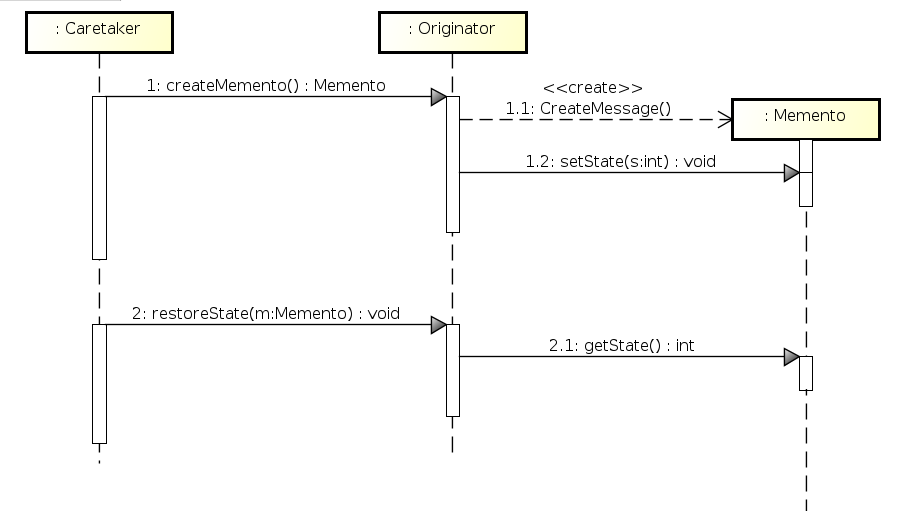

---

# Šta dobijamo?

- Očuvavamo enkapsulaciju – memento ne otkriva detalje interne implementacije
  *Originator* objekta iako se njegovo stanje čuva van njega. Pristup
  *Memento* objektu je moguć samo od strane Originator objekta.
- Pojednostavljen dizajn *Originator* objekta – klijenti čuvaju stanje
  objekta kroz *Memento* objekat.
- Korišćenje *Memento* objekata može biti problematično ukoliko je stanje
  *Originator*-a definisano velikom količinom podataka.
- U nekim programskim jezicima je teško sprečiti pristup internoj strukturi
  *Memento* objekta od strane drugih objekata u sistemu.


---
name: observer
class: center, middle
layout: false

# Observer

---
layout: true

.section[[Observer](#sadrzaj)]

---

# Observer

- Definiše međuzavisnost objekata tako da kada se stanje jednog objekta promeni
  svi zavisni objekti se automatski obaveštavaju.
- Poznat i pod nazivom *Publish-Subscribe*.

---

# Struktura obrasca

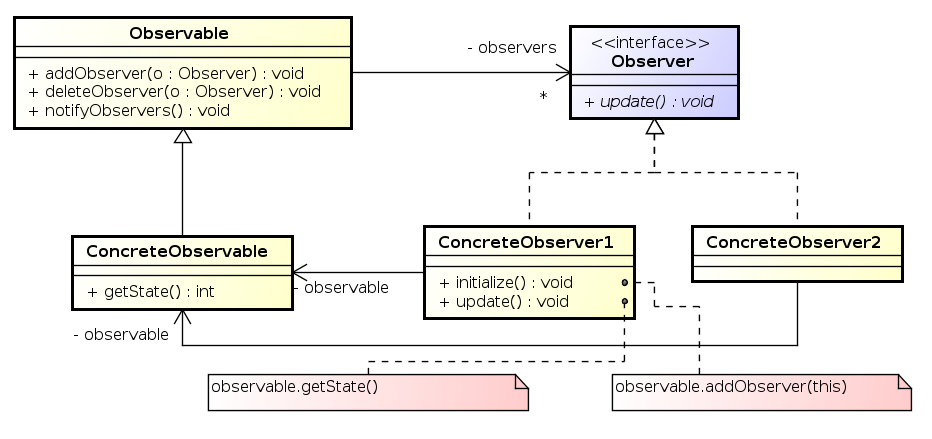

---

# Saradnja učesnika

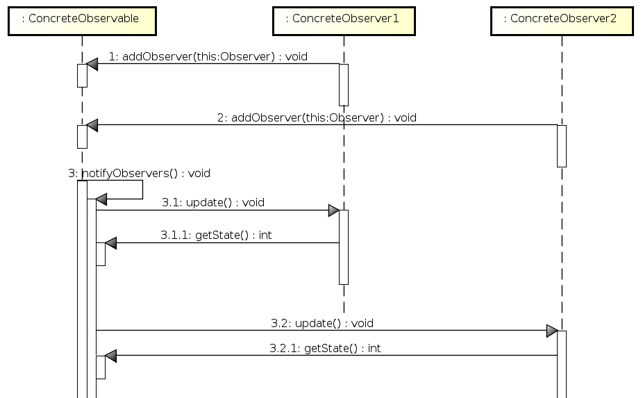

---

# Podrška u Javi

- Interfejs `Observer` i klasa `Observable` u paketu `java.util`.
- Mehanizam *Listener*-a u *Swing*-u prati ovaj obrazac.

---

# Šta dobijamo?

- Apstraktno sprezanje *Observer* i *Observable* objekata. *Observable* ne zna
  konkretne klase *Observer* objekata već komunicira sa njima putem
  jednostavnog interfejsa.
- *Broadcast* stil komunikacije. *Observable* javlja da se promena dogodila. Ne
  mora se navoditi primalac poruke. Svi zainteresovani osluškivači će dobiti
  notifikaciju o promeni.
- Ukoliko *Observable* ne navodi u pozivu poruke šta je promenjeno,
  *Observer*-i moraju to sami da ispitaju što može biti "skupo".

---

# Napomene

- Ukoliko *Observer* posmatra više *Observable* objekata potrebno je
  identifikovati objekat koji šalje poruku o promeni – slanje reference na
  objekat kao parametra.
- Izmena stanja *Observable* objekta prilikom obrade notifikacije može dovesti
  do beskonačne rekurzije.


---
name: state
class: center, middle
layout: false

# State

---
layout: true

.section[[State](#sadrzaj)]

---

# State

Izmena ponašanja objekta prilikom promene njegovog internog stanja. Objekat se
ponaša kao da je promenio klasu.

---

# Struktura obrasca


---

# Saradnja učesnika

- Context delegira operacije zavisne od stanja objektu state
  (*ConcreteStateX*).
- Context može proslediti sebe u zahtevu ukoliko stanje treba da mu pristupa.
- Klijenti koriste isključivo *Context*, mada mogu, ukoliko je potrebno,
  postaviti tekuće stanje.
- Odluku o prelasku u novo stanje može doneti *Context* ili tekući state
  objekat.

---

# Primer


---

# Šta dobijamo?

- Lokalizacija koda specifičnog za određeno stanje u jednu klasu - izbegavanje
  velikih *switch/if-else* iskaza.
- Eksplicitan prelazak između stanja.

---

# Napomene

- Promena stanja: *Context* ili *ConcreteStateX*?
  - Ukoliko menja *ConcreteStateX* potrebno je da pristupa *Context*-u preko
    interfejsa za promenu stanja.
  - Negativno: stanja moraju da znaju jedna za druge.
  - Ukoliko *Context* menja stanje – kod može biti dosta kompleksan kod većeg
    broja stanja.
- Kreiranje i uništavanje *State* objekata: jednom pri inicijalizaciji ili pri
  svakoj promeni stanja.
- Određeni programski jezici podržavaju oblik dinamičkog nasleđivanja –
  prirodna podrška za *State* obrazac.


---
name: strategy
class: center, middle
layout: false

# Strategy

---
layout: true

.section[[Strategy](#sadrzaj)]

---

# Strategy

Definisanje familije algoritama i omogućavanje njihove izmene bez uticaja na
klijenta. 

---

# Struktura obrasca

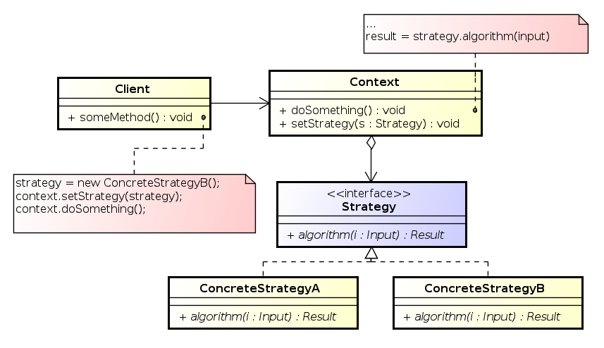

---

# Primer

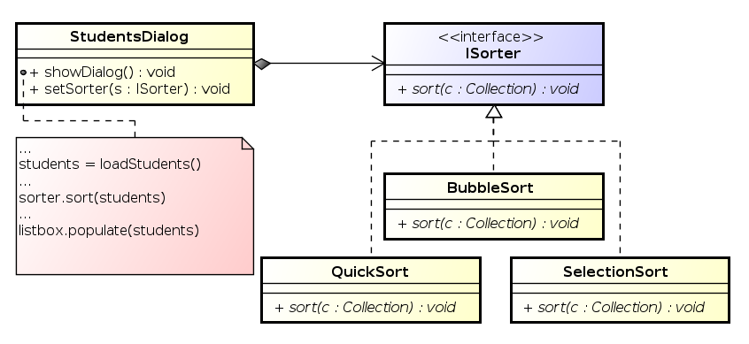

---

# Šta dobijamo?

- Definisanje familije algoritama. Nasleđivanje strategija se može koristiti za
  implementaciju zajedničke funkcionalnosti algoritama.
- Izmena ponašanja objekta dinamički. Nasleđivanjem kontekst klase može se
  postići izmena funkcionalnosti ali je ona statičke prirode.
- Eliminacija iskaza uslova (*if-else, switch*).
- Omogućavamo klijentu izbor algoritma i njegovih performansi (npr. manji
  utrošak memorije ili brže izvršavanje).


---
name: template
class: center, middle
layout: false

# Template Method

---
layout: true

.section[[Template Method](#sadrzaj)]

---

# Template Method

- Definisanje strukture algoritma pri čemu se definisanje određenih koraka
  ostavlja klasama naslednicama.
- Struktura algoritma je nepromenjiva ali se određeni koraci mogu promeniti.

---

# Struktura obrasca

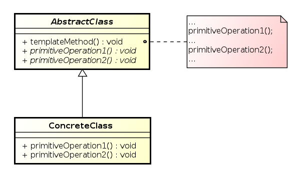

---

# Primer

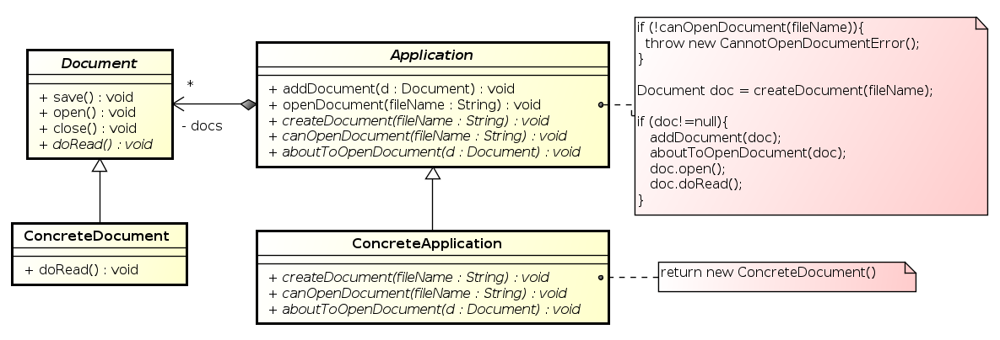

---

# Šta dobijamo?

- Mogućnost definisanja invarijantnih delova algoritma u apstraktnoj klasi a
  varijabilnih delova u podklasama – sprečava se dupliranje koda.
- Invertovanje kontrole – "Hollywood principle"

    > Don’t call us, we’ll call you

- Definisanje tzv. hook operacija. Najčešće su prazne ali mogu imati definisano
  i standardno ponašanje. Za razliku od apstraktnih operacija, hook operacije
  su opcione (ne moraju se redefinisati).


---
name: visitor
class: center, middle
layout: false

# Visitor

---
layout: true

.section[[Visitor](#sadrzaj)]

---

# Visitor

- Razdvajanje algoritma od strukture podataka nad kojim operiše.
- Lokalizacija implementacije operacije koja se izvršava nad elementima složene
  strukture podataka (npr. čvorovima stabla).

---

# Struktura

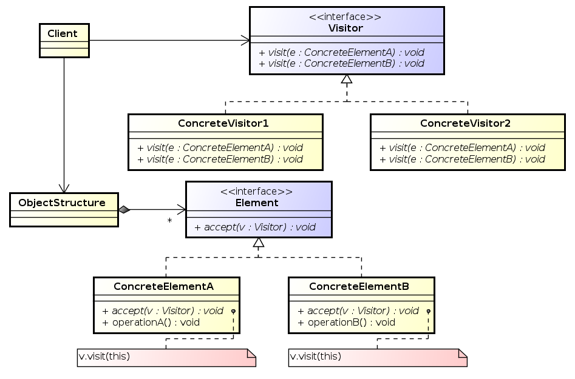

---

# Saradnja učesnika

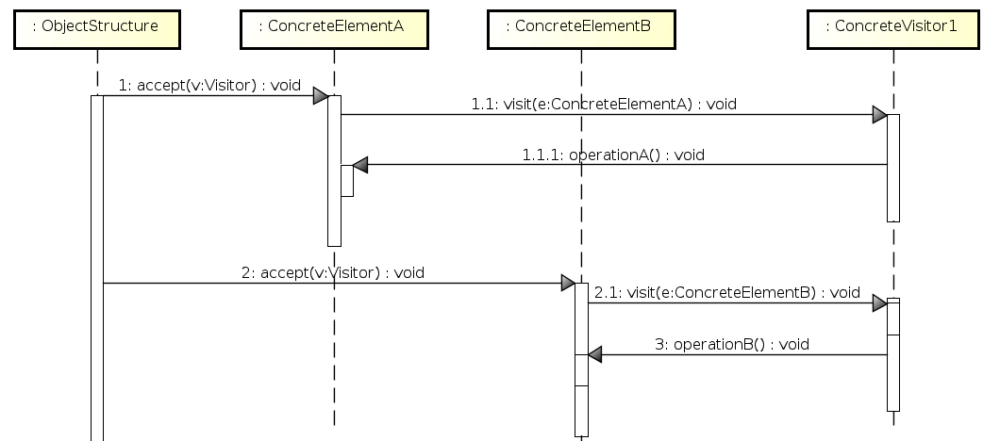

---

# Primer

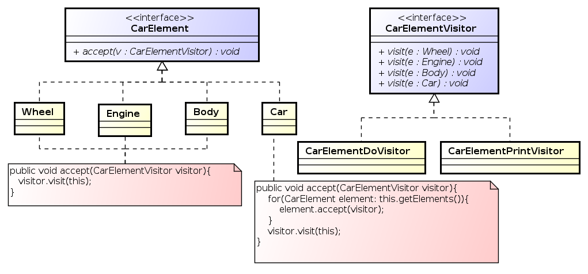

---

# Kada koristiti?

- Objektna struktura sadrži elemente različitih klasa a potrebno je izvršiti
  operaciju koja zavisi od konkretne klase objekta.
- Više različitih, nesrodnih operacija je potrebno izvršiti nad elementima
  složene strukture a želimo izbeći "zagađivanje", svih klasa čiji objekti čine
  složenu strukturu, sa novom metodom za svaku operaciju.
- Hijerarhija klasa objektne strukture se retko menja dok dodavanje novih
  operacija nad strukturom može biti česta operacija.

---

# Napomene

- Visitor predstavlja implementaciju *Double Dispatch* mehanizma. Pozvana
  operacija zavisi istovremeno od tipa konkretnog *Visitor* objekta kao i
  od tipa konkretnog elementa strukture nad kojom se operacija vrši.
- Srodne operacije su lokalizovane u jednoj klasi.


---
name: chain
class: center, middle
layout: false

# Chain of Responsibility

---
layout: true

.section[[Chain of R.](#sadrzaj)]

---

# Chain of Responsibility

Izbegavanje jakog sprezanja objekta koji šalje zahtev od objekta koji vrši
obradu zahteva tako što se objekti koji vrše obradu uvezuju u listu i daje se
šansa svakom u nizu da obradi događaj sve dok neko ne odgovori pozitivno na
zahtev (izvrši obradu).

---

# Struktura


---

# Primer


---

# Kada koristiti?

- Više od jednog objekta može da obradi zahtev a obrađivač nije poznat unapred.
- Želimo da uputimo zahtev jednom iz grupe objekata a da ne navodimo konkretnog
  obrađivača eksplicitno.
- Lista mogućih obrađivača može dinamički da se menja u vreme izvršavanja.

---

# Napomene

- Dve vrste: prosleđivanje zahteva niz lanac i posle obrade ili prekid
  prosleđivanja.
- Objekat koji vrši obradu nije eksplicitno definisan pa ne postoji garancija
  da će zahtev biti obrađen.

---
layout: false

# Literatura

- E. Gamma, R. Helm, R. Johnson, and J. M. Vlissides, *Design Patterns:
  Elements of Reusable Object-Oriented Software*, Addison-Wesley Professional,
  1994
- M. Grand, *Patterns in Java: A Catalog of Reusable Design Patterns
  Illustrated with UML*, John Wiley & Sons, Inc., vol. 1, 2002


