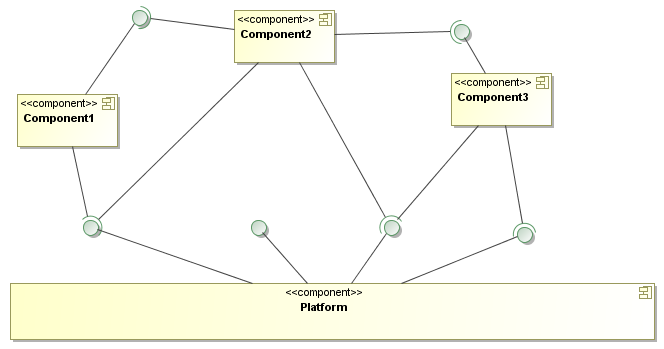

class: center, middle

# Razvoj baziran na komponentama

.author[ [Igor Dejanović](http://igordejanovic.net/) ]

.small[[Fakultet tehničkih nauka u Novom Sadu](http://ftn.uns.ac.rs/)]  
.small[[Katedra za informatiku](http://informatika.ftn.uns.ac.rs/)]

.created[{{now|dtformat("%d.%m.%Y u %H:%M")}}]

---

## Razvoj softvera

> In a world of rapidly changing business requirements,
> custom-made software is often too late – too late to be productive
> before becoming obsolete.

.footer[
  C. Szyperski, *Component Software: Beyond Object-Oriented Programming*,
  Addison-Wesley Longman Publishing Co., Inc., 2002
]

---

## Modularizacija

- Savladavanje kompleksnosti softvera podelom na manje celine – *Divide and
  Conquer* princip.
- Moduli treba da imaju **visoku koheziju** i **slabu spregu** sa drugim modulima.

---

## Softverske komponente

- Softverske komponente su izvršive jedinice koje se nezavisno proizvode,
  dobavljaju i instaliraju i koje se mogu komponovati u cilju formiranja
  funkcionalnog sistema.
- U cilju obezbeđivanja kompozicije, komponente moraju da poštuju određeni
  *komponentni model* i da budu kreirane za *određenu ciljnu platformu*.
- Sistem sastavljen od softverskih komponenti se naziva komponentni softver
  (*component software*).
  

---

## Razvoj baziran na komponentama

- Razvoj baziran na komponentama (*Component-Based Development - CBD*) – izrada
  softvera upotrebom softverskih komponenti.
- Komponentizacija nije nova ideja – uspešno se primenjuje u različitim
  oblastima...
- ...ali do nedavno nije bilo velikog uspeha u oblasti razvoja softvera.

---

## Šta je problem sa softverom?

Često se tvrdi da je softver previše fleksibilan da bi bilo moguće
kreirati komponente – ovo ne može biti razlog već više znak nezrelosti
oblasti.

---

## Integracija kao preduslov ponovne iskoristljivosti komponenti

.medium[
> A key issue is that today’s software environments focus on writing new
> software, instead of integrating existing software into new systems. In
> reality, integrating existing code has become a large part of the work
> of software developers. Therefore, there is a need for tools that
> standardize the integration aspects of software so that reusing
> existing components becomes reliable, robust and cheap.
]

.footer[
  http://www.osgi.org/About/Technology
]

---

## Prednosti komponentnog razvoja

- Jasna podela nadležnosti.
- Visok stepen kohezije i nizak stepe sprege – komponente se bave jasno
  određenim poslom i komuniciraju sa svojom okolinom preko jasno definisanih
  interfejsa i protokola.
- Ponovna iskoristljivost (*reusability*) – ista komponenta se može
  koristiti u više aplikacija.
- Komponente se mogu kupovati od nezavisnih proizvođača koji se specijalizuju za
  izradu određenog tipa komponenti – brža izgradnja kvalitetnog softvera.
- Održavanje i unapređenje komponente se prebacuje na proizvođača
  koji može biti eksterni (*third-party*).
- Proizvođači komponenti mogu istu komponentu prodavati velikom broju
  kupaca i time stvoriti preduslove za dalji razvoj i usavršavanje
  komponente.
  
---

## Preduslovi uspešne komponentizacije

- Postojanje standarda koji su praktični i ostvarljivi: 

  - OSGi
  - EJB
  - DCOM i ActiveX
  - CORBA

- Postojanje tržišta komponenti:

  - Eclipse Marketplace
  - Firefox/Chrome priključci
  - Google Play, Apple App Store i dr.

- Isplativost razvoja: smatra se da komponenta mora bar 3 puta da se iskoristi
  da bi se njen razvoj isplatio.
  
---

## Vrste softvera prema načinu dobavljanja

- Namenski izrađen softver (*Custom made*)
- Standardni softver

---

## Namenski izrađen softver

- Može biti u potpunosti prilagođen korisniku.
- Može koristiti vlasnička znanja i iskustvo firme za koju se proizvodi.
- Ovim se može postići značajna prednost na tržištu.
- Razvoj i održavanje može biti skupo. Interoperabilnost sa drugim sistemima
  može biti problematično.

---

## Standardni softver

- Kupuje se gotov i parametrizuje se da bude *dovoljno dobar* za posao za koji
  se koristi.
- Kratko vreme izgradnje – svodi se na konfiguraciju i prilagođavanje.
- Unapređenje, održavanje i implementacija interoperabilnosti sa drugim
  sistemima se prebacuje na proizvođača standardnog softvera.
- Teško može biti osnova sticanja prednosti na tržištu jer i konkurencija može
  kupiti isti softver.
  
---

## Problem sa standardnim softverom

- Često zahteva drastičnu promenu poslovnih procesa i načina rada u cilju
  prilagođavanja – primer: uvođenje SAP R/3 u Australijsku poštu.
- Izmenu procesa bi trebalo raditi u skladu sa izmenom poslovnog okruženja a ne
  u cilju prilagođavanja predviđenom načinu rada softvera.

---

## Komponentni softver – hibridni pristup

- Namenski izraditi komponente u domenu ekspertize.
- Kupiti standardne komponente za ostale domene.
- Primer: kupovina GUI komponenti, komponenti za rad sa XML datotekama, bazama i
  sl.
- Dobijamo prednost na tržištu jer u svom domenu radimo posao na način na koji
  želimo ali istovremeno ubrzavamo razvoj upotrebom standardnih, robusnih
  komponenti u domenima koji nisu od presudnog značaja za naš poslovni domen.

---

## Evolutivni razvoj

- Za razliku od monolitnih rešenja gde imamo periodičnu zamenu sistema novim
  (revolutivni pristup) kod komponentnog razvoja unapređenje sistema možemo
  raditi evolutivno kroz nezavisno unapređenje komponenti.
- Imamo niz češćih manjih promena umesto ređih velikih promena koje menjaju
  sistem iz korena.
  
  
---

## Univerzalne komponente?

- ... ne postoje.
- Komponente se prave za određenu ciljnu platformu i moraju poštovati određeni
  komponentni model.
- Takođe, moramo unapred imati svest o korisnicima komponente koju razvijamo
  odnosno njihovim očekivanjima.

---

## Apstraktna arhitektura softvera baziranog na komponentama

---

## Platforma

- Obezbeđuje infrastrukturu u koju se *ugrađuju* komponente.
- Pruža skup bazičnih servisa koje komponente mogu da koriste.

---

## Servisi

- Predstavlja skup funkcionalnosti koje određena komponenta pruža drugim
  komponentama i čije korišćenje je definisano ugovorom, koji propisuje način
  upotrebe (npr. interfejsi i protokoli), i ograničeno politikom upotrebe
  servisa.
- Platforma mora imati propisane mehanizme za objavljivanje i pronalaženje
  servisa.

---

## Konzumenti i pružaoci servisa

- U komponentnom softveru svaka komponenta može biti u ulozi pružaoca i/ili
  konzumenta servisa.
- Različite tehnike pronalaženja i povezivanja servisa.

---

## Literatura

- C. Szyperski, *Component Software: Beyond Object-Oriented Programming*,
  Addison-Wesley Longman Publishing Co., Inc., 2002
