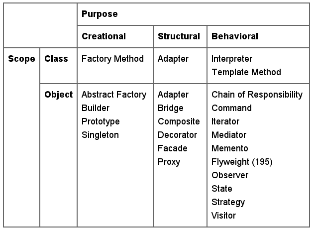



name: sadrzaj

# Sadržaj

- [Uvod](#uvod)
- [Softverski obrasci](#softverski-obrasci)
- [Softverski antiobrasci](#antiobrasci)

---
name: pregled
class: center, middle

# Uvod

---
layout: true

.section[[Uvod](#sadrzaj)]

---

## Razvoj softvera

- Razvoj softvera je težak a razvoj softvera na takav način da se rešenje može
  ponovo upotrebiti je još teže.
- Dobar, proširiv i fleksibilan dizajn je teško a verovatno i nemoguće odraditi
  *iz prve* za neiskusnog projektanta.

---

## Iskustvo

- Iskusni projektanti, tj. eksperti, ipak prave dobar dizajn.
- Eksperti znaju nešto što početnici ne znaju. Šta je to?

---

## Ponovno korišćenje dobrih rešenja

Eksperti će ponovo primenjivati rešenja koja su se pokazala kao dobra u
  prošlosti.

---
## Ponovna iskoristljivost - reusability

- Definicija sa *The Free Dictionary* .ref[*].

> The ability to use all or the greater part of the same programming
> code or system design in another application.

.footer[
  \* http://encyclopedia2.thefreedictionary.com/reusability/
]

---
## Ponovna iskoristljivost - Zašto?

- Da ne bi izmišljali *toplu vodu*.
- Upotreba već postojećih rešenja - brža izgradnja softvera.
- Već korišćen softver je bolje testiran - robusnost.

---

## Ponovna iskoristljivost - Kako?

- Na nivou koda - biblioteke, okviri za razvoj (*frameworks*), softverske
  komponente itd.
- Na nivou dizajna  - dizajn obrasci.

---
name: softverski-obrasci
class: center, middle
layout: false

# Softverski obrasci

---
layout: true

.section[[Softverski obrasci](#sadrzaj)]

---

## Šta je obrazac?

Christopher Alexander i sar. su napisali .ref[*].

> Each pattern describes a problem which occurs over and over again in
> our environment, and then describes the core of the solution to that
> problem, in such a way that you can use this solution a million times
> over, without ever doing it the same way twice.

.footer[ \* Christopher Alexander, Sara Ishikawa, Murray Silverstein, Max Jacobson,
  Ingrid Fiksdahl-King, and Shlomo Angel. *A Pattern Language*. Oxford
  University Press, New York, 1977. ]

---

## ...ili u slobodnom prevodu

> Svaki obrazac *opisuje problem* koji se *pojavljuje nanovo* u
> našem okruženju, i zatim *opisuje suštinu rešenja* datog problema na
> takav način da rešenje možete primeniti milion puta a da nikada ne rešite
> problem na potpuno identičan način.

---

## Šta je softverski obrazac?

Recept nastao na bazi kumuliranog ekspertskog znanja i iskustva u rešavanju
određenog rekurentnog problema u razvoju softvera koji opisuje problem, rešenje
i kontekst u kome je rešenje primenjivo kao i prednosti i mane rešenja.

---

## Gradivni elementi softverskog obrazca

- **Naziv** - Obezbeđuje lako referenciranje na obrazac. Čini deo vokabulara i
  omogućava komunikaciju.
- **Problem** - Opis problema i konteksta u kome se obrazac može primeniti.
  Često se navodi i lista preduslova za upotrebu obrasca.
- **Rešenje** - Elementi, međusobne veze, saradnja i odgovornost. Apstraktno je
  da bi moglo biti primenjeno u različitim konkretnim kontekstima.
- **Posledice** - opisuju šta je to što dobijamo a šta gubimo upotrebom datog
  obrasca (*trade-offs*).

---

## U čemu je prednost upotrebe softverskih obrazaca?

- Učenje na tuđim greškama.
- Manje iskusni projektanti mogu praviti dobar dizajn.
- Lakša komunikacija. Konzistentan vokabular.
- Lakša analiza dizajna složenog softvera. Obrasci imaju svoju *mustru*.
- Lakše uključivanje novih ljudi na projekat.
- Poznavanje unapred svih eventualnih problema koje rešenje može da izazove.

---

## Izbor programskog jezika

Izbor programskog jezika sa stanovišta softverskih obrazaca je važan!

---

## Organizacija

- Klasifikacija i katalogizacija u cilju lakšeg pronalaženja.
- Različiti autori - različite klasifikacije.
- Različiti domeni - različiti obrasci.

---

## Klasifikacija OO dizajn obrazaca

.footer[ E. Gamma, R. Helm, R. Johnson, and J. M. Vlissides, *Design Patterns:
Elements of Reusable Object-Oriented Software*, Addison-Wesley Professional,
1994 ]

---

## Klasifikacija OO dizajn obrazaca

Klasifikacija OO dizajn obrazaca prema [1]:

<ul>
<li>Fundamentalni</li>
<li>Kreacioni</li>
<li>Particioni</li>
<li>Strukturalni</li>
<li>Obrasci ponašanja</li>
<li>Obrasci za konkurentni dizajn</li>
</ul>

.footer[ 1. M. Grand, *Patterns in Java: A Catalog of Reusable Design Patterns
Illustrated with UML*, John Wiley & Sons, Inc., vol. 1, 2002 ]

---
name: antiobrasci
class: center, middle
layout: false

# Softverski antiobrasci

---
layout: true

.section[[Antiobrasci](#sadrzaj)]

---

## Softverski antiobrasci

- U razvoju softvera antiobrasci predstavljaju obrasce koji su
  se pokazali neefikasnim i kontraproduktivnim u praksi .ref[*].
  
- Još se zovu i *pitfalls* ili *dark patterns*.

.footer[
\* [Anti-pattern](http://en.wikipedia.org/wiki/Anti-pattern), From Wikipedia, the
   free encyclopedia
]

---

## Kako ih prepoznati?

Antiobrasci iskazuju sledeće osobine:

- Rekurentan obrazac akcije, procesa ili strukture koji je inicijalno izgledao
  kao dobar ali je u praksi pokazao da donosi više problema nego rešenja,
- Refaktorisano rešenje problema postoji, jasno je dokumentovano i dokazano u
  praksi.

---

## Neki od primera antiobrazaca

Primeri antiobrazaca su .ref[*]:

- *Cargo cult programming* - Korišćenje obrazaca i metoda bez razumevanja zbog
  čega se koriste.
- *God object* - Koncentrisanje previše funkcionalnosti u jedan element dizajna
  (najčešće klasu).
- *Big ball of mud* - Sistem bez jasne strukture.
- *Copy and paste programming* - Kopiranje i izmena postojećeg koda umesto
  kreiranja generičkog rešenja.i
- *Not Invented Here (NIH) sindrom* - Tendencija ka izmišljanju *tople vode*
  umesto korišćenja postojećeg, oprobanog rešenja.
- *Premature optimization* - Optimizovanje softvera prerano na uštrb dobrog
  dizajna i funkcionalnosti.
- *Dependency hell* - Problemi sa verzijama zavisnih komponenti i softvera.

.footer[
Za širi spisak videti http://en.wikipedia.org/wiki/Anti-pattern
]

---

## Literatura

- E. Gamma, R. Helm, R. Johnson, and J. M. Vlissides, *Design Patterns: Elements
    of Reusable Object-Oriented Software*, Addison-Wesley Professional, 1994

- M. Grand, *Patterns in Java: A Catalog of Reusable Design Patterns
    Illustrated with UML*, John Wiley & Sons, Inc., vol. 1, 2002

- [Anti-pattern](http://en.wikipedia.org/wiki/Anti-pattern), From Wikipedia, the
  free encyclopedia

w
