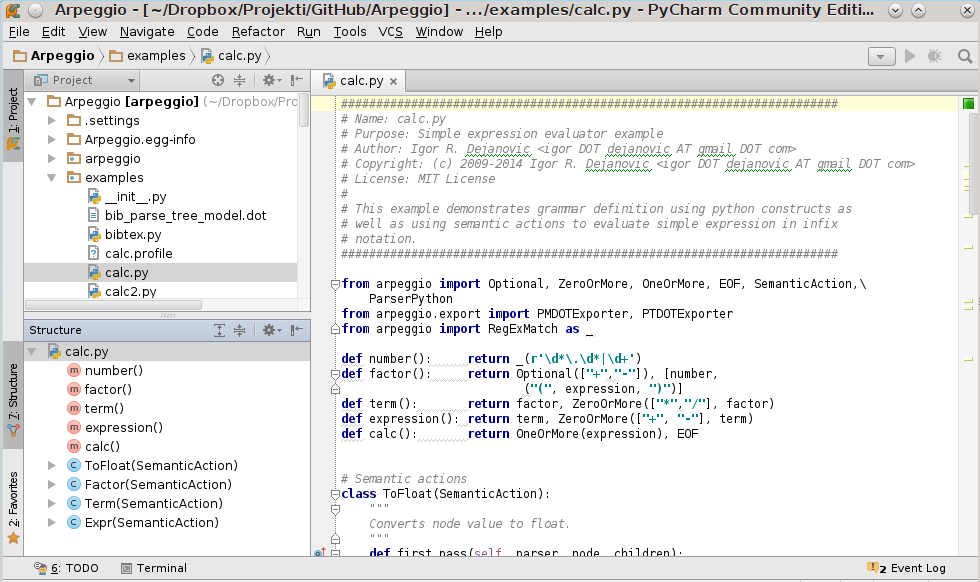
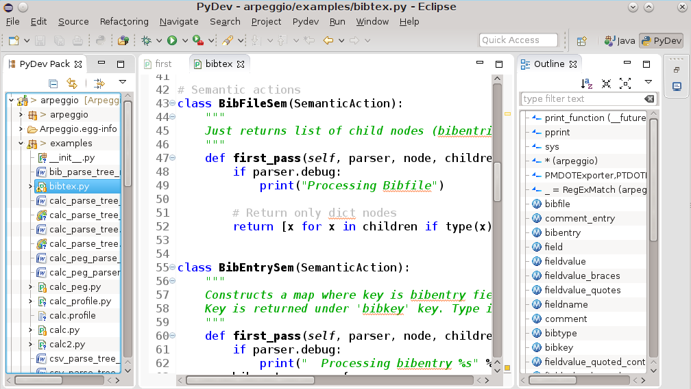




name: sadrzaj

## Sadržaj

- [Kratak pregled jezika](#pregled)
- [Leksičke konvencije i sintaksa](#sintaksa)
- [Tipovi i objekti](#tipovi)
- [Operatori i izrazi](#operatori)
- [Struktura programa i kontrola toka](#kontrola)
- [Funkcije i funkcionalno programiranje](#funkcionalno)
- [Klase i objektno-orijentisano programirane](#objektno)
- [Moduli i paketi](#moduli)
- [Alati i okruženja](#alati)
- [Pakovanje i distribucija](#pakovanje)

---
name: pregled
class: center, middle

# Kratak pregled Python-a

---
layout: true

.section[[Pregled](#sadrzaj)]

---

## Python

- Razvoj započet 1989 u Holandiji kao hobi projekat Gvida Van Rosuma. Danas
  jedan od najpopularnijih jezika.
- Interpretiran dinamički jezik visokog nivoa.
- Više paradigmi: imperativno, proceduralno, objektno, funkcionalno...
- Akcenat na efikasnosti programera i čitkosti koda.
- Cross-platform
- Sveobuhvatna i veoma razvijena standardna biblioteka.
- Jezik ima više implementacija.
- Koristi se za desktop i web aplikacije, mobilne aplikacije, administrativne
  skripte, upravljačke skripte, u ugrađenim sistemima...
- Upotrebljava se u firmama širom sveta: Google, Disney, Dropbox, Industrial
  Light & Magic...

---

## Zen of Python

```nohiglight
>>> import this
Beautiful is better than ugly.
Explicit is better than implicit.
Simple is better than complex.
Complex is better than complicated.
Flat is better than nested.
Sparse is better than dense.
Readability counts.
Special cases aren't special enough to break the rules.
Although practicality beats purity.
Errors should never pass silently.
Unless explicitly silenced.
In the face of ambiguity, refuse the temptation to guess.
There should be one-- and preferably only one --obvious way to do it.
Although that way may not be obvious at first unless you're Dutch.
Now is better than never.
Although never is often better than *right* now.
If the implementation is hard to explain, it's a bad idea.
If the implementation is easy to explain, it may be a good idea.
Namespaces are one honking great idea -- let's do more of those!
```

---


## Implementacije Python-a

- CPython
- PyPy
- Jython
- Iron Python
- pyjs
- ...

---


## Python konzola

- Pokreće se pozivom Python interpretera bez parametara.

```
$ python
Python 3.4.1 (default, May 19 2014, 17:23:49)
[GCC 4.9.0 20140507 (prerelease)] on linux
Type "help", "copyright", "credits" or "license" for more information.
>>> print("Hello World!")
Hello World!
>>> 23423432 ** 34
36992864259838982449973046100677855738848171498810334668814347544
72272789093305975943853887303038138168893642829742372685558166974
99603306904629343154070096117901999442230973428786292674630445031
96766248000024671594323356975802355740978014370737946624
>>>
```

---

## Jednostavan program na Python-u

```python
principal = 1000    # Početni iznos
rate = 0.05         # Kamatna stopa
numyears = 5
year = 1
while year <= numyears:
  principal = principal * (1 + rate)
  print year, principal     # print(year, principal) u Python-u 3
  year += 1
```

- Varijable - imena/reference za objekte.
- Objekti imaju nepromenjiv tip. Varijable mogu da menjaju objekat koji
  referenciraju.

---

## print i formatiranje izlaza

- Slično `printf` funkciji u C-u.
- Upotrebom string interpolacije (operator %)

```python
print "%3d %0.2f" % (year, principal)
print("%3d %0.2f" % (year, principal))      # Python 3
```

Ili modernija varijanta - `format` funkcija

```python
print format(year,"3d"),format(principal,"0.2f")
print(format(year,"3d"),format(principal,"0.2f")) # Python 3

# ili format funkcijom nad stringom
print "{0:3d} {1:0.2f}".format(year,principal)
print("{0:3d} {1:0.2f}".format(year,principal)) # Python 3
```

---

## Uslovi

.multicode[
```python
if a < b:
    print "Computer says Yes"
else:
    print "Computer says No"
```

```python
if product == "game" and type == "pirate memory" \
            and not (age < 4 or age > 8):
      print "I'll take it!"
```
.lcol-wide[
```python
if suffix == ".htm":
    content = "text/html"
elif suffix == ".jpg":
    content = "image/jpeg"
elif suffix == ".png":
    content = "image/png"
else:
    raise RuntimeError(
        "Unknown content type")
```
]
.rcol-narrow[
```python
if 'spam' in s:
    has_spam = True
else:
    has_spam = False
```
]
]

---

## Fajl ulaz/izlaz

.medium[

```python
f = open("foo.txt")
line = f.readline()
while line:
    print line,     # print(line,end='') za Python 3
    line = f.readline()
f.close()
```

Isti program u kraćoj formi:

```python
with open("foo.txt") as f:
  for line in f:
      print line,
```

Pisanje u fajl:

```python
f = open("out","w")       # Otvaranje za pisanje - "w"
while year <= numyears:
    principal = principal * (1 + rate)
    print >>f,"%3d %0.2f" % (year,principal)
    # Alternativno f.write("%3d %0.2f\n" % (year,principal))
    # Za P3, print("%3d %0.2f" % (year,principal),file=f)
    year += 1
f.close()
```
]

---

## Stringovi

```python
a = "Hello World"
b = 'Python is groovy'
c = """Computer says 'No'"""
print '''Content-type: text/html
<h1>Hello World</h1>
Click <a href="http://www.python.org">here</a>.
'''
b = a[4]      # b = 'o'

c = a[:5]     # c = "Hello"
d = a[6:]     # d = "World"
e = a[3:8]    # e = "lo Wo"

g = a + " This is a test"

x = "37"
y = "42"
z = x + y               # z = "3742" (konkatanacija stringova)
z = int(x) + int(y)     # z = 79 (Integer +)
```

---

## Liste

- Liste su sekvence proizvoljnih objekata (referenci)

```python
names = [ "Dave", "Mark", "Ann", "Phil" ]
a = names[2]          # Vraća treći objekat iz liste - "Ann"
names[0] = "Jeff"     # Menja prvi objekat-referencu na "Jeff"
names.append("Paula")       # Dodaje "Paula" na kraj liste
names.insert(2, "Thomas")   # Ubacuje "Thomas" na lokaciju 2

b = names[0:2]      # Vraća [ "Jeff", "Mark" ]
c = names[2:]       # Vraća [ "Thomas", "Ann", "Phil", "Paula" ]
names[1] = 'Jeff'   # Menja drugi element sa 'Jeff'
names[0:2] = ['Dave','Mark','Jeff']   # Menja prva dva elementa sa liste
                                      # sa listom na desnoj strani
a = [1,2,3] + [4,5]     # Rezultat je [1,2,3,4,5]

names = []            # Prazna lista
names = list()        # Prazna lista

a = [1,"Dave",3.14, ["Mark", 7, 9, [100,101]], 10]
a[1]            # "Dave"
a[3][2]         # 9
a[3][3][1]      # 101
```

---

## List comprehensions

```python
import sys                # Učitavanje sys modula
if len(sys.argv) != 2     # Proveri broj argumenata
    print "Please supply a filename"
    raise SystemExit(1)
f = open(sys.argv[1])     # Ime fajla je dato kao paramatar
lines = f.readlines()     # Pročitaj sve linije u listu
f.close()

# Konvertuje sve vrednosti u linijama teksta u float
fvalues = [float(line) for line in lines]

# Pronađi min i max vrednosti
print "The minimum value is ", min(fvalues)
print "The maximum value is ", max(fvalues)
```

---

## N-torke (*Tuples*)

- Nepromenjiva struktura - *immutable*

```python
stock = ('GOOG', 100, 490.10)
address = ('www.python.org', 80)
person = (first_name, last_name, phone)

# ili samo
stock = 'GOOG', 100, 490.10
address = 'www.python.org',80
person = first_name, last_name, phone

# Načini navođenja
a = ()          # 0-tuple (prazan tuple)
b = (item,)     # 1-tuple (obratiti pažnju na zarez)
c = item,       # 1-tuple (obratiti pažnju na zarez)

# "raspakivanje"
name, shares, price = stock
host, port = address
first_name, last_name, phone = person
```

---

## Primer upotrebe n-torki i lista

.medium[

```python
# File containing lines of the form "name,shares,price"
filename = "portfolio.csv"
portfolio = []
with open(filename) as f:
  for line in f:
      fields = line.split(",")       # Svaku liniju podeli na mestu ","
      name = fields[0]               # Izdvoj pojedinačna polja
      shares = int(fields[1])        # i konvertuj vrednosti
      price = float(fields[2])
      stock = (name, shares, price)  # Kreiraj n-torku (name, shares, price)
      portfolio.append(stock)        # Dodaj je na listu slogova
```

```python
>>> portfolio[0]
('GOOG', 100, 490.10)
>>> portfolio[1]
('MSFT', 50, 54.23)
>>> portfolio[1][1]
50
>>> portfolio[1][2]
54.23
>>>
```

```python
total = 0.0
for name, shares, price in portfolio:
    total += shares * price
```

]

---

## Skupovi (*sets*)

.multicode[.size-85[

Neuređena kolekcija objekata.

```python
s = set([3,5,9,10])     # Kreira skup brojeva
t = set("Hello")        # Kreira skup jedinstvenih karaktera
>>> t
set(['H', 'e', 'l', 'o'])
```
Operacije nad skupovima:

```python
a = t | s     # Unija skupova t i s
b = t & s     # Presek skupova t i s
c = t - s     # Razlika skupova t i s
d = t ^ s     # Simetrična razlika skupova t i s
              # (elementi koji pripadaju ili skupu t ili
              #  skupu s ali ne i preseku)
```

Dodavanje i uklanjanje elemenata.

```python
t.add('x')                # Dodavanje jednog elementa u t
s.update([10,37,42])      # Dodavanje više elemenata u s
t.remove('H')             # Uklanjanje elementa
```
]]

---

## Rečnici (*dictionaries*)

- Asocijativni niz objekata indeksiranih ključevima.
- Ključ može biti bilo koji nepromenjivi objekat (*immutable*).

.size-90[
```python
# Dva načina kreiranja praznog rečnika
stock = {}
stock = dict()

# Kreiranje rečnika sa podacima
stock = {
    "name" : "GOOG",
    "shares" : 100,
    "price" : 490.10
}

# Upotreba
name = stock["name"]
value = stock["shares"] * stock["price"]

# Upis vrednosti
stock["shares"] = 75
stock["date"] = "June 7, 2007"
```
]

---

## Rečnici - nastavak

```python
# Mogu se koristiti za brzo pronalaženje podataka
prices = {
    "GOOG": 490.10,
    "AAPL": 123.50,
    "IBM":  91.50,
    "MSFT": 52.13
}

# Default vrednosti
if "SCOX" in prices:
    p = prices["SCOX"]
else:
    p = 0.0

# ili kraće
p = prices.get("SCOX",0.0)

# Lista ključeva
syms = list(prices)     # syms = ["AAPL", "MSFT", "IBM", "GOOG"]

# ili
syms = prices.keys()
```

---

## Iteracija i petlje

```python
for n in [1,2,3,4,5,6,7,8,9]:
    print "2 na stepen %d je %d" % (n, 2**n)

for n in range(1,10):
    print "2 na stepen %d je %d" % (n, 2**n)

a = range(5)        # a = [0, 1, 2, 3, 4]
b = range(1, 8)     # b = [1, 2, 3, 4, 5, 6, 7]
c = range(0, 14, 3) # c = [0, 3, 6, 9, 12]
d = range(8, 1, -1) # d = [8, 7, 6, 5, 4, 3, 2]

for i in xrange(100000000):       # i = 0,1,2,...,99999999
    statements
```

---

## Iteracija i petlje (2)

- Iterator protokol
- Stringovi su sekvence - podržavaju iterator protokol

```python
a = "Hello World"
# Štampa pojedinačna slova stringa a
for c in a:
    print c
```

- Liste takođe.

```python
b = ["Dave","Mark","Ann","Phil"]
# Štampa članove liste b
for name in b:
    print name
```

---

## Iteracija i petlje (3)


- I mape

```python
c = { 'GOOG' : 490.10, 'IBM' : 91.50, 'AAPL' : 123.15 }
# Štampa sve članove rečnika c
for key in c:
    print key, c[key]
```

- I fajlovi

```python
# Štampa sve linije fajla foo.txt
f = open("foo.txt")
for line in f:
    print line,
```
- Proizvoljni objekti mogu da podrže iterator protokol.
- Kreiranje iteratora upotrebom funkcija - generatori (videti u nastavku)

---

## Funkcije

- Kreiraju se ključnom rečju `def`
- Ukoliko funkcija nema povratnu vrednost implicitno vraća `None`

```python
def fibonacci(n):
  "Returns element of fibonacci array at given possition."
  if n < 0:
    raise ValueError("Array index must be >=0.")
  if n < 2:
    return 1
  return fibonacci(n-2) + fibonacci(n-1)
```

```python
def f(a, b=5):
  return a + 2 ** b
>>> f(3)
35
>>> f(3, 5)
35
>>> f(3, 6)
67
```

---

## Funkcije (2)

.medium[

Parametri i vrednosti parametara se mogu upariti po poziciji ili po nazivu

```python
def f(a, b=5):
  return a + 2 ** b

>>> f(b=3, a=1)
9
```

Promenjivi broj parametara, po poziciji i po imenu

```python
def f(*args, **kwargs):
  for a in args:
    print(a)
  for k, v in kwargs.items():
    print(k, v)

>>> f(34, 56, 67, b=12, c=89, foo="bar")
34
56
67
b 12
foo bar
c 89
```
]

---

## Funkcije (3)


- Sve reference unutar funkcije su unutar opsega funkcije (scope)
- Ako treba da referenciramo globalnu varijablu deklarišemo je sa ključnom
  rečju `global`.

```python
count = 0
...
def foo1():
  count = 1    # Kreiranje lokalne varijable count
...
def foo2():
  global count
  count += 1    # Izmene globalne varijable count
```

---

## Generatori


Umesto jedne vrednosti funkcija može generisati sekvencu vrednosti.

```python
def countdown(n):
  print "Counting down!"
  while n > 0:
    yield n     # Generisanje vrednosti (n)
    n -= 1
```

- Poziv funkcije vraća tzv. *generator objekat*
- Ključna reč `yield` označava povratak jedne vrednosti sekvence.

---

## Generatori - upotreba

```python
>>> c = countdown(5)
>>> c.next()
Counting down!
5
>>> c.next()
4
>>> c.next()
3
```

```python
>>> for i in countdown(5):
      ...
      print i,
Counting down!
5 4 3 2 1
```

Svaki objekat (klasa) koji implementira generator protokol može da se koristi
kao generator.

---

## Korutine (*coroutines*)

.size-90[

- Koncept obrnut generatorima.
- Funkcije koje mogu spolja da prime sekvencu vrednosti u toku izvršavanja.

```python
def print_matches(matchtext):
  print "Tražim", matchtext
  while True:
    line = (yield)    # Preuzmi liniju teksta spolja
    if matchtext in line:
      print line
>>> matcher = print_matches("python")
>>> matcher.next()    # Postavlja se na prvi (yield)
Tražim python
>>> matcher.send("Hello World")
>>> matcher.send("python is cool")
python is cool
>>> matcher.send("yow!")
>>> matcher.close()     # Na kraju je potrebno zatvoriti korutinu
```

Omogućavaju implementaciju *producer-consumer* ili *pipe* obrasca bez upotrebe
niti i višenitnog programiranja.

]

---

## Objekti i klase

.size-85[

- Sve vrednosti su objekti.
- Objekat se sastoji od internih podataka i metoda koje operišu nad njima.
- Metode i atributi objekta se mogu izlistati ugrađenom funkcijom `dir`.


Stringovi su objekti.

```python
>>> dir("foo")
['__add__', '__class__', '__contains__', '__delattr__',
...  '__len__', '__lt__', '__mod__', '__mul__',
... 'capitalize', 'center', 'count', 'decode', 'encode',
... 'startswith', 'strip', 'swapcase', 'title', 'translate',
'upper', 'zfill']
```

Brojevi su objekti

```python
>>> dir(2)
['__abs__', '__add__', '__and__', '__class__', '__cmp__', '__coerce__',
 ...'__pow__', '__radd__', '__rand__', '__rdiv__', '__rdivmod__',
 ...'bit_length', 'conjugate', 'denominator', 'imag', 'numerator', 'real']
```

]

---

## Objekti i klase (2)

Funkcije su objekti

```python
>>> dir(fibonacci)
['__call__', '__class__', '__closure__', '__code__',
 ...
 'func_dict', 'func_doc', 'func_globals', 'func_name']
```

Liste su objekti

```python
>>> items = [37, 42]
>>> dir(items)
['__add__', '__class__', '__contains__', '__delattr__'
...
'append', 'count', 'extend', 'index', 'insert', 'pop',
'remove', 'reverse', 'sort']
```

---

## Objekti i klase (3)


- Specijalne metode su oblika `__xxx__`
- Ove metode se koriste za implementaciju npr. operatora (npr. +, -, \*, in...)i
  odgovora na specijalne ugrađene funkcije (npr. len).

```python
>>> items = [37, 42]
>>> items.__add__([73,101])
[37, 42, 73, 101]
# je ekvivalentno sa
>>> items + [73, 101]
```

Klasa može da proizvoljno redefiniše specijalne metode.

---

## Objekti i klase (4)

.medium[

Specijalna metoda *__init__* predstavlja konstruktor.

Primer: implementacija steka

```python
class Stack(object):
  def __init__(self):
    self.stack = [ ]
  def push(self,object):
    self.stack.append(object)
  def pop(self):
    return self.stack.pop()
  def length(self):
    return len(self.stack)

s = Stack()
s.push("Dave")
s.push(42)
s.push([3,4,5])
x = s.pop()
y = s.pop()
del s
```

- Svaka metoda prima objekat kao eksplicitan prvi parametar.
- Po konvenciji parametar nazivamo `self`

]

---

## Objekti i klase (5)

Pošto je stek vrlo sličan Python listi možemo direktno naslediti ugrađenu
listu.

```python
class Stack(list):    # Nasleđujemo listu
  # Dodajemo push metodu da bi implementirali
  # stack interfejs
  # Napomena: liste već imaju pop() methodu.
  def push(self,object):
    self.append(object)
```

Ovako kreirana klasa ima sve osobine liste.

```python
>>> s = Stack()
>>> s.push(2)
>>> s.push(3)
>>> s.push(4)
>>> s
[2, 3, 4]
>>> s[:2]
[2, 3]
```

---

## Objekti i klase

Klasa može da definiše različite vrste metoda.

```python
class EventHandler(object):
  @staticmethod
  def dispatcherThread():
    while (1):
      # Wait for requests
      ...

EventHandler.dispatcherThread()   # Poziv static metode kao da je funkcija
```

`@staticmethod` je dekorator. Više u nastavku.

---

## Izuzeci

Ukoliko dođe do graške u programu javlja se izuzetak

Ispis može biti poput ovoga:

```python
Traceback (most recent call last):
File "foo.py", line 12, in <module>
IOError: [Errno 2] No such file or directory: 'file.txt'
```

---

## Izuzeci (2)

Izuzeci se mogu uhvatiti i obraditi.

```python
f = open("file.txt", "r")
try:
  ... obrada fajla
except Exception as e:
  .. obrada izuzetka
finally:
  # Ovaj blok se uvek izvršava na kraju
  # bez obzira šta da se desi
  f.close()
```

Izuzeci se programski izazivaju na mestu detektovanja
nevalidnog stanja sa:

```python
raise RuntimeError("Computer says no")
```

---

## Izuzeci - konteksti

- Upotreba nekog resursa uvek zahteva njegovo oslobađanje (zatvaranje) po
  završetku upotrebe.
- Ovo oslobađanje može biti teže izvodljivo u kontekstu izuzetaka.
- Zato je uvedena ključna reč `with`.

```python
import threading
message_lock = threading.Lock()
...
with message_lock:
  messages.add(newmessage)
```

- Izlaskom iz `with` bloka, bilo regularno ili zbog izuzetka biće automatski
  obavljeno oslobađanje resursa.
- Objekti koji mogu da se navedu u iskazu `with` implementiraju određeni
  kontekst protokol (dve specijalne metode: `__enter__` i `__exit__`)

---

## Moduli

- Veće programe je poželjno razbiti u više fajlova/modula.
- Python omogućava import-ovanje definicija iz drugih fajlova/modula.
- Python moduli su fajlovi sa ekstenzijom `.py`

.multicode[

```python
# file : div.py
def divide(a,b):
  q = a/b
  r = a - q*b
  return (q,r)
```

.lcol[
```python
import div
a, b = div.divide(2305, 29)
```
]

.rcol[
```python
import div as foo
a,b = foo.divide(2305,29)
```
]
.lcol[
```python
from div import divide
a,b = divide(2305,29)
```
]
.rcol[
```python
from div import *
```
]

]

---

## Moduli (2)

I moduli su objekti

```python
>>> import string
>>> dir(string)
['_ _builtins_ _', '_ _doc_ _', '_ _file_ _', '_ _name_ _', '_idmap',
'_idmapL', '_lower', '_swapcase', '_upper', 'atof', 'atof_error',
'atoi', 'atoi_error', 'atol', 'atol_error', 'capitalize',
'capwords', 'center', 'count', 'digits', 'expandtabs', 'find',
...
```

---
layout: false
name: sintaksa
class: center, middle

# Leksičke konvencije i sintaksa

---
layout: true

.section[[Sintaksa](#sadrzaj)]

---

## Struktura linije i indentacija

```python
a = math.cos(3 * (x - n)) + \
    math.sin(3 * (y - n))
```

```python
if a:
  statement1     # Ispravna indentacija
  statement2
else:
  statement3
    statement4   # Neispravna indentacija
```

```python
if a: statement1
else: statement2
```

```python
if a:
  pass
else:
  statements
```

---

## Struktura linije i indentacija (2)

- Nije propisana širina uvlačenja ali mora biti konzistentan.
- Preporučeno je 4 *space* karaktera za uvlačenje.
- Preporuka je da se koriste *space* karakteri umesto *tab*.

---

## String literali

- Navode se unutar jednostrukih ili dvostrukih znakova navoda ili trostrukih za
  višelinijske stringove.
- Unutar stringova karakter `\` (*backslash*) služi da definiše tzv.
  *escape* sekvencu odnosno da omogući navođenje specijalnih znakova.
- Moguće je navesti i unicode kod sa prefiksom `\u`
- Za detalje videti reference.

---

## Kontejneri

- Vrednosti koje se navode unutar zagrada `[...], (...), {...}`
  predstavljaju kolekciju objekata koja se nalazi unutar liste, n-torke
  ili rečnika.

```python
a = [ 1, 3.4, 'hello' ]
b = ( 10, 20, 30 )
c = { 'a': 3, 'b': 42 }
```

- Elementi kontejnera se mogu navoditi u više linija bez upotrebe znaka za
  nastavak linije (`\`)
- Takođe, na kraju liste može da postoji `,` i to je sintaksno dozvoljeno.

```python
a = [ 1,
      3.4,
      'hello',
    ]
```

---
layout: false
name: tipovi
class: center, middle

# Tipovi i objekti

---
layout: true

.section[[Tipovi i objekti](#sadrzaj)]

---

## Terminologija

- Svi podaci Python programa su objekti.
- Objekti imaju identitet, tip i vrednost.

```python
>>> a = 42
>>> id(a)
140649856584416
>>> id(42)
140649856584416
>>> type(a)
<class 'int'>
>>> b = a
>>> id(b)
140649856584416
>>> type(b)
<class 'int'>
>>>
```

- Jednom kreiran, identitet i tip objekta su nepromenjivi.
- Ukoliko je vrednost objekta nepromenjiva kažemo da je objekat nepromenjiv
  (*immutable*).

---

## Terminologija (2)

- Objekti koji sadrže reference na druge objekte se nazivaju kontejneri ili
  kolekcije.
- Objekte karakterišu atributi i metode.
- Atributi su podaci pridruženi objektima.
- Metode su funkcije koje vrše određene operacije nad objektom.

```python
a = 3 + 4j      # Kreiranje kompleksnog broja
r = a.real      # Realni deo (atribut)
b = [1, 2, 3]   # Kreiranje liste
b.append(7)     # Dodavanje novog elementa upotrebom append metode
```

---

## *Duck Typing*

- Metode i atributi objekta definišu njegovu semantiku a ne pripadnost
  određenom tipu tj. nasleđivanje određene klase

> If it walks like a duck and quacks like a duck, it must be a duck.

--

```python
def sum(a, b):
    return a + b     # a i b podržavaju + operaciju

>>> print sum(2, 5)
7
>>> print sum(2.5, 6.7)
9.2
>>> print sum(True, False)
1
>>> print sum("Hello ", "world!")
Hello world!
```

---

## Protokoli
- Koncept tesno povezan sa *duck typing*.
- Predstavlja određeno ponašanje objekta (skup metoda, atributa i njihove
  semantike).
- Ako kažemo da objekat podržava neki protokol znamo šta možemo da očekujemo od
  njega i u kom kontekstu možemo da ga koristimo bez obzira kog je tipa.
- Na primer, ako je objekat sekvenca (podržava protokol sekvence) tada znamo da
  možemo da koristimo isecanje (*slice*), iteraciju itd.

---

## Identitet i tip objekta

```python
# Poređenje dva objekta
def compare(a,b):
  if a is b:
    # a i b su isti objekat
    ...
  if a == b:
    # a i b imaju istu vrednost
    ...
  if type(a) is type(b):
    # a i b su istog tipa
    ...
```

.lcol[
```python
if type(s) is list:
  s.append(item)
if type(d) is dict:
  d.update(t)
```
]
.rcol[
```python
if isinstance(s,list):
  s.append(item)
if isinstance(d,dict):
  d.update(t)
```
]

---

## Brojanje referenci

```python
a = 37        # Kreira objekat sa vrednošću 37
b = a         # Uvećava brojač referenci za 37
c = []
c.append(b)   # Uvećava brojač referenci za 37

del a         # Umanjuje brojač referenci za 37
b = 42        # - II -
c[0] = 2.0    # - II -
```

```python
>>> a = 37
>>> import sys
>>> sys.getrefcount(a)
7
```

---

## Reference i kopije

```python
>>> a = [1,2,3,4]
>>> b = a             # b je referenca na listu a
>>> b is a
True
>>> b[2] = -100       # Promena elementa u b
>>> a
[1, 2, -100, 4]       # Element je promenjen u a jer je to
>>>                   # isti objekat
```

---

## Plitko i duboko kopiranje

.lcol[
```python
>>> a = [ 1, 2, [3,4] ]
>>> b = list(a)
>>> b is a
False
>>> b.append(100)
>>> b
[1, 2, [3, 4], 100]
>>> a
[1, 2, [3, 4]]
>>> b[2][0] = -100
>>> b
[1, 2, [-100, 4], 100]
>>> a
[1, 2, [-100, 4]]

```
]
.rcol[
```python
>>> import copy
>>> a = [1, 2, [3, 4]]
>>> b = copy.deepcopy(a)
>>> b[2][0] = -100
>>> b
[1, 2, [-100, 4]]
>>> a
[1, 2, [3, 4]]
>>>
```
]

---


## *First-Class Objects*

- Svi objekti u Python-u su "prvog reda" (*first-class*)
- Ovo znači da svi objekti koji se mogu imenovati (referencirati) imaju isti
  status.

.lcol-narrow[
```python
items = {
    'number' : 42
    'text' : "Hello World"
}

items["func"] = abs
import math
items["mod"] = math
items["error"] = ValueError
nums = [1,2,3,4]
items["append"] = nums.append
```
]

.rcol-wide[
```python
>>> items["func"](-45)   #Poziva abs(-45)
45
>>> items["mod"].sqrt(4) #Poziva math.sqrt(4)
2.0
>>> try:
      ...
      x = int("a lot")
    # Isto kao except ValueError as e
    except items["error"] as e:
      ...
      print("Couldn't convert")
    ...
Couldn't convert
>>> items["append"](100)  # nums.append(100)
>>> nums
[1, 2, 3, 4, 100]
```

]

---

## Ugrađeni tipovi za podatke

- None: NoneType
- Brojevi: int, long, float, complex, bool
- Sekvence: str, unicode, list, tuple, xrange
- Mape: dict
- Skupovi: set(*mutable*), frozenset(*immutable*)

---

## Sekvence

- Uređena kolekcija objekata indeksirana nenegativnim rednim brojem.
- Stringovi - nepromenjiva sekvenca karaktera.
- n-torka(tuple) - nepromenjiva sekvenca proizvoljnih objekata.
- Sve sekvence podržavaju *slicing* i iteracije.

---

## Operacije nad sekvencama

```python
s[i]              # Indeksni pristup
s[i:j]            # Isecanje (slicing)
s[i:j:korak]      # Prošireno isecanje
len(s)            # broj elemenata sekvence
min(s), max(s)    # minimalna/maksimalna vrednosta u sekvenci
sum(s, [initial]) # sumiranje sekvence
all(s)            # da li su svi elementi sekvence True
any(s)            # da li je bilo koji element u listi True
for a in s:       # iteracija
  ...
```

---

## Operacije nad promenjivim sekvencama

```python
s[i] = v
s[i:j] = t
s[i:j:korak] = t
del s[i]
del s[i:j]
del s[i:j:korak]
```

---

## Liste

- Liste su sekvence.
- Svaka sekvenca se može konvertovati u listu sa <code>list(s)</code>.
- Definišu sledeće metode:
  - `s.append(x)` - dodavanje na kraj
  - `s.extend(t)` - proširenje sa listom t
  - `s.count(x)` - broj pojava vrednosti x
  - `s.index(x)` - pozicija prve pojave vrednosti x
  - `s.insert(i, x)` - umetanje vrednosti x na poziciju i
  - `s.pop()` - izbacivanje elementa sa kraja liste
  - `s.remove(x)` - izbacivanje elementa x iz liste
  - `s.reverse()` - obrtanje liste u mestu
  - `s.sort([key, [, reverse]])` - sortiranje liste u mestu

---

## Stringovi

.size-90[

- Stringovi u Python-u 2 mogu biti *byte* i *unicode* stringovi.
- U python-u 2 unicode stringovi imaju prefix *u*.

```python
ustr = u'Ово је ћирилични unicode стринг!'
bstr = 'Ovo je byte string!'
```

Literali se navode unutar znakova navoda. Koriste se trostruki za
višelinijske stringove.

```python
a = 'Ovo je string'
b = "I ovo je string"
c = """ Ovo je viselinijski
string
Evo jos jedne linije
"""
d = '''
I ovo je viselinijski
string
'''
```
]

---

## Stringovi (2)

- Stringovi su nepromenjivi objekti (*immutable*). Sve metode stringa koje
  vraćaju string kreiraju novi string.
- Neke od metoda:

```python
s.capitalize()                # Prvi karakter postaje veliko slovo.
s.center(width [, pad])       # Centrira string unutar zadate širine.
s.find(sub [, start [,end]])  # Pronalazi podstring
s.isalnum()                   # True ukoliko je alfanumerik
s.isdigit()                   # True ukoliko su svi karakteri cifre
s.lower()                     # Sva slova postaju mala
s.split([sep [,maxsplit]])    # Deli string na mestu separator i vraća
                              # listu podstringova
```

---

## Stringovi - formatiranje

- Tri načina:
  - Konkatanacija - operator `+` - izbegavati.
  - Interpolacija - `%` operator.
  - `format` metoda - noviji i preferirani način.

```python
>>> "Odgovor je %d" % 42
'Odgovor je 42'
>>> "Prvi=%s, drugi=%d, treci=%s" % ("prvi", 23, "third")
'Prvi=prvi, drugi=23, treci=third'
>>> "Prvi=%(prvi)s, drugi=%(drugi)d, pa opet %(prvi)s"
    % {'drugi':11, 'prvi':"34"}
'Prvi=34, drugi=11, pa opet 34'
>>> "{} ribi {} rep.".format("Riba", "grize")
'Riba ribi grize rep.'
>>> "{1} ribi {0} rep.".format("Riba", "grize")
'grize ribi Riba rep.'
>>> "{ko} ribi {sta} rep.".format(ko="Riba", sta="grize")
'Riba ribi grize rep.'
>>> "{ko} ribi {sta} rep.".format(sta="soli", ko="riba")
'riba ribi soli rep.'
```

---

## Mape

.size-90[
- Promenjive, neuređene kolekcije proizvoljnih objekata indeksirane
  proizvoljnim objektom (uz određena ograničenja).
- Rečnici (*dict*) su ugrađeni tip i predstavljaju implementaciju *hash*
  tabela ili asocijativnih nizova.
- dict kao ograničenje za ključeve zahteva nepromenjivost (*immutability*)
  jer *hash* vrednost mora biti konstantna.
- Operacije:

```python
m = {}            # Kreiranje praznog rečnika
m = {             # Kreiranje rečnika sa elementima
  'BG': 11000,
  'NS': 21000,    # Zarez na kraju je dozvoljen
}
m['KG'] =         # Upis u rečnik
m['NS']           # Čitanje vrednosti
21000
del m['BG']       # Brisanje vrednosti
m[42] = 'Odgovor' # Ključevi i vrednosti mogu biti
                  # različitog tipa
```
]

---

## Mape (2)

```python
len(m)              # Broj elemenata rečnika
'NS' in m           # Provera pripadnosti
m.clear()           # Uklanja sve elemente
m.copy()            # Vraća kopiju od m
m.get(k[, default]) # Vraća objekat pod ključem k a ako
                    # ne postoji vraća v
m.items()           # Vraća sekvencu (ključ, vrednost) parova
m.keys()            # Vraća kolekciju ključeva
m.values()          # Vraća kolekciju vrednosti
m.setdefault(k[, v])  # Vraća m[k] ako postoji a ako ne vraća
                      # v i postavlja m[k]=v
m.update(b)         # Proširuje m sa elementima mape b
m.pop(k[, default]) # Uklanja i vraća m[k] ukoliko postoji ili
                    # default ukoliko ne postoji
```

---

## *Dict comprehensions*

Treba da kreiramo mapu od sekvence ključeva i vrednosti

```python
mapa = {}
for idx, kljuc in enumerate(kljucevi):
  mapa[kljuc] = vrednosti[idx]
```
  
ili upotrebom *dict comprehensions*

```python
mapa = { kljuc:vrednost for kljuc, vrednost in zip(kljucevi, vrednosti) }
```

---

## Skupovi

- Neuređene kolekcije jedinstvenih elemenata.
- Elementi nisu indeksirani. Ne postoji slice operator.
- Elementi moraju biti nepromenjivi (*immutable*).
- Dve vrste:
  - `set` - promenivi skup
  - `frozenset` - nepromenjivi skup
- Instanciraju se pozivom sa parametrom koji implementira iterator protokol.

```python
s = set([1,5,10,15])
f = frozenset(['a',37,'hello'])
```

---

## Skupovi - operacije

```python
len(s)                    # Broj elemenata
s.copy()                  # Kopija
s.intersection(t)         # s &amp; t   - presek
s.union(t)                # s | t   - unija
s.difference(t)           # s - t   - razlika
s.symetric_difference(t)  # s ^ t   - simetrična razlika
s.isdisjoint(t)           # True ako nemaju zajedničkih elem.
s.issubset(t)             # True ako je s podskup od t
s.issuperset(t)           # True ako je s nadskup od t

# Promenivi skupovi još imaju i
s.add(element)
s.remove(element)
s.clear()
s.update(iterable)        # Dodaje sve elemente iterabilne kolekcije na s
...
```

---

## Callables

.size-85[
- Objekti koji podržavaju semantiku poziva.
- Funkcije, klase, metode.
- Tretiraju se kao i svi drugi objekti - mogu biti elementi kolekcija, mogu se
  prosleđivati kao parametri, biti povratne vrednosti drugih callables itd.

```python
def foo(x,y):
    return x + y

bar = lambda x,y: x + y

funkcije = [foo, bar]
for f in funkcije:
  print f(2,3)

def div_by_maker(x):
  def div_by(b):
    return b/x
  return div_by

a = div_by_maker(5)
a(20)                 # = 4
b = div_by_maker(2)
b(20)                 # = 10
b(10)                 # = 5
```
]

---
layout: false
name: operatori
class: center, middle

# Operatori i izrazi (TODO)

---
layout: true

.section[[Operatori](#sadrzaj)]

---
layout: false
name: kontrola 
class: center, middle

# Struktura programa i kontrola toka

---
layout: true

.section[[Kontrola toka](#sadrzaj)]

---

## Struktura programa

- Svaki iskaz se tretira na isti način. Nema specijalnih iskaza.
- Svaki iskaz se može pojaviti bilo gde u programu.

```python
if debug:
  def square(x):
    if not isinstance(x,float):
      raise TypeError("Expected a float")
    return x * x
else:
  def square(x):
    return x * x
```

---

## Uslovno izvršavanje

```python
if expression:
  statements
elif expression:
  statements
elif expression:
  statements
...
else:
  statements
```

---

## Petlje i iteracije

.medium[

```python
while expression:
  statements
```

For petlja (s podržava iterator protokol)
```python

for i in s:
  statements
```

Ili razloženo
```python
it = s.__iter__() # Iterator za kolekciju s
while True:
  try:
    i = it.next() # Sledeći element (__next__ u P3)
    # Obradi element i
  except StopIteration:
    # Nema više elemenata
    break
  ...
```
]

---

## Raspakivanje elemenata


Ukoliko su svim elementi kolekcije sekvence iste dužine moguće je uraditi
sledeće:

```python
# s je oblika [ (x1,y1,z1), (x2,y2,z2),... ]
for x,y,z in s:
  ... Obrada x, y, z elemenata
```

---

## Indeks u for petlji

- Kada se iterira kroz elemente kolekcije nekad je potrebno znati indeks.

```python
i = 0
for x in s:
  statements
  i += 1

# Ili jednostavnije
for i,x in enumerate(s):
  statements
```

---

## Paralelna iteracija

Često je potrebno iterirati paralelno kroz više kolekcija.

```python
# s i t su dve sekvence
i = 0
while i &lt; len(s) and i &lt; len(t):
    x = s[i]    # Uzmi i-ti element iz s
    y = t[i]    # Uzmi i-ti element iz t
    statements
    i += 1
```

Ili jednostavnije

```python
for x,y in zip(s,t):
  statements
```

---

## For-else, break, continue

- Iz `for` petlje može prevremeno da se izađe upotrebom `break` iskaza.

- `For` petlja može imati opcioni `else` blok koji se izvršava ukoliko se
  petlja nije završila prevremeno (`break` iskaz)

```python
for line in open("foo.txt"):
  stripped = line.strip()
  if not stripped:
    break
    # process the stripped line
  ...
else:
  raise RuntimeError("Missing section separator")
```

---

## For-else, break, continue

- Sa `continue` se može direktno preći na sledeći ciklus iteracije.

```python
for line in open("foo.txt"):
  stripped = line.strip()
  if not stripped:    # Ako je linija prazna
    continue # Preskoči je
  # Obradi sve linije koje nisu prazne
```

---
layout: false
name: funkcionalno
class: center, middle

# Funkcije i funkcionalno programiranje

---
layout: true

.section[[Funkcije](#sadrzaj)]

---

## Osnove


Definisanje funkcije

```python
def add(x, y):
  return x + y
```

--

Lambda funkcija

```python
l = lambda x, y: x + y
```

---

## Podrazumevana vrednost parametara

```python
def split(line, delimiter=','):
  statements
```

Povezivanje je u trenutku kreiranja funkcije.

```python
a = 10
def foo(x=a):
  return x

a = 5     # Redefinisanje varijable 'a'
foo()     # Vraća 10 (podrazumevana vrednost nije promenjena)
```

---

## Napomena kod *mutable* tipova

Problem
```python
def foo(x, items=[]):
  items.append(x)
  return items

foo(1)    # Vraća [1]
foo(2)    # Vraća [1, 2]
foo(3)    # Vraća [1, 2, 3]
```

--

Rešenje
```python
def foo(x, items=None):
  items = [] if items is None else items
  items.append(x)
  return items
```

---

## Promenjiv broj argumenata - po poziciji

.medium[

```python
def fprintf(file, fmt, *args):
  file.write(fmt % args)
```

Poziv `fprintf` -  `args` postaje n-torka `(42,"hello world", 3.45)`
```python
fprintf(out,"%d %s %f", 42, "hello world", 3.45)
```

n-torke možemo i "raspakovati" pri pozivu upotrebom `*` operatora
```python
def printf(fmt, *args):
  # Poziv druge funkcije i prosleđivanje argumenata
  fprintf(sys.stdout, fmt, *args)
```

Ili na primer
```
a = (2,3)
f = lambda x, y: x + y
print f(*a)   # n-torka a se "razlaže" i prosleđuje poziciono
```
]


---

## Prosleđivanje parametara po nazivu

```python
def foo(x, y, z, w):
  statements
```
 
Prosleđivanje vrednosti parametara po nazivu
```python
foo(x=3, y=22, w='hello', z=[1,2])
```

--

Može i kombinovano
```python
foo(3, 22, w='hello', z=[1,2])
```

--

Ali ne i ovako - višestruke vrednosti za y
```python
foo('hello', 3, z=[1,2], y=22)
```

---

## Promenjiv broj argumenata - imenovani parametri

```python
def make_table(data, **parms):
  # Preuzimanje konfiguracionih parametara
  fgcolor = parms.pop("fgcolor","black")
  bgcolor = parms.pop("bgcolor","white")
  width = parms.pop("width",None)
  ...
  # Nema više opcija
  if parms:
    raise TypeError("Konfiguracione opcije '%s' nisu podržane" % list(parms))

make_table(items, fgcolor="black", bgcolor="white", border=1,
            borderstyle="grooved", cellpadding=10,
            width=400)
```

---

## Promenjiv broj argumenata - kombinovan prenos

Mogu se kombinovati pozicioni i imenovani parametri dok god se imenovani (`**`)
nalaze na kraju


Različit broj pozicionih i imenovanih parametara

```python
def spam(*args, **kwargs):
  # args je n-torka sa pozicionim parametrima
  # kwargs je rečnik sa imenovanim parametrima
  ...
```
  
Možemo i prosleđivati parametre drugim funkcijama.  To se često koristi kod
tzv. wrapper ili proxy funkcija

```python
def callfunc(*args, **kwargs):
  func(*args,**kwargs)
```

---

## Prenos parametara i povratne vrednosti

.medium[

Prenos se obavlja po referenci.
```python
a = [1, 2, 3, 4, 5]
def square(items):
  for i, x in enumerate(items):
    items[i] = x * x     # Menja elemente u mestu

square(a)     # Promena u [1, 4, 9, 16, 25]
```

Ako funkcija vraća više vrednosti to se može učiniti n-torkom (*tuple*).
```python
def factor(a):
  d = 2
  while (d &lt;= (a / 2)):
    if ((a / d) * d == a):
      return ((a / d), d)
    d = d + 1
  return (a, 1)     # Vraćamo dve vrednosti iz funkcije

(x, y) = factor(1234)
# ili jednostavno
x, y = factor(1234)
```
]

---

## Opseg važenja (*scoping rules*) - lokalne i globalne varijable

```python
a = 42
def foo():
  a = 13
foo()
# ovde je a 42

a = 42
b = 37
def foo():
  global a    # Deklarišemo 'a' kao globalnu
  a = 13
  b = 0
foo()
# a je 13. b je još uvek 37.
```

---

## Opseg važenja (*scoping rules*) - ne-lokalne varijable

.lcol[
```python
def countdown(start):
  n = start
  def display():
    print('T-minus %d' % n)
  def decrement():
    n -= 1      # Ne radi u Python 2
  while n &gt; 0:
    display()
    decrement()
```
]

.rcol[
```python
def countdown(start):
  n = start
  def display():
    print('T-minus %d' % n)
  def decrement():
    nonlocal n # Radi samo u Python 3
    n -= 1
  while n &gt; 0:
    display()
    decrement()
```
]


---

## Dekoratori

- Dekorator obrazac.
- Funkcije koje prihvataju kao parametar funkciju (ili uopšte
  `callable`) i vraćaju izmenjenu verziju.

.lcol-narrow[
```python
@trace
def square(x):
  return x*x

# Ovo je ekvivalentno sa
def square(x):
  return x*x
square = trace(square)
```
]

.medium[
.rcol-wide[
```python
enable_tracing = True
if enable_tracing:
  debug_log = open("debug.log","w")
def trace(func):
  if enable_tracing:
    def callf(*args,**kwargs):
      debug_log.write("Calling %s: %s, %s\n" %
              (func._ _name_ _, args, kwargs))
      r = func(*args,**kwargs)
      debug_log.write("%s returned %s\n" %
                      (func._ _name, r))
      return r
    return callf
  else:
    return func
```
]]


---

## Dekoratori (2)

Mogu da se stekuju.

```python
@foo
@bar
@spam
def grok(x):
  pass
```

je isto što i
```python
def grok(x):
  pass
grok = foo(bar(spam(grok)))
```


---

## Dekoratori (3)

Mogu da imaju parametre

.lcol[
```python
@eventhandler('BUTTON')
def handle_button(msg):
  ...

@eventhandler('RESET')
def handle_reset(msg):
  ...

# Sto je ekvivalentno sa
def handle_button(msg):
...
temp = eventhandler('BUTTON')
handle_button = temp(handle_button)
```
]

.rcol[
```python
# Event handler decorator
event_handlers = { }
def eventhandler(event):
  def register_function(f):
    event_handlers[event] = f
    return f
  return register_function
```
]


---

## *List comprehensions* opet

.medium[
.lcol-narrow[
```python
nums = [1, 2, 3, 4, 5]
squares = []
for n in nums:
  squares.append(n * n)

# Ekvivalentno
nums = [1, 2, 3, 4, 5]
squares = [n * n for n in nums]
```
]

.rcol-wide[
```python
# Opšti oblik sintakse
[expression for item1 in iterable1 if condition1
            for item2 in iterable2 if condition2
            ...
            for itemN in iterableN if conditionN ]

# Što je ekvivalentno sa
s = []
for item1 in iterable1:
  if condition1:
    for item2 in iterable2:
      if condition2:
        ...
        for itemN in iterableN:
          if conditionN: s.append(expression)
```
]]


---

## *List comprehensions* primeri

```python
a = [-3, 5, 2, -10, 7, 8]
b = 'abc'

c = [2*s for s in a]                # c = [-6,10,4,-20,14,16]
d = [s for s in a if s >= 0]        # d = [5,2,7,8]
e = [(x, y) for x in a              # e = [(5,'a'),(5,'b'),(5,'c'),
           for y in b               #      (2,'a'),(2,'b'),(2,'c'),
           if x > 0 ]               #      (7,'a'),(7,'b'),(7,'c'),
                                    #      (8,'a'),(8,'b'),(8,'c')]

f = [(1,2), (3,4), (5,6)]
g = [math.sqrt(x * x + y * y)       # g = [2.23606, 5.0, 7.81024]
     for x, y in f]
```

---

## Generator izrazi

Slično kao *list comprehensions* ali ne kreiraju listu već generator objekat
koji izračunava vrednosti na zahtev (lenja evaluacija).

.medium[
.lcol-wide[
```python
# Opšti oblik sintakse
(expression for item1 in iterable1 if condition1
            for item2 in iterable2 if condition2
            ...
            for itemN in iterableN if conditionN )
```
]]

.rcol-narrow[
```python
>>> a = [1, 2, 3, 4]
>>> b = (10*i for i in a)
>>> b
<generator object at 0x590a8>
>>> b.next()
10
>>> b.next()
20
...
```
]


---

## Generator izrazi - primer


```python
f = open("data.txt")
lines = (t.strip() for t in f)

comments = (t for t in lines if t[0] == '#')
for c in comments:
  print(c)


# Uvek se može konvertovati u listu
clist = list(comments)
```

---

## `lambda` iskaz


Kreiranje anonimne funkcije.

Sintaksa:

```python
lambda args : expression
```

Primeri
```python
a = lambda x,y : x+y
r = a(2,3)
```

Osnovna namena - kratke callback funkcije

Primer - *case-insensitive* sortiranje
```python
names.sort(key=lambda n: n.lower())

```

---
layout: false
name: objektno
class: center, middle

# Klase i objektno-orijentisano programiranje

---
layout: true

.section[[Objektno](#sadrzaj)]

---

## Klase
  
- Kolekcija funkcija (metoda), varijabli (atributa) i dinamičkih
  atributa(*properties*).

```python
class Account(object):
  num_accounts = 0

  def __init__(self,name,balance):   # Konstruktor
    self.name = name
    self.balance = balance
    Account.num_accounts += 1        # Pristup deljenom class atributu

  def __del__(self):
    Account.num_accounts -= 1

  def deposit(self,amt):
    self.balance = self.balance + amt

  def withdraw(self,amt):
    self.balance = self.balance - amt

  def inquiry(self):
    return self.balance
```

---

## `class` iskaz
- Klasa je python objekat koji se kreira kada interpreter naiđe na `class`
  iskaz i uspešno ga obradi.
- Referenca na ovaj objekat je ime klase.
- `class` iskaz nije ni počemu poseban i može da se koristi bilo gde gde se
  mogu koristiti i drugi iskazi.

```python
def napravi_klasu():
  class MojaKlasa(object):
    def __init__(self, a):
      self.a = a
  return MojaKlasa

k = napravi_klasu()     # k je klasa
m = napravi_klasu()     # m je klasa
id(k) != id(m)          # ali nova
```

---

## Instanciranje

- Istanciranje objekta se obavlja pozivom klase.
- Klasa je *callable*.

```python
a = Account("Guido", 1000.00)  # Poziva Account.__init__(a,"Guido",1000.00)
b = Account("Bill", 10.00)
```

---

## Referenciranje atributa i metoda

```python
a.deposit(100.00)       # Poziva Account.deposit(a, 100.00)
b.withdraw(50.00)       # Poziva Account.withdraw(b, 50.00)
name = a.name           # Pristup 'name' atributu
```

---

## Opseg važenja (<i>scoping</i>)

- Klase definišu prostor imena (*namespace*) ali metode nemaju prostor
  imena.
- Pristup atributima iz metoda mora biti potpuno kvalifikovan
- U tu svrhu koristi se eksplicitna `self` referenca.

```python
class Foo(object):

  def bar(self):
    print("bar!")

  def spam(self):
    bar(self)       # Neispravno! 'bar' baca NameError izuzetak
    self.bar()      # Ispravno
    Foo.bar(self)   # Takođe ispravno
```

---

## Nasleđivanje

```python
import random

class EvilAccount(Account):

  def inquiry(self):
    if random.randint(0,4) == 1:
      return self.balance * 1.10
    else:
      return self.balance


c = EvilAccount("George", 1000.00)
c.deposit(10.0)
available = c.inquiry()
```

---

## Nasleđivanje (2)

- Naslednica može da doda nove atribute.

```python
class EvilAccount(Account):

  def __init__(self, name, balance, evilfactor):
    Account.__init__(self, name, balance)
    self.evilfactor = evilfactor

  def inquiry(self):
    if random.randint(0,4) == 1:
      return self.balance * 1.10
    else:
      return self.balance
```

---

## `super` funkcija

```python
class MoreEvilAccount(EvilAccount):

  def deposit(self,amount):
    self.withdraw(5.00)
    EvilAccount.deposit(self, amount)
```

```python
class MoreEvilAccount(EvilAccount):

  def deposit(self,amount):
    self.withdraw(5.00)
    super(MoreEvilAccount, self).deposit(amount)

    # U python-u 3 može i samo
    super().deposit(amount)
```

---

## Višestruko nasleđivanje

.lcol-narrow[
```python
class DepositCharge(object):
  fee = 5.00
  def deposit_fee(self):
    self.withdraw(self.fee)

class WithdrawCharge(object):
  fee = 2.50
  def withdraw_fee(self):
    self.withdraw(self.fee)
```
]

.rcol-wide[
```python
class MostEvilAccount(EvilAccount,
                      DepositCharge,
                      WithdrawCharge):

  def deposit(self,amt):
    self.deposit_fee()
    super(MostEvilAccount,self).deposit(amt)

  def withdraw(self,amt):
    self.withdraw_fee()
    super(MostEvilAcount,self).withdraw(amt)
```
]

.wide[
```python
d = MostEvilAccount("Dave",500.00,1.10)
d.deposit_fee()   # DepositCharge.deposit_fee().  Fee je 5.00
d.withdraw_fee()  # WithdrawCharge.withdraw_fee(). Fee je 5.00 ??
```
]


---

## Višestruko nasleđivanje - MRO

- *Method Resolution Order* - MRO

```python
>>> MostEvilAccount.__mro__
(<class '_ _main_ _.MostEvilAccount'>,
 <class '_ _main_ _.EvilAccount'>,
 <class '_ _main_ _.Account'>,
 <class '_ _main_ _.DepositCharge'>,
 <class '_ _main_ _.WithdrawCharge'>,
 <type 'object'>)
>>>
```

---

## Polimorfizam, dinamičko povezivanje, *duck typing*

- Korišćenje objekta bez obzira na njegov konkretni tip.
- Dovoljno je samo da ima određene atribute i metode tj. određeno ponašanje.
- U Python-u nije bitna ni hijerarhija nasleđivanja.
- Primer: *file-like* objekti iz standardne biblioteke.

---

## *Static* metode

```python
class Foo(object):
  @staticmethod
  def add(x,y):
    return x + y

x = Foo.add(3,4)
```

---

## *Static* metode (2)

```python
class Date(object):
  def __init__(self,year,month,day):
    self.year = year
    self.month = month
    self.day = day

  @staticmethod
  def now():
    t = time.localtime()
    return Date(t.tm_year, t.tm_mon, t.tm_day)

  @staticmethod
  def tomorrow():
    t = time.localtime(time.time()+86400)
    return Date(t.tm_year, t.tm_mon, t.tm_day)

a = Date(1967, 4, 9)
b = Date.now()      # Calls static method now()
c = Date.tomorrow() # Poziva static metodu tomorrow()
```

---

## *class* metode

- Metode klase koje primaju `class` objekat klase nad kojom su
  pozvane.

```python
class Times(object):
  factor = 1

  @classmethod
  def mul(cls,x):
    return cls.factor * x

class TwoTimes(Times):
  factor = 2

x = TwoTimes.mul(4)     # Poziva Times.mul(TwoTimes, 4) -&gt; 8
```

---

## Primer upotrebe *class* metode - problem

```python
class EuroDate(Date):

  # Izmena string konverzije da koristi evropske datume
  def __str__(self):
    return "%02d/%02d/%4d" % (self.day, self.month, self.year)
```

- Problem je ukoliko se pozove `EuroDate.now()` biće vraćena instanca `Date`
  klase.

---

## Primer upotrebe *class* metode - rešenje

```python
class Date(object):
  ...
  @classmethod
  def now(cls):
    t = time.localtime()
    # Kreiranje objekat odgovarajućeg tipa
    return cls(t.tm_year, t.tm_month, t.tm_day)

class EuroDate(Date):
...

a = Date.now()      # Poziva Date.now(Date) i vraća Date
b = EuroDate.now()  # Poziva Date.now(EuroDate) i vraća EuroDate

# Jedna napomena. Metode su dostupne i na instancama
a = Date(1967,4,9)
b = d.now()         # Poziva Date.now(Date)
```

---


## *Properties*

- Specijalna vrsta atributa koja dinamički izračunava svoju vrednost.

.lcol[
```python
class Circle(object):

  def __init__(self,radius):
    self.radius = radius

  @property
  def area(self):
    return math.pi * self.radius ** 2

  @property
  def perimeter(self):
    return 2 * math.pi * self.radius
```
]
.rcol[
```python
>>> c = Circle(4.0)
>>> c.radius
4.0
>>> c.area
50.26548245743669
>>> c.perimeter
25.132741228718345
>>> c.area = 2
Traceback (most recent call last):
  File "<stdin>", line 1, in <module>
AttributeError: can't set attribute
>>>
```
]

---

## *Properties* - *setters*

```python
class Foo(object):
  def __init__(self,name):
    self.__name = name
  @property
  def name(self):
    return self.__name
  @name.setter
  def name(self,value):
    if not isinstance(value,str):
      raise TypeError("Must be a string!")
    self.__name = value
  @name.deleter
  def name(self):
    raise TypeError("Can't delete name")

f = Foo("Guido")
n = f.name        # Poziva f.name() - getter
f.name = "Monty"  # Poziva setter name(f, "Monty")
f.name = 45       # Poziva setter name(f, 45) -&gt; TypeError
del f.name        # Poziva deleter name(f) -&gt; TypeError
```

---

## Enakpsulacija i privatni atributi

```python
class A(object):
  def __init__(self):
    self.__X = 3        # Izmenjeno u self._A__X
  def __spam(self):     # Izmenjeno u _A__spam()
    pass
  def bar(self):
    self.__spam()       # Poziva A.__spam()


class B(A):
  def __init__(self):
    A.__init__(self)
    self.__X = 37       # Izmenjeno u self._B__X
  def __spam(self):     # Izmenjeno u _B__spam()
    pass
```

---

## Redefinisanje operatora (*operator overloading*)

.medium[
- Svi operatori korišćeni u Python-u (npr. `+, -, *, /, in, []...`) su opisani
  specijalnim metodama i mogu se redefinisati.

```python
class Complex(object):
  def __init__(self,real,imag=0):
    self.real = float(real)
    self.imag = float(imag)
  def __repr__(self):
    return "Complex(%s,%s)" % (self.real, self.imag)
  def __str__(self):
    return "(%g+%gj)" % (self.real, self.imag)
  # self + other
  def __add__(self,other):
    return Complex(self.real + other.real, self.imag + other.imag)
  # self - other
  def __sub__(self,other):
    return Complex(self.real - other.real, self.imag - other.imag)
```

- Napomena: Ovo je samo ilustrativan primer - Python već ima ugrađen tip
  kompleksnih brojeva.
]

---

## Pripadnost klasi ili tipu

```python
class A(object): pass
class B(A): pass
class C(object): pass
a = A() # Instance of 'A'
b = B() # Instance of 'B'
c = C() # Instance of 'C'

type(a)           # Vraća klasu A (class objekat)
isinstance(a, A)  # True
isinstance(b, A)  # True, B nasleđuje A
isinstance(b, C)  # False, B ne nasleđuje C


issubclass(B,A)   # True
issubclass(C,A)   # False
```


---
layout: false
name: moduli
class: center, middle

# Moduli i paketi

---
layout: true

.section[[Moduli](#sadrzaj)]

---

## Moduli i `import` iskaz


- Svaki pajton fajl može da se koristi kao modul.
- `import` iskaz *uvozi* definicije iz drugog modula u tekući prostor imena
  (*namespace* )

.lcol-wide[
```python
# spam.py
a = 37
def foo():
  print("I'm foo and a is %s" % a)
def bar():
  print("I'm bar and I'm calling foo")
  foo()
class Spam(object):
  def grok(self):
    print("I'm Spam.grok")
```
]

.rcol-narrow[
```python
import spam
x = spam.a
spam.foo()
s = spam.Spam()
s.grok()
...
```  
]


---

## `import` - razni oblici

```python
import socket, os, re
```

```python
import spam as sp
import socket as net
sp.foo()
sp.bar()
net.gethostname()
```

```python
if format == 'xml':
  import xmlreader as reader
elif format == 'csv':
  import csvreader as reader
data = reader.read_data(filename)
```

---

## `import` - razni oblici (2)

Import samo određenog objekta.

```python
from spam import foo
foo()
spam.foo()
```

Import na više linija

```python
from spam import (foo,
                  bar,
                  Spam)
```

Promena imena pri importu.

```python
from spam import Spam as Sp
s = Sp()
```

---

## `import` - razni oblici (3)

.medium[
Import svih definicija u tekući prostor imena.
```python
from spam import *
```

Definisanje šta se uvozi kod import `*`.
```python
# module: spam.py
__all__ = [ 'bar', 'Spam' ]
```

Opseg važenja se ne menja.
```python
from spam import foo
a = 42
foo()     # Ispisuje "I'm foo and a is 37"
```

```python
from spam import bar
def foo():
  print("I'm a different foo")
bar() # Kada bar pozove foo(), poziva se spam.foo(), a ne
      # definicija foo() iz ovog fajla
```
]

---

## Izvršavanje glavnog programa

.medium[
- `import` iskaz izvršava kod u prostoru imena pozivaoca.
- Svaki modul definiše implicitno varijablu `__name__` koja predstavlja ime
  modula.
- Ukoliko se modul startuje kao nezavisan program i tada dolazi do izvršavanja
  koda ali će `__name__` varijabla imati vrednost `"__main__"`.
- Pajton program se startuje sa:

```bash
$ python moj_program.py
```

- Možemo u modulu imati ovakav kod da bi obezbedili drugačije tretiranje modula
  pri importu i pri startovanju kao nezavisan program.

```python
if __name__ == '__main__':
  # Startovan kao program
else:
  # Importovan kao modul
```
]

.footer[
Za više informacija videti [relativni import i ime paketa na SO](http://stackoverflow.com/questions/14132789/relative-imports-for-the-billionth-time)
]


---
layout: false
name: alati
class: center, middle

# Alati i okruženja

---
layout: true

.section[[Alati](#sadrzaj)]

---

## IPython

- Interaktivni *shell* sličan standardnom
- Read-Eval-Print-Loop
- Razvoj kroz eksperimentisanje

---

## IPython mogućnosti


- Dopuna sa TAB tasterom
- Istraživanje objekata sa ?
- *Autoreload* modula
- *Magic* funkcije


---

## Primer sesije


```python
[igor@sizif]$ ipython2
Python 2.7.8 (default, Jul  1 2014, 17:30:21)
Type "copyright", "credits" or "license" for more information.

IPython 2.1.0 -- An enhanced Interactive Python.
?         -> Introduction and overview of IPython's features.
%quickref -> Quick reference.
help      -> Python's own help system.
object?   -> Details about 'object', use 'object??' for extra details.

In [1]: print "Hello world!"
Hello world!

In [2]:
```

---

## Dopuna koda


Pritisak na taster TAB

```
In [4]: import os

In [5]: os.pa
os.pardir          os.path            os.pathconf
os.pathconf_names  os.pathsep

In [5]: os.pa
```

---

## Informacije o objektima

Iza naziva reference staviti znak "?"

```
In [7]: map?
Type:        builtin_function_or_method
String form: <built-in function map>
Namespace:   Python builtin
Docstring:
map(function, sequence[, sequence, ...]) -> list

Return a list of the results of applying the function to the items of
the argument sequence(s).  If more than one sequence is given, the
function is called with an argument list consisting of the corresponding
item of each sequence, substituting None for missing values when not all
sequences have the same length.  If the function is None, return a list of
the items of the sequence (or a list of tuples if more than one sequence).

In [8]:
 
```

---

## Proširene informacije o objektima


Iza naziva reference staviti znak "??"

```
In [2]: import os

In [3]: os.path.abspath??
Type:        function
String form: <function abspath at 0x7f723641b848>
File:        /usr/lib/python2.7/posixpath.py
Definition:  os.path.abspath(path)
Source:
def abspath(path):
"""Return an absolute path."""
if not isabs(path):
if isinstance(path, _unicode):
  cwd = os.getcwdu()
else:
  cwd = os.getcwd()
path = join(cwd, path)
return normpath(path)

```

---

## *paste* više linija koda


- Ponekad je zgodno u cilju testiranja *paste*-ovati blok koda na konzolu
  uz očuvanje indentacije.
- Za ovu namenu koristi se magična funkcija `%paste`

```python
In [5]: %paste
def napravi_klasu():
    class MojaKlasa(object):
        def __init__(self, a):
            self.a = a
    return MojaKlasa
## -- End pasted text --

```

---

## Reload modula


- Problem kod izmene koda posle import-a.
- Dva načina:

  1. `reload` funkcija
  ```
  reload(moj_modul)
  ```
  1. `autoreload` ekstenzija
  ```
  %load_ext autoreload
  %autoreload 2
  ```

---

## Zadatak

Upotrebom IPython konzole:

- kreirati niz od 100 celih brojeva iz intervala [1, 1000] tako da se brojevi
  ne ponavljaju.
- Pronaći minimalni i maksimalni element niza.
- Sortirati niz u opadajućem redosledu.
- Napraviti modul sa funkcijom koja vraća sortirani niz sa brojem elemenata
  zadatim kao parametar.
- Uraditi import ove funkcije u IPython sesiju.
- Obrnuti smer sortiranja.
- Uraditi *reload* modula u IPython-u bez restarta i verifikovati da je funkcija
  izmenjena.

Pomoć: `random` modul


---

## [PyCharm](http://www.jetbrains.com/pycharm/)




---

## PyCharm - osobine

- Osnovne IDE operacije: navigacija, bojenje i dopuna koda, prikaz strukture
  koda...
- Podrška za analizu koda i refaktorisanje
- Integrisani debager. Podrška za testiranje
- Podrška za Django web framework, editovanje HTML i javaScript fajlova
- Komercijalni (firma JetBrains) - dostupan u *Community* verziji
- Pisan u Javi, radi na svim vodećim OS

---

## [Eclipse PyDev](http://pydev.org/)




---

## PyDev - osobine

- Slobodan softver otvorenog koda.
- Dostupan kao skup plugin-a za Eclipse
- Osnovne operacije: navigacija, strukturni prikaz, bojenje i dopuna koda...
- Podrška za refaktorisanje ali trenutno na nižem nivou od PyCharm.
- Integrisani debager, interaktivna konzola, podrška za testiranje
- Podrška za Django i Django template
- Pisan u Javi, radi na svim vodećim OS


---

## Editori

- vim, neovim
- emacs
- Sublime
- Atom
- ...


---
layout: false
name: pakovanje
class: center, middle

# Pakovanje i distribucija aplikacija

---
layout: true

.section[[Pakovanje](#sadrzaj)]

---

## Pakovanje i distribucija aplikacija u Python-u

- Distutils
- setuptools
- pip
- PyPi
- virtualenv
- wheels

---

## Distutils

- Standardna biblioteka za upravljanje paketima.
- Dolazi uz instalaciju Pythona.

---

## Setuptools
              
- Naprednija verzija biblioteke za upravljanje paketima.
- Dobrim delom kompatiblina sa Distutils
- Podrazumenvano se instalira u virtuelno okruženje (`virtualenv`)

---

## `setup.py` fajl
              
- Metapodaci python paketa + informacije za *build*.
- Primer:

```python
#!/usr/bin/env python

from setuptools import setup
#from distutils.core import setup

setup(name='ImePaketa',
      version='1.0',
      description='Opis paketa',
      author='Ime i prezime autora',
      author_email='mailautora@negde.com',
      url='http://ulrprojekta.com/',
      packages=['prvipaket', 'drugipaket',
                'drugipaket.podpaket'],
     )
```

---
          
## Instalacija iz setup.py
              
Instalacija iz izvornog koda sa setup.py fajlom se obavlja komandom:

```
$  python setup.py install
```

---

## Instalacija za razvoj

Ukoliko k&ocirc;d koji želimo da instaliramo još uvek razvijamo a želimo da
izbegnemo ponovnu instalaciju posle svake izmene potrebno je da instaliramo
paket na sledeći način:

```
$ python setup.py develop
```

Za deinstalaciju razvojnog paketa koristi se:


```
$ python setup.py develop --uninstall
```

---

## Zadatak

- Kreirati fajl `gsearch.py` sa sadržajem sa sledećeg slajda.
- Napraviti `setup.py` za njega i instalirati ga u *develop* modu.
- Pokrenuti `IPyhon` sa proizvoljne lokacije i importovati `gsearch` modul.
- Pozvati `search` funkciju.
- Izmeniti `search` funkciju.
- Importovati `gsearch` modul i verifikovati da je izmenjen.

---

## Primer

.medium[

```python
#!/usr/bin/python3
from urllib import parse, request
import json

def search(query):

  url = "http://ajax.googleapis.com/ajax/services/search/web?v=1.0&"

  query = parse.urlencode( {'q' : query } )
  response = request.urlopen (url + query ).read()
  data = json.loads ( response.decode("utf-8") )
  results = data [ 'responseData' ] [ 'results' ]

  ret_results = []
  for result in results:
      title = result['title']
      url = result['url']
      ret_results.append((title, url))

  return ret_results

if __name__=="__main__":
    for title, link in search("fakultet tehnickih nauka"):
        print("{}   [{}]".format(title, link))
```

]

.footer[Primer preuzet sa [ove adrese](http://www.pythonforbeginners.com/code-snippets-source-code/google-command-line-script/) i prilagođen kursu]


---

## Kreiranje distribucija iz `setup.py`

- Kreiranje *source* distribucije:

```
$ python setup.py sdist
```
              
- Kreiranje *binarne* distribucije:

```
$ python setup.py bdist
```

- Npr. kreiranje binarnog installera za windows se obavlja sledećom komandom:
              
```
$ python setup.py bdist_wininst
```


---

## Python wheels

- Novi način distribucije paketa.
- C ekstenzije su prekompajlirane za ciljnu platformu.
- Brža instalacija.

Kreiraju se sa:

```
$ python setup.py bdist_wheel
```

---

## Python Package Index - PyPI

- PyPI (**Py**thon **P**ackage **I**ndex) predstavlja repozitorijum python
  paketa.
- Dostupan je na adresi https://pypi.python.org/
- Paketi se mogu pretraživati i prezimati putem web interfejsa ali i putem `pip`
  alata.

---

## `pip` alat


Osnovne komande:

.lcol[

- Pretraga paketa po nazivu:

        pip search deo_imena
- Instalacija paketa:

        pip install ime_paketa
- Prikaz instaliranih paketa:

        pip list
]

.rcol[

- *Upgrade* paketa:

        pip install --upgrade ime_paketa
- Deinstalacija paketa:

        pip uninstall ime_paketa
]


---

## virtualenv

- Problem sa zavisnošću i kolizijom između verzija.
- `virtualenv` omogućava kreiranje izolovanih Python okruženja sa svojim skupom
  paketa.
- Kada se aktivira određeno okruženje, sistemski paketi kao i paketi iz drugih
  okruženja se ne vide.
- Kreiranje novog okruženja:
             
```bash
$ virtualenv JSD
Using base prefix '/usr'
New python executable in /home/igor/VirtualEnvs/JSD/bin/python3
Also creating executable in /home/igor/VirtualEnvs/JSD/bin/python
Installing setuptools, pip, wheel...done.
$
```

---

## virtualenvwrapper

- Skup proširenja `virtualenv` alata.
- Upravljanje virtualnim okruženjima.

```
mkvirtualenv typhoon
```

Aktivacija:
```
workon typhoon
pip install ...
pip list ...
```

Brisanje:
```
rmvirtualenv typhoon
```

---

## Aktivacija virtuelnog okruženja


```bash
$ source JSD/bin/activate
(JSD)$
```

Listanje paketa u okruženju:

```bash
(JSD)$ pip list
pip (8.1.2)
setuptools (28.6.1)
wheel (0.30.0a0)
(JSD)$
```

- U okruženju se podrazumevano ne vide sistemski paketi.
- Okruženje je izolovano od drugih okruženja.

---

## Instalacija paketa u virtuelno okruženje


.medium[
```bash
(JSD)$ pip install textX
Collecting textX
  Downloading textX-1.4.tar.gz
Collecting Arpeggio (from textX)
  Downloading Arpeggio-1.5.tar.gz
Building wheels for collected packages: textX, Arpeggio
  Running setup.py bdist_wheel for textX ... done
  Stored in directory: /home/igor/.cache/pip/wheels/...
  Running setup.py bdist_wheel for Arpeggio ... done
  Stored in directory: /home/igor/.cache/pip/wheels/...
Successfully built textX Arpeggio
Installing collected packages: Arpeggio, textX
Successfully installed Arpeggio-1.5 textX-1.4
```

Sada se Django biblioteka nalazi u aktivnom okruženju:
```bash
(JSD)$ pip list
Arpeggio (1.5)
pip (8.1.2)
setuptools (28.6.1)
textX (1.4)
wheel (0.30.0a0)
(JSD)$
```
]

---

## Zadatak
              
- Kreirati novo virtuelno okruženje <em>JSD</em>
- Aktivirati ga
- Instalirati sledeće pakete: `IPython`, `Arpeggio`, `textX`, `Django`
- Izlistati sve instalirane pakete
- Deinstalirati paket `Django`
- Konfigurisati PyDev da prepoznaje pakete iz novog okruženja. Ovo se može
  verifikovati sa:

```python
import arpeggio
```

- Ukoliko `arpeggio` nije na putanji PyDev će označiti grešku da modul ne
  postoji.
              

---

## Reference

- Beazley, David M. *Python essential reference*. Addison-Wesley Professional, 2009.
- [Python dokumentacija](https://docs.python.org/3/)
- [virtualenv dokumentacija](http://virtualenv.readthedocs.org/en/latest/virtualenv.html)
- [pip dokumentacija](https://pip.readthedocs.org/en/latest/)</a>


