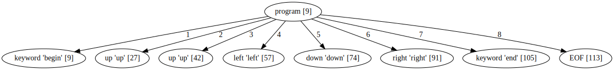



name: sadrzaj

# Sadržaj

- [Kratak pregled Python parsera](#pregled)
- [Arpeggio - uvod](#arpeggio)
- [Konfiguracija parsera](#konfiguracija-parsera)
- [Debagovanje, vizualizacija](#debagovanje)
- [Analiza stabala parsiranja](#analiza)

---
name: pregled
class: center, middle

# PyParsing

---
layout: true

.section[[Kratak pregled Python parsera](#sadrzaj)]

---

## PyParsing

- 100% Python
- MIT licenca
- PEG parser
- Gramatika se zadaje Python izrazima preko redefinisanih operatora `+` i `|` 
- Mane

  - Slabija podrška za semantičku analizu
  - Referenciranje pravila unapred - `Forward`
  - Nije moguće definisati gramatiku putem PEG notacije

- http://pyparsing.wikispaces.com/

---

## Primer

```python
from pyparsing import Word, alphas
greet = Word( alphas ) + "," + Word( alphas ) + "!" # <-- grammar
hello = "Hello, World!"
print (hello, "->", greet.parseString( hello ))
```

```
Hello, World! -> ['Hello', ',', 'World', '!']
```

---

## parsimonious

- 100% Python
- https://github.com/erikrose/parsimonious
- PEG (packrat) parser
- MIT licenca
- Cilj - performanse
- Gramatika se zadaje tekstualnim jezikom.
- *Whitespace* karakteri se zadaju gramatikom.

---

## Primer

```python
>>> from parsimonious.grammar import Grammar
>>> grammar = Grammar(
...     """
...     bold_text  = bold_open text bold_close
...     text       = ~"[A-Z 0-9]*"i
...     bold_open  = "(("
...     bold_close = "))"
...     """)

>>> print grammar.parse('((bold stuff))')
<Node called "bold_text" matching "((bold stuff))">
    <Node called "bold_open" matching "((">
    <RegexNode called "text" matching "bold stuff">
    <Node called "bold_close" matching "))">
```

---

## PLY

- 100% Python
- LR parser
- Inspirisan sa lex/yacc alatima
- Pravila prioriteta, oporavak od grešaka, podrška za neodređene gramatike.
- Tokenizacija kao poseban korak (lex modul)
- Gramatika se piše u docstring-ovima za semantičke akcije.

---


## Primer

```python
# When parsing starts, try to make a "chemical_equation" because it's
# the name on left-hand side of the first p_* function definition.
def p_species_list(p):
    "chemical_equation :  chemical_equation species"
    p[0] = p[1] + [p[2]]

def p_species(p):
    "chemical_equation : species"
    p[0] = [p[1]]
```

            

---
name: arpeggio
class: center, middle
layout: false

# Arpeggio

---
layout: true

.section[[Arpeggio](#sadrzaj)]

---

## Osnovne osobine

- 100% Python kod
- MIT licenca
- Definisanje gramatike putem Python izraza ili putem PEG notacije
- Puna podrška za semantičku analizu
- Dobra podrška za debagovanje
- Vizualizacija stabla parsiranja i modela parsera upotrebom GraphViz biblioteke.
- Dobra prijava grešaka
- Mogućnost višestruke analize istog stabla parsiranja
- https://github.com/igordejanovic/arpeggio/

---


---


## PEG pravila

- Gramatika se zadaje skupom PEG pravila
- Svako pravilo definiše način prepoznavanja određenog (ne)terminala na ulazu.

---

## PEG pravila (2)

Ako su e, e1 i e2 PEG pravila definisani su sledeći elementarni PEG izrazi:

- *Sekvenca:* `e1 e2` - izraz će dovesti do prepoznavanja ulaza ako i samo ako
  redom izrazi `e1` i `e2` prepoznaju ulaz
- *Uređeni izbor:* `e1 / e2` - izraz će biti prepoznat ukoliko bilo izraz `e1`
  ili izraz `e2` dovedu do prepoznavanja u navedenom redosledu (prvo `e1` pa
  zatim `e2` )
- *Jedan ili više:* `e+` - sukcesivno se vrši prepoznavanje izraza `e` dok god
  uspeva. Ukoliko je `e` prepoznat bar jednom prepoznavanje je uspešno
- *Nula ili više:* `e*` - sukcesivno se vrši prepoznavanje izraza `e` dok god
  uspeva. Izraz uvek uspeva pri čemu ako izraz `e` nije prepoznat ni jednom
  rezultat je prazan string,
- *Opciono:* `e?` - izraz uvek uspeva. Ukoliko se prepozna string sa ulaza biće
  konzumiran.
  
---

## PEG pravila - predikati

Predikati su pravila koja prepoznaju string sa ulaza ali ga ne konzumiraju.

- *"I" predikat:* `&e` - pravilo je uspešno samo ukoliko je `e` prepoznato na ulazu.
- *"Ne" predikat:* `!e` - pravilo je uspešno samo ukoliko `e` nije prepoznato na
  ulazu.
  
---

## Koncepti

- *Parser model* - opisuje određenu vrstu dijagrama stanja-prelaza parsera. Može
  se vizualizovati upotrebom dot alata u cilju debagovanja.
- *Stablo parsiranja* - može se vizualizovati dot alatom
- *Semantičke akcije* - transformišu stablo parsiranja u drugi oblik upotrebom
  *Visitor* obrasca.
  
---

## Definisanje gramatike - interni DSL

.lcol-wide2[
```python
def program():      return Kwd('begin'), ZeroOrMore(command),
                            Kwd('end'), EOF
def command():      return [up, down, left, right]
def up():           return 'up'
def down():         return 'down'
def left():         return 'left'
def right():        return 'right'
```
]
.rcol-narrow2[
```
begin
  up
  up
  left
  down
  right
end
``` 
]
            
- Gramatička pravila → Python funkcije
- Sekvenca → n-torka (*tuple*)
- Uređeni izbor → Python lista
- Ostalo → instance klasa (npr. `ZeroOrMore, OneOrMore, Optional`)
- Navedena gramatika prepoznaje ulaz dat na desnoj strani.

---

## Definisanje gramatike - eksterni DSL

```
program = 'begin' command* 'end' EOF
command = UP/DOWN/LEFT/RIGHT
UP = 'up'
DOWN = 'down'
LEFT = 'left'
RIGHT = 'right'
```

---

## Instanciranje parsera

```python
from arpeggio import ParserPython
def program():...

parser = ParserPython(program)

# Ili za eksternu PEG notaciju
from arpeggio.cleanpeg import ParserPEG
parser = ParserPEG(grammar)
# gde je grammar gramatika u PEG notaciji
```

---

## Model parsera


```
from arpeggio import ParserPython
...
parser = ParserPython(robot, debug=True)
```


---

## Stablo parsiranja

```python
prog_src = """
begin
    up
    up
    left
    down
    right
end
"""
parse_tree = parser.parse(prog_src)

```


.center[Elementi stabla su terminali i neterminali.]

[Dokumentacija: Stablo parsiranja, navigacija, terminali i ne-terminali](http://igordejanovic.net/Arpeggio/parse_trees/)

---

## Terminali (*Terminal nodes*)

- Kreiraju se pravilima koje nasleđuju `Match` pravilo. Mogu se konvertovati u
  string predstavu pozivom `str` funkcije.
- Trenutno postoje dve `Match` naslednice: `StrMatch` i `RegExMatch`.


---

## Ne-terminali (*Non-terminal nodes*)

- Kreiraju se svim ostalim pravilima: `Sequence`, `OrderedChoice`, `ZeroOrMore`
itd.
- Nasleđuju `list` tako da se mogu koristiti u svim kontekstima gde se može
  koristiti i lista.

---

## Stablo parsiranja aritmetičkog izraza


---

## Informacije sadržane u čvorovima stabla parsiranja

Svaki čvor stabla je objekat koji poseduje sledeće atribute:

- `rule` - veze prema `ParsingExpression` naslednici iz modela parsera, odnosno
  pravilo koje je prepoznalo ovaj element u ulaznom stringu,
- `rule_name` - ime pravila
- `position` - apsolutna pozicija unutar ulaznog stringa od početka.


Red i kolona se može dobiti preko parsera na sledeći način:

  ```python
  line, col = parser.pos_to_linecol(node.position)
  ```
  
---

## Navigacija

- Ne-terminali nasleđuju `list` tako da se mogu koristiti u svim kontekstima gde
  se može koristiti i lista.
    - Indeksni pristup:
    ```
    child = pt_node[2]
    ```
    - Iteracija:
    ```
    for child in pt_node:
      ...
    ```

---

## Navigacija

Dodatno se *child* elementima može pristupati i po nazivu pravila:

.medium[
```python
# Grammar
def foo(): return "a", bar, "b", baz, "c", ZeroOrMore(bar)
def bar(): return "bar"
def baz(): return "baz"
# Parsing
parser = ParserPython(foo)
result = parser.parse("a bar b baz c bar bar bar")

# Accessing parse tree nodes. All asserts will pass.
# Index access
assert result[1].rule_name  == 'bar'
# Access by rule name
assert result.bar.rule_name == 'bar'
# There are 8 children nodes of the root 'result' node.
# Each child is a terminal in this case.
assert len(result) == 8
# There is 4 bar matched from result (at the beginning and from ZeroOrMore)
# Dot access collect all NTs from the given path
assert len(result.bar) == 4
# You could call dot access recursively, e.g. result.bar.baz if the
# rule bar called baz. In that case all bars would be collected from
# the root and for each bar all baz will be collected.

# Verify position
# First 'bar' is at position 2 and second is at position 14
assert result.bar[0].position == 2
assert result.bar[1].position == 14
```
]


---
name: konfiguracija-parsera
class: center, middle
layout: false

# Konfiguracija parsera

---
layout: true

.section[[Konfiguracija parsera](#sadrzaj)]

---

## Osetljivost na veličinu slova (*Case-sensitiviy*)

- Parser je podrazumevano osetljiv na veličinu slova.
- Da se ovo promeni:

```python
parser = ParserPython(calc, ignore_case=True)
```

---

## Upravljanje "praznim" karakterima (*Whitespaces*)

- Arpeggio podrazumevano preskače prazne karaktere.
- Da bi se ovo promenilo:

```python
parser = ParserPython(calc, skipws=False)
```
- Pod praznim karakterima podrazumevaju se `\n\t\r `. Ovo se može promeniti
  parametrom `ws` pri konstrukciji:
  
```python
parser = ParserPython(calc, ws='\t\r ')
```

- Ovo se može koristiti i na nivou sekvence:

```python
def grammar():     return Sequence("one", "two", "three", skipws=False), "four"
parser = ParserPython(grammar)
pt = parser.parse('onetwothree four')
```

---

## Ključne reči

Ukoliko se uključi parametar `autokwd` tada će prepoznavanje svega što je oblika
ključne reči biti sa uzimanjem u obzir granice reči (*word boundary*) odnosno
ključne reči u sklopu većih reči neće biti prepoznate kao takve.
  
Primer:

```
  def grammar():     return "one", "two", "three"

  parser = ParserPython(grammar, autokwd=True)

  # If autokwd is enabled this should parse without error.
  parser.parse("one two three")

  # But this will not parse as the match is done using word boundaries
  # so this is considered a one word.
  parser.parse("onetwothree")
```

---

## Komentari

Arpeggio može opciono da primi i gramatiku za komentare. Ova gramatika će se
koristiti između svaka dva elementarna prepoznavanja osnovne gramatike (slično
kao za prazne karaktere).

```python
# Grammar
def simpleLanguage():   return function
def parameterlist():    return "(", symbol, ZeroOrMore(",", symbol), ")"
def functioncall():     return symbol, "(", expressionlist, ")"
def function():         return Kwd("function"), symbol, parameterlist, block
...
def comment():          return [_("//.*"), _("/\*.*\*/")]

parser = ParserPython(simpleLanguage, comment)
```


---

## Redukcija stabala parsiranja

Kod "dubokih" gramatika često imamo pojavu ne-terminala sa samo jednim
podčvorom. Zbog jednostavnosti analize nekada je poželjno eliminisati takve
čvorove iz stabla.

```python
parser = ParserPython(calc, reduce_tree=True)
```


---

## Parsiranje do kraja linije

Nekada je potrebno da pravila koja nasleđuju `Repetition` (`ZeroOrMore` i
`OneOrMore`) vrše parsiranje samo do kraja linije.

```python
def grammar():      return first, second
def first():        return ZeroOrMore(["a", "b"], eolterm=True)
def second():       return "a"

# first rule should match only first line
# so that second rule will match "a" on the new line
input = """a a b a b b
a"""

parser = ParserPython(grammar)
result = parser.parse(input)
```


---
name: debagovanje
class: center, middle
layout: false

# Debagovanje i vizualizacija

---
layout: true

.section[[Debagovanje](#sadrzaj)]

---
## Debagovanje (*Debugging*)

Arpeggio se može postaviti da radi u režimu za degabovanje.

```python
parser = ParserPython(calc, debug=True)
```

```
>> Entering rule calc=Sequence at position 0 => *-(4-1)*5+(
  >> Entering rule OneOrMore in calc at position 0 => *-(4-1)*5+(
      >> Entering rule expression=Sequence in calc at position 0 => *-(4-1)*5+(
        >> Entering rule term=Sequence in expression at position 0 => *-(4-1)*5+(
            >> Entering rule factor=Sequence in term at position 0 => *-(4-1)*5+(
              >> Entering rule Optional in factor at position 0 => *-(4-1)*5+(
                  >> Entering rule OrderedChoice in factor at position 0 => *-(4-1)*5+(
                    >> Match rule StrMatch(+) in factor at position 0 => *-(4-1)*5+(
                        -- No match '+' at 0 => '*-*(4-1)*5+('
                    >> Match rule StrMatch(-) in factor at position 0 => *-(4-1)*5+(
                        ++ Match '-' at 0 => '*-*(4-1)*5+('
                  << Leaving rule OrderedChoice
              << Leaving rule Optional
              >> Entering rule OrderedChoice in factor at position 1 => -*(4-1)*5+(2
```

---

## Vizuelizacija

.medium[
- U režimu za debagovanje kreiraju se `dot` fajlovi i za model parsera i za
  stablo parsiranja (ako nema sintaksnih grešaka).
- Koristimo `dot` alat (deo GraphViz alata) za konverziju u grafičke formate.

```
$ dot -Tpng -O calc_parser_model.dot
```
]


---

## Obrada grešaka pri parsiranju

```python
parser = ParserPython(calc)
# 'r' in the following expression can't be recognized by
# calc grammar
input_expr = "23+4/r-89"
parse_tree = parser.parse(input_expr)
```

```
Traceback (most recent call last):
  ...
arpeggio.NoMatch: Expected '+' or '-' or 'number' or 
  '(' at position (1, 6) => '23+4/*r-89'.
```

- `NoMatch` izuzetak.
  - `rules` - lista pravila (iz modela parsera) koja su pokušana na datom mestu.
  - `position` - apsolutna pozicija od početka fajla
  - `line`, `col` - red i kolona 
  - `parser` - referenca na parser objekat


---
name: analiza
class: center, middle
layout: false

# Analiza stabala parsiranja

---
layout: true

.section[[Analiza](#sadrzaj)]

---

## Semantičke akcije - transformacija u AST

```python
from arpeggio ParserPython, visit_parse_tree

parser = ParserPython(calc)
input_expr = "-(4-1)*5+(2+4.67)+5.89/(.2+7)"
parse_tree = parser.parse(input_expr)
result = visit_parse_tree(parse_tree, CalcVisitor())
```

---
          
## Semantičke akcije - transformacija u AST (2)

```python
class CalcVisitor(PTNodeVisitor):

    def visit_number(self, node, children):
        """
        Converts node value to float.
        """
        if self.debug:
            print("Converting {}.".format(node.value))
        return float(node.value)

    def visit_factor(self, node, children):
        """
        Applies a sign to the expression or number.
        """
        if self.debug:
            print("Factor {}".format(children))
        if len(children) == 1:
            return children[0]
        sign = -1 if children[0] == '-' else 1
        return sign * children[-1]
```

---

## `SemanticActionResults` 

- Klasa čija instanca se dobija kao `children` parametar u akcijama.
- Enkapsulira rezultate vraćene od akcija nižeg nivoa.
- Nasleđuje Python listu.

```python
def visit_bar(self, node, children):
  # Index access
  child = children[2]

  # Iteration
  for child in children:
    ...

  # Rule name lookup
  # Returns a list of all rules created by PEG rule 'baz'
  baz_created = children['baz']
```

---

## Postprocesiranje u drugom pozivu

- Nekada se konstrukcija AST-a mora obaviti u dva prolaza (npr. razrešavanje
  referenci).
- Opciona metoda oblika `second_<rule_name>`. Dobija objekat koji vraća poziv
  `visit_<rule_name>` i dodatno ga obrađuje.
  
---

## Podrazumevane semantičke akcije

- Ako nije definisana metoda `visit_<rule_name>` Arpeggio će primeniti
  podrazumevanu akciju čija logika je sledeća:
  - Ako je čvor kreiran `StrMatch` pravilom (string literal) vraća se `None`
    čime se čvor eliminiše iz `children` kolekcije čvora višeg nivoa.
  - Ako je krairan sa `RegExMatch` biće vraćen string.
  - Ako je čvor ne-terminal sa samo jednim podčvorom biće vraćen podčvor.
- Podrazumevane akcije se mogu isključiti parametrom `defaults`:

  ```python
  result = visit_parse_tree(parse_tree, CalcVisitor(defaults=False))
  ```

- Podrazumevane akcije se mogu eksplicitno pozvati:

  ```python
  def visitor_myrule(self, node, children):
    if some_condition:
      ...
    else:
      return super(MyVisitor, self).visit__default__(node, children)
  ```

---

## Primeri

- [CSV](http://arpeggio.readthedocs.io/en/latest/tutorials/csv/)
- [BibTeX](http://arpeggio.readthedocs.io/en/latest/tutorials/bibtex/)
- [Calc](http://arpeggio.readthedocs.io/en/latest/tutorials/calc/)

---

# Arpeggio dokumentacija
            
- http://igordejanovic.net/Arpeggio/


---
class: center, middle
layout: false

# Veče džeza i slobodnih formi - improvizacije

            



