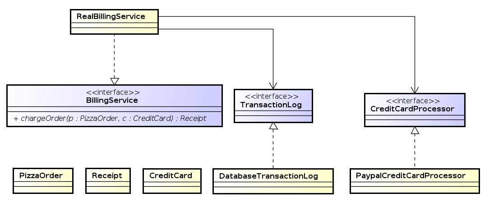

class: center, middle

# Umetanje zavisnosti - *Dependency Injection*
## Google Guice

.author[ [Igor Dejanović](http://igordejanovic.net/) ]

.small[[Fakultet tehničkih nauka u Novom Sadu](http://ftn.uns.ac.rs/)] </br>
.small[[Katedra za informatiku](http://informatika.ftn.uns.ac.rs/)]

.created[{{now|dtformat("%d.%m.%Y u %H:%M")}}]


---

name: sadrzaj

# Sadržaj

- [Motivacija](#motivacija)
- [*Dependency Injection*](#di)
- [Google Guice](#guice)

---
name: motivacija
class: center, middle
layout: false

# Motivacija

---
layout: true

.section[[Motivacija](#sadrzaj)]

---

# Motivacija

- Objekti iole složenijih aplikacija formiraju složene grafove zavisnosti.
- Kako objekat "dobija" reference na zavisne objekte?

---

# Motivacija



---

# Klasičan pristup dobavljanja referenci

.medium[
```java
public class RealBillingService implements BillingService {

  @Override
  public Receipt chargeOrder(PizzaOrder order, CreditCard creditCard) {
      CreditCardProcessor processor = new PaypalCreditCardProcessor();
      TransactionLog transactionLog = new DatabaseTransactionLog();

      try {
        ChargeResult result = processor.charge(creditCard, order.getAmount());
        transactionLog.logChargeResult(result);

        return result.wasSuccessful()
            ? Receipt.forSuccessfulCharge(order.getAmount())
            : Receipt.forDeclinedCharge(result.getDeclineMessage());
       } catch (UnreachableException e) {
        transactionLog.logConnectException(e);
        return Receipt.forSystemFailure(e.getMessage());
      }
  }
}
```
]

---

# Upotreba *Singleton/Factory* obrasca

Objekat se sam brine o dobavljanju referenci ali to čini posredstvom globalne
deljene reference.

.medium[
```java
public class RealBillingService implements BillingService {

  public Receipt chargeOrder(PizzaOrder order, CreditCard creditCard) {
    CreditCardProcessor processor = CreditCardProcessorFactory.getInstance();
    TransactionLog transactionLog = TransactionLogFactory.getInstance();

    try {
      ChargeResult result = processor.charge(creditCard, order.getAmount());
      transactionLog.logChargeResult(result);

      return result.wasSuccessful() ?
            Receipt.forSuccessfulCharge(order.getAmount()) :
            Receipt.forDeclinedCharge(result.getDeclineMessage());
    } catch (UnreachableException e) {
      transactionLog.logConnectException(e);
      return Receipt.forSystemFailure(e.getMessage());
    }
  }
}
```
]

---

# *Singleton/Factory* - testiranje

.medium[
```java
public class RealBillingServiceTest extends TestCase {

  private final PizzaOrder order = new PizzaOrder(100);
  private final CreditCard creditCard = new CreditCard(5000);

  private final InMemoryTransactionLog transactionLog = new InMemoryTransactionLog();
  private final FakeCreditCardProcessor creditCardProcessor = new FakeCreditCardProcessor();

  @Override
  public void setUp() {
    TransactionLogFactory.setInstance(transactionLog);
    CreditCardProcessorFactory.setInstance(creditCardProcessor);
  }

  @Override
  public void tearDown() {
    TransactionLogFactory.setInstance(null);
    CreditCardProcessorFactory.setInstance(null);
  }

  public void testSuccessfulCharge() {
    RealBillingService billingService = new RealBillingService();
    Receipt receipt = billingService.chargeOrder(order, creditCard);

    assertTrue(receipt.hasSuccessfulCharge());
    assertEquals(100.0, receipt.getAmount(), 0.001);
    assertEquals(creditCard, creditCardProcessor.getCardOfOnlyCharge());
    assertEquals(100.0, creditCardProcessor.getAmountOfOnlyCharge(), 0.001);
    assertTrue(transactionLog.wasSuccessLogged());
  }
}
```
]

---

# Upotreba Singleton/Factory obrasca - problemi

- Deljena referenca - moramo posebno da pazimo da je postavljamo na prave
  vrednosti.
- Nemoguće paralelizovati testove.


---
name: di
class: center, middle
layout: false

# *Dependency Injection*

---
layout: true

.section[[DI](#sadrzaj)]

---

# Umetanje zavisnosti - <i>Dependency Injection</i>

- Izmeštanje nadležnosti za dobavljanje referenci van objekta - neko drugi će
  se brinuti da "umetne" reference pre njihove upotrebe.
- Prednosti:
  - Kod se pojednostavljuje. Zavisnost između klasa je bazirana na apstraktnim
    interfejsima što pozitivno utiče na održavanje (*maintability*), ponovnu
    iskoristljivost (*reusability*) i podelu posla i nadležnosti.
  - Objekat će do trenutka poziva njegovih servisnih metoda već biti na
    odgovarajući način inicijalizovan. Smanjuje se tzv. *boilerplate* kod.
  - Testiranje je daleko jednostavnije. Kreiranje "lažnih" objekata (*mockup*)
    je moguće i jednostavno se izvodi. Moguća paralelizacija testova.
            

---

# Mehanizmi umetanja zavisnosti

- Putem parametara konstruktora.
- Putem mutator metoda (*setters*).
- Putem implementiranog interfejsa.

---

# Injekcija putem parametara konstruktora

```java
Client(Service service) {
    this.service = service;
}
```

.footer[[Wikipedia: Dependency
Injection](http://en.wikipedia.org/wiki/Dependency_injection)]


---

# Injekcija putem *setter* metoda

```java
public void setService(Service service) {
    this.service = service;
}
```

.footer[[Wikipedia: Dependency
Injection](http://en.wikipedia.org/wiki/Dependency_injection)]

---

# Injekcija putem interfejsa

```java
public interface ServiceSetter {
    public void setService(Service service);
}
public class client implements ServiceSetter {

    private Service service;

    @Override
    public void setService(Service service) {
        this.service = service;
    }
}
```

.footer[[Wikipedia: Dependency
Injection](http://en.wikipedia.org/wiki/Dependency_injection)]

---

# Upotreba DI

```java
public class RealBillingService implements BillingService {
  private final CreditCardProcessor processor;
  private final TransactionLog transactionLog;

  public RealBillingService(CreditCardProcessor processor,
      TransactionLog transactionLog) {
    this.processor = processor;
    this.transactionLog = transactionLog;
  }

  public Receipt chargeOrder(PizzaOrder order, CreditCard creditCard) {
    try {
      ChargeResult result = processor.charge(creditCard, order.getAmount());
      transactionLog.logChargeResult(result);

      return result.wasSuccessful() ?
           Receipt.forSuccessfulCharge(order.getAmount()) :
           Receipt.forDeclinedCharge(result.getDeclineMessage());
    } catch (UnreachableException e) {
      transactionLog.logConnectException(e);
      return Receipt.forSystemFailure(e.getMessage());
    }
  }
}
```

---

# Upotreba DI - testiranje

```java
public class RealBillingServiceTest extends TestCase {

  private final PizzaOrder order = new PizzaOrder(100);
  private final CreditCard creditCard = new CreditCard(5000);

  private final InMemoryTransactionLog transactionLog =
                                             new InMemoryTransactionLog();
  private final FakeCreditCardProcessor creditCardProcessor =
                                             new FakeCreditCardProcessor();

  public void testSuccessfulCharge() {
    RealBillingService billingService = new RealBillingService(
        creditCardProcessor, transactionLog);
    Receipt receipt = billingService.chargeOrder(order, creditCard);

    assertTrue(receipt.hasSuccessfulCharge());
    assertEquals(100.0, receipt.getAmount(), 0.001);
    assertEquals(creditCard, creditCardProcessor.getCardOfOnlyCharge());
    assertEquals(100.0, creditCardProcessor.getAmountOfOnlyCharge(), 0.001);
    assertTrue(transactionLog.wasSuccessLogged());
  }
}
```

---

# DI kontejneri

- DI se može implementirati i bez posebnog alata/okvira.
- DI kontejneri omogućavaju nametanje određenih konvencija za primenu ovog obrasca.
- Korišćenje DI kontejera donosi određene prednosti:
  - Upotreba najbolje prakse
  - Standardizacija

---

# DI kontejneri za Javu

- Google Guice
- PicoContainer
- Spring
- ...

---

# Standardizacija za programski jezik Java

- JSR-330 .ref[1]
- Definiše skup standardnih Java anotacija za DI:
  - `Provider<T>` - Provides instances of T
  - `Inject` - Identifies injectable constructors, methods, and fields.
  - `Named` - String-based qualifier.
  - `Qualifier` - Identifies qualifier annotations.
  - `Scope` - Identifies scope annotations.
  - `Singleton` - Identifies a type that the injector only instantiates once.

.footnote[.ref[1] https://code.google.com/p/atinject/]


---
name: guice
class: center, middle
layout: false

# Google Guice

---
layout: true

.section[[Google Guice](#sadrzaj)]

---

# Google Guice

- *Lightweight* okvir za DI u Javi.
- Razvijen od strane Google-a.
- Konfiguracija bazirana na Java anotacijama.

---

# Injekcija putem konstruktora

.medium[
```java
public class RealBillingService implements BillingService {
  private final CreditCardProcessor processor;
  private final TransactionLog transactionLog;

  @Inject
  public RealBillingService(CreditCardProcessor processor,
      TransactionLog transactionLog) {
    this.processor = processor;
    this.transactionLog = transactionLog;
  }

  public Receipt chargeOrder(PizzaOrder order, CreditCard creditCard) {
    try {
      ChargeResult result = processor.charge(creditCard, order.getAmount());
      transactionLog.logChargeResult(result);

      return result.wasSuccessful()
          ? Receipt.forSuccessfulCharge(order.getAmount())
          : Receipt.forDeclinedCharge(result.getDeclineMessage());
     } catch (UnreachableException e) {
      transactionLog.logConnectException(e);
      return Receipt.forSystemFailure(e.getMessage());
    }
  }
}
```
]

---

# Konfiguracija za povezivanje - *binding/wiring*

```java
public class BillingModule extends AbstractModule {
  @Override
  protected void configure() {
    bind(TransactionLog.class).to(DatabaseTransactionLog.class);
    bind(CreditCardProcessor.class).to(PaypalCreditCardProcessor.class);
    bind(BillingService.class).to(RealBillingService.class);
  }
}
```

---

# Upotreba kontejnera

```java
public static void main(String[] args) {
  Injector injector = Guice.createInjector(new BillingModule());
  BillingService billingService = injector.getInstance(BillingService.class);
  Receipt result = billingService.chargeOrder(new PizzaOrder(100),
                                              new CreditCard(500));
  System.out.println(result.hasSuccessfulCharge());
}
```

---

# *Linked Bindings*

```java
public class BillingModule extends AbstractModule {
  @Override
  protected void configure() {
    bind(TransactionLog.class).to(DatabaseTransactionLog.class);
    bind(DatabaseTransactionLog.class).to(MySqlDatabaseTransactionLog.class);
  }
}
```

---

# *Custom Bindings Annotations*

```java
package example.pizza;
import com.google.inject.BindingAnnotation;
import java.lang.annotation.Target;
import java.lang.annotation.Retention;
import static java.lang.annotation.RetentionPolicy.RUNTIME;
import static java.lang.annotation.ElementType.PARAMETER;
import static java.lang.annotation.ElementType.FIELD;
import static java.lang.annotation.ElementType.METHOD;

@BindingAnnotation @Target({ FIELD, PARAMETER, METHOD }) @Retention(RUNTIME)
public @interface PayPal {}
...
public class RealBillingService implements BillingService {

  @Inject
  public RealBillingService(@PayPal CreditCardProcessor processor,
      TransactionLog transactionLog) {
    ...
  }
...
    bind(CreditCardProcessor.class)
        .annotatedWith(PayPal.class)
        .to(PayPalCreditCardProcessor.class);
```

---

# *@Named Binding Annotation*

```java
public class RealBillingService implements BillingService {

  @Inject
  public RealBillingService(@Named("Checkout") CreditCardProcessor processor,
      TransactionLog transactionLog) {
    ...
  }
 ...
 ...
    bind(CreditCardProcessor.class)
        .annotatedWith(Names.named("Checkout"))
        .to(CheckoutCreditCardProcessor.class);
```

---

# *Instance Bindings*

```java
bind(String.class)
    .annotatedWith(Names.named("JDBC URL"))
    .toInstance("jdbc:mysql://localhost/pizza");
bind(Integer.class)
    .annotatedWith(Names.named("login timeout seconds"))
    .toInstance(10);
```

---

# *@Provides Methods*

```java
public class BillingModule extends AbstractModule {
  @Override
  protected void configure() {
    ...
  }

  @Provides
  TransactionLog provideTransactionLog() {
    DatabaseTransactionLog transactionLog = new DatabaseTransactionLog();
    transactionLog.setJdbcUrl("jdbc:mysql://localhost/pizza");
    transactionLog.setThreadPoolSize(30);
    return transactionLog;
  }
}
...
  @Provides @PayPal
  CreditCardProcessor providePayPalCreditCardProcessor(
      @Named("PayPal API key") String apiKey) {
    PayPalCreditCardProcessor processor = new PayPalCreditCardProcessor();
    processor.setApiKey(apiKey);
    return processor;
  }
```

---

# *Provider Bindings*

```java
public class DatabaseTransactionLogProvider 
      implements Provider<TransactionLog> {
  private final Connection connection;

  @Inject
  public DatabaseTransactionLogProvider(Connection connection) {
    this.connection = connection;
  }

  public TransactionLog get() {
    DatabaseTransactionLog transactionLog = new DatabaseTransactionLog();
    transactionLog.setConnection(connection);
    return transactionLog;
  }
}
...
public class BillingModule extends AbstractModule {
  @Override
  protected void configure() {
    bind(TransactionLog.class)
        .toProvider(DatabaseTransactionLogProvider.class);
  }
}
```

---

# *Scopes*

```java
@Singleton
public class InMemoryTransactionLog implements TransactionLog {
  /* everything here should be threadsafe! */
}
...
bind(TransactionLog.class)
  .to(InMemoryTransactionLog.class).in(Singleton.class);
...
@Provides @Singleton
TransactionLog provideTransactionLog() {
  ...
}
...
bind(Bar.class).to(Applebees.class).in(Singleton.class);
bind(Grill.class).to(Applebees.class).in(Singleton.class);
```

---
layout: false

# Reference

- [Google Guice Wiki](https://github.com/google/guice/wiki)
- [Dependency Injection on
  Wikipedia](https://en.wikipedia.org/wiki/Dependency_injection)
- Martin Fowler, [Inversion of Control Containers and the Dependency Injection
  pattern](http://www.martinfowler.com/articles/injection.html), January 2004.
