


name: sadrzaj

# Sadržaj

- [Uvod](#uvod)
- [Git repozitorijum](#repozitorijum)
- [Instalacija i konfiguracija](#konfiguracija)
- [Osnovne operacije](#operacije)
- [Grane](#grane)
- [Spajanje grana (*Merging*)](#merging)
- [Razmena promena](#razmena)
- [Ispravke grešaka](#greske)
- [Održavanje repozitorijuma](#odrzavanje)
- [Modeli grananja](#modeli)
- [Preporučena praksa](#praksa)
- [O implementaciji](#implementacija)
          
---
name: uvod
class: center, middle

# Uvod u Git

---
layout: true

.section[[Uvod](#sadrzaj)]

---

# Šta je Git?
            
- Distribuirani sistem za kontrolu verzija (*Distributed Version Control System -
  DVCS*).
- Razvoj započeo Linus Torvalds, u aprilu 2005. godine, posle promene politike
  licenciranja BitKeeper-a koji je do tada korišćen za razvoj linux kernela.
  Dostupan na adresi http://git-scm.com/
            
---

# Git - osobine
            
- Izuzetno brz i skalabilan.
- Jednostavan dizajn.
- Većina operacija su lokalne prirode.
- Odlična podrška za nelinearan razvoj (podrška za veliki broj grana) i velike
  projekte (npr. Linux kernel).
- Pisan najvećim delom u C-u, ali su delovi pisani u Perl-u, bash-u itd.
- Komande niskog nivoa (*plumbing*). Komande visokog nivoa (*porcelain*).
- Ne prati fajlove već sadržaj. Izmene se eksplicitno dodaju pre *commit*-a.
- Kriptografska autentikacija istorije promena.
            
---

# Osnovni workflow

- Ako ne postoji klon repozitorijuma na lokalnom računaru vrši se kloniranje
  udaljenog repozitorijuma (ovo se generalno radi jednom).
- Menjaju se fajlovi.
- Izmene se dodaju u pripremnu zonu (indeks).
- Vrši se trajno beleženje promene (operacija *commit*).

---
name: repozitorijum
layout: false
class: center, middle

# Git repozitorijum

---
layout: true

.section[[Repozitorijum](#sadrzaj)]

---

# Praćenje sadržaja

Osnova git repozitorijuma je praćenje sadržaja a ne fajlova i promena nad njima.
Informacije o promenama se izračunavaju po potrebi.

> I’m right. I’m always right, but sometimes I’m more right than
> other times. And dammit, when I say "files don’t matter", I’m
> really really Right(tm).ref[1].

.footer[
    1. Linus
       Torvalds,
       [prepiska na mailing listi](http://article.gmane.org/gmane.comp.version-control.git/217) ]

---

# Veza radnog stabla, indeksa i repozitorijuma
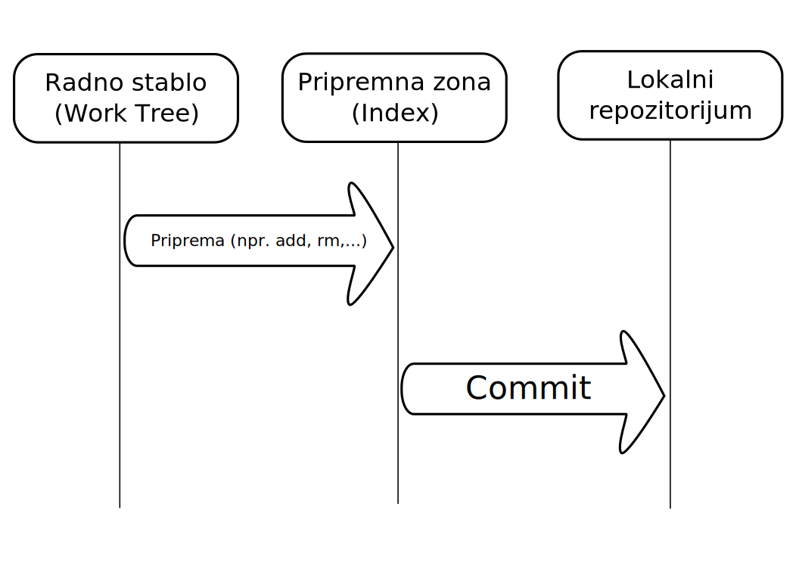

---

# Životni ciklus fajla u git repozitorijumu
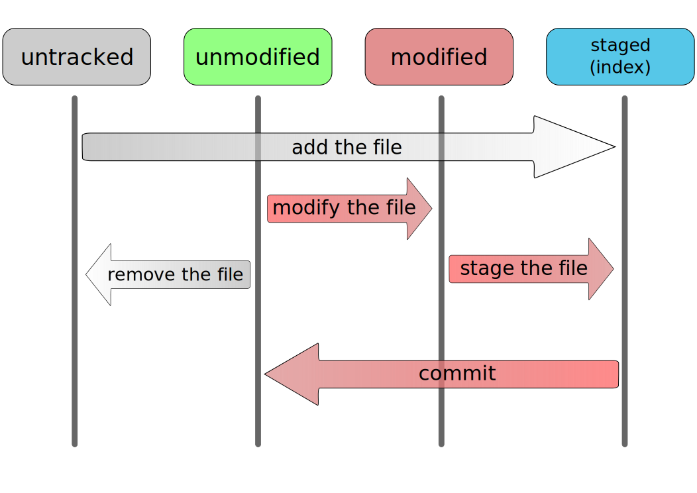

---

# Git repozitorijum

- **Objektna baza**: Jednostavan model repozitorijuma baziran na mapama (parovi
  ključ-vrednost).
- Ključevi su **SHA1 heš sadržaja** koji se čuva + hedera.
- **Tri vrste objekata/vrednosti**. Sadržaj se komprimuje pomoću *zlib* biblioteke.
- Reference - *pokazivači* na određene objekte u repozitorijumu.
- Repozitorijum se nalazi u **.git** direktorijumu unutar direktorijuma gde je
    izvršena inicijalizacija sa `git init` komandom (videti u nastavku).


---

# Git repozitorijum sa objektima i referencama

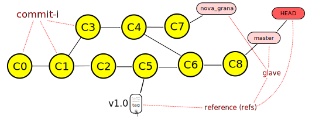

---

# Prikaz popularnih hosting rešenja

- https://github.com/
- https://gitlab.com/

---
name: konfiguracija
layout: false
class: center, middle

# Instalacija i konfiguracija

---
layout: true

.section[[Konfiguracija](#konfiguracija)]

---

# Vrste klijenata

- GUI
  - FLOSS: EGit (Eclipse plugin), git-cola, TortoiseGit, Git Extensions...
  - Komercijalni: SmartGit

- Command line - kanonički git klijent

---

# Pomoć - help

Spisak osnovnih komandi git-a se može dobiti sa:

```
$ git help
usage: git [–version] ...
...
The most commonly used git commands are:
add       Add file contents to the index
bisect    Find by binary search the change that introduced a bug
branch    List, create, or delete branches
checkout  Checkout a branch or paths to the working tree
...
```

Detaljna pomoć za komandu se dobija sa:

```
$ git help <ime komande>
```
 
---

# Konfiguracija

- Konfiguracija se čuva u tekstualnim fajlovima koji imaju strukturu *.ini
  fajlova*.
- Preporučivo je parametre podešavati putem <em>git config</em> komande.
- Tri nivoa konfiguracije:
  - *sistemska* (za sve korisnike instalacije) - fajl `/etc/gitconfig`
  - *po korisniku* (važi za ulogovanog korisnika) - fajl `~/.gitconfig` (POSIX)
      ili `C:\Documents and Settings\$USER\.gitconfig` (Windows)
  - *po repozitorijumu* (važi za tekući repozitorijum) - fajl `.git/config`
    unutar repozitorijuma
  
---

# Osnovna konfiguracija

.medium[
Konfigurisanje imena i email-a:

```
$ git config --global user.name "Igor Dejanović"
$ git config --global user.email "igor DOT dejanovic AT gmail DOT com"
```

Konfiguracija se može izlistati sa:
```
$ git config --list
```

Editor za unos log poruka je postavljen na podrazumevani sistemski (najčešće vi
ili vim). Windows korisnici uglavnom nisu vični upotrebi ovog editora.

Podrazumevani editor se na windowsu može promeniti na sledeći način:
```
# Windows - Obratiti pažnju na duple navodnike!!!
$ git config --global core.editor
    "'C:/Program Files/Windows NT/Accessories/wordpad.exe'"
          </code></pre>
```
]

---

# Konfiguracija za SSL i proxy

Za pristup serverima sa nevalidnim sertifikatom (npr. samopotpisan sertifikat)
potrebno je podesiti sledeće za sertifikat koji smo preuzeli sa servera:

```
$ git config --global http.sslCAInfo /home/igor/config/all-certs.crt
```

ili ukoliko ne želimo proveru sertifikata:

```
$ git config --global http.sslVerify false
```

Ako je potreban pristup preko HTTP proxy-ja to se po korisniku može podesiti sa:

```
$ git config --global http.proxy 192.168.77.100:8080
```

---

# Povezivanje sa serverom upotrebom SSH ključeva

            
- Ključevi se nalaze u `~/.ssh/` direktorijumu.
- Generišu se sa komandom:

```
$ ssh-keygen -t rsa -b 4096 -C "your_email@example.com"
Generating public/private rsa key pair.
Enter file in which to save the key (/Users/you/.ssh/id_rsa): [Press enter]
Enter passphrase (empty for no passphrase): [Type a passphrase]
Enter same passphrase again: [Type passphrase again]
Your identification has been saved in /Users/you/.ssh/id_rsa.
Your public key has been saved in /Users/you/.ssh/id_rsa.pub.
The key fingerprint is:
01:0f:f4:3b:ca:85:d6:17:a1:7d:f0:68:9d:f0:a2:db your_email@example.com
```

.footer[
  [GitHub: Generating SSH keys](https://help.github.com/articles/generating-ssh-keys/)
]


---

# Konfigurisanje diff/merge alata

```
$ git config --global merge.tool meld
```

Ili na windows-u:

```
$ git config --global merge.tool "'C:\ Program Files\...'"
```

---

# Konfiguracija veličine slova u nazivima fajlova

Unix fajl sistemi su uglavnom *case-sensitive* dok kod *windows*-a to
nije slučaj. Stoga je na unix file sistemima sasvim legalno da
postoje dva fajla istog naziva ali različite veličine slova (na primer
`File1.txt` i `file1.txt`). Ovo na *windows*-u nije moguće pa je dobro,
ukoliko članovi tima rade na različitim operativnim sistemima,
podesiti sledeće:

```
$ git config --global core.ignorecase true
```

Na taj način će git tretirati fajlove različitog *case*-a kao identične i
ukoliko se kreira fajl istog naziva kao postojeći u repozitorijum ali
različitog *case*-a on će biti ignorisan.


---

# Konfiguracija završetaka linija (<i>line endings</i>)

.medium[
Unix na kraju reda kod tekstualnih fajlova koristi LF bajt. Windows koristi dva
bajta - CR i LF. Današnji editori su u stanju da rade sa oba standarda. Git
podržava automatsku konverziju krajeva linija. Tekuća praksa je da se kreira
konfiguracioni fajl `.gitattributes` u korenskom folderu u kome se
"pomaže" git-u da pravilno odredi tekstualne i binarne fajlove. Ovaj fajl se
*commit*-uje u repozitorijum tako da svi članovi tima imaju isto
podešavanje. Sadržaj `.gitattributes` fajla:

```
  * text=auto
  *.png binary
  *.jpg binary
  *.exe binary
```

.attention[
**Napomena**: Za dodatnu konfiguraciju pogledati konfiguracione
parametre `core.eol`, `core.autocrlf` i `core.safecrlf`.]

]

---

# Normalizacija krajeva linija u repozitorijumu

Ako se u git repozitorijumu već nalaze fajlovi sa CRLF tada je potrebno izvršiti
normalizaciju svih tekstualnih fajlova na LF
pratite
[uputstvo sa GitHub-a](https://help.github.com/articles/dealing-with-line-endings/).

---
name: operacije
layout: false
class: center, middle

# Osnovne operacije

---
layout: true

.section[[Operacije](#sadrzaj)]

---

# Inicijalizacija repozitorijuma

Repozitorijum je skup metapodataka koji se nalaze u skrivenom folderu .git
unutar korenskog foldera projekta.

Kreiranje se obavlja na sledeći način:

```
# Prelazak u folder gde se nalazi izvorni kod
# projekta
$ cd ~/Projekat
# Inicijalizacija
$ git init
Initialized empty Git repository in
/home/igor/Projekat/.git/
```

Ovim je kreiran prazan repozitorijum. Sledeći korak je dodavanje sadržaja.


---

# Kloniranje repozitorijuma

Repozitorijum možemo kreirati kloniranjem udaljenog
repozitorijuma.

```
$ git clone https://puppet.ftn.uns.ac.rs/rks/tim1/git RKSProjekat
```

Ili na primer ako se podigne lokalni server sa `git daemon` (videti sekciju
*Razmena promena*)

```
$ git clone git://192.168.100.50/ mojProjekat
```

gde je 192.168... IP adresa računara na kojem je daemon pokrenut

---

# Ignorisanje fajlova

Obavlja se putem fajla `.gitignore` koji se nalazi u korenskom
folderu projekta. Sadržaj je sledećeg oblika:

```
  # Ovo je komentar.
  # Ignorišemo sve privremene fajlove
  *.tmp
  *~
  *.class
  /docs/*.html
  # Ignorisemo sve .html fajlove u docs i poddirektorijumima
  /docs/**/*.html
  # Ali ne ignorisemo rucno pisanu dokumentaciju
  !/docs/manual/*.html
```

`.gitignore` fajl se može kreirati i u poddirektorijumima i u tom slučaju
važi samo za dati poddirektorijum.

---

# Status repozitorijuma

Status predstavlja informacije kao što su:
- Grana na kojoj se nalazi radno stablo.
- Koji fajlovi su novi, nisu ignorisani i nisu spremni za dodavanje.
- Koji fajlovi/sadržaji su spremni za dodavanje.

---

# Status repozitorijuma

Na primer, za repo. koji ima lokalnih promena

```
$ git status
# On branch master
# Changes not staged for commit:
# (use "git add <file>..." to update what will be committed)
# (use "git checkout – <file>..." to discard changes in working directory)
#
# modified: fajl2.txt
#
# Untracked files:
# (use "git add <file>..." to include in what will be committed)
#
# file1.txt
no changes added to commit (use "git add" and/or "git commit -a")
```

- Radno stablo je na grani master (osnovna grana u git repozitorijumu – videti u
  nastavku).
- `fajl2.txt` je izmenjen ali nije pripremljen za dodavanje dok je `file1.txt`
  novi fajl koji se trenutno ne prati.

---

# Priprema index-a


Priprema sadržaja za *commit* se obavlja operacijama `add`, `rm` i sl.
```
# Dodavanje sadržaja
$ git add MojaKlasa.java
$ git add .
# Interaktivno dodavanje sadržaja
$ git add -p .
# Dodavanje/uklanjanje svih novih/modifikovanih/obrisanih fajlo
$ git add -A .
# Uklanjanje iz radnog stabla i indeksa.
$ git rm MojaKlasa.java
# Uklanjanje iz indeksa uz brisanje iz repozitorijuma.
# Fajl ostaje u radnom stablu ali se više ne prati.
$ git rm --cached MojaKlasa.java
# Uklanjanje promena zabeleženih u indeksu
$ git reset HEAD ili samo git reset
# Uklanjanje zabeleženih promena nad fajlom iz indeksa
$ git reset HEAD <putanja do fajla>

```
Promene se beleže u index-u.
 

---

# Napomena za inicijalni *commit*


Pri inicijalnom *commit*-u repozitorijum je prazan pa `HEAD`
pokazivač ne postoji. Zbog toga nije moguće poništiti indeks
komandom `git reset HEAD` pa se u tom slučaju radi:

```
$ git rm –r --cached .
```


.attention.medium[
  **Napomena**: ovo se radi samo kod inicijalnog *commit*-a. Nemojte ovo raditi
  kasnije! Ova komanda registruje promenu koja će obrisati sve fajlove (rekurzivno
  – flag –r) u sledećoj verziji.
]

---

# Odustajanje od praćenja fajla

.medium[
- U komandama tipa `git add -A` i `git commit -a` git automatski dodaje promene
  za fajlove koji se prate.
- Ukoliko je potrebno odustati od praćenja fajla a zadržati fajl u radnom stablu
  to se može uraditi na sledeći način:

  ```
  $ git rm --cached MojaKlasa.java
  ```

  Problem sa ovim pristupom je što će fajl biti obrisan u
  udaljenom repozitorijumu.

- Ukoliko želimo da se fajl ne prati ali da ostane u svim
  repozitorijumima potrebno ga je obeležiti kao takvog sa:

  ```
  $ git update-index --assume-unchanged MojaKlasa.java
  ```

  Kada želimo opet da pratimo fajl radimo:

  ```
  $ git update-index --no-assume-unchanged MojaKlasa.java
  ```
]

---

# Trajno beleženje - *commit*

- Promena se trajno beleži sa:

  ```
  $ git commit
  ```

  Potrebno je zatim uneti log poruku. Preporuka je da se u
  prvom redu unese skraćena verzija, ostavi prazan red, a zatim
  unese duža verzija poruke.

- Ukoliko indeks nije pripremljen može se koristiti prečica:

  ```
  $ git commit -a
  ```

  Koja pre commit-a smešta u indeks sve modifikovane/obrisane
  fajlove. Novi fajlovi ne ulaze u indeks.


---

# Pregled istorije

- Istorija se može pregledati sa komandom:

  ```
  $ git log
  ```

- Grafički pregled istorije se dobija sa

  ```
  $ gitk
  ```

  za tekuću granu, ili
  
  ```
  $ gitk --all
  ```
  za sve grane.


---

# Premeštanje fajlova, promena imena

Premeštanje fajlova i promena imena može da se obavi na
sledeći način
  
```
$ git mv staroime novoime
```

ali pošto git ne vodi informacije o premeštanjima i promenama
imena fajlova već koristi heuristiku koja to obavlja
post-festum, možemo koristiti i alate operativnog sistema za
premeštanje i promene imena, a zatim sve promene dodati sa

```
$ git add -A
```

Git će detektovati premeštene fajlove čak i u slučaju da su
usput u izvesnoj meri promenjenog sadržaja.

---

# Privremeno “sklanjanje” lokalnih izmena

- U sred ste rada i stiže zahtev da se nešto mora hitno uraditi.
- Dva načina na koji se može odgovoriti na ovaj zahtev:
  - Napraviti novi klon repozitorijuma, postaviti se na odgovarajuću granu,
    obaviti izmenu i poslati izmene.
  - Iskoristiti operaciju `stash` koja “sklanja” lokalne promene na stek promena
    i dovodi radno stablo u čisto stanje, pozicioniranje na odgovarajuću granu,
    obavljanje izmena, vraćanje lokalnih promena sa stash steka.

  ```
  $ git stash # Sklanjanje lokalnih promena
  $ git checkout neka_grana
  $ ... # Potrebne ispravke
  $ git commit -a
  $ git checkout ...
  $ git stash pop # Vraćanje lokalnih promena
  ```
           
---

# Revizije

.medium[
- Revizije imenuju *commit* objekat.
- *Commit* može biti identifikovan sa kriptografskim SHA1 ključem dužine
  40-bajtova. Na primer `dae86e1950b1277e545cee180551750029cfe735`. Može
- se koristiti skraćena verija ukoliko je jednoznačana, na primer `dae86e`.
  Korišćenje simboličkih imena grana i oznaka (ili reference). Na primer,
  `master`, `heads/master`, `refs/heads/master`, `refs/remotes/origin/master`,
  `HEAD`, `ORIG_HEAD` itd.
- Referenca sa sufiksom `@` i vremenskom odrednicom u zagradama. Na primer,
  `HEAD@{yesterday}`, `master@{1 week ago}`, `moja_grana@{2011-03-17 17:00:00}`.
- Referenca sa sufiksom `@` i celim brojem `n` u zagradama označava vrednost
  reference `n` promena unazad. Na primer, `master@{3}`, `moja_grana@{1}`. Ako
  se referenca izostavi uzima se tekuća grana.
- Revizija praćena znakom `^` iza koje je opciono naveden ceo broj `n`. Označava
  n-ti roditeljski commit date revizije. Na primer `HEAD^`, `master^^`,
  `v1.5.1^2`. Ako se n izostavi podrazumeva se 1.
- Revizija praćena znakom `~` iza koje je opciono naveden ceo broj `n`. Označava n-ti
  predak do koga se stiže preko prvog roditelja. Na primer `master~`.
  Za detalje videti http://schacon.github.com/git/gitrevisions.html
]


---
name: grane
layout: false
class: center, middle

# Grane (*Branches*)

---
layout: true

.section[[Grane](#sadrzaj)]

---

# Grane – Branches

- Grane su alternativni tokovi razvoja.
- Kreiranje grana kod Git-a je jednostavno i brzo tako da se ohrabruje njihovo
  često kreiranje (npr. za svaki *feature*, *bugfix* i sl.).
- Osnovna grana se naziva *master*. Ona obično uvek postoji (osim kod praznog
  repozitorijuma).
  
  
---

# Vrste grana

- Grane u git repozitorijumu mogu biti:
  - **lokalne**: Nastale u lokalnom repozitorijumu i ne prate druge grane.
  - **tracking**: Lokalne grane koje prate druge grane (tj. podešena ima je
    *upstream* grana). Najčešće prate *remote tracking grane*.
  - **remote tracking**: Grane nastale u udaljenom repozitorijumu koje se
    kloniraju u lokalni.
    
    
---

## Kako to sve izgleda u repozitorijumu

.center[
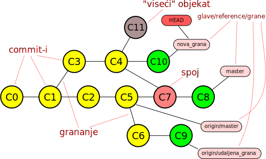
]

.small[
- grane su reference(*refs*) na poslednji *commit* alternativnog toka.
- `nova_grana` je lokalna grana na kojoj se radno stablo trenutno nalazi (`HEAD`
  pokazuje na ovu granu).
- `origin/master` i `origin/udaljena_grana` su *remote tracking* grane udaljenog
  repozitorijuma `origin`.
- `master` je lokalna grana koja prati `origin/master` tj. ona je *tracking* grana.
]

---

# Grane i operacije


.footer[
   http://stackoverflow.com/questions/25786808/how-many-types-of-branches-exist-in-git
]


---

# Kreiranje grane

Kreiranje nezavisne lokalne grane
```
$ git branch mojagrana 
```

Kreiranje grane koja prati udaljenu (*tracking branch*) Udaljena grana je u
lokalnom repozitorijumu predstavljena kao `<udaljeni repo>/<ime grane>`. Na
primer `origin/udaljenagrana`.
```
$ git branch -t origin/udaljenagrana
```

Prethodni primer će kreirati tracking granu koja se zove kao i udaljena
(`udaljenagrana`). Ako želimo da kreiramo tracking granu koja se zove drugačije
radimo:

```
$ git branch mojagrana -t origin/udaljenagrana
```

---

# Informacije o granama

Spisak lokalnih grana, sa `*` označena tekuća
```
$ git branch
  * master
  moja_grana
```

Spisak lokalnih i *remote tracking* grana
```
$ git branch -a 
```

Spisak *remote tracking* grana
```
$ git branch -r
```

Spisak lokalnih grana i njihovih *upstream* grana
```
$ git branch -vv
```

---

# Prelazak između grana

.medium[
- Promena grane podrazumeva izmenu radnog stabla tako da
  odgovara verziji sa grane.
- Grana se menja komandom checkout na sledeći način:
  ```
  $ git checkout moja_grana
  Switched to branch ’moja_grana’
  $ git checkout master
  Switched to branch ’master’
  ```

- Ako želimo da kreiramo novu granu i pređemo na nju:
  ```
  $ git checkout -b moja_grana
  Switched to a new branch ’moja_grana’
  ```

- A ako je novokreirana grana *tracking*:
  ```
  $ git checkout -t origin/udaljena_grana
  # Ili ako želimo posebno ime
  $ git checkout -b moja_grana -t origin/udaljena_grana
  ```
]

---

# Brisanje lokalnih grana

Brisanje lokalne grane:
```
$ git branch -d grana_za_brisanje
```

Prethodna komanda će proveriti da li je grana prethodno spojena (*merge*) na
neku drugu i ako nije odbiti da uradi posao jer bi to značilo ostavljanje
nespojenih *commit*-a sa grane da "vise" (*dangling objects*). Ovi *commit*-i bi
bili trajno obrisani prilikom sledećeg izvršavanja komande `git gc`.

Ako smo sigurni da želimo da obrišemo nespojenu granu to radimo sa:
```
$ git branch -D grana_za_brisanje
```

---

# Slanje promena u drugi repozitorijum

.medium[
Slanje promena na *upstream* granu se radi sa:

```
$ git push
```

Objavljivanje/kreiranje grane na udaljenom repozitorijumu se radi na sledeći
način:
```
$ git push origin moja_grana
$ git push -u origin moja_grana    # sa podešavanjem upstream grane
```

Ili ako želite da se na udaljenom repo-u zove drugačije
```
$ git push origin moja_grana:super_grana
```

Ili ako želite da pošaljete sve grane (npr. *push* u prazan repo)
```
$ git push --all origin # ili...
$ git push origin '*:*'
```
]

---

# Slanje promena u drugi repozitorijum

.medium[
A ako želimo da lokalne grane ujedno postanu tracking za
upravo objavljene grane
```
$ git push -u --all origin
```

Naravno preduslov je da je `origin` udaljeni repozitorijum
podešen.
]

---

# push.default - TODO


---

# Podešavanje veze sa udaljenim repozitorijumom

.medium[
Prethodne komande su podrazumevale da je udaljeni repozitorijum sa imenom `origin`
već podešen. Ukoliko je lokalni repozitorijum nastao kloniranjem udaljenog ovo
jeste tako, ali ukoliko nije (na primer, hoćemo da uradimo `push` u prazan
centralni repozitorijum) možemo kreirati vezu na
sledeći način:

```
$ git remote add origin https://puppet.ftn.uns.ac.rs/rks/timX/git
```

A zatim se mogu izlistati svi udaljeni repozitorijumi sa:
```
$ git remote
```

Ili se mogu prikazati detalji određenog repozitorijuma, zajedno sa granama koje
se prate sa
```
$ git remote show origin
```
]

---

# Brisanje udaljenih grana

Brisanje grane u udaljenom repozitorijumu se može uraditi na sledeći način:

```
$ git push origin :udaljena_grana
```

ili u novijim verzijama:
```
$ git push origin --delete udaljena_grana
```

---

# Poređenje grana (*commit*-a)

.medium[
Da bi videli koji fajlovi su promenjeni između dve grane uz ignorisanje
*whitespace* karaktera (`-w`):

```
$ git diff -w --name-status master..integration
```

Da vidimo promene između vrhova dve grane:

```
$ git diff master..integration | kompare -
```

Da vidimo vizuelno sve izmene nad fajlovima u folderu `src`:

```
$ git diff -w --diff-filter=M master..integration src/ | kompare -
```

Šta imamo na `integration` što nije uključeno na `master` (**tri tačke!**):
```
$ git diff master...integration | kompare -
```

Poređenje možemo obaviti između bilo koja dva *commit*-a (po *hash* *id*-u).
]


---
name: merging
layout: false
class: center, middle

# Spajanje grana (*merging*)

---
layout: true

.section[[Spajanje](#sadrzaj)]

---

# Spajanje grana – *merge*

- Komanda `pull` automatski radi spajanje grane sa udaljenog repozitorijuma.
  ```
  $ git pull
  ```

- A možemo spajanje obaviti i eksplicitno. Na primer:
  ```
  $ git fetch
  $ git merge origin/master
  ```
- `fetch` će pokupiti promene sa udaljenog repozitorijuma ali neće automatski
  obaviti spajanje na tekuću *tracking granu*.
- `merge` obavlja spajanje. Ako ne dođe do konflikta automatski se vrši `commit`
  (ovo se može promeniti navođenjem `--no–commit` parametra).
- Ako dođe do konflikta potrebno ga je razrešiti ručno i zatim dodati promenu i
  uraditi `commit`.
  
---

# Spajanje grana – strategije

- Prilikom operacije spajanja moguće je zadati odgovarajuću `merge` strategiju
  navođenjem parametra iza `-X`.
- Podrazumevana strategija je trenutno `recursive` a interesantne su i strategije
  `ours/theirs` koje će preuzeti naše ili udaljene promene kao podrazumevane u
  novoj verziji.

---

## Spajanje grana – *fast-forward merge*

Ukoliko je polazni commit grane koju spajamo jednak vrhu tekuće grane git će
podrazumevano da uradi tzv. *fast-forward* merge.

.center[
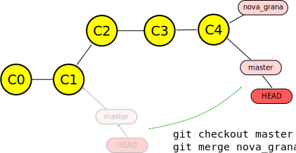
]

---

## Spajanje grana – *no fast-forward merge*

Ukoliko se želi zadržati informacija o tome da je postojao alternativni tok
(grana) može se proslediti parametar `--no-ff` čime se merge obavlja na klasičan
način.

.center[
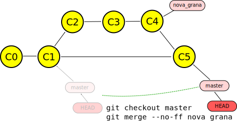
]

---

# Spajanje grana – *rebase*

Drugi mehanizam spajanja promena sa druge grane je *rebase*.

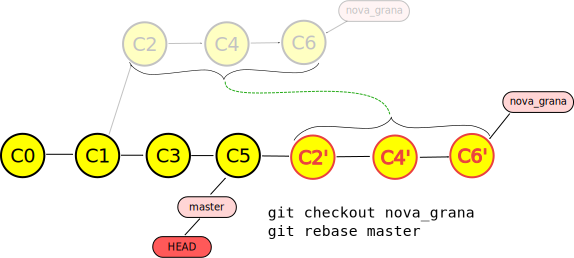

.attention[
  **Važno**: *rebase* menja istoriju. Ne raditi na udaljenim deljenim granama.
]

---

## Preuzimanje pojedinačnih *commit*-a – *cherry-pick*

.medium[

Ukoliko je potrebno preuzeti pojedinačnu promenu (*commit*) i primeniti je na
tekuću granu koristi se komanda `cherry-pick`.

Primeri:

- Preuzmi commit master na tekući `HEAD`
  ```
  $ git cherry-pick master
  ```
  
- Preuzmi *commit master* ali edituj *commit* log poruku 
  ```
  $ git cherry-pick -e master
  ```
- Preuzmi *commit* 7f... u WT i index
  ```
  $ git cherry-pick -n 7f546d
  ```
- Preuzmi 5-ti i treći *commit* od kraja *master* grane
  ```
  $ git cherry-pick master~4 master~2 
  ```
]

---

# Razrešavanje konflikta

- Konflikti će biti označeni odgovarajućim markerima unutar tekstualnih fajlova.
  ```
  <<<<<<< HEAD:file.txt
  Hello world
  =======
  Goodbye
  >>>>>>> 77976da35a11db4580b80ae27e8d65caf5208086:file.txt
  ```

- Konflikt razrešavamo ručnom ispravkom fajla u kome je nastao i dodavanjem u indeks:
  ```
  $ git add file.txt
  $ git commit
  ```
  
---

# Razrešavanje konflikta

- Kod konflikta komanda git diff će prikazivati *three-way-diff* između zajedničkog
  pretka, tekuće verzije i verzije sa druge grane. Razrešenje preuzimanjem naše ili
  tuđe verzije obavljamo sa:
  ```
  $ git checkout --ours file.txt
  $ git checkout --theirs file.txt
  ```
  posle čega je potrebno uraditi `add`

- Od spoja možemo odustati sa:
  ```
  $ git master --abort
  ```

---
name: razmena
layout: false
class: center, middle

# Razmena promena

---
layout: true

.section[[Razmena](#sadrzaj)]

---

# Razmena promena

- Može se obavljati putem deljenog repozitorijuma:
  ```
  $ git pull ....
  $ git fetch ....
  $ git push ....
  ```

- Putem lokalnog daemon-a:
  ```
  $ git daemon --export-all --base-path=.
  ```

  Ili ako želimo i mogućnost `push` operacije
  ```
  $ git daemon --export-all --enable=receive-pack --base-path=.
  ```

  **Napomena:** Sa ovom komandom `push` operacija nije moguća
  ka repozitorijumima koji nisu *bare*.


---

# Razmena promena

Ili upotrebom fajlova (mejlom, na prenosnom disku i sl.).

- Putem tzv. *bundle*-ova :
  ```
  $ git bundle ...
  $ git unbundle ....
  ```
  
---

# Razmena promena

- Putem zakrpa (*patches*). U ovoj varijanti promena može da se prenosi između repozitorijuma sa različitom istorijom.

  Poslednjih n *commit*-a
  ```
  $ git format-patch -n 
  ```
  
  Promene na `master` grani
  ```
  $ git format-patch origin/master..master
  ```

  Od poslednjeg `pull`-a i zatim primena na odredišni repozitorijum
  ```
  $ git am *.patch
  ```


---
name: greske
layout: false
class: center, middle

# Ispravke grešaka

---
layout: true

.section[[Ispravke](#sadrzaj)]

---

# Ispravke grešaka

Imamo sledeće situacije:

- Uradili smo lokalne izmene ili smo izmenili indeks i želimo od tih promena da
  odustanemo.
- Uradili smo izmenu i primetili smo da smo pogrešili a izmenu još nismo poslali
  u udaljeni repozitorijum.
- Primetili smo da je izmena koja nije poslednja a poslata je u udaljeni
  repozitorijum neispravana.
- Izmena koja nije poslednja je neispravna ali još uvek nije poslata u udaljeni
  repozitorijum.
  
.attention[
   **Važna napomena**
   
   Obratite pažnju da se istorija koja je objavljena (promene poslate u udaljeni
   repozitorijum) ne sme menjati! Može se samo kreirati nova promena koja
   poništava staru.

]

---

## Odustajanje od lokalnih promena

Izmenili smo indeks ili smo izmenili fajlove u lokalnom stablu. Ukoliko želimo
da poništimo sadržaj index-a i/ili lokalnog stabla koristimo komandu `reset`.
`reset` komanda može da, opciono, "premota" `HEAD` pokazivač tekuće grane na
zadatu verziju i da uskladi index i/ili radno stablo sa datom verzijom.

Dovođenje index-a i radnog stabla na `HEAD` verziju.
Posle ovoga `git diff [--cached]` komanda javlja da
nema razlika.
```
$ git reset --hard HEAD
```

---

## Odustajanje od lokalnih promena

Samo želimo da premotamo tekući `HEAD` jednu verziju unazad ali ne želimo da
promenimo indeks i radno stablo. Promene obeležene za dodavanje ostaju.

```
$ git reset --soft HEAD^
```

Resetujemo indeks ali ne i radno stablo. Ovo je podrazumevano
ponašanje (`--mixed` može da se izostavi).
```
$ git reset --mixed HEAD
```

.attention[
  **Napomena**: Pomeranjem `HEAD`-a git pamti prethodni u `ORIG_HEAD` tako da možemo uvek da
  poništimo efekat `reset` komande.
]

---

## Poništavanje lokalne promene nad proizvoljnim fajlom

Ukoliko želimo da odustanemo od promene proizvoljnog fajla radimo sledeće:

- Vraćanje na verziju iz indeksa
  ```
  $ git checkout -- readme.txt
  ```

- Vraćanje na verziju sa `HEAD`-a
  ```
  $ git checkout HEAD readme.txt
  ```
  
---

# Izmena poslednjeg *commit*-a

Ukoliko smo uradili commit a zatim primetili da smo nešto zaboravili, ili smo
upisali pogrešnu log poruku možemo uraditi sledeće:

```
# Ovaj commit je pogrešan
$ git commit 
# Vršimo potrebne dorade
# Kažemo git-u da je ovo dodatak
$ git commit --amend 
# Dobićemo mogućnost ažuriranja log poruke
# ...što je vrlo slično sa sledećim:
# Premotavamo se na verziju unazad
$ git reset --soft HEAD^
# ali indeks i radno stablo ne menjamo
# ... obavljamo izmene ...
# radimo commit sa log porukom prethodnog HEAD-
$ git commit -c ORIG_HEAD
# Dobićemo mogućnost da modifikujemo log poruku
```

---

# Poništavanje proizvoljne promene

Ukoliko želimo da poništimo efekat neke od promena iz istorije koristimo komandu
revert:

```
$ git revert <verzija>
# ... razrešavamo eventualne konflikte
# izazvane kasnijim izmenama ...
$ git commit
```

---

# Izmena istorije

.attention.small[
   **Napomena**: Ovo se radi samo sa lokalnim granama, izmenama na
   tracking granama koje još nisu poslate na udaljeni repozitorijum, ili u
   dogovoru sa ostatkom tima!!!
]

.medium[

Proizvoljne commit-e možemo menjati sa rebase komandom u interaktivnom modu.

```
$ git rebase -i HEAD~3
# Zadajemo parent commit-a od kojeg krećemo
# Dobijamo listu u editoru sličnu ovoj
pick f7f3f6d changed my name a bit
pick 310154e updated README formatting and added blame
pick a5f4a0d added cat-file
# Rebase da5fd63..2bb69f5 onto da5fd63
#
# Commands:
# p, pick = use commit
# r, reword = use commit, but edit the commit message
# e, edit = use commit, but stop for amending
# s, squash = use commit, but meld into previous commit
# f, fixup = like "squash", but discard this commit’s log message
# x, exec = run command (the rest of the line) using shell
#
# If you remove a line here THAT COMMIT WILL BE LOST.
# However, if you remove everything, the rebase will be aborted.
#
```
]

---

# Izmena istorije

Menjamo `pick` komande sa `edit` i `squash`. Na primer:

```
edit f7f3f6d changed my name a bit
pick 310154e updated README formatting and added blame
pick a5f4a0d added cat-file
```

Ovim ćemo dobiti mogućnost izmene *commit*-a `f7f3f6d`.
Radimo izmenu i modifikujemo commit sa `--amend` opcijom.
Zatim nastavljamo `rebase` sa:

```
$ git rebase ––continue
```

---
# Izmena istorije sa *git rebase --onto*

Ukoliko želimo da deo grane preselimo na drugu granu koristimo
*git rebase --onto*.

Dva oblika:

```
git rebase --onto new_base old_base
```

```
git rebase --onto new_base old_base target_ref
```

---

## Potraga za izgubljenim *commit*-ima – *reflog*

- `reflog` predstavlja strukturu koja sadrži istoriju izmena `HEAD` reference.
- Podrazumevano ova struktura "pamti" 30 dana unazad.

  ```
  git reflog
  ```

.center[
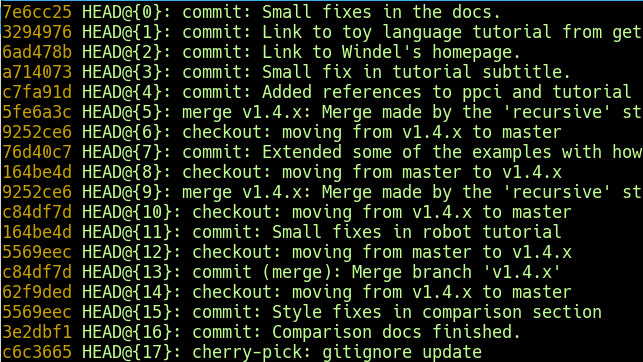
]


---
name: odrzavanje
layout: false
class: center, middle

# Održavanje repozitorijuma

---
layout: true

.section[[Održavanje](#sadrzaj)]

---

# Održavanje repozitorijuma

- Git ima jednostavne mehanizme skladištenja istorije bazirane na *snap-shot*
  modelu. Čuvaju se celi fajlovi u obliku *BLOB* objekata.
- Inicijalno se *BLOB*-ovi čuvaju kao zasebni fajlovi u `.git/objects` folderu.
- Zbog toga, posebno kod velikih fajlova, repozitorijum može vremenom da
  značajno poraste. U ovim situacijama Git omogućava “pakovanje” objekata
  upotrebom efikasnog delta algoritma. Pronalaze se slični BLOB-ovi između kojih
  se izračuvana razlika (delta).
- Da bi se obavilo pakovanje objekata, i uklanjanje "visećih" objekata (*dangling
  objects*), dovoljno je pozvati:
  ```
  $ git gc
  ```
  
.footer[
  Detalje možete naći na
  http://schacon.github.com/git/user-manual.html#pack-files
]

---
name: modeli
layout: false
class: center, middle

# Modeli grananja

---
layout: true

.section[[Modeli](#sadrzaj)]

---

# Modeli grananja (*branching models*)


- Konvenciju imenovanja grana i proces koji opisuje način njihovog korišćenja.
- Trivijalan model grananja koristi samo `master` granu.
- Nešto složeniji koristi granu za razvoj (`develop`) i `master` granu na koju se
  vrši spajanje kada procenimo da imamo stabilnu verziju.
- Kod razvoja složenog softvera gde imamo više verzija koje moramo održavati
  potreban je i nešto složeniji model.
- Jedan od najpopularnijih modela grananja se naziva `GitFlow`.ref[1].

.footer[
   1. http://nvie.com/posts/a-successful-git-branching-model/
]

---

# *Feature branches*

- Način razvoja softvera gde se za svaku funkcionalnost softvera (*feature*)
  kreira nova grana.
- Prednosti:
  - izolacija koda za određenu funkcionalnost,
  - loše implementirana funkcionalnost se lako poništava,
  - jednostavniji uvid u progres po funkcionalnostima.
- Mane:
  - kod funkcionanosti koja se dugo razvija odlaže se integracija što može
    dovesti do kasnijih problema.

---

# *GitFlow* model

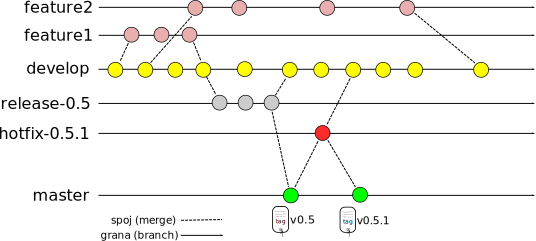

.footer[
  http://nvie.com/posts/a-successful-git-branching-model/
]


---

# Modifikovani *GitFlow* model


---
name: praksa
layout: false
class: center, middle

# Preporučena praksa

---
layout: true

.section[[Praksa](#sadrzaj)]

---

## Preporučena praksa u radu sa granama

- Čest `commit` vs. čista istorija
- Lokalne (privatne) grane - čest *commit* za beleženje međuverzija (mogućnost
  *undo*-a).
- Kasnije spajanje na javnu granu (npr. `master` ili `develop`) uz integraciju
  *commit*-a (*squash*).


.footer[
  [Benjamin Sandofsky, Understanding the Git Workflow](http://sandofsky.com/blog/git-workflow.html)
]

---

# Kratkotrajne grane

Kreiramo i prelazimo na novu granu:
```
$ git checkout -b private_feature_branch
```

Vršimo izmene, ažuriramo indeks:
```
$ git add ...
```

Beležimo promenu:
```
$ git commit -am "WIP"
```

.footer[
  [Benjamin Sandofsky, Understanding the Git Workflow](http://sandofsky.com/blog/git-workflow.html)
]

---

# Kratkotrajne grane

Kada završimo sa izmenama, prelazimo na master granu:
```
$ git checkout master
```

Spajamo granu uz integraciju svih *commit*-a
```
$ git merge --squash private_feature_branch
```

`Commit` - zadajemo detaljnu log poruku:
```
$ git commit -v
```

.footer[
  [Benjamin Sandofsky, Understanding the Git Workflow](http://sandofsky.com/blog/git-workflow.html)
]


---

# Dugotrajne grane

.medium[

Kada jedan *squash commit* ne bi bio adekvatan jer se grana duže razvijala pa je
potrebno svesti na više *commit*-a. Na *feature* grani radimo sređivanje
interaktivnim *rebase*-om
```
$ git rebase --interactive master
```

ili kreiramo granu za sređivanje promena:
```
# Prelazimo na master
$ git checkout master
# Kreiramo granu za sređivanje sa mastera
$ git checkout -b cleaned_up_branch
# Spajamo i integrišemo sve promene sa privatne grane
$ git merge --squash private_feature_branch
# Resetujemo indeks da bi dobili čistu situaciju
# sa svim izmenama koje su bile na privatnoj grani u radnoj kopiji.
$ git reset
```

Posle ovoga možemo obaviti standardno interaktivno ažuriranje indeksa i
*commit*-e.

]

.footer[
  [Benjamin Sandofsky, Understanding the Git Workflow](http://sandofsky.com/blog/git-workflow.html)
]

---

## Upotreba *Subversion* repozitorijuma

Git je moguće koristiti i sa *Subversion* repozitorijumom.

```
# Kloniranje svn repozitorijuma standardnog layout-a (trunk, branches, tags)
$ git svn clone -s https://..../
# Izmena fajlova + commit (može više puta)
# Preuzimanje promena sa svn-a i rebase lokalnih promena
$ git svn rebase
# Slanje izmena na svn repo
$ git svn dcommit
```

---

# *Subversion* i lokalne grane

Moguće je kreirati i grane na svn repozitorijumu i povezati ih sa
lokalnim

```
$ git checkout -b mojagrana
# Izmene fajlova
$ git commit -m "Neka izmena"
# Kreiranje grane na svn-u (mora se biti online, radi se samo jednom)
$ git svn branch mojagrana
# Povezivanje lokalne i svn grane (radi se samo jednom)
$ git branch --set-upstream mojagrana remotes/mojagrana
# Slanje promena
$ git svn dcommit
```


---
name: implementacija
class: center, middle
layout: false

# Implementacija

---
layout: true

.section[[Implementacija](#sadrzaj)]

---

# Git repozitorijum

- **Objektna baza**: Jednostavan model repozitorijuma baziran na mapama (parovi
  ključ-vrednost).
- Ključevi su **SHA1 heš sadržaja** koji se čuva + hedera.
- **Tri vrste objekata/vrednosti**. Sadržaj se komprimuje pomoću *zlib* biblioteke.
- Reference - *pokazivači* na određene objekte u repozitorijumu.
- Repozitorijum se nalazi u **.git** direktorijumu unutar direktorijuma gde je
    izvršena inicijalizacija sa `git init` komandom (videti u nastavku).

---

# Vrste git objekata

Repozitorijum je objektna baza gde postoje tri vrste objekata:

- **Blob:** Niz bajtova bez semantike. Najčešće služi za opis sadržaja fajla.
- **Stablo(Tree):** Čuva niz referenci na blobove i druga podstabla zajedno sa
  meta-podacima kao što su: naziv fajla, mod i sl.
- **Commit:** "Pokazivač" na stablo koje opisuje kako je projekat izgledao u
  trenutku *commit*-a. Osim toga sadrži niz meta-informacija kao što su autor,
  vreme nastanka, pokazivače na prethodne *commit*-e i dr.


---

# Vrste git objekata

- Svi objekti su smešteni na isti način u `.git/objects` direktorijumu. Prva dva
  karaktera *SHA1* heša čine naziv poddirektorijuma dok preostalih 38 čini ime
  fajla.
- Na primer:
  `.git/obects/bb/82d56602c51c7998911b2d07e84e25a942a028`
- Gotovo sve Git operacije se baziraju na manipulaciji sa strukturom koja se
  sastoji od objekata čiji tip je jedan od navedenih.
  
---

# BLOB

Niz bajtova bez semantike i metapodataka. Najčešće služi za
opis sadržaja fajla.

```java
blob 107\0
class MainClass {
  static void main(int argc, String[] argv) {
    System.out.println("Hello World!");
  }
}
```
.center[

]

---

# *Tree*

- Čuva niz referenci na blobove i druga podstabla zajedno sa meta-podacima kao
  što su: naziv fajla, mod i sl.
- Rekurzivne reference na druga stabla.
- Struktura tree objekta:

  ```
  tree 64\0
  100644 blob 8e0462460e55357686a844cfd27564ab5a6055a6 README
  040000 tree 1d6a41c11d3557faae7522bc2af7042e8723e63a src
  ```
.center[
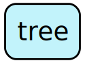
]


---

# *Commit*

- Sadrži informacije o trajnoj zabelešci (*commit*): referenca na stablo
  (*tree*), autor, osobu koja je kreirala zabelešku (*commiter*), datum i vreme
  nastanka kao i vezu prema pretodnim zbeleškama.

Struktura commit objekta:
```
commit 195\0
tree c7984074ae6aae0bb8b087ca0a5bd6026b108528
author Igor Dejanovic <igor.dejanovic@gmail.com> 1350920069 +0200
committer Igor Dejanovic <igor.dejanovic@gmail.com> 1350920069 +0200
Prvi commit.
```
.center[

]


---

# Prvi *commit*


.center[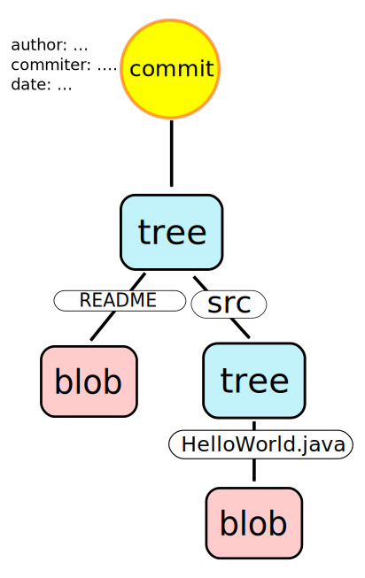]

---

# Drugi *commit*

.center[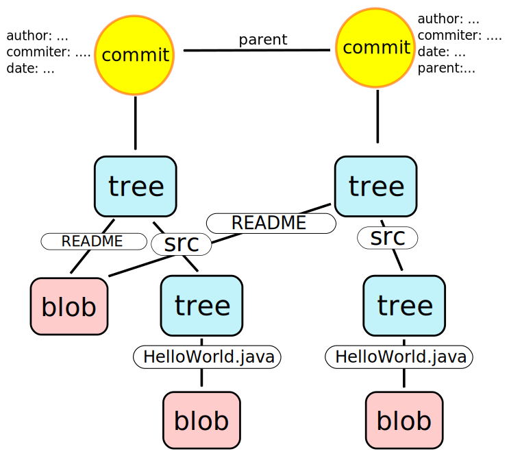]

---

# Reference

- Pokazivači na objekte u git repozitorijumu (najčešće *commit*-e).
- Smeštene u `.git/refs` direktorijumu.
- Dele se na:
  - **glave (heads)** koje predstavljaju pokazivač na poslednji *commit* sa grane.
  - **oznake (tags)** koji predstavljaju obeleživač/marker *commit*-a koji je, na
    neki način, poseban. Na primer, možemo označiti određenu verziju projekta.
- Specijalna referenca `HEAD` pokazuje na glavu koja je tekuća čime označava granu
  na kojoj se radna kopija trenutno nalazi. Smeštena je u `.git/HEAD` fajlu.
- Navode se prema putanji u `refs` folderu (npr. `refs/heads/master`).

---

# Git repozitorijum sa objektima i referencama

.center[]

---


# Literatura

- Scott Chacon, Ben Straub: *Pro Git*, Apress, 2014.
  Dostupna na: https://git-scm.com/book/en/v2
- Git dokumentacija - https://git-scm.com/doc


