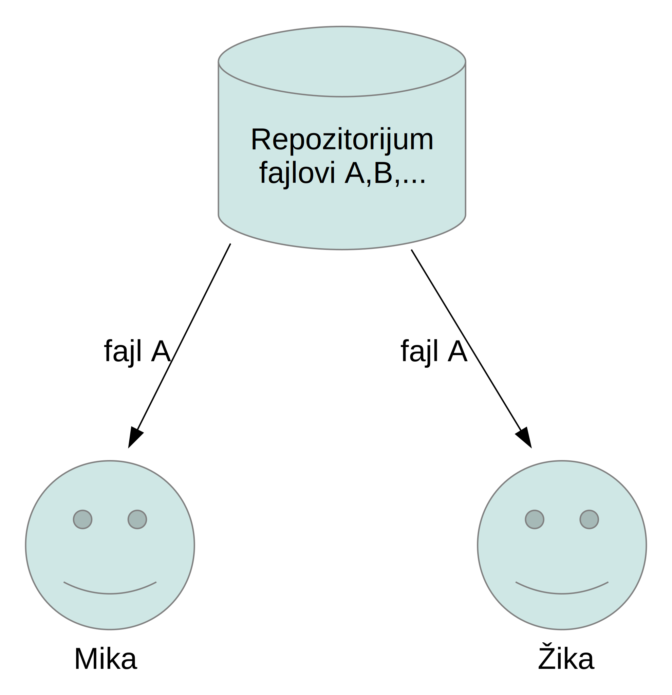
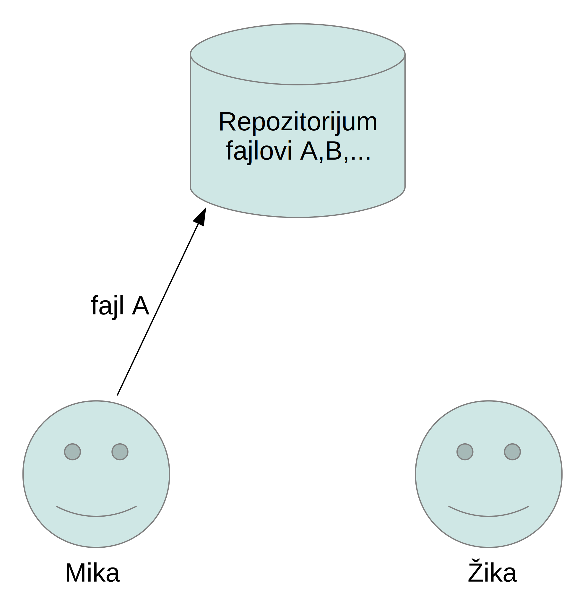
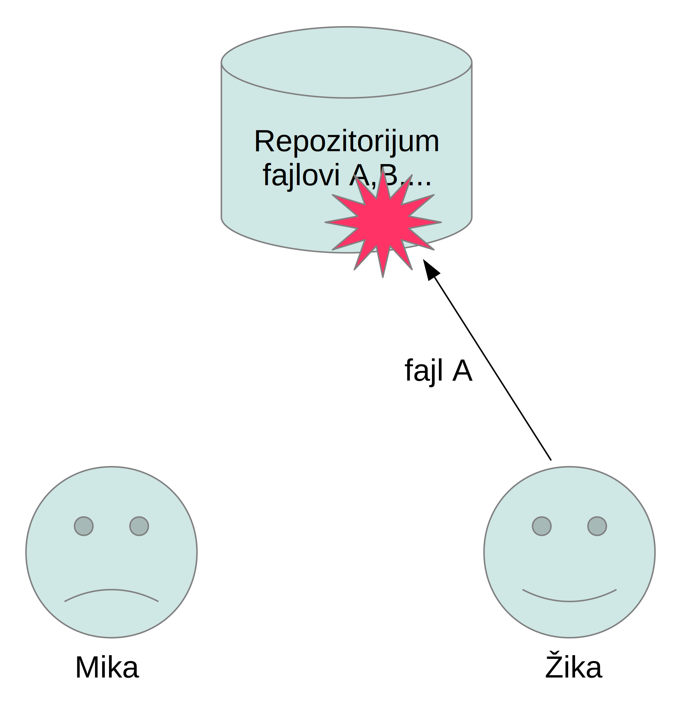
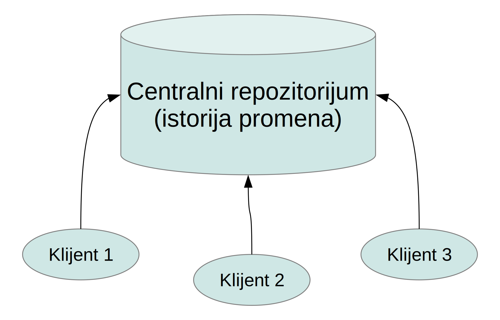
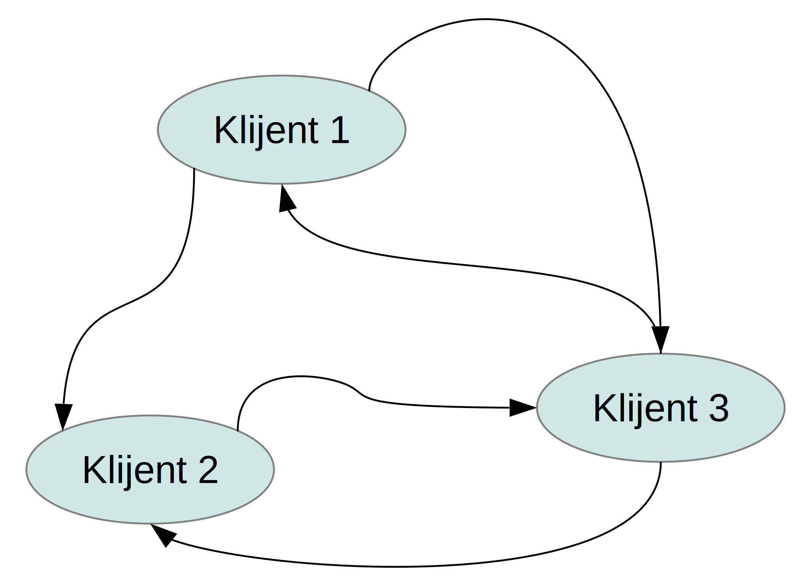
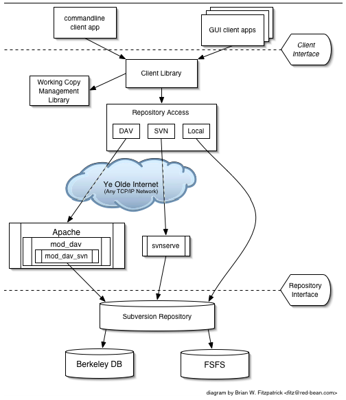
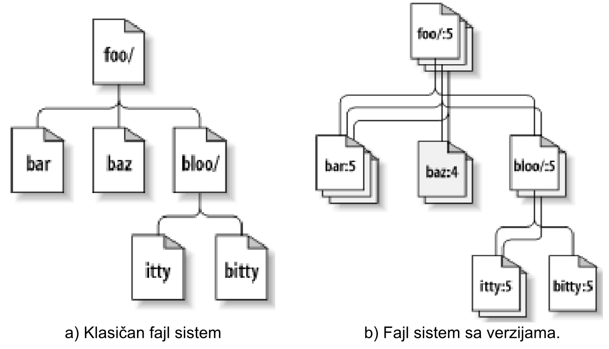
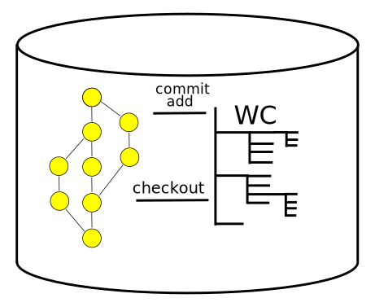
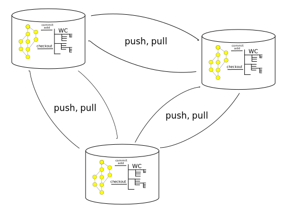

class: center, middle

# Sistemi za kontrolu verzija
## *Version Control Systems - VCS*

.author[ [Igor Dejanović](http://igordejanovic.net/) ]

.small[[Fakultet tehničkih nauka u Novom Sadu](http://ftn.uns.ac.rs/)]  
.small[[Katedra za informatiku](http://informatika.ftn.uns.ac.rs/)]

.created[{{now|dtformat("%d.%m.%Y u %H:%M")}}]

---

name: sadrzaj

# Sadržaj

- [Problemi, podela i osobine](#problemi)
- [Centralizovani](#centralizovani)
- [Distribuirani](#distribuirani)

---
name: pregled
class: center, middle

# Problemi, podela i osobine

---
layout: true

.section[[Problemi](#sadrzaj)]

---

## Problem sa konkurentnim izmenama

- Konkurentni razvoj podrazumeva da različiti ljudi menjaju iste resurse u isto
  vreme.
- Kako očuvati sve izmene? Kako ih spojiti na konzistentan način?
- Poseban problem – čuvanje istorije promena.

---

## Problem sa konkurentnim izmenama

.center[Mika i Žika preuzimaju fajl A iz deljenog repozitorijuma]

---

## Problem sa konkurentnim izmenama

.center[Mika vraća izmenjenu verziju fajla A]

---

## Problem sa konkurentnim izmenama

.center[Žika vraća izmenjenu verziju i preko Mikine]
.center[Mikina izmena je izgubljena]

---

## Kontrola verzija - *Version Control*

- Kontrola verzija (eng. *Version Control*) je opšti naziv za aktivnost praćenja
  promena i spajanja konkurentnih promena nad artifaktima od interesa za
  posmatranu aktivnost, uz očuvanje istorije.
- U slučaju razvoja softvera artifakti koji su predmet praćenja mogu biti bilo
  koji digitalni sadržaji koji su deo softverskog projekta: modeli, programski
  kod, dokumentacija, konfiguracioni fajlovi, multimedijalni sadržaji i sl.
- Predstavlja deo šire discipline pod nazivom upravljanje konfiguracijom
  softvera (eng. *Software Configuration Management* - SCM ). SCM je inženjerska
  disciplina koja omogućava kontrolisano praćenje i evoluciju softverskog
  proizvoda.
  
---

## Sistem za kontrolu verzija

- Sistem za kontrolu verzija (*Version Control System - VCS*) upravlja promenama
  nad digitalnim artifaktima (najčešće fajlovima i folderima).
- Daje *uvid u sve promene* koje su učinjene nad artifaktima koji su predmet
  kontrole verzija sa svim relevantnim metapodacima kao što su:

  - Ko je načinio promenu?
  - Kada je promena učinjena?
  - Šta je tom prilikom promenjeno i na koji način?
  - Nad kojom verzijom je promena učinjena, odnosno koje
  - promene su prethodile?
  - ...

- Omogućava *vraćanje na verziju iz prošlosti* i kreiranje *alternativnih
  tokova* razvoja/varijanti.

---

## Modeli upravljanja konkurentnim promenama

.medium[
- Pesimistički (*Lock-Modify-Unlock*)

  - Konkurentne izmene se izbegavaju zaključavanjem
  - Primena moguća samo kod centralizovanih sistema
  - Mane:
  
    - Smanjena "propusnost" sistema – posebno izraženo kod projekata sa većim
      brojem učesnika
    - Sindrom "otišao na ručak"
  

- Optimistički (*Copy-Modify-Merge*)

  - Konkurentne promene se udružuju naknadno (operacija *Merge*).
  - Visoka propusnost – svaki učesnik može da ažurira proizvoljan artifakt.
  - Mane:
  
    - Konkurentne promene mogu biti u konfliktu što se razrešava prilikom
      operacije spajanja.
    - Kod proizvoljnih binarnih fajlova gde semantika sadržaja nije poznata
      alatu ovaj pristup ne može da se koristi.
]
  
---

## Osnovni koncepti

- Promena (*Change/Delta/Patch*)
- Skup promena (*ChangeSet*)
- Repozitorijum
- Radna stablo/kopija (*Working Tree/Copy*)

---

## Postojeće arhitekture

.medium[
- Centralizovana ili client-server arhitektura.

  - Sva istorija je u repozitorijumu centralnog servera. Klijenti imaju samo
    tekuću verziju.
    

- Distribuirana ili peer-to-peer arhitektura.

  - Svaki klijent ima punu istoriju izmena.
  

]

---

## Centralizovani sistemi za kontrolu verzija

- Klijent-server arhitektura.
- Prednosti:

  - Moguće je uspostaviti strožiju kontrolu.
  - Bolji uvid u tekuće stanje projekta.

- Mane:

  - Sve promene se vide na centralnom serveru što obeshrabuje programere na
    eksperimentisanje.
  - Jedna tačka otkaza.
  - Lošija skalabilnost u poređenju sa distribuiranim.
  - Kod offline rada imamo pojavu velikih i nefokusiranih promena (*commit*-a).

---

## Distribuirani sistemi za kontrolu verzija

.medium[
- Sistemi koji su implementirani u skladu sa distribuiranom arhitekturom
  (*peer-to-peer*) nazivaju se distribuiranim sistemima za kontrolu verzija
  (*Distributed Version Control Systems - DVCS*).

- Prednosti:

  - Offline rad. Kreiranje manjih, fokusiranih promena/*commit*-a.
  - Jednostavno kreiranje repozitorijuma i eksperimentisanje.
  - Jednostavno grananje – svaki repozitorijum je grana razvoja.
  - Jednostavno kreiranje podtimova.
  - Jednostavno baziranje projekta na već postojećem (eng. *forking*).
  - Odlična skalabilnost – primer: linux kernel.
  - Nov način rada – društveno kodiranje (eng. *social coding*). Videti
      sajtove
      [github.com](https://github.com/), [gitlab.org](https://about.gitlab.com/)
      i [bitbucket.org](https://bitbucket.org/)
]
  
---
  
## Osnovne VCS operacije

- *Clone* kod DVCS, *cteckout* kod centralizovanih – Kreiranje radne kopije.
- *Commit* – Registrovanje nove promene.
- *Update* – Preuzimanje tuđih promena
- *Pull/Push* kod DVCS – Prijem/slanje promena iz/u udaljenih repozitorijuma.

---
name: Centralizovani sistemi
class: center, middle
layout: false

# Centralizovani sistemi

---
layout: true

.section[[Centralizovani](#sadrzaj)]

---

## Najpoznatiji predstavnici

- Subversion – http://subversion.apache.org/
- CVS – http://savannah.nongnu.org/projects/cvs
- Perforce – http://www.perforce.com/

---

## Šta je Subversion?

- Open-source centralizovani VCS sistem nastao kao zamena za vremešni CVS.
- Repozitorijum u kojoj se čuva celokupna istorija projekta se nalazi na
  centralnom serveru.
- Programeri pristupaju određenim verzijama projekta upotrebom SVN klijenata.
- Postoji više klijenata u upotrebi: *svn*, *TortoiseSVN*, *Subclipse*,
  *Subversive*...
- Svaki član tima može izabrati sa kojim će klijentom da radi.
- Može koristiti i više klijenata ukoliko želi.

---

## Subversion arhitektura

.footer[
  B. Collins-Sussman, B. W. Fitzpatrick, and C. M. Pilato, *Version Control
  with Subversion*, For Subversion 1.7.
]

---

## Model Subversion repozitorijuma

.lcol[
- Repozitorijum je modelovan kao fajl sistem sa verzijama.
- Početna verzija je 0 i fajl sistem je prazan.
- Operacije nad fajl sistemom su ACID
  (*Atomicity-Consistency-Isolation-Durability*) operacije.
- Svaka uspešna izmena fajl sistema uvećava verziju za 1.
]
.rcol[

]

.footer[
  B. Collins-Sussman, B. W. Fitzpatrick, and C. M. Pilato, *Version Control
  with Subversion*, For Subversion 1.7.
]

---
name: Distribuirani sistemi za kontrolu verzija
class: center, middle
layout: false

# Distribuirani sistemi za kontrolu verzija

---
layout: true

.section[[Distribuirani](#sadrzaj)]

---

## Distribuirani sistemi - najpoznatiji predstavnici

- Git – http://git-scm.com/
- Mercurial – http://mercurial.selenic.com/
- Bazzar – http://bazaar.canonical.com/

---

## DVCS repozitorijum

---

## Komunikacija između repozitorijuma

---

## Git

- Razvoj započeo Linus Torvalds, u aprilu 2005. godine, posle promene politike
  licenciranja BitKeeper-a koji je do tada korišćen za razvoj linux kernela.
- Izuzetno brz i skalabilan.
- Pisan najvećim delom u C-u, ali su delovi pisani u Perl-u, bash-u itd.
- Kriptografska autentifikacija istorije promena.
- Problemi sa portom na Windows platformu. Ali to je sada manje-više rešeno.
- Ne prati fajlove već sadržaj. Izmene se eksplicitno dodaju pre commit-a.
- Repozitorijum je potrebno povremeno “očistiti”.

---

## Mercurial

- Brz, skalabilan i portabilan.
- Pisan najvećim delom u Python-u sa kritičnim delovima napisanim u C-u.
- Jednostavan za korišćenje. Komande po uzoru na subversion.
- Jedan izvšni fajl proširiv putem ekstenzija.
- Repozitorijum je aditivne prirode. Nije promenjiv i nije potrebno čišćenje kao
  kod git-a. Veličina repozitorijuma je uvek minimalna.
- Problematičan kod velikih fajlova.

---

## Bazaar

- Za sada najsporiji od “velike trojke”.
- Pisan najvećim delom u Python-u sa delovima napisanim u C-u.
- Podržan od strane Canonical-a.
- Direktna podrška za različite procese.
- Praćenje naziva direktorijuma i fajlova. Jaka podrška za promene imena i
  premeštanje fajlova.

