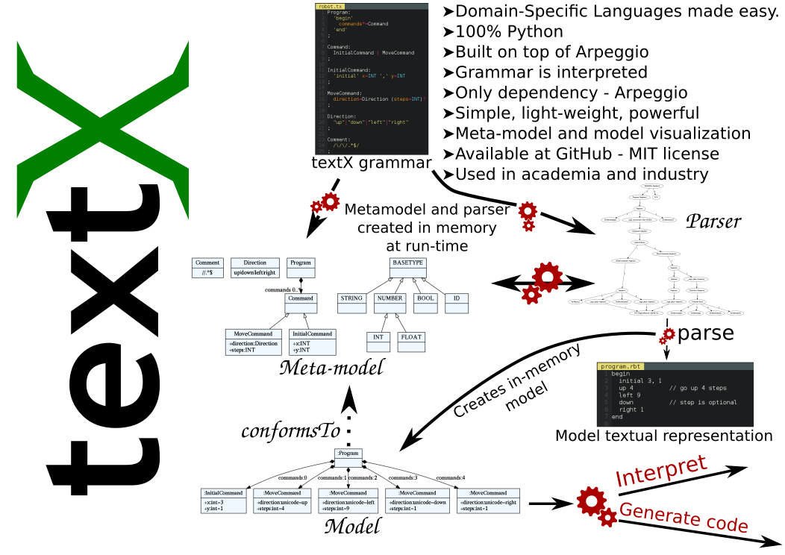
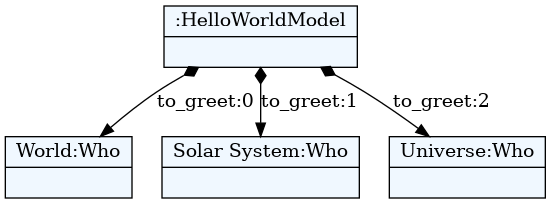
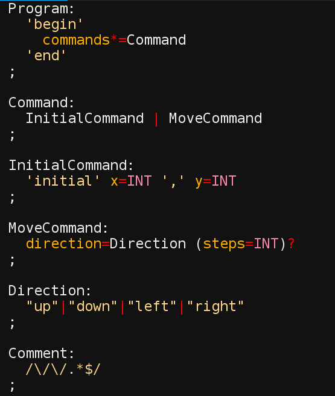
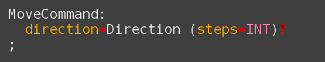




## Osnovne osobine

- 100% Python kod
- MIT licenca
- Istovremeno definisanje gramatike i meta-modela -
  inspirisan [Xtext](https://eclipse.org/Xtext/)
- Automatska konstrukcija modela - podrška za razrešavane referenci
- Podrška za veze tipa celina-deo
- Kontrola parsiranja (*whitespaces, case, keywords*...)
- Postprocesiranje objekata modela ili celog modela
- Modularizacija gramatika - import
- Vizualizacija modela i meta-modela 
- Dokumentacija i tutorijali dostupni na http://igordejanovic.net/textX/

---



---

## Instalacija

- Sa PyPI

```
$ pip install textX
Collecting textX
  Downloading textX-0.4.2.tar.gz
Collecting Arpeggio (from textX)
  Downloading Arpeggio-1.2.1.tar.gz
Installing collected packages: Arpeggio, textX
Building wheels for collected packages: textx, Arpeggio
  Running setup.py bdist_wheel for textx
  Stored in directory: /home/igor/.cache/pip/wheels/b7/d9/...
  Running setup.py bdist_wheel for Arpeggio
  Stored in directory: /home/igor/.cache/pip/wheels/31/0c/...
Successfully built textx Arpeggio
Installing collected packages: Arpeggio, textx
Successfully installed Arpeggio-1.2.1 textX-0.4.2
```

---

## Instalacija razvojne verzije

```
$ pip install https://github.com/igordejanovic/textX/archive/master.zip
Collecting https://github.com/igordejanovic/textX/archive/master.zip
  Downloading https://github.com/igordejanovic/textX/archive/master.zip
     - 577kB 379kB/s
Collecting Arpeggio (from textX==0.4.2)
Installing collected packages: Arpeggio, textX
  Running setup.py install for textX
Successfully installed Arpeggio-1.2.1 textX-0.4.2
```

---

## Gramatika = meta-model + konkretna sintaksa

```
HelloWorldModel:
  'hello' to_greet+=Who[',']
;

Who:
  name = /[^,]*/
;
```

```python
from textx import metamodel_from_file
hello_meta = metamodel_from_file('hello.tx')
```


---

## Model = program

```
hello World, Solar System, Universe
```
          


---
          
## Parsiranje - instanciranje modela

```python
example_hello_model = hello_meta.model_from_file('example.hello')
```



- Model je graf Python objekata čija struktura je u skladu sa gramatikom (npr.
  *HelloWorldModel* objekat sadrži Python listu *to_greet*).
- Model možemo dalje interpretirati, analizirati, generisati kod...

---

## Provera i vizualizacija meta-modela

- textX će pri parsiraju gramatike prijaviti sintaksne greške.
- Ako želimo možemo proveriti gramatiku u toku razvoja:

  ```
  $ textx check hello.tx
  Meta-model OK.
  ```
            
- U slučaju greške biće prijavljena tačna lokacija.

```
Error in meta-model file.
Expected 'abstract_rule_ref' at position (6, 9) => ':   name |*= /[^,]*/ '.
```
          
- ili vizualizovati

```
$ textx visualize hello.tx
Meta-model OK.
Generating 'hello.tx.dot' file for meta-model.
To convert to png run 'dot -Tpng -O hello.tx.dot'
$ dot -Tpng -O hello.tx.dot
```

---

## Robot primer

.lcol[



]

.rcol[
```
begin
    initial 3, 1
    up 4
    left 9
    down
    right 1
end
```
]

---

## Instanciranje meta-modela


```python
from textx import metamodel_from_file
robot_mm = metamodel_from_file('robot.tx')

```


---

## Parsiranje i instanciranje modela

```python
robot_model = robot_mm.model_from_file('program.rbt')
```
            
```
begin
    initial 3, 1
    up 4
    left 9
    down
    right 1
end
```
            

          
---

## Šta raditi sa modelom?

- Interpretiranje
- Generisanje koda
- Razne vrste analize i transformacije

---

## Interpretiranje Robot modela

```python
class Robot(object):

  def __init__(self):
    # Initial position is (0,0)
    self.x = 0
    self.y = 0

  def __str__(self):
    return "Robot position is {}, {}.".format(self.x, self.y)
```

---

## Interpretiranje Robot modela

```python
def interpret(self, model):

    # model is an instance of Program
    for c in model.commands:

        if c.__class__.__name__ == "InitialCommand":
            print("Setting position to: {}, {}".format(c.x, c.y))
            self.x = c.x
            self.y = c.y
        else:
            dir = c.direction
            print("Going {} for {} step(s).".format(dir, c.steps))

            move = {
                "up": (0, 1),
                "down": (0, -1),
                "left": (-1, 0),
                "right": (1, 0)
            }[dir]

            # Calculate new robot position
            self.x += c.steps * move[0]
            self.y += c.steps * move[1]

        print(self)
```
            
---

## Interpretacija Robot modela

```
robot = Robot()
robot.interpret(robot_model)
```

.lcol[

```
begin
    initial 3, 1
    up 4
    left 9
    down
    right 1
end
```
]

.rcol[

```
Setting position to: 3, 1
Robot position is 3, 1.
Going up for 4 step(s).
Robot position is 3, 5.
Going left for 9 step(s).
Robot position is -6, 5.
Going down for 0 step(s).
Robot position is -6, 5.
Going right for 1 step(s).
Robot position is -5, 5.
```

]

.wide[
**Problem:** Ako ne zadamo korak podrazumevano je 0 (textX definiše default
vrednosti za bazične tipove).
]

---

## Object processor

.lcol[
```python
def move_command_processor(move_cmd):

  if move_cmd.steps == 0:
    move_cmd.steps = 1
```
]

.rcol[

]

.wide[
Registracija procesora na meta-modelu:

```python
robot_mm.register_obj_processors({'MoveCommand': move_command_processor})
```
            
Sada se robot ponaša ispravno.
.medium[
```
Setting position to: 3, 1
Robot position is 3, 1.
Going up for 4 step(s).
Robot position is 3, 5.
Going left for 9 step(s).
Robot position is -6, 5.
Going down for 1 step(s).
Robot position is -6, 4.
Going right for 1 step(s).
Robot position is -5, 4.
```
]
]

---

## Workflow primer

- Referenciranje drugih objekata.
- https://github.com/igordejanovic/textX/tree/master/examples/workflow

---

## Generisanje koda - Entity primer

- Referenciranje drugih objekata.
- Upotreba obrađivača šablona (*Template Engines*) za generisanje koda.
- http://textx.readthedocs.io/en/latest/tutorials/entity/

---
## Izrada mini kompajlera - ppci

- [Windel Bouwman](http://www.windel.nl/)
- https://ppci.readthedocs.io/en/latest/howto/toy.html

---
class: center, middle

# Napredne tehnike - [pyFlies](https://github.com/igordejanovic/pyFlies)


---
class: center, middle

# IDE za textX - [textX-ninja](https://github.com/igordejanovic/textX-ninja)

---
class: center, middle

# Veče džeza i slobodnih formi - improvizacije
              

          



