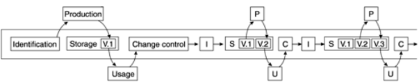



name: sadrzaj

## Sadržaj

- [Upravljanje konfiguracijom](#cm)
- [Upravljanje konfiguracijom softvera](#scm)

---
name: cm
class: center, middle

# Upravljanje konfiguracijom

---
layout: true

.section[[Uvod](#sadrzaj)]

---

## Upravljanje konfiguracijom

> Proces za uspostavu i održavanje konzistencije funkcionalnih i
> fizičkih osobina kao i performansi proizvoda u skladu sa zahtevima,
> dizajnom i operativnim informacijama tokom njegovog životnog
> ciklusa.ref[*].

.footer[
\* M. Handbook, *Configuration management guidance*, tech. rep., MIL-HDBK-61A
   (SE) Department of Defense–United States of America, 2001
]

---

## Upravljanje konfiguracijom

> Disciplina koja se bavi identifikacijom svih komponenti i njihovih
> međusobinih veza, u sistemu koji kontinualno evoluira, u cilju
> očuvanja integriteta, sledljivosti i kontrole promena u toku životnog
> ciklusa sistema.ref[*].

.footer[
\* Britanski standard BS 6488:1984 - *Code of practice for configuration
   management of computer-based systems*
]

---

## Upravljanje konfiguracijom

.medium[
> Upravljanje konfiguracijom predstavlja jedinstvenu
> identifikaciju, kontrolisano skladištenje, kontrolisanu izmenu i
> izveštavanje o statusu izabranih proizvoda, njihovih radnih vezija
> i komponenti za vreme životnog ciklusa sistema.ref[1].

  
> Upravljanje konfiguracijom softvera predstavlja kontrolu evolucije
> složenih softverskih sistema.ref[2].
]

.footer[

1. A. Hass, *Configuration management principles and practice*. Addison-Wesley
   Professional, 2003

1. J. Estublier, *Software configuration management: a roadmap*, in
   Proceedings of the conference on The future of Software engineering, pp.
   279–289, ACM, 2000
   
]

---

## Stavka konfiguracije (*Configuration Item*)

- Prema standardu ANSI/IEEE 1042-1987, stavka konfiguracije (*Configuration
  Item - CI* ili *Software Configuration Item*) predstavlja osnovnu jedinicu
  identifikacije i praćenja.
- Bilo koji artifakt nad kojim se može vršiti kontrola verzija, koji se može
  pratiti.
- Na primer, to može biti fajl ili direktorijum kod fajl baziranih sistema,
  objekti smešteni u objektno orijentisanim bazama podataka i sl.
- Gotovo svi sistemi za kontrolu verzija danas u upotrebi imaju fiksnu CI - a to
  je fajl.
- Možemo reći da je tekuće stanje projekta skup tekućih stanja svih stavki
  konfiguracije.
- Verzija fajla takođe se može posmatrati kao stavka konfiguracije.

---

## Stavka konfiguracije i promene - životni ciklus

- Stavka konfiguracije nastaje iz plana.
- Kasnije verzije nastaju kao proizvod zahteva za promenom.
- Zahtev za promenom nastaje na osnovu iskustva u toku korišćenja.

---

## Referentna verzija (*Baseline*)

- Referentna verzija može da znači sledeće:

  - Identifikacija tačnih verzija svih CI koji čine deo jednog izdanja.
  - Identifikacija tačnih verzija CI koje su odobrene da postanu deo sledećeg
    izdanja kroz ustanovljen proces revizije i odobravanja promena.

- Čini osnovu koja je predmet sledećih promena.
- U sistemima za upravljanje izvornim kodom najčešće se sprovodi kroz proces
  "označavanja" (eng. *Tagging*).
  
---

## Tradicionalna definicija CM-a

- Identifikacija konfiguracije (*Configuration Identification*)
- Upravljanje promenama (*Change Control*)
- Praćenje statusa (*Status Accounting*)
- Revizija i verifikacija (*Configuration Verification and Audit*)

---

## Struktura CM procesa

.footer[
Anne Mette Jonassen Hass, *Configuration Management Principles and Practice*,
Addison-Wesley Professional, 2003.
]

---

## Arhitektura CM sistema

---

## Identifikacija konfiguracije (*Configuration Identification*)

- Obezbeđivanje jedinstvene identifikacije za svaki artifakt koji je predmet
  praćenja.
- Najčešće su predmeti praćenja razne vrste fajlova: izvorni kod, binarni
  fajlovi, slike, dokumenta, konfiguracioni fajlovi itd.
- Identifikacija često podrazumeva i imenovanje direktorijuma i fajlova na
  smislen način koji će pojednostaviti praćenje.
- Artifakti praćenja ne moraju uvek biti fajlovi u fajl sistemu već mogu biti
  elementi u repozitorijumima koji nisu bazirani na fajl sistemu. Na primer,
  modeli u repozitorijumima modela ili dokumenti u sistemima za upravljanje
  dokumentima.

---

## Identifikacija u kontekstu

.medium[
- Proces identifikacije započinje u dva slučaja: prvobitno kreiranje stavke
  konfiguracije i pojava zahteva za promenom.
- Izlaz predstavljaju metapodaci za stavku konfiguracije.
- Svaka organizacija pravi svoju konvenciju jedinstvene identifikacije. Često je
  ova šema nametnuta alatima koji se koriste za CM.
- Pored identifikacije stavke konfiguracije potrebno je identifikovati i svaki
  zahtev za promenom kao i svaku novu verziju stavke konfiguracije.
]

---

## Upravljanje promenama (*Change Control*)

- Promene su neizbežne: ljudi prave greške, klijenti zahtevaju promene, radno
  okruženje proizvoda evoluira.
- Puna kontrola i upravljanje zahtevima za promenama i implementiranim promenama
  na osnovu zahteva.
  
---

## Upravljanje promenama u kontekstu

- Upravljanje promenama je inicirano događajem.
- Izlaz aktivnosti upravljanja promenama je dokumentovan događaj kao i zahtevi
  za promenama koji su rezultat tog događaja.

---

## Događaji

.medium[
- Upravljanje promenama je inicirano događajem. Događaj može da se posmatra i
  kao želja za promenom ali obično nije tako formulisan.
- Događaj može predstavljati i opservaciju da se desilo nešto neočekivano ili
  pogrešno tokom upotrebe stavke konfiguracije.
- Događaj može biti, na primer:

  - Loša formulacija uočena za vreme revizije dokumenta.
  - Greška u kodiranju uočena za vreme prolaska kroz programski kod.
  - Ideja za proširenje ili poboljšanje funkcionalnosti nastala
    od strane klijenta za vreme korišćenja proizvoda.
  - Greška pronađena za vreme integracionog testa.
  - Želja za poboljšanjem proizvoda kada je proizvod već isporučen i u fazi je
    aktivne upotrebe.
  - Upit osoblju za pomoć u vezi načina upotrebe proizvoda.
  - Prelazak na novu verziju korišćenih biblioteka i platformi koje nisu unazad
    kompatibilne sa prethodnim verzijama.

- Događaj se dokumentuje u obliku registracije događaja.
]

---

## Zahtevi za promenama (*Change Requests*)

- Zahtevi za promenama nastaju kao posledica registracije događaja.
- Neki zahtevi za promenama mogu biti planirani (na primer zahtevi nastali za
  vreme revizije dokumenta), a neki i ne (na primer zahtev klijenta za
  promenom).
- Zahtevi za promenama dalje prolaze kroz aktivnost identifikacije jer su
  predmet praćenja.
  
---

## Praćenje statusa (*Status Accounting*)

- Ova aktivnost obezbeđuje informacije potrebne za efikasno upravljanje razvojem
  i održavanjem proizvoda.
- Druge aktivnostim CM-a obezbeđuju potrebne podatke u vidu metapodataka o
  stavkama konfiguracije kao i informacije o promenama.
- Praćenje statusa omogućava ekstrakciju, uređenje i formatiranje informacija o
  stavkama konfiguracije i promenama na zahtevani način.

---

## Praćenje statusa u kontekstu

- Praćenje statusa i izveštavanje može se obaviti u bilo kom trenutku.
- Izlaz ove aktivnosti je izveštaj prema zadatim kriterijumima.

---

## Revizija i verifikacija (*Configuration Verification and Audit*)

- Osigurava da stavka konfiguracije koja se isporučuje odgovara postavljenim
  zahtevima i da je kompletna.
- Kompletnost podrazumeva i sve potrebne metapodatke koji omogućavaju kompletan
  uvid u istoriju promena koje su dovele do verzije koja se isporučuje.
- Ova aktivnost se najčešće posmatra kao deo procesa osiguranja kvaliteta.

---
name: scm
class: center, middle
layout: false

# Upravljanje konfiguracijom softvera
## Software Configuration Management (SCM)

---
layout: true

.section[[SCM](#sadrzaj)]

---

## Upravljanje konfiguracijom softvera

U kontekstu razvoja softvera upravljanje konfiguracijom se može posmatrati kroz
sledeće aktivnosti:

- Upravljanje izvornim kodom (*Source Code Management*)
- Upravljanje izgradnjom (*Build Engineering*)
- Upravljanje konfiguracijom okruženja (*Environment Configuration*)
- Upravljanje promenama (*Change Control*)
- Upravljanje izdanjima (*Release Management*)
- Upravljanje uvođenjem (*Deployment*)

---

## Upravljanje izvornim kodom (*Source Code Management*)

- Jedna od najvažnijih SCM disciplina.
- Bavi se:

  - Čuvanjem svih stavki konfiguracije koje učestvuju u izgradnji proizvoda.
  - Praćenjem promena nad stavkama konifiguracije i integracijom konkurentnih
    promena.
  - Kreiranjem i praćenjem alternativnih tokova razvoja.
  - Vraćanje i uvid u istorijske verzije proizvoljnih stakvi konfiguracije.

- Daje osnovu za izvođenje ostalih SCM aktivnosti.
- U tesnoj vezi je sa praćenjem defekata i zahteva koji su najčešće integrisani
  sa alatima i procesima upravljanja izvornim kodom.
  
---

## Osnovni principi upravljanje izvornim kodom

- Sav kôd je u sigurnom skladištu i ne može biti izgubljen.
- Konkurentne promene se jednostavno integrišu. Konflikti se jednostavno
  razrešavaju.
- Za kôd se vode beleške o značajnim trenucima razvoja (referentne verzije).
- Upravljanje varijantama mora biti jednostavno upotrebom grana.
- Kôd promenjen u jednoj varijanti (grani) može se lako preneti na drugu
  varijantu.
- U svakom trenutku imamo potpunu sledljivost i možemo dobiti informacije ko je,
  kada i zbog čega promenio izvorni kôd? Šta je tačno pri tome promenjeno?
- Možemo u svakom trenutku poništiti promenu.

---

## Upravljanje izgradnjom softvera (*Build Engineering*)

- Aktivnost usmerena na izgradnju izvršne verzije sofvera iz izvornog koda putem
  automatizovanih procedura na siguran i brz način.
- Bavi se identifikacijom zavisnosti u vreme kompajliranja i izvršavanja kao i
  drugih tehničkih uslova potrebnih za efikasnu izgradnju gotovog proizvoda.
- Izuzetno važna za agilne i iterativne metodologije.

---

## Principi upravljanja izgradnjom softvera

- Izgradnja je razumljiva i ponovljiva.
- Izvorni kôd i zavisnosti za kompajliranje se mogu lako odrediti.
- Uzrok nauspele izgradnje se može jednostavno ustanoviti i problem se može brzo
  otkloniti.
- Izgradnja mora biti potpuno automatizovana.
- Skripte za automatizovanju izgradnju moraju biti čitke i moraju se jednostavno
  održavati.

---

## Upravljanje konfiguracijom okruženja (*Environment Configuration*)

- Identifikacija i upravljanje zavisnostima proizvoda u vreme izvršavanja
  (*runtime dependencies*).
- Razvojno okruženje je često drugačije od produkcionog ili QA (*Quality
  Assurance*).
- Automatizacija upravljanja parametrima okruženja (npr. promenjive okruženja,
  konekcija sa bazom, povezivanje sa veb servisima).
- Značajno za aktivnost uvođenja (*deployment*).
- Ukoliko se odradi loše može dovesti do nesagledivih posledica.

---

## Upravljanje promenama (*Change Control*)

- Pored upravljanja izvornim kodom jedan od najznačajnijih aktivnosti u SCM.
- Kontrolisana izmena produkcionog okruženja (ili QA okruženja).
- Takođe esencijalna aktivnost za određivanje koje izdanje proizvoda će postati
  deo produkcionog okruženja.
- U velikim firmama često realizovana kroz odbor za upravljanje promenama
  (*Change Control Board*).
- Proces koji propisuje način razrešavanja zahteva za promenama (*Request for
  Change*).

---

## Principi upravljanje promenama

- Promene moraju biti planirane.
- Promene moraju biti razumljive uključujući i uticaj koji će imati na
  produkciono okruženje.
- Način odobravanja i autorizacija promena mora biti uspostavljena.
- Procedure za hitne izmene moraju biti propisane u slučajevima incidentnih
  situacija.
- Mora postojati jasna sledljivost za sve izvršene promene - Ko je promenu
  tražio? Ko je odobrio? Kada je promena izvršena nad produkcionim okruženjem?
  Koji je status promene?

---

## Upravljanje izdanjima (*Release Management*)

- Proces kreiranja finalnog proizvoda na osnovu izvršne verzije kreirane u
  procesu izgranje.
- Definiše standarde pakovanja i imenovanja (identifikacije) proizvoda.
- Sledljivost ka ugrađenim promenama i odobrenjima datih promena od strane CCB.

---

## Principi upravljanja izdanjima

- Izdanja se mogu identifikovati putem nepromenjivog identifikatora.
- Izdanja moraju biti zapakovana sa svim zavisnostima.
- Kreiranje izdanja mora biti automatizovano u cilju izbegavanja ljudske greške.
- Kreiranje izdanja mora biti brzo i pouzdano da bi se moglo koristiti kod
  agilnog i iterativnog razvoja.
- Mora postojati način verifikacije izdanja u cilju utvrđivanja gradivnih CI.
- Sadržaj izdanja mora biti dobro poznat, uključujući i vezu prema zahtevima.
- Mora postojati mehanizam izveštavanja o svim kreiranim izdanjima i njihovim
  sadržajima.

---

## Upravljanje uvođenjem (*Deployment*)

- Poslednja faza u SCM procesu.
- Uvođenje izdanja u produkciono okruženje.
- Takođe se bavi poništavanjem akcije (vraćanje na prethodnu verziju) u slučaju
  problema.
- Najčešće posao posebnog tima (*Operations Team*).
- Praćenje aktivne verzije izdanja i eventualnih neautorizovanih modifikacija
  produkcionog okruženja.

---

## Principi upravljanja uvođenjem

- Uvođenje izdanja (ili vraćanje na staro) mora biti pouzdano i jednostavno.
- Uvođenje izdanja (ili vraćanje na staro) mora kreirati dnevnik (log) svih
  promena.
- Samo autorizovano osoblje može vršiti ovu aktivnost.
- U mnogim organizacijama razdvojene nadležnosti između razvojnog tima i tima za
  uvođenje...
- ...ali poslednjih godina razvojni timovi preuzimaju posao uvođenja softvera
  koji razvijaju.
- Moraju postojati mehanizmi za otkrivanje neautorizovanih promena.
- Procedura za proveru verzije izdanja u produkciji (ili QA) mora biti jasno
  definisana.
- Proces uvođenja mora biti stalno revidiran i unapređivan.

---

## Literatura

1. M. Handbook, *Configuration management guidance*, tech. rep., MIL-HDBK-61A
   (SE) Department of Defense–United States of America, 2001.
1. A. Hass, *Configuration management principles and practice*. Addison-Wesley
   Professional, 2003.
1. J. Estublier, *Software configuration management: a roadmap*, in Proceedings
   of the conference on The future of Software engineering, pp. 279–289, ACM,
   2000.
1. R. Aiello and L. Sachs, *Configuration Management Best Practices: Practical
   Methods that Work in the Real World*. Addison-Wesley Professional, 1st
   ed., 2010.


