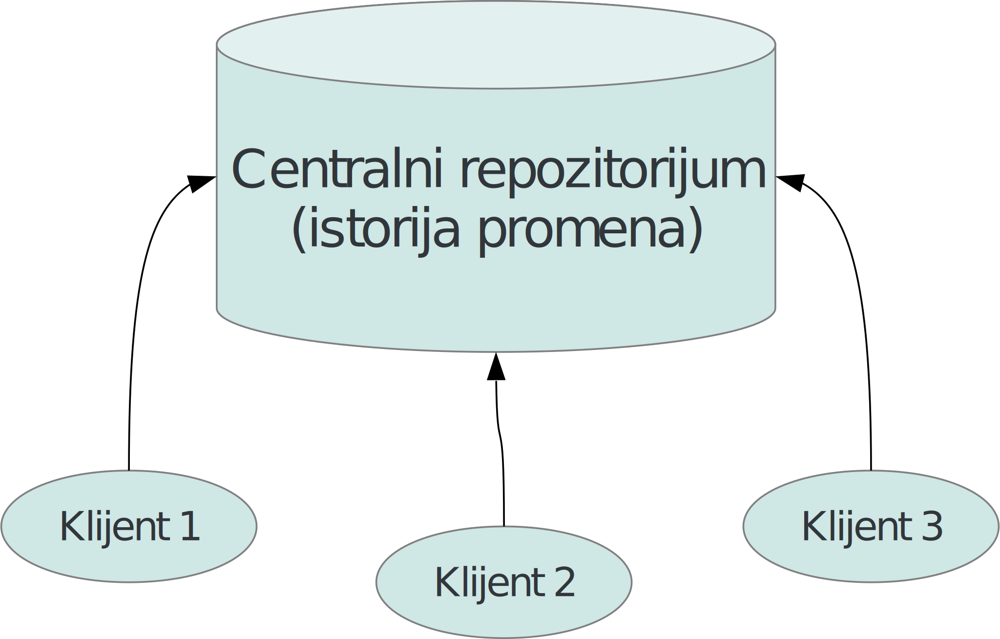
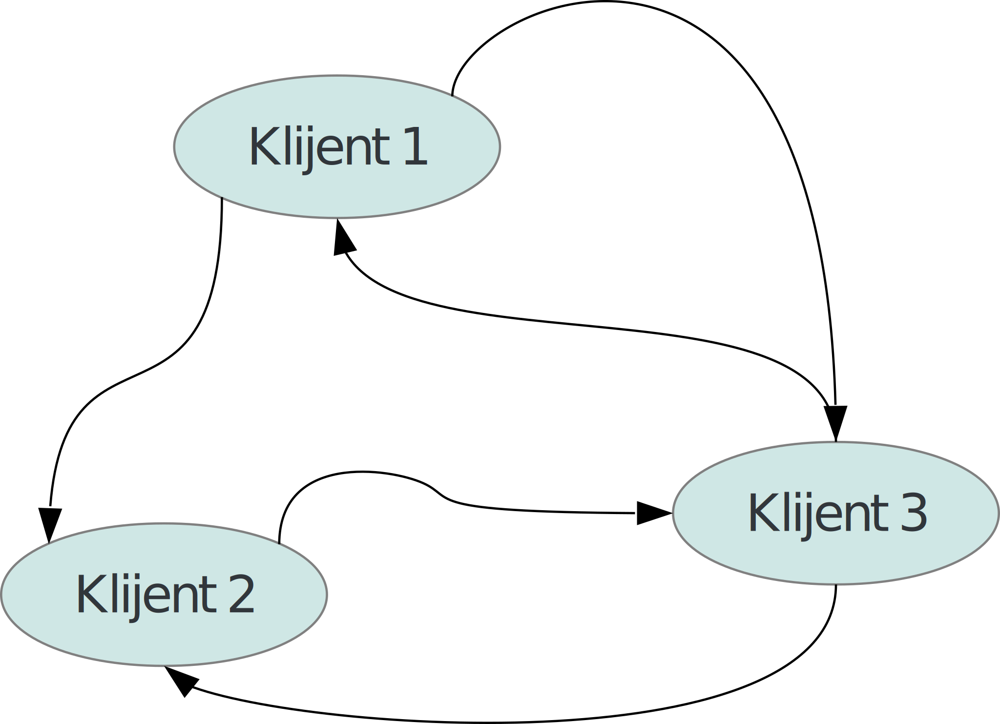
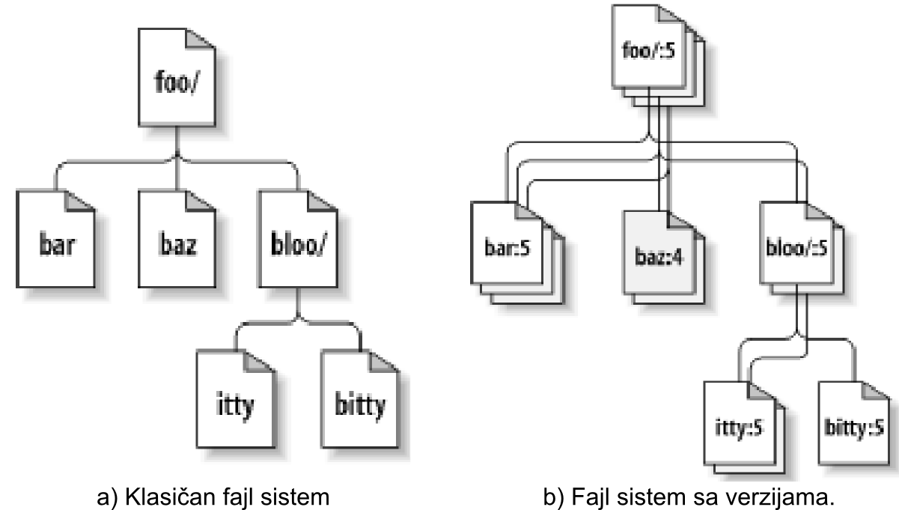
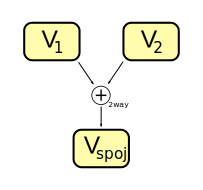
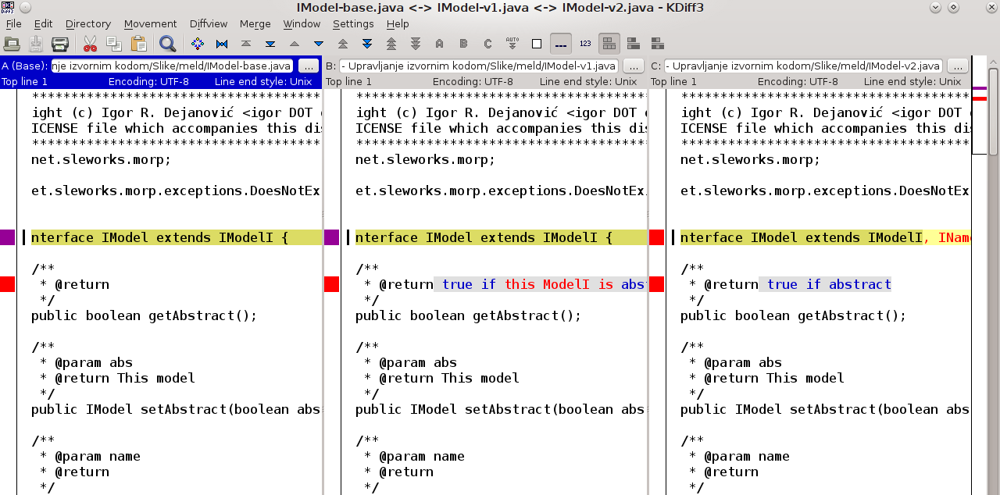
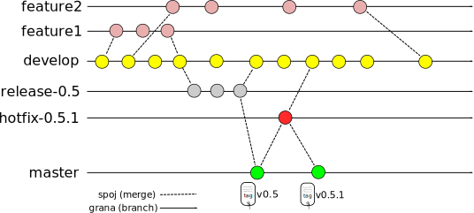



name: sadrzaj

# Sadržaj

- [Sistemi za kontrolu verzija](#vcs)
- [Osnovne definicije](#osnovne-definicije)
- [Arhitekture i modeli](#arhitekture-i-modeli)
- [Modeli repozitorijuma](#modeli-repozitorijuma)
- [*Merge* i *delta*](#merge-i-delta)
- [Modeli alternativnih tokova](#modeli-alternativnih-tokova)

---
name: pregled
class: center, middle

# Sistemi za kontrolu verzija

---
layout: true

.section[[Sistemi za kontrolu verzija](#sadrzaj)]

---

## Sistemi za kontrolu verzija

- Sistem za kontrolu verzija (eng. *Version Control System - VCS*) upravlja
  promenama nad digitalnim stavkama konfiguracije (*Configuration Item - CI*).
- Daje uvid u sve promene koje su učinjene nad artifaktima koji su predmet
  kontrole verzija sa svim relevantnim metapodacima kao što su:
  - Ko je načinio promenu?
  - Kada je promena učinjena?
  - Šta je tom prilikom promenjeno i na koji način?
  - Nad kojom verzijom je promena učinjena, odnosno koje promene su prethodile?
  - ...
- Omogućava vraćanje na verziju iz prošlosti i kreiranje alternativnih tokova
  razvoja/varijanti.

---
name: osnovne-definicije
class: center, middle
layout: false

# Osnovne definicije

---
layout: true

.section[[Osnovne definicije](#sadrzaj)]

---

## Verzija

- Verzija predstavlja stanje evoluirajuće stavke konfiguracije.
- Shvatanje verzije u današnjem kontekstu popularnih VCS-ova sa *snapshot*
  modelom istorije jeste da verzija predstavlja stanje projekta u određenom
  trenutku u istoriji, tj. verzija je *snapshot*.
- Svaka verzija u VCS-u mora biti identifikovana na jednoznačan način.

---

## Identifikator verzije

Identifikator verzije (IV) je objekat koji zadovoljava sledeća pravila:
- **jedinstvenost** – ne sme postojati dva istorijska objekta (verzije) unutar
  istog repozitorijuma sa istim identifikatorom,
- **jednostavnost** – IV bi, ako je moguće, trebao biti kratak i jednostavan
  za upotrebu (npr. iz korisničkog interfejsa),
- **stabilnost** – IV ne sme da se menja u vremenu i između različitih kopija
  istog repozitorijuma kod DVCS-ova.
  
---

## Identifikator verzije - dodatne napomene

- Kod centralizovanih sistema IV može biti numerička oznaka koja se uvećava sa
  svakom verzijom dok kod distribuiranih, zbog prirode arhitekture, moraju se
  koristiti drugi algoritmi.
- Najčešći algoritmi danas u upotrebi kod DVCS-ova su bazirani na kriptografskim
  jednosmernim heš funkcijama (npr. SHA1) nad sadržajem promene.
- S obzirom da vrednost heša nije pogodna za ručni unos neki DVCS-ovi
  pribegavaju uvođenju dodatnih jednostavnih oznaka verzija koje su lokalne
  prirode i automatski se mapiraju na globalne IV-ove. Na taj način obezbeđuje
  se jednostavnost upotrebe uz očuvanje globalne jedinstvenosti koju nudi IV
  baziran na hešu.
  
---

## Promena (*Change*)

- Definiše se najčešće kao niz operacija koje prevode stavku konfiguracije iz
  jedne verzije u drugu.
- Posmatra se na nivou jedne stavke konfiguracije (u kontekstu tekućih VCS-ova
  to je fajl).
- Skup promena (eng. *changeset - CS* ) predstavlja više logički povezanih promena
  koje prevode stanje projekta iz jedne verzije u drugu.
- Promena i skup promena se često nazivaju i *delta* ili *diff* (prema jednom od
  popularnijih algoritama i alata za određivanje razlike dva fajla).
  
  
---

## Radni prostor (*Workspace*) ili radna kopija (*Working Copy*)

- Privatni prostor u kojem programer vrši izmene.
- Najčešće skup foldera i fajlova na lokalnom računaru programera.
- Prostor je izolovan u smislu da ne utiče na ostale učesnike na projektu.
- Programer može preuzeti nove promene sa linije koju razivija na kontrolisan
  način.
- Često programeri imaju više radnih kopija na svom računaru (različiti projekti
  na kojima rade).

---

## Trajna zabeleška (*commit* operacija)

Programer može izmene iz lokalnog radnog prostora trajno zabeležiti u VCS
repozitorijumu i omogućiti ostalim učesnicima uvid u izmene putem *commit*
operacije.

---

## Alternativni tokovi razvoja

- Projekat u svakom trenutku može imati više aktivnih linija razvoja.
- Razvijamo verziju 2.0 našeg proizvoda li još uvek održavamo verziju 1.x.
- Naš proizvod radi na više operativnih sistema (Linux, Windows, Mac).
- Alternativni tokovi razvoja se u VCS sistemima realizuju upotrebom *grana*.

---
name: arhitekture-i-modeli
class: center, middle
layout: false

# Arhitekture i modeli

---
layout: true

.section[[Arhitekture i modeli](#sadrzaj)]

---

## Arhitekture sistema za kontrolu verzija

.medium[
- Centralizovana ili *client-server* arhitektura.
  - Sva istorija je u repozitorijumu centralnog servera. Klijenti imaju samo
    tekuću verziju.

- Distribuirana ili *peer-to-peer* arhitektura.
  - Svaki klijent ima punu istoriju izmena.
  

]

---
name: modeli-repozitorijuma
class: center, middle
layout: false

# Modeli repozitorijuma

---
layout: true

.section[[Modeli repozitorijuma](#sadrzaj)]

---

## Modeli VCS repozitorijuma

Najčešće korišćeni modeli VCS repozitorijuma su sledeći:
- Skup fajlova sa promenama.
- Virtuelni fajl sistem sa verzijama.
- Usmereni aciklični graf skupova promena.

---

## Skup fajlova sa promenama

- Korišćen u starijim sistemima za kontrolu verzija (SCCS, RCS, CVS).
- Svaki fajl je praćen nezavisno tako što se čuvala bazna verzija i promene koje
  su sledile.
- Verzija svakog fajla se nezavisno uvećavala i kreiranje verzije celog projekta
  se obavljalo označavanjem (\emph{tagging}) ili se, kao odrednica za
  identifikaciju verzije, koristio datum i vreme.
- Podrška za transakcije i obezbeđivanje konzistencije repozitorijuma najčešće
  nije postojala ili je bila na niskom nivou.
- Ovakav model je dugo godina bio u upotrebi zbog svoje jednostavnosti.

---
## Virtuelni fajl sistem sa verzijama

.medium[
- Model korišćen kod subversion (SVN) VCS-a.
- Koristi koncepte klasičnih fajl sistema - fajlove i foldere.
- Svaka promena nad SVN fajl sistemom rezultuje novom verzijom celokupnog fajl
  sistema tj. rezultuje novim *snapshot*-om.
- Ako posmatramo fajl sistem kao dvodimenzionalnu strukturu onda se fajl sistem
  sa verzijama može posmatrati trodimenzionalno pri čemu je treća dimenzija
  vreme (odnosno verzije).
]

.footnote[
.small[CollinsSussmanVersionControlwithSubversion2012]
]

---

## Virtuelni fajl sistem sa verzijama

- Operacije izmene su transakcione prirode sa ACID semantikom.
- Upotrebom klijentskog alata moguće je vratiti se na bilo koju verziju
  repozitorijuma u prošlosti.
- SVN koristi referenciranje delova stabla u određenim verzijama i čuvanje samo
  razlika koje su nastale u svakoj verziji.
- Kompleksnost operacije kopiranja i premeštanja fajlova i čitavih podstabala je
  *O(1)* i obavljaju se gotovo trenutno uz minimalan utrošak prostora (prostor
  potreban da se zabeleže reference na kopirani sadržaj).
- Operacije grananja (eng. *branching*) i označavanja (eng. *tagging*) se
  obavljaju operacijom kopiranja.
- Kopija podstabla će imati zajedničku istoriju sa originalom do trenutka
  kopiranja.
- Od trenutka kopiranja svaka kopija je nezavisna.
- Kopija podstabla predstavlja alternativni tok razvoja pa se može koristiti (i
  koristi se) kao grana razvoja.
  
---

## Usmereni aciklični graf skupova promena

- Usmereni aciklični graf (*Directed Acyclic Graph - DAG*) skupova promena.
- Najčešće se koristi kod distribuiranih sistema za kontrolu verzija. 
- Može se opisati kao graf čije su veze usmerene i kod koga ne postoje zatvorene
  jednosmerne putanje (acikličan je).
  
---

## Usmereni aciklični graf skupova promena
  

- U odnosu na opšti DAG korišćena struktura ima ograničenja u pogledu broja
  mogućih ulaznih veza u svaki čvor.
- Ograničenja su sledeća:
  - Postoji tačno jedan čvor koji nema ulaznih veza. Ovaj čvor predstavlja
    početnu verziju repozitorijuma.
  - Svi ostali čvorovi imaju 1 ulaznu vezu ukoliko predstavljaju obične verzije
    ili 2 ulazne veze ukoliko predstavljaju spoj (*merge*) dve prethodne verzije
    (čvorovi V5 i V7 na slici).
    
---

## Modeli upravljanja konkurentnim promenama

.medium[
- Pesimistički (*Lock-Modify-Unlock*)
  - Konkurentne izmene se izbegavaju zaključavanjem
  - Primena moguća samo kod centralizovanih sistema
  - Mane:
      - Smanjena propusnost sistema - posebno izraženo kod projekata sa većim
        brojem učesnika,
      - Sindrom "otišao na ručak".
- Optimistički (*Copy-Modify-Merge*)
  - Konkurentne promene se udružuju naknadno (operacija *Merge*).
  - Visoka propusnost - svaki učesnik može da ažurira proizvoljan artifakt
  - Mane:
      - Konkurentne promene mogu biti u konfliktu što se razrešava prilikom
        operacije spajanja.
      - Kod proizvoljnih binarnih fajlova gde semantika sadržaja nije poznata
        alatu ovaj pristup ne može da se koristi.
]

---

## Modelovanje istorije

- Bazirano na zatečenom stanju - eng. *Snapshot* ili *State-Based Versioning*.
- Bazirano na promenama - eng. *Changeset* ili *Change-Based Versioning*.
- Većina današnjih sistema za kontrolu verzija koriste SS model u komunikaciji
  sa korisnikom. Korisniku je repozitorijum predstavljen kao niz stanja projekta
  u određenim trenucima vremena.
- Zbog ušteda u prostoru, interno se koriste CS mehanizmi tj. čuvaju se samo
  razlike u odnosu na prethodna stanja.
  
  

---
name: merge-i-delta
class: center, middle
layout: false

# *Merge* i *delta*

---
layout: true

.section[[*Merge* i *delta*](#sadrzaj)]

---

## Spajanje konkurentnih promena - *Merge*

- Konkurentno razvijene promene pri korišćenju optimističkog pristupa moraju u
  nekom trenutku biti spojene.
- Podrazumeva kreiranje integralne verzije stavke konfiguracije od više
  nezavisnih verzija.
- Spajanje se sastoji od operacija poređenja, detekcije konflikata, razrešenja
  konflikata i spoja.
- Operacija razrešenja konflikata zahteva intervenciju korisnika.

---

## Operacija poređenja

- Određuje razlike između dva CI.
- Za različite vrste CI koriste se različiti algoritmi.
- Na primer, različiti algoritmi se koriste u zavisnosti od toga da li je CI
  tekstulane ili binarne prirode.
- Većina VCS-ova tretira binarne fajlove kao sadržaj bez semantike. Određeni
  komercijalni VCS-ovi pružaju podršku za neke popularne binarne fajl formate.

---

## Jedinica poređenja (*Unit of Comparison - UC*)

.medium[
- Esencijalne operacije kontrole verzija su izračunavanje razlike dva CI-a,
  njihova reprezentacija i vizualizacija na ljudski čitljiv način u cilju
  analize promena i razrešavanja eventualnih konflikata.
- Da bi analizirali algoritme za poređenje stavki konfiguracije potrebno je
  uvesti pojam *jedinice poređenja* (*Unit of Comparison - UC*).
- Jedinica poređenja definiše granulaciju poređenja.
- Prilikom poređenja, ukoliko ustanovimo da su dve jedinice poređenja različite
  na bilo kom delu, smatramo da su u celosti različite.
- Kod većine sistem za kontrolu verzija jedinica poređenja je linija teksta za
  tekstualne artifakte i ceo fajl za binarne.
]

---

## Određivanje, reprezentacija i čuvanje promene

- Naivan pristup - čuvanje svake verzije u celosti.
- Veliki gubitci prostora s obzirom da se dve sukcesivne verzije fajla u proseku
  razlikuju u svega 2%.
- Delta kodiranje (*Delta encoding*) - reprezentacija samo razlika između dve
  sukcesivne verzije.
- Propratni efekat je poboljšanje performansi jer je delta često dosta manja od
  originalne verzije a brzine procesora su za više redova veličina veće od
  brzina jedinica spoljne memorije.
- Razmena verzija između repozitorijuma - slanje delti.

---

## Algoritmi za određivanje promena u tekstualnim CI

.medium[
Izračunavanje delti obavlja se algoritmima koji se mogu podeliti u dve klase:
- **copy/insert** delta algoritmi:
    - Dobijanje odredišnog fajla od polaznog kreiranjem komandi kopiranja
      (*copy*) za delove koji su nepromenjeni i komandi dodavanja (*insert*) za
      delove koji su različiti.
    - Daje bolje performanse.

- **insert/delete** delta algoritmi:
    - Transformacija polaznog fajla u odredišni dodavanjem sadržaja koji postoji
      samo u odredišnom a ne i u polaznom (*insert*) i brisanjem sadržaja koji
      postoji samo u polaznom a ne i u odredišnom (*delete*).
    - Ova klasa algoritama je bazirana na algoritmima za određivanje najduže
      zajedničke podsekvence (*Longest Common Subsequence - LCS* – npr. Majersov
      algoritam). Ovaj algoritam se koristi u unix *diff* alatu.
    - Daje intuitivnije rezultate.
]

---

## diff
  

- *diff* je unix komanda koja će za dva ulazna tekstualne fajla odrediti razliku
  i enkodovati je upotrebom jednostavnog delta kodovanja prikazanog na slici.
- Delta predstavlja skup komandi za dodavanje i brisanje linija.

---

## patch

- Upotrebom ovako kodovane razlike, *patch* komandom možemo dobiti odredišni
  fajl od polaznog.
- Ova tehnika je osnova za izgradnju složenih VCS sistema.

---

## Dvostrano spajanje

---

## Trostrano spajanje

---

## Trostrano poređenje - primer

---

## Konflikti

- Javljaju se ukoliko je došlo do konkurentnih promena nad istim jedinicama
  poređenja.
- Neko mora da odluči koja izmenu treba zadržati a koju odbaciti.
- Ova operacija, koja zahteva manuelnu intervenciju, naziva se razrešavanje
  konflikata.

---

## Spajanje konkurentnih promena nad tekstualnim CI

- Kod tekstualnih CI, kod kojih je jedinica poređenja linija teksta, najčešće se
  spoj obavi automatski bez pojave konflikata.
- Konflikt se javlja ukoliko je došlo do paralelnih izmena istih linija teksta
  od strane više programera.
- Najčešće onaj koji poslednji pokušava da zabeleži svoju promenu u
  repozitorijumu treba da razreši konflikt.
  
---

## Spajanje konkurentnih promena nad binarnim CI

- Kod binarnih CI, jedinica poređenja je najčešće ceo CI tako da nije moguće
  automatizovati spajanje već se razrešenje konflikta vrši izborom jednog od
  konkurentno razvijenih verzija.
- Zbog toga se, kod binarnih fajlova, ažuriranje ne radi konkurentno.
- Jedan od mehanizama da se to obezbedi je korišćenje pesimističkog pristupa za
  binarne fajlove.
  

---
name: modeli-alternativnih-tokova
class: center, middle
layout: false

# Modeli alternativnih tokova

---
layout: true

.section[[Modeli alternativnih tokova](#sadrzaj)]

---

## Modeli alternativnih tokova ili grananja

- Odnosi se na organizaciju i upravljanje procesom kreiranja grana, trajnih
  zabeleški (*commit*) i operacije spoja (*merge*).
- Proces kreiranja grana podrazumeva imenovanje grana na određeni način i
  definisanje načina na koji se grane koriste.
- Često korišćeni termini su razvojne grane (*development branches*), grane za
  izdanja (*release branches*), grane za ispravke grešaka (*bugfix branches*) i
  sl.

---

## Primer modela grananja - *GitFlow*


