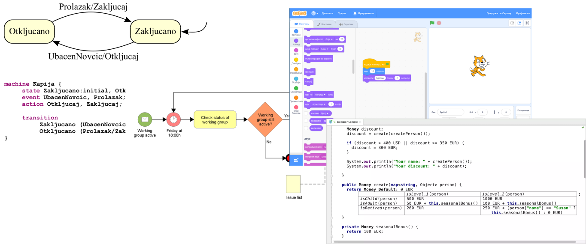
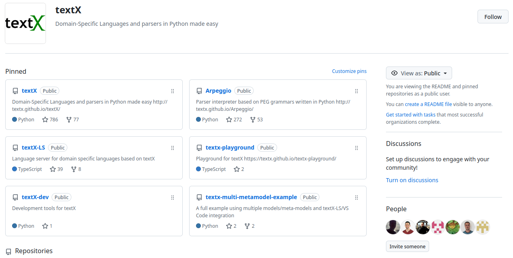
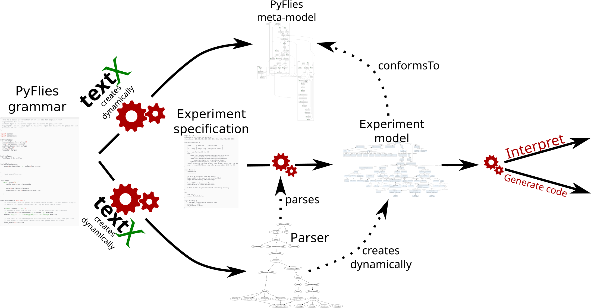
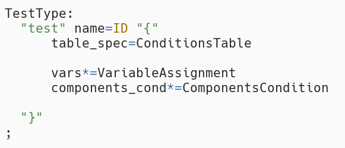
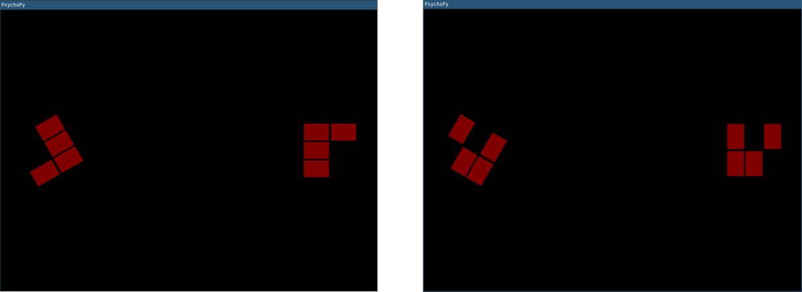
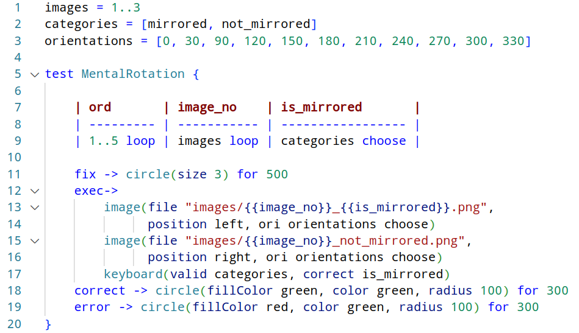
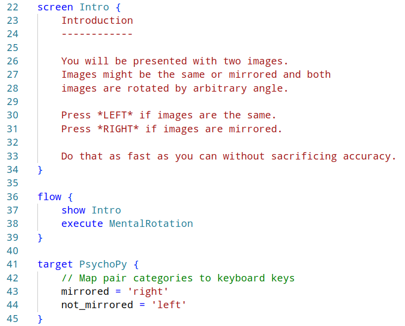
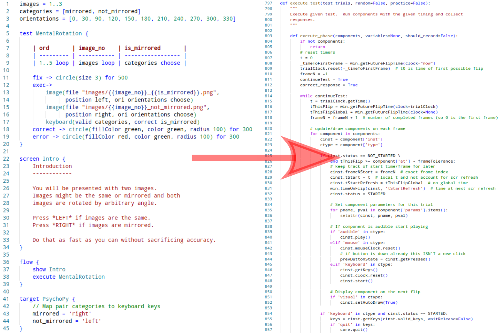
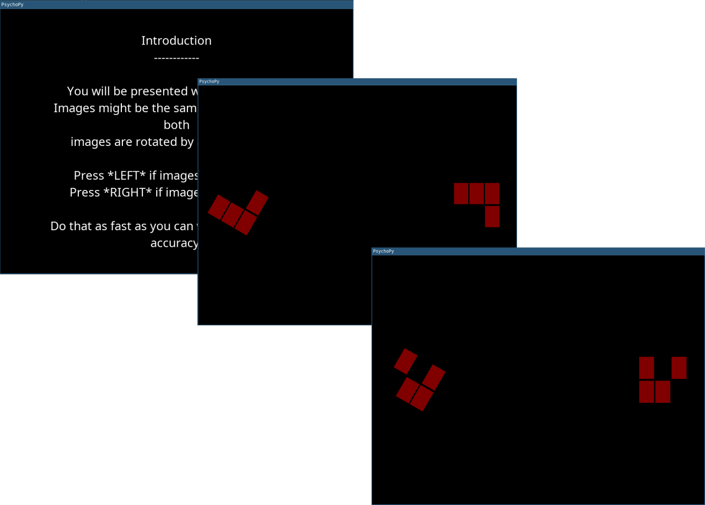

#+TITLE: Developing a Domain-Specific Language for Cognitive Tests Using TextX
#+AUTHOR: Igor Dejanović and Mirjana Dejanović
#+Email: igord at uns ac rs, mirjana at uns ac rs
#+SUBTITLE: INFORMATION TECHNOLOGY 2025, Žabljak
#+DATE: 19.-22. February 2025
#+SETUPFILE: startup.org
#+EXPORT_FILE_NAME: index.html
#+REVEAL_TITLE_SLIDE_BACKGROUND: images/background.png
#+REVEAL_DEFAULT_SLIDE_BACKGROUND: images/background.png
#+REVEAL_EXTRA_CSS: style.css
#+REVEAL_TITLE_SLIDE: <h1 class="title">%t</h1>
#+REVEAL_TITLE_SLIDE: <h2 class="author"><a href="https://igordejanovic.net/">%a</a></h2>
#+REVEAL_TITLE_SLIDE: 
#+REVEAL_TITLE_SLIDE_BACKGROUND_SIZE: contain
#+REVEAL_DEFAULT_SLIDE_BACKGROUND_SIZE: contain
#+OPTIONS: reveal_width:1886 reveal_height:1062
#+REVEAL_MARGIN: 0.1

* COMMENT Agenda
:PROPERTIES:
:UNNUMBERED: notoc
:END:
#+REVEAL_TOC: headlines 1

* Domain-Specific Languages
- Specialized languages designed for domain experts
- Appropriate level of abstraction
- Domain concepts
- Boost in productivity -- 10x and more
- Today popular sub-class: Low Code / No Code
- But not easy to develop and maintain

#+attr_html: :style height: 500px;
#+ATTR_ORG: :width 300px

* textX to the rescue
- DSLs in Python made easy
- We started the project in 2014.
- Open-source - MIT License
- 786 stars, 77 forks and 24 contributors on GitHub as of this writing.
- Used in academia and industry for DSL development, data extraction, IDE
  language support, legacy code analysis etc.

#+attr_html: :style height: 400px;
#+ATTR_ORG: :width 300px

* textX - workflow
#+attr_html: :style height: 900px;
#+ATTR_ORG: :width 300px

* For what is textX used?
- textX is used to implement various DSLs, including:
  - Software construction
  - Source code analysis and representation
  - e-health
  - LLM enabled domain modeling
  - Microservice architectures
  - Mobile app development
  - Game development
  - Power electronics models specification
- In this work, we showcase its use in the specification of cognitive tests.

* Cognitive tests
- Used to assess the cognitive capabilities of human or animal subjects.
- Physical changes can be evaluated using CT scans, MRI, etc., but how do we
  assess cognitive changes?
- GUI designers vs. general-purpose programming languages.
- We developed PyFlies, a DSL for cognitive tests, to bridge the gap.
- Test specification by domain experts, such as psychologists and
  neurophysiologists.
- Our focus is primarily on reaction time tests.

* PyFlies
** Domain analysis
- Talk with domain experts
- Take notes
- Identify nouns (concepts) and verbs (actions/procedures)
- Examples: =Test=, =Trial=, =Stimulus=, =Flow=, etc.

** Design the syntax and meta-model in textX
#+attr_html: :style height: 500px;
#+ATTR_ORG: :width 300px

* Mental Rotation Test
** Mental Rotation Test
- The subject is presented with two images rotated relative to each other by a
  random degree
- The images are either identical or mirrored.
- Task: determine as quickly as possible whether the images are mirrored or not.

#+attr_html: :style height: 400px;
#+ATTR_ORG: :width 300px

** Mental Rotation Test implementation
#+ATTR_ORG: :width 300px

** The rest of the experiment
#+ATTR_ORG: :width 300px

** Generated Python code
#+attr_html: :style height: 900px;
#+ATTR_ORG: :width 300px

** Running the test
#+attr_html: :style height: 900px;
#+ATTR_ORG: :width 300px

* Results
** \nbsp

#+caption: Lines of Code (LOC) Metrics for the Implementation of PyFlies
#+label: tbl:cloc
| <l>            | <c> |
| File type      | LOC |
|----------------+-----|
| Python         | 993 |
| textX grammar  | 175 |
| Jinja template |  80 |

#+ATTR_HTML: :style font-size: 0.85em;
- Language has 34 concepts
- From 175 grammar lines textX dynamically produces a meta-model and a full parser
- Jinja template lines are for built-in generators - CSV and Log.

** \nbsp

#+caption: Lines of Code (LOC) Metrics for the Implementation of Mental Rotation Test
#+label: tbl:cloc
| <l>            | <c> |
| File type      | LOC |
|----------------+-----|
| PyFlies        |  35 |
| Python         | 873 |

- From 35 lines of high-level PyFlies code we generate 873 lines of Python code.
- ~25x reduction in code size -> huge increase in productivity

* Conclusion
- **textX** is a powerful tool for enhancing productivity through the use of
  **Domain-Specific Languages (DSLs)**.
- It empowers **non-programmer domain experts** to design and implement tests
  effectively.
- All resources presented here are **free and open-source**:
  - [[https://github.com/textX/textX/][textX project]] and [[https://textx.github.io/textX/][documentation]]
  - [[https://textx.github.io/textx-playground/][textX playground]]
  - [[https://github.com/pyflies/pyflies/][PyFlies project]], [[https://pyflies.github.io/pyflies/latest/][documentation]] and [[https://www.youtube.com/watch?v=tSFdYYnQmjA][overview video]]
- Further Work
  - Ongoing **evaluation** of textX for **large-scale industrial DSLs**.

* \nbsp
:PROPERTIES:
:UNNUMBERED: notoc
:reveal_background: ./images/background-first.png
:reveal_background_trans: slide
:END:

#+attr_html: :style height: 300px;
#+ATTR_ORG: :width 300px

#+ATTR_HTML: :style font-size: 3em; color: rgb(219, 48, 0);
Thanks!

#+ATTR_HTML: :style font-size: 3em; color: rgb(219, 48, 0);
Q&A

