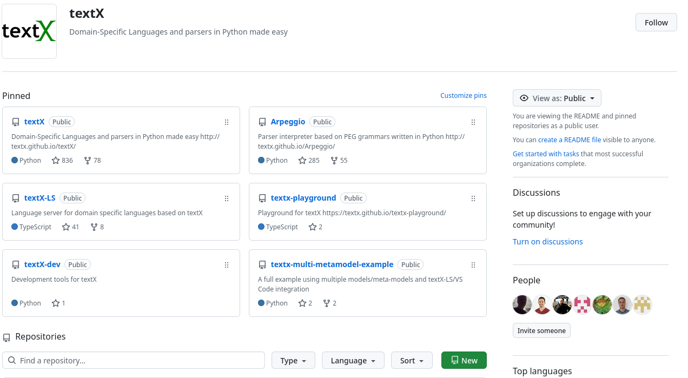
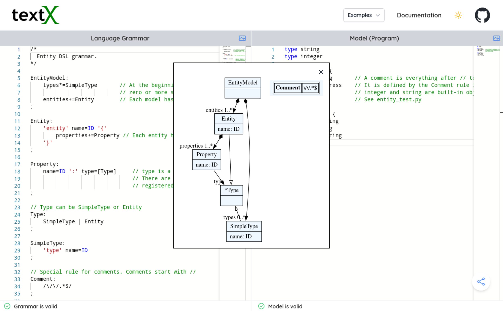
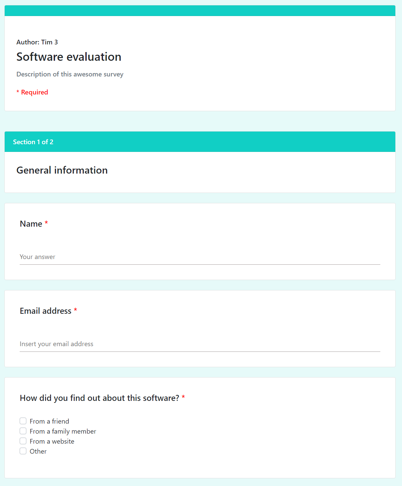
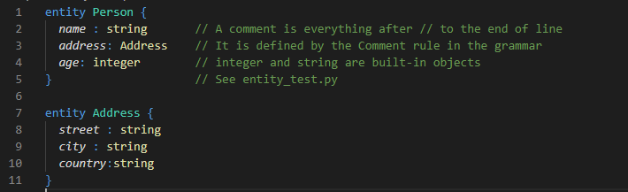
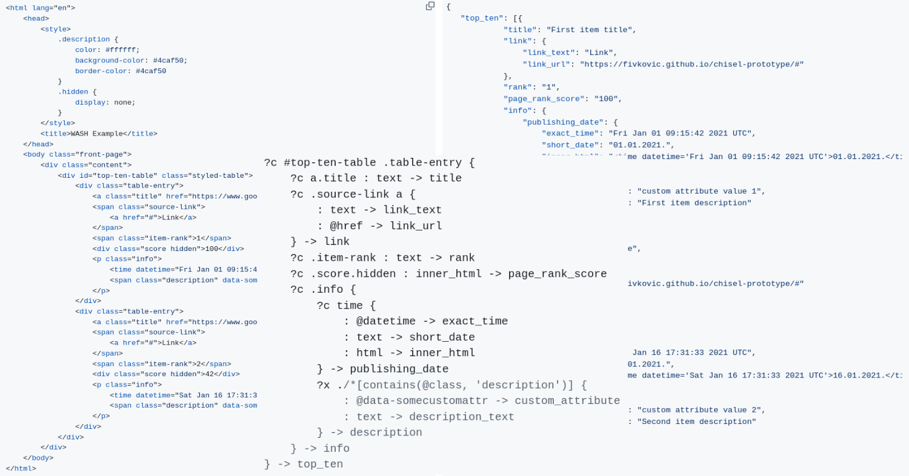
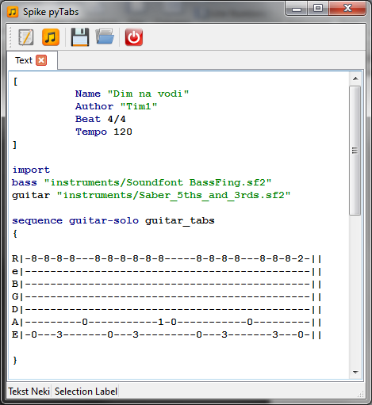

#+TITLE: Teaching Domain-Specific Languages with textX: A Hands-On Approach
#+AUTHOR: Igor Dejanović, Milan Šović and Balša Šarenac
#+Email: igord at uns ac rs, milan_sovic at outlook com, balsasarenac at uns ac rs
#+SUBTITLE: INFORMATION TECHNOLOGY 2026, Žabljak
#+DATE: 24.-28. February 2026
#+SETUPFILE: startup.org
#+EXPORT_FILE_NAME: index.html
#+REVEAL_TITLE_SLIDE_BACKGROUND: images/background.png
#+REVEAL_DEFAULT_SLIDE_BACKGROUND: images/background.png
#+REVEAL_EXTRA_CSS: style.css
#+REVEAL_TITLE_SLIDE: <h1 class="title">%t</h1>
#+REVEAL_TITLE_SLIDE: <h2 class="author">%a</h2>
#+REVEAL_TITLE_SLIDE: <h4 class="title">Faculty of Technical Sciences, University of Novi Sad</h4>
#+REVEAL_TITLE_SLIDE: 
#+REVEAL_TITLE_SLIDE: <h3 class="title">30th international scientific and professional</h3>
#+REVEAL_TITLE_SLIDE: <h3 class="title">Conference INFORMATION TECHNOLOGY 2026</h3>
#+REVEAL_TITLE_SLIDE: <h4 class="title">%d</h4>
#+REVEAL_TITLE_SLIDE_BACKGROUND_SIZE: contain
#+REVEAL_DEFAULT_SLIDE_BACKGROUND_SIZE: contain
#+OPTIONS: reveal_width:1886 reveal_height:1062
#+REVEAL_MARGIN: 0.1

* COMMENT Agenda
:PROPERTIES:
:UNNUMBERED: notoc
:END:
#+REVEAL_TOC: headlines 1

* Domain-Specific Languages
- Specialized languages designed for domain experts
- Domain concepts
- Boost in productivity -- 10x and more
- Today popular rebranding: Low Code / No Code
- /DSLs are powerful, but teaching them is challenging./

#+attr_html: :style height: 500px;
#+ATTR_ORG: :width 300px
[[./images/DSLs.png]]

* The Pedagogical Challenge
- Traditional compiler courses use complex formalisms.
- Modern Language Workbenches (e.g. MPS) have steep learning curves.
- Students spend too much time fighting the IDE/Tooling and not enough time
  learning parsing, ASTs, and semantics.
- /We need a way to give hands-on design experience without the "heavyweight"
  overhead./
  
* The Solution: textX
- A lightweight, open-source Python library for rapid DSL development.
- Project started in 2014.
- Goal: low friction experience in building DSLs.
- Open-source - MIT License
- 836 stars, 78 forks and 24 contributors on GitHub as of this writing.
- Used by >600 projects on GitHub.
- Used in academia and industry for teaching and developing DSLs, data
  extraction, IDE language support, legacy code analysis etc.

#+attr_html: :style height: 400px;
#+ATTR_ORG: :width 300px

* Course in DSLs 
- A master level course at the Faculty of Technical Sciences, University of Novi
  Sad.
- One semester.
- Taught since 2014. ~20 students per generation on average.
  
* Course Methodology
- *Phase 1: Foundations:* Theory (Parsing, Concrete vs. Abstract syntax) + Labs
  using the Online Playground and VS Code extension.
- *Phase 2: Capstone Project (Team-based, 3-5 team members):*
  1. *Ideation:* Students pick their own domain (high engagement).
  2. *Analysis & Design:* Analyze domain, identify concepts, write grammar,
     visualize metamodel.
  3. *Implementation:* Build Interpreter or Code Generator.
  4. *Demo:* Peer review. Group discussions.
     
* [[https://textx.github.io/textx-playground/][Online Playground]]

#+ATTR_ORG: :width 300px

     
* Student Projects (Selection)
** SurveyIT
Generates Web Surveys
  
#+REVEAL_HTML: 

#+REVEAL_HTML: 

#+begin_src text
import "example_question_types.qstn"

survey SoftwareEvaluation {

    title : "Software evaluation"
    description: "Description of this awesome survey"
    author: "Tim 3"

    submit_url:"https://exampleURL.com"

    success_message: "You have successfully submitted your answers! Thank you for participating."
    error_message: "Unfortunately, an error occured. Please try again."

    section {
        title: "General information"

        @Required
        @TextQuestion
        question Question0 {
            title: "Name"
            multiline: false
        } 

        @Required
        @EmailQuestion
        question Question1 {
            title: "Email address"
            placeholder: "Insert your email address"
        }
#+end_src
#+REVEAL_HTML: 

#+REVEAL_HTML: 

#+REVEAL_HTML: 

#+REVEAL_HTML: 

** EasyColorLang

#+begin_src text
#main:
    begin: "entity" names: "keyword"
    end: "{" names: "keyword.other"
    (match: "[a-zA-Z][a-zA-Z_0-9]*" name: "support.class")

    begin: "[a-zA-Z][a-zA-Z_0-9]*" names: "markup.italic"
    end: "[a-zA-Z][a-zA-Z_0-9]*" names: "entity.name.function"
    (match:"\s*:\s*" name:"keyword.other")

    matches_from_grammar: "entity.tx"
start entity(main)
#+end_src

#+attr_html: :style height: 400px;
#+ATTR_ORG: :width 300px

** *WASH* (Web Automation/Scraping)

#+ATTR_ORG: :width 300px

** *PyTabs* (Music notation player)
#+ATTR_ORG: :width 300px

* Outcomes & Conclusion
*Key Observations:*
- *High Engagement:* Students "own" their domains.
- *Full Workflow:* They master the pipeline from Grammar $\to$ AST $\to$ Semantics.
- *Simplicity Wins:* Using a library (textX) rather than a heavyweight IDE allows:
  - focus on concepts,
  - easy integration in student's existing workflow,
  - integration with the Python ecosystem.
- *Virtuous Cycle:* The Online Playground and VS Code Extension started as student projects.

#+REVEAL: split

**textX** eliminates the "tooling tax", allowing students to spend most of their
time learning DSL concepts and designing the language.

* Future Work
- Expanding support tools.
- New tools - visualizers, animations, debuggers.
- Performing more rigorous evaluations.
  

* \nbsp
:PROPERTIES:
:UNNUMBERED: notoc
:reveal_background: ./images/background-first.png
:reveal_background_trans: slide
:END:

#+attr_html: :style height: 400px;
#+ATTR_ORG: :width 300px

#+ATTR_HTML: :style font-size: 2em; color: rgb(37, 121, 255);
Thanks!

#+ATTR_HTML: :style font-size: 2em; color: rgb(37, 121, 255);
Q&A

#+ATTR_HTML: :style font-size: 0.5em;
All resources presented here are **free and open-source**:
#+ATTR_HTML: :style font-size: 0.5em;
- [[https://github.com/textX/textX/][textX project]] and [[https://textx.github.io/textX/][documentation]]
- [[https://textx.github.io/textx-playground/][textX playground]]
- [[https://igordejanovic.net/courses/jsd/][DSL course materials]] (in Serbian language)
